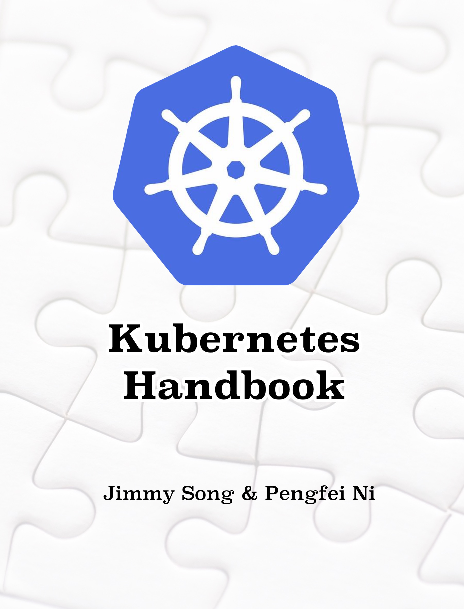

# Kubernetes Handbook——Kubernetes中文指南/云原生应用架构实践手册

[Kubernetes](http://kubernetes.io)是Google基于[Borg](https://research.google.com/pubs/pub43438.html)开源的容器编排调度引擎，作为[CNCF](http://cncf.io)（Cloud Native Computing Foundation）最重要的组件之一，它的目标不仅仅是一个编排系统，而是提供一个规范，可以让你来描述集群的架构，定义服务的最终状态，Kubernetes可以帮你将系统自动地达到和维持在这个状态。Kubernetes作为云原生应用的基石，相当于一个云操作系统，其重要性不言而喻。

## 关于本书

  

本书起始于2017年3月，记录了本人从零开始学习和使用Kubernetes的心路历程，着重于经验分享和总结，同时也会有相关的概念解析，希望能够帮助大家少踩坑，少走弯路，还会指引大家关于关注Kubernetes生态周边，如微服务构建、DevOps、大数据应用、[Service Mesh](https://jimmysong.io/posts/what-is-a-service-mesh/)、Cloud Native等领域。

### 开始之前

在阅读本书之前希望您掌握以下知识和准备以下环境：

- Linux 操作系统原理
- Linux 常用命令
- Docker 容器原理及基本操作
- 一台可以上网的电脑，Mac/Windows/Linux 皆可
- 安装 Docker

### 本书主题

本书的主题不局限于Kubernetes，还包括以下几大主题：

- 云原生开源组件
- 云原生应用与微服务架构
- 基于Kubernetes的Service Mesh架构
- Kubernetes与微服务结合实践

起初写作本书时，安装的所有组件、所用示例和操作等皆基于**Kubernetes 1.6+** 版本，同时我们也将密切关注Kubernetes的版本更新，随着它的版本更新升级，本书中的Kubernetes版本和示例也将随之更新。

### 使用方式

您可以通过以下方式使用本书：

- GitHub地址：https://github.com/rootsongjc/kubernetes-handbook
- GitBook在线浏览：https://jimmysong.io/kubernetes-handbook/
- 下载本书的发行版：https://github.com/rootsongjc/kubernetes-handbook/releases
- 按照[说明](https://github.com/rootsongjc/kubernetes-handbook/blob/master/CODE_OF_CONDUCT.md)自行编译成离线版本
- Fork 一份添加你自己的笔记自行维护，有余力者可以一起参与进来

**注意：本书中的 Service Mesh 相关内容已不再维护，请转至 [istio-handbook](https://jimmysong.io/istio-handbook) 浏览。**

## 快速开始

如果您想要学习Kubernetes和云原生应用架构但是又不想自己从头开始搭建和配置一个集群，那么可以直接使用[kubernetes-vagrant-centos-cluster](https://github.com/rootsongjc/kubernetes-vagrant-centos-cluster)项目直接在本地部署一个3节点的分布式集群及其他如Heapster、EFK、Istio等可选组件，或者使用更加轻量级的[cloud-native-sandbox](https://github.com/rootsongjc/cloud-native-sandbox)在个人电脑上使用Docker运行单节点的Kubernetes、Istio等组件。

## 贡献与致谢

感谢大家对本书做出的贡献！

- [查看贡献者列表](https://github.com/rootsongjc/kubernetes-handbook/graphs/contributors)
- [查看如何贡献](https://github.com/rootsongjc/kubernetes-handbook/blob/master/CONTRIBUTING.md)
- [查看文档的组织结构与使用方法](https://github.com/rootsongjc/kubernetes-handbook/blob/master/CODE_OF_CONDUCT.md)

## Stargazers over time

## 社区&读者交流

- **微信群**：K8S&Cloud Native实战，扫描我的微信二维码，[Jimmy Song](http://jimmysong.io/about)，或直接搜索微信号*jimmysong*后拉您入群，请增加备注（姓名-公司/学校/博客/社区/研究所/机构等）。
- **Slack**：全球中文用户可以加入[Kubernetes官方Slack](http://slack.k8s.io)中文频道**cn-users channel**
- **知乎专栏**：[云原生应用架构](https://zhuanlan.zhihu.com/cloud-native)
- **微信公众号**：扫描下面的二维码关注Jimmy Song 的<u>个人微信公众号</u>CloudNativeGo（云原生应用架构）

  

- **ServiceMesher**：ServiceMesher 社区公众号，下承 Kubernetes、上接 Serverless，云原生应用的通信层，旨在加强行业内部交流，促进开源文化构建，推动 Kubernetes、Service Mesh、Serverless 等云原生技术在企业落地，发布活动及业界最前沿资讯。[加入组织](http://www.servicemesher.com/contact/)。

  

## 读者反馈

以下是部分读者反馈，希望更多人[加入我们](http://www.servicemesher.com)，共同打造中国质量最高的云原生社区！

## 云原生出版物

以下为本人参与出版的图书。

- [Cloud Native Go](https://jimmysong.io/posts/cloud-native-go/) - 基于Go和React的web云原生应用构建指南（Kevin Hoffman & Dan Nemeth著 宋净超 吴迎松 徐蓓 马超 译），电子工业出版社，2017年6月出版
- [Python云原生](https://jimmysong.io/posts/cloud-native-python/) - 使用Python和React构建云原生应用（Manish Sethi著，宋净超译），电子工业出版社，2018年6月出版
- [云原生Java](https://jimmysong.io/posts/cloud-native-java/) - Spring Boot、Spring Cloud与Cloud Foundry弹性系统设计（Josh Long & Kenny Bastani著，张若飞 宋净超译 ），电子工业出版社，2018年7月出版
- [未来架构——从服务化到云原生](https://jimmysong.io/posts/future-architecture-from-soa-to-cloud-native/) - 张亮 吴晟 敖小剑 宋净超 著，电子工业出版社，2019年3月出版

## 支持本书

为云原生干杯🍻！使用微信扫一扫请我喝一杯☕️

