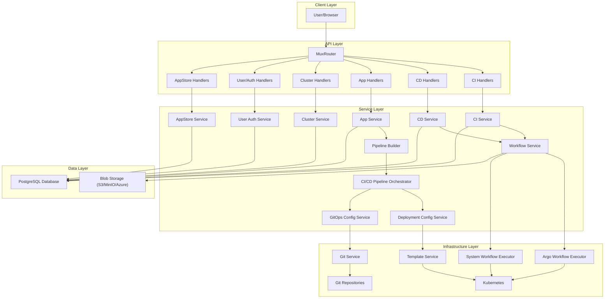
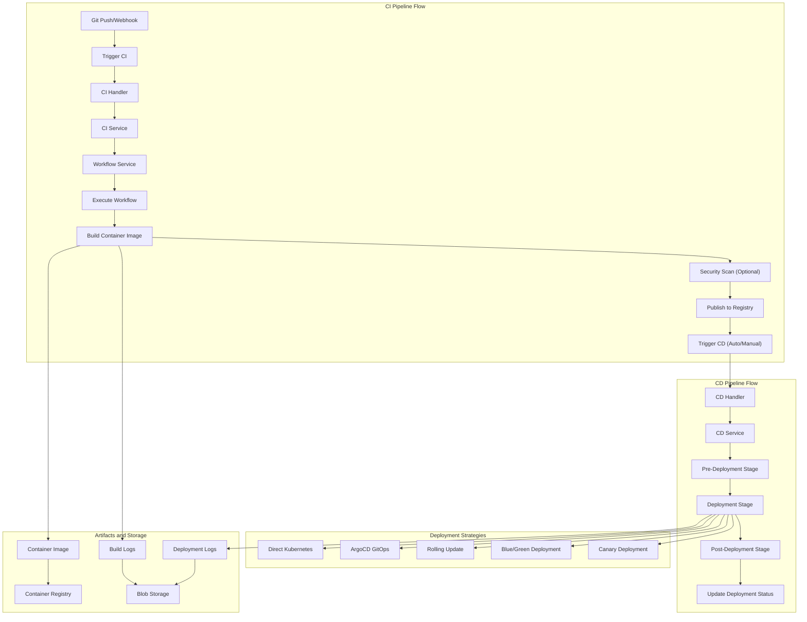
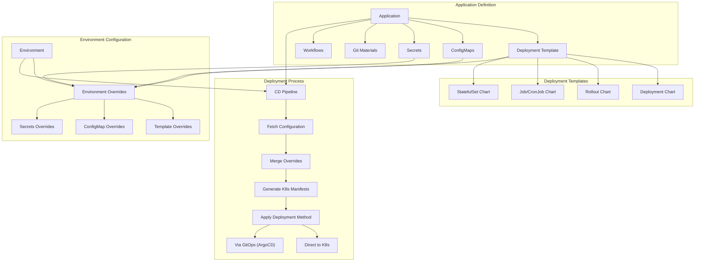

> Devtron 是一款开源云原生应用管理平台，集成 CI/CD、GitOps、安全扫描和监控告警等功能，助力团队高效管理 Kubernetes 应用全生命周期。

## Devtron 简介

[Devtron](https://github.com/devtron-labs/devtron) 是一款开源的云原生应用管理平台，提供了完整的应用生命周期管理解决方案。它集成了 CI/CD、GitOps、安全扫描、监控告警等功能，帮助开发和运维团队高效管理 Kubernetes 应用。

## 主要特性

Devtron 提供丰富的功能，覆盖应用部署、CI/CD 流水线、安全合规、监控告警和开发工具集成等多个方面。

### 应用生命周期管理

- 应用部署：支持 Helm Chart 和 Kustomize 部署方式
- 多环境管理：支持开发、测试、生产等多环境部署
- 版本控制：集成 GitOps 工作流，支持应用配置版本管理
- 回滚功能：提供快速的应用回滚和版本切换

### CI/CD 流水线

- 构建流水线：支持多种编程语言的自动化构建
- 部署策略：支持蓝绿部署、金丝雀发布等策略
- 审批流程：支持部署前的审批机制
- 集成测试：内置应用测试和验证功能

### 安全与合规

- 安全扫描：集成容器镜像安全扫描
- 策略检查：支持 Open Policy Agent (OPA) 策略验证
- 审计日志：完整的操作审计和日志记录
- 访问控制：基于角色的细粒度权限管理

### 监控与可观测性

- 应用监控：集成 Prometheus 和 Grafana 监控栈
- 日志聚合：集中式日志收集和分析
- 告警管理：智能告警规则和通知机制
- 性能分析：应用性能指标和趋势分析

### 开发工具集成

- Git 集成：支持 GitHub、GitLab 等代码仓库
- 容器镜像：集成 Docker Registry 和 Harbor
- 云服务：支持 AWS、GCP、Azure 等云平台
- 第三方工具：支持 Slack、Teams 等协作工具

## 系统架构

Devtron 采用分层架构，由 API、服务、基础设施和数据层组成，协同提供全面的 Kubernetes 应用管理。下图展示了 Devtron 的主要架构组件及其交互关系。




{width=2741 height=1886}

### 核心组件说明

- API 层：处理 HTTP 请求并路由到相应处理器
- 服务层：包含 CI/CD、应用、集群、用户认证等业务逻辑
- 基础设施层：对接 Argo、Kubernetes、Git 等外部系统
- 数据层：使用 PostgreSQL 存储元数据，Blob 存储保存日志和制品

## CI/CD 流水线流程

Devtron 提供完整的 CI/CD 流水线，自动化实现从代码提交到生产部署的全流程。下图展示了主要流程。




{width=2677 height=2792}

## 部署配置与模板

Devtron 采用模板化方法配置和管理应用部署，支持多种部署模板类型，适应不同应用需求。




{width=3048 height=1554}

### 部署模板类型

- Deployment：标准无状态应用部署
- Rollout Deployment：支持蓝绿、金丝雀等高级策略
- Job & CronJob：一次性或定时任务
- StatefulSet：有状态应用，支持持久存储

所有模板均可通过 GUI 或 YAML 编辑灵活配置。

## 安装选项

Devtron 支持多种安装模式，满足不同场景需求。



| 安装选项                       | 描述                         | 使用场景                   |
|-------------------------------|------------------------------|----------------------------|
| Devtron with CI/CD            | 完整安装，含 CI/CD           | 完整软件交付工作流         |
| Helm Dashboard                | 仅 Helm 应用管理             | 管理现有 Helm 应用         |
| Devtron with CI/CD and GitOps | 启用 GitOps (ArgoCD)         | 基于 GitOps 的部署工作流   |



安装过程使用 Helm Chart，支持多种存储后端（MinIO、AWS S3、Azure Blob、GCS）。

## 安全特性

Devtron 内置多项安全功能，支持 DevSecOps 工作流：

- 安全扫描：容器镜像和代码漏洞扫描
- 安全策略：基于漏洞严重性的策略执行
- RBAC：细粒度角色权限控制
- SSO 集成：支持 Google、GitHub、GitLab、LDAP、OIDC 等

扫描可在构建前、镜像构建后、部署前等阶段执行，保障全流程安全。

## 全局配置

Devtron 提供集中式全局配置，统一管理平台各项能力：

- 主机 URL、GitOps、项目、集群与环境
- Git 账户、容器镜像仓库、Chart 仓库
- 部署模板、授权、通知等

全局配置为应用和环境的个性化设置提供基础。

## 安装部署

### 使用 Helm 安装

推荐使用 Helm Chart 进行安装：

```bash
# 添加 Devtron Helm 仓库
helm repo add devtron https://helm.devtron.ai
helm repo update

# 安装 Devtron
helm install devtron devtron/devtron-operator \
  --create-namespace \
  --namespace devtroncd \
  --set components.devtron.url=https://devtron.example.com
```

### 安装后配置

1. 访问控制台：

    ```bash
    kubectl get secret -n devtroncd devtron-secret -o jsonpath='{.data.ADMIN_PASSWORD}' | base64 -d
    ```

2. 配置外部访问：

    ```bash
    kubectl apply -f - <<EOF
    apiVersion: networking.k8s.io/v1
    kind: Ingress
    metadata:
      name: devtron-ingress
      namespace: devtroncd
    spec:
      ingressClassName: nginx
      rules:
      - host: devtron.example.com
        http:
          paths:
          - path: /
            pathType: Prefix
            backend:
              service:
                name: devtron-service
                port:
                  number: 80
    EOF
    ```

## 核心功能使用

Devtron 提供直观的应用管理、环境配置、CI/CD 流水线、安全扫描和监控告警能力。

### 应用管理

- 创建应用：从 Git 仓库导入，配置环境和参数，设置 CI/CD 流水线
- 环境管理：多环境配置，环境变量、资源限制和配额管理

### CI/CD 流水线

- 构建配置示例：

    ```yaml
    # .devtron/ci-pipeline.yaml
    build:
      - name: build
        image: node:16
        commands:
          - npm install
          - npm run build
          - docker build -t myapp:$DOCKER_TAG .
    ```

- 部署配置示例：

    ```yaml
    # .devtron/cd-pipeline.yaml
    deploy:
      - name: deploy
        environment: production
        strategy: blue-green
        values:
          image.tag: $DOCKER_TAG
    ```

### 安全扫描

- 容器镜像扫描：集成 Trivy、Clair
- 依赖检查：第三方依赖漏洞扫描
- 配置审计：Kubernetes 配置安全性检查
- 合规检查：安全策略与最佳实践验证

### 监控告警

- 配置监控：集成 Prometheus，支持自定义指标和告警
- 日志管理：集成 EFK/Loki，支持日志轮转、搜索和过滤

## 最佳实践

- 应用组织：命名空间隔离、独立 Git 仓库、标签注解管理
- CI/CD 优化：分支保护、自动化测试、部署审批
- 安全加固：最小权限、依赖和镜像定期更新、网络策略
- 监控运维：关键指标监控、合理告警、故障响应流程

## 集成生态

Devtron 支持与多种工具和平台集成，提升整体 DevOps 能力。

- 代码仓库：GitHub、GitLab、Bitbucket，支持 Webhook
- 容器平台：Docker Hub、Harbor、ECR，支持镜像扫描和签名
- 云服务：AWS EKS、GCP GKE、Azure AKS
- 监控工具：Prometheus、Grafana、Datadog

## 故障排查

### 常见问题

- 安装失败：检查 Kubernetes 版本、资源、Pod 日志
- 应用部署失败：检查 Git 连接、Helm/Kustomize 配置、部署日志
- CI/CD 问题：检查构建环境、脚本语法、流水线日志

## 总结

Devtron 作为云原生应用管理平台，集成了 CI/CD、GitOps、安全、监控等能力，极大提升了 Kubernetes 应用的交付效率和运维体验。通过模块化架构和丰富的集成生态，Devtron 能满足多团队、多环境的复杂场景需求，是现代云原生团队的理想选择。

## 参考文献

1. [Devtron 官方文档 - docs.devtron.ai](https://docs.devtron.ai/)
2. [Devtron GitHub - github.com](https://github.com/devtron-labs/devtron)
3. [Helm Chart - artifacthub.io](https://artifacthub.io/packages/helm/devtron/devtron-operator)
4. [Devtron 社区 - discord.gg](https://discord.gg/js7E4A5qZY)
