kubectl 是 Kubernetes 官方命令行工具，极大简化了 API 交互、认证、资源管理与自动化操作。掌握 kubectl 与 API 的工作原理，有助于提升集群运维与开发效率。

## kubectl 与 API Server 交互原理

Kubernetes API 是控制面的核心，提供 HTTP REST 接口，支持用户、集群组件及外部系统通信。kubectl 作为官方 CLI，负责处理认证、请求格式化与响应解析。



{width=1920 height=633}

## Kubernetes API 基础

Kubernetes API 遵循 RESTful 设计，支持标准 HTTP 动作（GET、POST、PUT、PATCH、DELETE）操作资源。资源按 API 组、版本、类型组织。


{width=1920 height=994}

常见 API 路径模式：

- 集群级资源：`/apis/GROUP/VERSION/RESOURCETYPE`
- 命名空间资源：`/apis/GROUP/VERSION/namespaces/NAMESPACE/RESOURCETYPE`
- 单个资源：`/apis/GROUP/VERSION/namespaces/NAMESPACE/RESOURCETYPE/NAME`

## kubectl 工作机制

kubectl 作为 API 客户端，将用户命令转为 HTTP 请求，读取 kubeconfig 配置集群、认证与上下文信息。


{width=1920 height=1256}

## kubectl 认证机制

kubectl 通过 kubeconfig 自动完成 API Server 认证，支持多种方式：

- 客户端证书
- Bearer Token
- 基本认证
- OAuth2 Token（外部插件）
- 服务账号 Token（集群内）



{width=1920 height=988}

## kubectl 基本用法

kubectl 命令基本格式如下：

```text
kubectl [command] [TYPE] [NAME] [flags]
```

- `command`：操作类型（如 create、get、describe、delete）
- `TYPE`：资源类型（如 pods、deployments、services）
- `NAME`：资源名称（列表操作可省略）
- `flags`：可选参数

常用 kubectl 命令如下：



| Command      | Description           | Example                                      |
| ------------ | -------------------- | -------------------------------------------- |
| get          | 列出资源              | `kubectl get pods`                           |
| describe     | 查看详细信息          | `kubectl describe pod nginx`                 |
| create       | 创建资源              | `kubectl create deployment nginx --image=nginx` |
| apply        | 文件创建/更新         | `kubectl apply -f manifest.yaml`             |
| delete       | 删除资源              | `kubectl delete pod nginx`                   |
| logs         | 查看容器日志          | `kubectl logs nginx`                         |
| exec         | 容器内执行命令        | `kubectl exec -it nginx -- bash`             |
| port-forward | 端口转发              | `kubectl port-forward pod/nginx 8080:80`     |



## 直接访问 API

kubectl 支持 `kubectl proxy` 启动本地代理，便于 curl 等工具直接访问 API，适合高级场景。

```bash
# 启动本地代理
kubectl proxy --port=8080

# 使用 curl 访问 API
curl http://localhost:8080/api/v1/namespaces/default/pods
```

## 输出格式与 JSONPath

kubectl 支持多种输出格式，便于脚本与自动化：



| Format         | Description         | Example                                                        |
| -------------- | ------------------ | -------------------------------------------------------------- |
| json           | JSON 格式           | `kubectl get pods -o json`                                     |
| yaml           | YAML 格式           | `kubectl get pods -o yaml`                                     |
| wide           | 详细信息            | `kubectl get pods -o wide`                                     |
| name           | 仅资源名            | `kubectl get pods -o name`                                     |
| custom-columns | 自定义列            | `kubectl get pods -o custom-columns=NAME:.metadata.name,STATUS:.status.phase` |
| jsonpath       | JSONPath 过滤       | `kubectl get pods -o jsonpath='{.items[0].metadata.name}'`     |
| go-template    | Go 模板格式化       | `kubectl get pods -o go-template='{{range .items}}{{.metadata.name}}{{"\n"}}{{end}}'` |



### JSONPath 常用表达式



| Expression                | Description         |
| ------------------------- | ------------------ |
| `{.items[*]}`             | 所有列表项         |
| `{.metadata.name}`        | 资源名称           |
| `{.status.phase}`         | 资源状态           |
| `{range .items[*]}{end}`  | 遍历所有项         |
| `{.spec.containers[*].image}` | 所有容器镜像   |



## Server-Side Apply 原理

Server-Side Apply 支持多管理者协作管理同一对象，追踪字段所有权，避免相互覆盖。



{width=1920 height=2828}

关键点：

- 字段所有权追踪，避免冲突
- `--field-manager` 标识管理者
- `--force-conflicts` 强制覆盖冲突字段

## 其他 API 访问方式

除 kubectl 外，还可通过多种方式访问 Kubernetes API。

### 官方客户端库

Kubernetes 提供多语言官方客户端库：



| Language   | Client Library                        |
| ---------- | ------------------------------------- |
| Go         | github.com/kubernetes/client-go       |
| Python     | github.com/kubernetes-client/python   |
| Java       | github.com/kubernetes-client/java     |
| JavaScript | github.com/kubernetes-client/javascript |
| .NET       | github.com/kubernetes-client/csharp   |



### API 代理与端口转发

- 使用 `kubectl proxy` 启动本地代理
- 直接带认证访问 API Server
- 端口转发访问服务

```bash
kubectl proxy --port=8080
curl http://localhost:8080/api/v1/namespaces/default/pods
```

## kubectl 脚本与自动化最佳实践

- 明确指定输出格式（json、yaml、name），便于解析
- 明确资源版本（如 `apps/v1/deployments`）
- 不依赖默认 context，必要时显式指定
- 使用 `--dry-run=client/server` 预览变更
- 长时间命令设置超时
- 使用标签与选择器过滤资源
- 配合版本控制管理 YAML 文件，推荐用 apply
- 利用 kubectl 插件扩展功能

```bash
kubectl get deployment.apps/nginx -o json
kubectl apply -f deployment.yaml
kubectl apply -f deployment.yaml --dry-run=server
```

## 总结

kubectl 极大简化了 Kubernetes API 交互，支持丰富的资源管理、输出格式与自动化能力。深入理解 kubectl 与 API 的工作机制，有助于高效管理和自动化 Kubernetes 集群。

## 参考文献

1. [Kubernetes 官方文档 - kubernetes.io](https://kubernetes.io/zh-cn/docs/)
2. [kubectl 命令参考 - kubernetes.io](https://kubernetes.io/zh-cn/docs/reference/kubectl/)
3. [Kubernetes API 访问 - kubernetes.io](https://kubernetes.io/zh-cn/docs/concepts/overview/kubernetes-api/)
4. [Server-Side Apply 机制 - kubernetes.io](https://kubernetes.io/zh-cn/docs/reference/using-api/server-side-apply/)
5. [Kubernetes 客户端库 - kubernetes.io](https://kubernetes.io/zh-cn/docs/reference/using-api/client-libraries/)
