本文系统梳理了通过 kubectl 与 Kubernetes API 交互的原理与实践，涵盖 API 结构、认证机制、常用命令、输出格式、Server-Side Apply 及最佳实践，帮助读者高效管理和自动化 Kubernetes 资源。

## 概述

Kubernetes API 是控制面的核心，提供 HTTP API 以实现用户、集群内部组件及外部系统的通信。kubectl 作为官方命令行工具，简化了 API 交互流程，自动处理认证、请求格式化和响应解析等细节。



{width=1920 height=838}

## Kubernetes API 基础

Kubernetes API 采用 RESTful 设计，通过标准 HTTP 动词（GET、POST、PUT、PATCH、DELETE）对资源进行增删改查。资源按 API 组、版本和类型组织。



{width=1920 height=917}

常见 API URL 模式如下：

- 集群级资源：`/apis/GROUP/VERSION/RESOURCETYPE`
- 命名空间级资源：`/apis/GROUP/VERSION/namespaces/NAMESPACE/RESOURCETYPE`
- 单个资源：`/apis/GROUP/VERSION/namespaces/NAMESPACE/RESOURCETYPE/NAME`

## kubectl 工作原理

kubectl 作为 Kubernetes API 的客户端，将用户命令转为 HTTP 请求。其配置文件 kubeconfig 包含集群信息、认证方式和上下文设置。


{width=1920 height=1220}

## API Server 认证机制

kubectl 通过 kubeconfig 文件自动完成 API Server 认证，支持多种认证方式：

- 客户端证书
- Bearer Token
- 基本认证
- OAuth2（外部插件）
- ServiceAccount Token（集群内部）



{width=1920 height=1141}

## kubectl 基本用法

kubectl 命令基本语法如下：

```text
kubectl [command] [TYPE] [NAME] [flags]
```

- `command`：操作类型（如 create、get、describe、delete）
- `TYPE`：资源类型（如 pods、deployments、services）
- `NAME`：资源名称（列表操作可省略）
- `flags`：可选参数

常用 kubectl 命令如下表所示。



| Command      | Description                  | Example                                         |
| ------------ | ---------------------------- | ----------------------------------------------- |
| get          | 列出资源                     | `kubectl get pods`                              |
| describe     | 查看详细信息                 | `kubectl describe pod nginx`                    |
| create       | 创建资源                     | `kubectl create deployment nginx --image=nginx` |
| apply        | 从文件创建或更新资源         | `kubectl apply -f manifest.yaml`                |
| delete       | 删除资源                     | `kubectl delete pod nginx`                      |
| logs         | 查看容器日志                 | `kubectl logs nginx`                            |
| exec         | 容器内执行命令               | `kubectl exec -it nginx -- bash`                |
| port-forward | 本地端口转发到 Pod           | `kubectl port-forward pod/nginx 8080:80`        |



## 直接访问 API

除了 kubectl，用户还可以通过 `kubectl proxy` 启动本地代理，便于直接访问 API，适合高级操作和调试。

```bash
# 启动代理
kubectl proxy --port=8080

# 使用 curl 访问 API
curl http://localhost:8080/api/v1/namespaces/default/pods
```

## 输出格式

kubectl 支持多种输出格式，便于脚本化和自动化处理。



| Format         | Description              | Example                                                      |
| -------------- | ------------------------ | ------------------------------------------------------------ |
| json           | JSON 格式                | `kubectl get pods -o json`                                   |
| yaml           | YAML 格式                | `kubectl get pods -o yaml`                                   |
| wide           | 额外信息                 | `kubectl get pods -o wide`                                   |
| name           | 仅资源名称               | `kubectl get pods -o name`                                   |
| custom-columns | 自定义列格式             | `kubectl get pods -o custom-columns=NAME:.metadata.name,STATUS:.status.phase` |
| jsonpath       | JSONPath 过滤            | `kubectl get pods -o jsonpath='{.items[0].metadata.name}'`   |
| go-template    | Go 模板格式化            | `kubectl get pods -o go-template='{{range .items}}{{.metadata.name}}{{"\n"}}{{end}}'` |



## kubectl 的 JSONPath 用法

JSONPath 是一种 JSON 查询语言，kubectl 支持用其提取 API 响应中的特定字段，适合自动化脚本。

常用 JSONPath 表达式如下。



| Expression                    | Description                   |
| ----------------------------- | ----------------------------- |
| `{.items[*]}`                 | 获取列表中所有项              |
| `{.metadata.name}`            | 资源名称                      |
| `{.status.phase}`             | 资源状态                      |
| `{range .items[*]}{end}`      | 遍历所有项                    |
| `{.spec.containers[*].image}` | 所有容器镜像                  |



## Server-Side Apply

Server-Side Apply 支持多用户/控制器协作管理同一对象，自动跟踪字段归属，避免相互覆盖。



{width=1920 height=2413}

关键点：

- 字段管理跟踪每个字段的归属
- 不同管理者设置同一字段会产生冲突
- `--field-manager` 标识管理实体
- `--force-conflicts` 可强制覆盖他人字段

## 其他 API 访问方式

除了 kubectl，还可以通过多种方式访问 Kubernetes API。

### 客户端库

Kubernetes 提供多语言官方客户端库，便于程序化访问。



| Language   | Client Library                          |
| ---------- | --------------------------------------- |
| Go         | github.com/kubernetes/client-go         |
| Python     | github.com/kubernetes-client/python     |
| Java       | github.com/kubernetes-client/java       |
| JavaScript | github.com/kubernetes-client/javascript |
| .NET       | github.com/kubernetes-client/csharp     |



此外还有众多社区维护的客户端库。

### API 代理与端口转发

- 使用 `kubectl proxy` 创建本地代理
- 直接带认证访问 API Server
- 通过端口转发访问特定服务

## kubectl 使用最佳实践

在脚本或自动化场景下，建议：

- 明确指定输出格式（`json`、`yaml`、`name`），便于解析
- 明确资源版本（如 `apps/v1/deployments`）
- 避免依赖默认 context，必要时显式指定
- 使用 `--dry-run=client` 或 `--dry-run=server` 预览变更
- 长时间操作设置合理超时
- 利用标签和选择器过滤资源
- 配合版本控制的 YAML 文件使用 apply
- 利用插件扩展功能

## 总结

掌握 kubectl 与 Kubernetes API 的交互原理，是高效管理和自动化 Kubernetes 资源的基础。kubectl 抽象了 API 复杂性，提供丰富的资源管理、输出格式和脚本化能力。深入理解 JSONPath、Server-Side Apply、客户端库等高级用法，将助力你更好地应对实际生产环境中的自动化和协作需求。
