> Kubernetes 的可扩展机制正成为 AI 基础设施的控制平面，推动云原生架构向智能化演进。

Kubernetes 之所以能成为现代云计算的基础设施，不仅因为它“能调度容器”，更因为它是一个可编程的分布式系统平台（Programmable Platform）。

其核心设计哲学是：

> “可扩展而不修改（Extensible Without Forking）”

本章围绕这一哲学，系统介绍了四大扩展机制。下表总结了各机制的类别、关键组件与典型应用场景。



| 类别 | 机制 | 关键组件 | 典型应用 |
|------|------|-----------|-----------|
| API 扩展 | CRD / APIService | API Server | 定义新资源类型 |
| 控制面扩展 | Controller / Operator | Controller Manager | 自动化运维 |
| 准入控制扩展 | Admission Webhook | API Server | 策略与安全 |
| 调度扩展 | Scheduler Framework | kube-scheduler | 智能调度（GPU/AI） |



## 扩展机制回顾

Kubernetes 的扩展机制为平台的可编程性和生态繁荣奠定了基础。下图展示了各扩展机制的关系和典型实现。

{width=1920 height=1060}

### API 扩展

API 扩展让 Kubernetes 支持任意自定义资源（CRD），无需修改 API Server。由此打开了 Operator、Serverless、AI Gateway 等上层生态的可能。

### 控制器扩展

通过控制循环（Control Loop）实现状态自动收敛。从自动化部署到 AI Operator，构建自治型系统。

### 准入控制扩展

准入控制扩展让策略与安全逻辑在集群层执行。Sidecar 注入、镜像验证、合规检查都依赖 Admission Webhook。

### 调度扩展

调度扩展通过 Scheduler Framework 插件模型实现智能调度。从资源分配到 AI 作业协调，迈向语义化与智能化调度。

## 从 Cloud-Native 到 AI-Native 的演进

随着大模型与异构计算的兴起，Kubernetes 的可扩展机制正在成为 AI 基础设施的控制平面（AI Control Plane）。

下表总结了各阶段的核心特征与代表技术。



| 阶段                    | 核心特征            | 代表技术                                 |
| --------------------- | --------------- | ------------------------------------ |
| Cloud-Native（云原生） | 容器化、自动化、弹性伸缩    | Kubernetes / Istio / Envoy           |
| ML-Native（机器学习原生） | 训练与推理工作流集成      | Kubeflow / KServe / MLflow           |
| AI-Native（人工智能原生） | 模型中心化、智能调度、语义网格 | KubeRay / Volcano / AI Gateway / MCP |



下图展示了从 Cloud-Native 到 AI-Native 的技术演进路径。

{width=1920 height=820}

## AI-Native 扩展模式的崛起

AI-Native 扩展模式正在重塑 Kubernetes 的应用边界。以下分别介绍三种典型模式。

### AI Operator

AI Operator 继承自传统 Operator 模式，但关注对象从“应用”转向“模型”。

- 示例：`ModelDeployment`、`InferenceJob`、`Dataset` CRD
- 能力：模型上线、推理版本管理、灰度发布

### AI Gateway

AI Gateway 融合 API Gateway 与 Model Gateway 的新形态，管理多模型接入（如 OpenAI、Gemini、Claude、内部模型），实现 LLM 请求路由、监控与安全控制。类似 Envoy，但面向 AI 请求流量。

### LLM Workflow Controller

LLM Workflow Controller 负责 orchestrate 智能体 / Chain / Graph 的执行，结合 LangGraph / LangChain / LangFlow，控制 Agent 之间的协作与状态收敛，对应 AI-Native 的“控制面扩展”模式。

下图展示了三者之间的协同关系。

{width=1920 height=4685}

## AI 原生调度的愿景

AI 调度不再只是资源分配，而是决策优化。未来的调度器需要理解：

- 模型拓扑（DAG / LangGraph）
- 任务语义（训练、微调、推理）
- 硬件异构性（GPU / TPU / IPU）
- 数据本地性与带宽
- 成本与能耗优化

下图展示了 AI-Native Scheduler 的核心发展方向。

{width=1920 height=935}

这将使调度器从“静态分配系统”进化为“智能决策中枢”。

## 总结

Kubernetes 不仅仅是容器编排器，它正在成为一个可扩展的通用计算控制平面（Universal Control Plane）。无论是 GPU 调度、AI Agent Workflow、还是 AI Gateway 路由，其底层思想都是：

- 控制循环（Reconcile Loop）
- 可编程 API（CRD + Webhook + Plugin）
- 自治系统（Operator + Scheduler Framework）

Kubernetes 已具备成为 AI 原生操作系统（AI-Native OS）的潜力。未来十年，Kubernetes 的边界，不在容器，而在智能。

## 参考文献

- [Kubernetes 官方文档：Extending Kubernetes - kubernetes.io](https://kubernetes.io/docs/concepts/extend-kubernetes/)
- [KubeRay 项目 - github.com](https://github.com/ray-project/kuberay)
- [Volcano Scheduler - volcano.sh](https://volcano.sh/)
- [Kueue: Kubernetes Native Job Queueing - kueue.sigs.k8s.io](https://kueue.sigs.k8s.io/)
- [LangGraph 与 AI Workflow Controller - github.com](https://github.com/langchain-ai/langgraph)
- [MCP: Model Control Plane 设计理念 - modelcontrolplane.io](https://modelcontrolplane.io)
