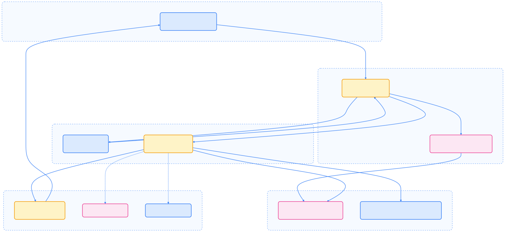
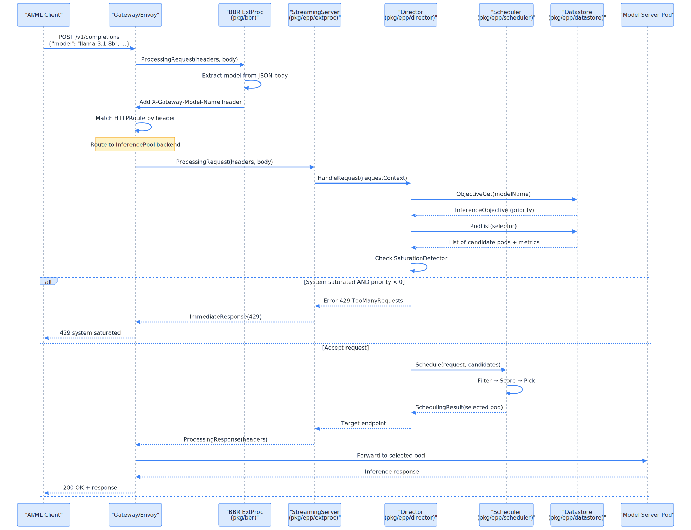
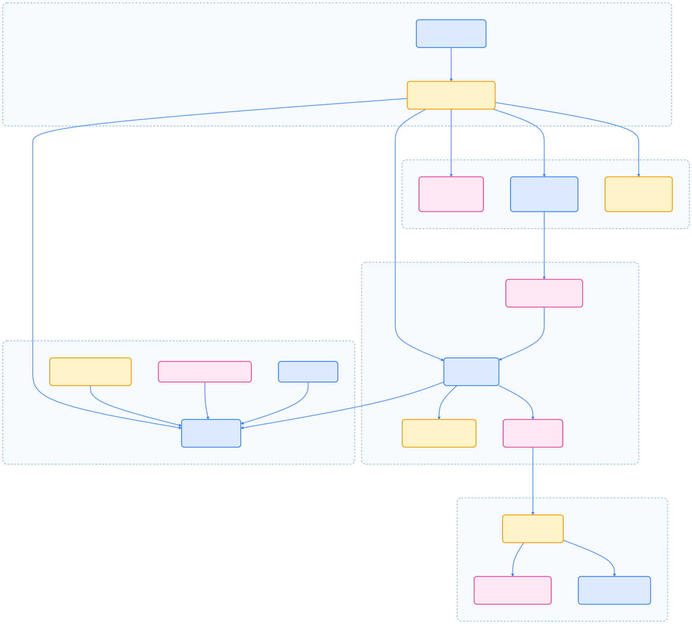

> Gateway API Inference Extension 为 Kubernetes AI/ML 推理工作负载提供了标准化、声明式的流量管理和智能路由能力，极大提升了模型服务的可扩展性与可维护性。

## 引言

本文系统介绍了 Kubernetes Gateway API Inference Extension 的架构、核心组件、关键资源、请求处理流程、调度算法及最佳实践，帮助读者全面理解其在 AI 推理场景下的应用价值。

## 什么是 Gateway API Inference Extension

Gateway API Inference Extension 是 Kubernetes Gateway API 的一个扩展，专为 AI/ML 推理工作负载设计。它提供标准化 API，便于管理 AI 模型服务的路由、负载均衡和流量控制。

### 核心特性

- 模型路由：基于模型名称、版本等进行路由
- 负载均衡：AI 推理服务的智能负载均衡
- 流量分割：支持金丝雀发布和 A/B 测试
- 服务发现：自动发现和注册 AI 服务
- 安全控制：API 密钥管理和访问控制

## 架构概述

下图展示了 Gateway API Inference Extension 的整体架构：

```mermaid "系统架构总览"
graph TB
    subgraph "客户端层"
        CLIENT["AI/ML 应用<br/>(OpenAI-compatible client)"]
    end

    subgraph "网关层"
        GW["Gateway<br/>(Envoy-based proxy)"]
        HR["HTTPRoute<br/>(gateway.networking.k8s.io/v1)"]
    end

    subgraph "扩展层"
        BBR["Body-Based Router<br/>(pkg/bbr)"]
        EPP["Endpoint Picker Proxy<br/>(cmd/epp)"]
    end

    subgraph "控制平面"
        POOL["InferencePool CRD<br/>(apis/v1/inferencepool_types.go)"]
        OBJ["InferenceObjective CRD<br/>(apis/v1alpha2/inferenceobjective_types.go)"]
    end

    subgraph "后端层"
        MS1["Model Server Pod 1<br/>(vLLM, Triton, SGLang)"]
        MS2["Model Server Pod 2"]
        MS3["Model Server Pod N"]
    end

    CLIENT -->|"HTTP POST /v1/completions"| GW
    GW -->|"ext-proc gRPC stream"| BBR
    BBR -->|"adds X-Gateway-Model-Name header"| GW
    GW -->|"matches HTTPRoute"| HR
    HR -->|"backendRef: InferencePool"| POOL
    GW -->|"ext-proc gRPC stream"| EPP
    EPP -->|"watches"| POOL
    EPP -->|"watches"| OBJ
    EPP -->|"selects optimal pod"| MS1
    EPP -.->|"alternative selection"| MS2
    EPP -.->|"alternative selection"| MS3
    MS1 -->|"inference response"| CLIENT
```


{width=2318 height=1066}

### 组件说明

- Gateway：入口网关，处理外部请求
- InferencePool：推理服务池，管理多个模型服务
- InferenceExtension：推理扩展，提供 AI 特定功能
- Model Servers：实际的模型推理服务

## 核心组件详解

Gateway API Inference Extension 由四个主要组件协同工作，提供智能推理路由能力。

### Gateway

Gateway 是支持 Gateway API 且实现 ext-proc 的 Kubernetes 代理。常见实现包括 GKE Gateway、Istio、Kgateway 和 Agentgateway。Gateway 负责 L4-L7 路由，并通过 gRPC 流与扩展组件集成。

### Body-Based Router (BBR)

BBR 是可选 ext-proc 服务器，从 OpenAI 格式请求体中提取 `model` 字段，并注入 `X-Gateway-Model-Name` 头部，便于 HTTPRoute 按模型名称路由。

### Endpoint Picker Proxy (EPP)

EPP 是核心智能组件，实现调度和路由逻辑。其主要子模块包括：

- StreamingServer：处理 Envoy 的双向 gRPC 协议
- Director：协调请求生命周期和插件执行
- Scheduler：执行 Filter → Score → Pick 流水线
- Datastore：缓存 Kubernetes 资源和 Pod 指标
- Controllers：协调 InferencePool、InferenceObjective 和 Pod 资源

### Model Servers

后端 Pod 运行推理服务器（如 vLLM、Triton、SGLang），需实现协议以公开调度决策指标。

## 核心 Kubernetes 资源

下表总结了扩展引入的自定义 Kubernetes 资源及其作用：



| 资源 | API 版本 | 目的 |
| --- | --- | --- |
| InferencePool | inference.networking.k8s.io/v1 | 定义模型服务器 Pod 池并引用 EPP 服务进行端点选择 |
| InferenceObjective | inference.networking.x-k8s.io/v1alpha2 | 为模型指定请求优先级和路由策略 |
| Gateway | gateway.networking.k8s.io/v1 | 标准 Gateway API 资源，通过 EPP 集成扩展 |
| HTTPRoute | gateway.networking.k8s.io/v1 | 将流量路由到 InferencePool 后端而非标准 Service |



下图展示了资源之间的关系：

```mermaid "Kubernetes 资源关系图"
graph LR
    subgraph "标准 Gateway API"
        GW["Gateway"]
        HR["HTTPRoute"]
    end

    subgraph "Inference Extension CRDs"
        POOL["InferencePool<br/>inference.networking.k8s.io/v1"]
        OBJ["InferenceObjective<br/>inference.networking.x-k8s.io/v1alpha2"]
    end

    subgraph "Core Kubernetes"
        SVC["Service<br/>(EPP ext-proc)"]
        POD["Pods<br/>(model servers)"]
    end

    HR -->|"backendRef"| POOL
    POOL -->|"endpointPickerRef"| SVC
    POOL -->|"selector.matchLabels"| POD
    OBJ -->|"references"| POOL
    GW -->|"parent of"| HR
```


{width=1920 height=558}

## 请求处理流程

推理请求的处理流程如下图所示：

```mermaid "推理请求处理时序图"
sequenceDiagram
    participant Client as "AI/ML Client"
    participant Envoy as "Gateway/Envoy"
    participant BBR as "BBR ExtProc<br/>(pkg/bbr)"
    participant SS as "StreamingServer<br/>(pkg/epp/extproc)"
    participant Dir as "Director<br/>(pkg/epp/director)"
    participant Sched as "Scheduler<br/>(pkg/epp/scheduler)"
    participant DS as "Datastore<br/>(pkg/epp/datastore)"
    participant Pod as "Model Server Pod"

    Client->>Envoy: POST /v1/completions<br/>{"model": "llama-3.1-8b", ...}
    Envoy->>BBR: ProcessingRequest(headers, body)
    BBR->>BBR: Extract model from JSON body
    BBR->>Envoy: Add X-Gateway-Model-Name header

    Envoy->>Envoy: Match HTTPRoute by header
    Note over Envoy: Route to InferencePool backend

    Envoy->>SS: ProcessingRequest(headers, body)
    SS->>Dir: HandleRequest(requestContext)

    Dir->>DS: ObjectiveGet(modelName)
    DS-->>Dir: InferenceObjective (priority)

    Dir->>DS: PodList(selector)
    DS-->>Dir: List of candidate pods + metrics

    Dir->>Dir: Check SaturationDetector

    alt System saturated AND priority < 0
        Dir-->>SS: Error 429 TooManyRequests
        SS-->>Envoy: ImmediateResponse(429)
        Envoy-->>Client: 429 system saturated
    else Accept request
        Dir->>Sched: Schedule(request, candidates)
        Sched->>Sched: Filter → Score → Pick
        Sched-->>Dir: SchedulingResult(selected pod)
        Dir-->>SS: Target endpoint
        SS-->>Envoy: ProcessingResponse(headers)
        Envoy->>Pod: Forward to selected pod
        Pod-->>Envoy: Inference response
        Envoy-->>Client: 200 OK + response
    end
```


{width=1976 height=1516}

**关键阶段说明：**

1. Body Parsing：BBR 从请求体提取模型名称
2. Route Matching：Gateway 根据头部匹配 HTTPRoute
3. Endpoint Selection：EPP Director 协调 Scheduler 选择最佳 Pod
4. Saturation Detection：检查系统是否过载
5. Scheduling：三阶段调度选择最佳 Pod

## 关键概念和术语

- **Inference Gateway (IGW)**：与 Endpoint Picker 耦合的代理/负载均衡器，基于实时指标智能路由。
- **Endpoint Picker Extension (EPP)**：推理调度器实现，扩展 Envoy 以注入路由决策。
- **指标和能力**：如队列深度、KV 缓存利用率、前缀缓存、LoRA 适配器等。
- **饱和检测**：EPP 监控系统负载，丢弃低优先级请求，相关阈值可配置。

## EPP 内部组件

下图展示了 EPP 应用的主要子系统及其关系：

```mermaid "EPP 内部组件结构"
graph TB
    subgraph "EPP 进程"
        MAIN["main()<br/>(cmd/epp/main.go)"]
        RUNNER["Runner<br/>(pkg/epp/runner/runner.go)"]
    end

    subgraph "gRPC 服务器"
        HEALTH["Health Server<br/>:9003<br/>(pkg/epp/health)"]
        EXTPROC["ExtProc Server<br/>:9002<br/>(pkg/epp/extproc)"]
        METRICS["Metrics Server<br/>:9090<br/>(pkg/epp/metrics)"]
    end

    subgraph "请求管道"
        SS["StreamingServer<br/>(streaming_server.go)"]
        DIR["Director<br/>(director.go)"]
        SD["SaturationDetector<br/>(saturationdetector/)"]
        SCHED["Scheduler<br/>(scheduler.go)"]
    end

    subgraph "数据层"
        DS["Datastore<br/>(datastore.go)"]
        POOL_CTL["InferencePoolReconciler<br/>(controllers/)"]
        OBJ_CTL["InferenceObjectiveReconciler"]
        POD_CTL["PodReconciler"]
    end

    subgraph "插件系统"
        PLUGINS["Plugin Registry<br/>(plugins/)"]
        SCORERS["Scorers<br/>(kvcache, queue, lora)"]
        PICKERS["Pickers<br/>(maxscore, random)"]
    end

    MAIN --> RUNNER
    RUNNER --> HEALTH
    RUNNER --> EXTPROC
    RUNNER --> METRICS
    RUNNER --> DIR
    RUNNER --> DS

    EXTPROC --> SS
    SS --> DIR
    DIR --> SD
    DIR --> SCHED
    DIR --> DS

    SCHED --> PLUGINS
    PLUGINS --> SCORERS
    PLUGINS --> PICKERS

    POOL_CTL --> DS
    OBJ_CTL --> DS
    POD_CTL --> DS
```


{width=2042 height=1843}

**主要职责：**

- Runner：初始化和启动所有子系统
- StreamingServer：实现 Envoy 双向流协议
- Director：协调请求生命周期和插件执行
- Scheduler：执行调度流水线
- Datastore：缓存 Kubernetes 资源
- Controllers：同步 CRD 到数据存储
- Plugins：可扩展评分和选择策略

## 调度算法

EPP 采用三阶段调度算法，受 Kubernetes 调度器启发：

```mermaid "三阶段调度算法流程"
graph LR
    CANDIDATES["候选 Pods<br/>(来自 InferencePool 选择器)"]

    subgraph "阶段 1: 过滤"
        F1["HeaderBasedTestingFilter<br/>(plugins/headerbasedtesting)"]
    end

    subgraph "阶段 2: 评分"
        S1["KVCacheUtilizationScorer<br/>(plugins/kvcache)"]
        S2["QueueScorer<br/>(plugins/queue)"]
        S3["LoraAffinityScorer<br/>(plugins/loraaffinity)"]
        S4["PrefixCachePlugin<br/>(plugins/prefixcache)"]
    end

    subgraph "阶段 3: 选择"
        P1["MaxScorePicker<br/>(plugins/maxscore)"]
    end

    RESULT["选定的 Pod IP:Port"]

    CANDIDATES --> F1
    F1 -->|"过滤后的候选"| S1
    S1 --> S2
    S2 --> S3
    S3 --> S4
    S4 -->|"评分后的候选"| P1
    P1 --> RESULT
```


{width=2998 height=198}

**评分权重说明：**

- KV 缓存：利用率越低分数越高
- 队列深度：请求越少分数越高
- LoRA 亲和：已加载适配器分数高
- 前缀缓存：命中前缀分数高

## 支持的平台

### Gateway 提供商



| 提供商 | 状态 | 备注 |
| --- | --- | --- |
| GKE Gateway | 稳定 | 原生 Google Cloud 集成，支持 HealthCheckPolicy |
| Istio | 实验性 | 需 Istio 1.28-dev+，启用 ENABLE_GATEWAY_API_INFERENCE_EXTENSION |
| Kgateway | 技术预览 | v2.1.0+ 滚动发布支持 |
| Agentgateway | 技术预览 | Kgateway 控制平面 AI 优化代理 |



### 模型服务器



| 服务器 | 支持级别 | 协议合规性 |
| --- | --- | --- |
| vLLM | 增强 | 与 llm-d 集成的完整协议支持 |
| Triton Inference Server | 支持 | 需协议合规指标 |
| SGLang | 支持 | 需协议合规指标 |



## 安装与配置

### 安装 Gateway API

以下命令用于安装 Gateway API 及 Inference Extension：

```bash
kubectl apply -f https://github.com/kubernetes-sigs/gateway-api/releases/download/v1.0.0/gateway-api.yaml
kubectl apply -f https://github.com/kubernetes-sigs/gateway-api-inference-extension/releases/download/v0.1.0/inference-extension.yaml
```

### 创建 InferencePool

以下 YAML 示例定义了一个 InferencePool：

```yaml
apiVersion: inference.networking.x-k8s.io/v1alpha1
kind: InferencePool
metadata:
  name: llama-pool
spec:
  selector:
    matchLabels:
      app: llama-model
  targetPortNumber: 8000
  endpointPicker:
    type: Random
```

### 配置 Gateway

```yaml
apiVersion: gateway.networking.k8s.io/v1
kind: Gateway
metadata:
  name: ai-gateway
  annotations:
    inference.networking.x-k8s.io/enabled: "true"
spec:
  gatewayClassName: inference-gateway
  listeners:
  - name: http
    hostname: ai.example.com
    port: 80
    protocol: HTTP
```

### 创建 InferenceRoute

```yaml
apiVersion: inference.networking.x-k8s.io/v1alpha1
kind: InferenceRoute
metadata:
  name: chat-route
spec:
  parentRefs:
  - name: ai-gateway
  rules:
  - matches:
    - method: POST
      path:
        type: PathPrefix
        value: /v1/chat/completions
    backendRefs:
    - kind: InferencePool
      name: llama-pool
      weight: 100
```

## 高级路由功能

### 模型版本路由

通过 headers 匹配实现模型版本路由：

```yaml
apiVersion: inference.networking.x-k8s.io/v1alpha1
kind: InferenceRoute
metadata:
  name: versioned-route
spec:
  rules:
  - matches:
    - headers:
      - name: x-model-version
        value: v2
    backendRefs:
    - kind: InferencePool
      name: llama-v2-pool
      weight: 100
  - matches:
    - headers:
      - name: x-model-version
        value: v1
    backendRefs:
    - kind: InferencePool
      name: llama-v1-pool
      weight: 100
```

### 流量分割

```yaml
spec:
  rules:
  - matches:
    - path:
        type: PathPrefix
        value: /v1/chat/completions
    backendRefs:
    - kind: InferencePool
      name: llama-v2-pool
      weight: 90
    - kind: InferencePool
      name: llama-v1-pool
      weight: 10
```

### 地理位置路由

```yaml
apiVersion: inference.networking.x-k8s.io/v1alpha1
kind: InferenceRoute
metadata:
  name: geo-route
spec:
  rules:
  - matches:
    - headers:
      - name: x-region
        value: us-west
    backendRefs:
    - kind: InferencePool
      name: us-west-pool
  - matches:
    - headers:
      - name: x-region
        value: eu-central
    backendRefs:
    - kind: InferencePool
      name: eu-central-pool
```

## 负载均衡策略

### 轮询负载均衡

```yaml
apiVersion: inference.networking.x-k8s.io/v1alpha1
kind: InferencePool
metadata:
  name: round-robin-pool
spec:
  endpointPicker:
    type: RoundRobin
```

### 最小连接数

```yaml
spec:
  endpointPicker:
    type: LeastConnections
```

### 基于权重的负载均衡

```yaml
spec:
  endpointPicker:
    type: WeightedRoundRobin
    weights:
      endpoint-1: 70
      endpoint-2: 30
```

## 安全与访问控制

### API 密钥验证

```yaml
apiVersion: inference.networking.x-k8s.io/v1alpha1
kind: InferenceRoute
metadata:
  name: secured-route
  annotations:
    inference.networking.x-k8s.io/auth-type: api-key
spec:
  rules:
  - matches:
    - path:
        type: PathPrefix
        value: /v1/chat/completions
    filters:
    - type: RequestHeaderModifier
      requestHeaderModifier:
        add:
        - name: Authorization
          value: Bearer ${API_KEY}
```

### 速率限制

```yaml
filters:
- type: RateLimit
  rateLimit:
    requestsPerUnit: 100
    unit: Minute
    burst: 20
```

## 监控与可观测性

Inference Extension 自动收集请求延迟、吞吐量、错误率、推理池健康状态等指标。

### 集成 Prometheus

以下为 Prometheus 集成配置示例：

```yaml
apiVersion: v1
kind: ConfigMap
metadata:
  name: inference-gateway-config
data:
  gateway-config.yaml: |
    apiVersion: gateway.networking.k8s.io/v1
    kind: Gateway
    metadata:
      name: ai-gateway
      annotations:
        inference.networking.x-k8s.io/metrics-enabled: "true"
        inference.networking.x-k8s.io/prometheus-port: "9090"
```

## 最佳实践

- 多副本部署，确保高可用
- 配置健康检查与自动故障转移
- 优化连接池与缓存策略，提升性能
- 启用 TLS 加密与细粒度访问控制
- 开启审计日志，便于安全追踪

## 故障排除

常见问题及调试命令：

- 路由不生效：检查 InferenceRoute 配置和标签选择器
- 负载不均衡：验证 endpoint picker 配置
- 性能问题：检查资源限制和网络配置

```bash
kubectl get inferencepool
kubectl describe inferenceroute chat-route
kubectl logs -l app=gateway-api-controller
```

## 快速开始

1. 部署模型服务器（GPU/CPU/模拟器）
2. 安装 CRDs
3. 安装 InferencePool + EPP
4. 部署 Gateway
5. 发送推理请求

```bash
kubectl apply -f https://github.com/kubernetes-sigs/gateway-api-inference-extension/releases/latest/download/manifests.yaml
helm install vllm-llama3-8b-instruct oci://registry.k8s.io/gateway-api-inference-extension/charts/inferencepool
curl ${IP}:${PORT}/v1/completions -d '{"model": "...", "prompt": "..."}'
```

## 项目状态

该项目目前处于 alpha 阶段，API 及功能可能有重大变更。最新版本特性包括：

- InferencePool v1 API（稳定）
- InferenceObjective v1alpha2 API（Alpha）
- 生产级 EPP 可插拔调度框架
- GKE Gateway 稳定支持
- Istio、Kgateway、Agentgateway 实验性支持

## 总结

Gateway API Inference Extension 为 AI 推理服务带来了声明式、可扩展的流量管理与智能调度能力。通过标准化的 Kubernetes 资源和灵活的路由策略，极大提升了 AI 服务的可维护性与可观测性，是构建现代 AI 平台的重要基础设施组件。

## 参考

- [Gateway API Inference Extension](https://gateway-api-inference-extension.sigs.k8s.io/)
