> HAMi 是一款面向 Kubernetes 的异构算力虚拟化中间件，支持多种 AI 加速器的统一管理与调度，极大提升了 GPU、NPU、MLU 等硬件的利用率和资源弹性。本文系统梳理 HAMi 的架构、功能、生态集成与实际应用，帮助读者全面理解其技术价值与行业意义。

## 项目简介与定位

HAMi（Heterogeneous AI Computing Virtualization Middleware，前身为 `k8s-vGPU-scheduler`）是一个专为 Kubernetes 设计的异构设备管理中间件。它扩展了 K8s 原生调度与资源管理能力，为 GPU、NPU、MLU、DCU 等 AI 加速硬件提供统一的资源分配与调度接口。HAMi 致力于打通不同异构设备间的管理壁垒，用户无需修改应用即可享受统一的算力资源管理体验。

**核心能力包括：**

- 设备虚拟化：将物理设备切分为多个虚拟实例，实现资源隔离
- 设备共享：支持多个容器安全高效共享同一物理设备
- 统一调度：面向异构硬件的拓扑感知调度
- 资源隔离：对设备显存和计算核心实施硬隔离
- 多厂商支持：通过统一接口屏蔽不同厂商设备差异

## 系统架构与组件

HAMi 通过一系列关键组件与 Kubernetes 深度集成，扩展了原生的调度与资源管理能力：

- Admission Webhook（hami-scheduler）：拦截并修改 Pod 规范，注入设备需求与校验资源请求
- Scheduler Extender（hami-scheduler）：提供设备感知的节点过滤与打分，实现智能调度
- Device Plugin（hami-device-plugin）：在节点侧管理设备资源，并向 kubelet 上报可用性
- 配置管理：通过 ConfigMap 存储设备参数与调度策略


{width=1920 height=1139}

## 设备虚拟化与共享机制

HAMi 的核心创新在于将物理设备虚拟化为多个虚拟实例，并实现资源隔离：

- `nvidia.com/gpu`：请求虚拟 GPU 实例数量
- `nvidia.com/gpumem`：分配的设备显存（MB）
- `nvidia.com/gpucores`：分配的计算核心百分比
- `nvidia.com/gpumem-percentage`：按百分比分配显存

**主要特性：**

- 硬件显存限制：容器仅能访问分配的显存
- 计算核心限制：严格限制 SM 单元使用比例
- 应用零侵入：无需修改现有 CUDA 应用
- 动态资源伸缩：支持显存超配（比例大于 1.0）

## 多厂商异构设备支持

HAMi 采用插件架构，支持多家主流厂商的异构设备：



| 厂商      | 设备类型 | 资源名称示例                                         | 主要特性                  |
| --------- | -------- | ---------------------------------------------------- | ------------------------- |
| NVIDIA    | GPU      | `nvidia.com/gpu`, `nvidia.com/gpumem`                | MIG、vGPU、显存伸缩       |
| Cambricon | MLU      | `cambricon.com/vmlu`, `cambricon.com/mlu.smlu.vmemory` | MLU 虚拟化                |
| Hygon     | DCU      | `hygon.com/dcunum`, `hygon.com/dcumem`               | DCU 共享                  |
| Iluvatar  | GPU      | `iluvatar.ai/vgpu`, `iluvatar.ai/vcuda-memory`       | GPU 虚拟化                |
| Huawei    | Ascend NPU | `huawei.com/Ascend910`, `huawei.com/Ascend910-memory` | NPU 支持                  |
| Mthreads  | GPU      | `mthreads.com/vgpu`, `mthreads.com/sgpu-memory`      | GPU 共享                  |
| Enflame   | GPU      | `enflame.com/gcu`, `enflame.com/gcu-memory`          | GCU 支持                  |
| Metax     | GPU      | `metax-tech.com/gpu`, `metax-tech.com/sgpu`          | GPU 虚拟化                |



## 调度与资源分配策略

HAMi 扩展了 Kubernetes 的调度能力，支持设备感知与拓扑优化：

- 节点调度策略：`binpack`（集中分配）或 `spread`（均衡分布）
- GPU 调度策略：`binpack`（共享单卡）或 `spread`（分散多卡）
- 拓扑感知：考虑 NUMA、互联拓扑等硬件布局
- 自定义过滤：支持基于 UUID、设备类型等多维过滤

**配置方式：**

- `scheduler.defaultSchedulerPolicy.nodeSchedulerPolicy`：默认节点分配策略
- `scheduler.defaultSchedulerPolicy.gpuSchedulerPolicy`：默认 GPU 分配策略
- Pod 注解如 `hami.io/gpu-scheduler-policy` 支持单 Pod 策略覆盖

## 云原生生态集成

HAMi 作为 [CNCF Sandbox 项目](https://landscape.cncf.io/?item=orchestration-management--scheduling-orchestration--hami)，与云原生生态深度融合：

- Kubernetes 集成：遵循 Device Plugin、Admission Controller、Scheduler Extender 等标准 API，兼容原生资源模型与调度流程
- 监控与可观测性：内置 Prometheus 指标（`/metrics`），提供 Grafana 仪表盘模板，便于集成现有监控体系
- 部署与管理：官方 Helm Chart 支持一键安装与配置，适配 CI/CD 自动化部署，兼容 kube-scheduler 与 volcano-scheduler
- 社区与治理：活跃的开源社区，50+ 机构参与，定期社区会议与治理机制，已在互联网、云、金融、电信、制造等行业生产落地

## 快速入门

HAMi 安装与使用门槛低，几步即可在 Kubernetes 集群中实现 GPU 虚拟化：

**前置条件：**

- Kubernetes 版本 ≥ 1.18
- NVIDIA 驱动 ≥ 440（如需支持 NVIDIA GPU）
- nvidia-docker 版本 > 2.0
- Helm 版本 > 3.0

**基础安装流程：**

```bash
# 给 GPU 节点打标签
kubectl label nodes {node-name} gpu=on

# 添加 HAMi Helm 仓库
helm repo add hami-charts https://project-hami.github.io/HAMi/

# 安装 HAMi
helm install hami hami-charts/hami -n kube-system
```

**资源请求示例：**

```yaml
resources:
  limits:
    nvidia.com/gpu: 1        # 申请 1 个 vGPU
    nvidia.com/gpumem: 3000  # 分配 3GB 显存
    nvidia.com/gpucores: 50  # 分配 50% GPU 核心
```

## 项目起源与发展历程及 CNCF 定位

HAMi（Heterogeneous AI Computing Virtualization Middleware）前身是开源项目“k8s-vGPU-scheduler”，于 2021 年由第四范式等贡献者发起。项目目标是在 Kubernetes 集群中简化和自动化对 GPU、NPU、MLU 等异构 AI 加速硬件的管理。HAMi 通过将单张物理 GPU 拆分为多个虚拟单元供多任务共享，大幅提升硬件利用率。它解决了 Kubernetes 原生 NVIDIA Device Plugin 一卡一 Pod 导致的 GPU 利用率低下问题，使多个 Pod 能安全高效共享同一 GPU。

在社区运营方面，HAMi 自发布以来增长迅速。截至 2024 年底，GitHub 上已有 ~1800 颗星标和 70+ 名贡献者参与（2025 年已超 2.2k Stars），初始贡献来自第四范式等公司。HAMi 于 2024 年 8 月正式被 CNCF（云原生计算基金会）接纳为 Sandbox（沙箱）级项目。目前 HAMi 作为 CNCF 编排与调度类的开源项目，已被收录进 CNCF 技术全景图和 CNAI（云原生 AI）景观。项目以开放治理为目标，由互联网、金融、制造、云厂商等多个领域共同发起，具备中立开放的社区属性。截至 2025 年初，HAMi 已广泛应用于公有云、私有云以及金融、证券、能源、电信、教育、制造等行业的生产环境，超过 50 家机构既是其终端用户也是积极贡献者。

HAMi 的核心愿景是成为“Kubernetes 上异构算力的一站式管理中间件”，打破不同加速硬件间的使用鸿沟，为用户提供统一的接口和体验，同时无需改动现有应用程序。2024 年 HAMi 通过 CNCF 沙箱项目投票，以超过规定票数通过并正式进入基金会治理。这标志着 HAMi 获得了云原生社区的认可，也使其生态加速壮大。

## 技术架构设计与核心功能

**架构概览：** HAMi 采用模块化的架构，包含多个协同工作的组件：一个统一的 Mutating Webhook（变更准入控制器）、一个自定义的调度扩展（Scheduler Extender）、针对不同硬件的 Device Plugin 插件，以及每种异构设备对应的容器内虚拟化核心（HAMi-Core）。此外，HAMi 提供可选的 Web UI 界面用于资源可视化管理（v2.4+ 提供）。下图展示了 HAMi 的高层架构，各组件在 Kubernetes 集群中的配合（MutatingWebhook -> 调度器 -> 设备插件 -> HAMi-Core）：



{width=1920 height=829}

### 关键组件

下面分项说明 HAMi 的若干核心组件及其职责，便于读者快速定位各模块功能与交互关系。

**Mutating Webhook（变更准入控制器）**

Mutating Webhook 拦截集群中创建的 Pod 请求，判断是否包含 HAMi 支持的资源类型。  
它为需要使用 GPU/NPU 的 Pod 打标并注入必要的环境变量、挂载信息和配置，保证后续由 HAMi 的设备插件与调度器接管设备分配与运行时约束。

主要职责：

- 标注 Pod 并注入 LD_PRELOAD、配置变量等运行时设置。
- 校验资源请求合法性，拦截不合规的显存/算力请求。
- 配合设备插件完成容器启动时的共享库挂载。

**自定义调度器（Scheduler Extender / hami-scheduler）**

HAMi 的调度扩展提供双层调度能力：先选节点、再选设备插槽。它支持基于剩余资源与拓扑的过滤与打分（K8s 的“打分 -> 过滤 -> 选择”三步）。

要点：

- 节点层策略：Spread（均衡）/ Binpack（紧凑）。
- 卡级策略同样支持 Spread/Binpack，兼顾互联与碎片率。
- 从设备插件获取节点 GPU 状态（空闲显存、算力余量）以做更精细决策。
- 支持与 kube-scheduler 协作，并能集成 Volcano 等调度器。

**设备插件（Device Plugin）**

设备插件在每个节点上运行，负责发现物理设备并虚拟化为多个逻辑设备供 kubelet 分配。插件将虚拟设备注册给 kubelet，并在 Pod 分配时注入 HAMi-Core 所需的挂载与环境变量。

功能亮点：

- 将物理 GPU 切分为多个逻辑 vGPU（例如 `gpu-1-1`）。
- 在 Node 注解中周期性更新设备拓扑与资源余量供调度器使用。
- 在容器启动阶段挂载共享库并注入 LD_PRELOAD。

**HAMi‑Core（容器内代理库）**

HAMi‑Core 由 `libvgpu.so` 等组件组成，通过 LD_PRELOAD 加载到容器内，拦截 CUDA / NVML 等调用以实施显存与算力限制，保证容器在“看似独占”下被精细管控。

实现机制：

- 拦截内存分配 API（如 cuMemAlloc），超配时返回 OOM。
- 通过令牌桶等算法限制 Kernel 启动频率与平均 SM 使用率。
- 通过环境变量（如显存上限、SM 限制）传递配额给拦截层。

**Web UI（可选可视化面板）**

从 2.4 起提供可选 Web UI，便于运维查看节点设备分配、每 Pod 的显存/算力使用量及历史指标。Web UI 可集成 Prometheus 指标与 Grafana 仪表盘模板，支持告警接入与可视化运维流程。

### 核心功能与技术亮点

以下按能力模块拆分，突出 HAMi 在虚拟化、调度、配额与 QoS 方面的关键技术点。

**GPU 虚拟化与共享**

HAMi 将物理 GPU 虚拟化为多个 vGPU，支持按 MB 或百分比分配显存，并可限定计算核心百分比。结合时间片调度与设备复用，多个容器可并行或分时共享同一块 GPU，从而显著提升利用率。

支持项：

- 显存粒度或百分比分配。
- MIG 支持与动态 MIG 创建/调整。
- 时间片共享与软隔离机制。

**拓扑感知调度**

调度器在分配多卡任务时考虑 NVLink / PCIe / 自研互联（如 MetaXLink）等拓扑，优先选择互联带宽高的 GPU 组合，降低通信瓶颈并提升分布式训练/推理效率。引入 `linkZone` 概念对同域优先调度。

效果：

- 优化多卡通信延迟与带宽利用。
- 在 Spread/Binpack 策略下兼顾互联域完整性与资源连续性。

**ResourceQuota 扩展**

为了解决 K8s 原生 ResourceQuota 无法感知 vGPU 显存和算力的问题，HAMi 对配额统计进行扩展，将 `nvidia.com/gpumem`、`nvidia.com/gpucores` 等纳入租户计量，支持与 Volcano 队列配额联动，实现多租户场景下的总量控制。

能力：

- 将 vGPU 请求折算入租户总配额。
- 支持基于队列/命名空间的配额统计与限制。

**QoS 策略与抢占**

HAMi 支持任务优先级与基于优先级的算力抢占机制。高优先级 Pod 可在共享 GPU 时优先获取算力，低优先级 Pod 会被限速或挂起以释放资源，保证关键业务的服务质量。

特点：

- 优先级驱动的动态资源让渡与挂起/恢复策略。
- 支持公平共享与超售策略（可配置是否允许 oversubscription）。

**零侵入与生态整合**

HAMi 设计强调对上层应用的透明兼容：无需修改 Pod YAML 即可启用 vGPU。与 NVIDIA 官方 Device Plugin、GPU Operator 等并存，支持多调度器协作，并原生输出 Prometheus 指标与 Grafana 模板，便于在现有平台中“即插即用”部署。

兼容性要点：

- 与 nvidia.com/gpu 资源模型兼容。
- 支持公有云/私有云/混合云场景的一键 Helm 安装。
- 提供监控和运维接入示例与最佳实践。

以上分节有助于读者快速定位 HAMi 的组件职责与关键能力，同时便于在文档中按需引用具体实现细节或使用示例。

## 总结

从技术与行业趋势来看，HAMi 具有较高的研究与应用价值。它能显著提升 GPU 及其他异构加速器的利用率，在大模型训练与推理场景用更少硬件提供更多算力，已有顺丰、Prep EDU 等实践验证效果。插件化架构和拓扑感知调度使其易于扩展到更多异构设备（如 FPGA、定制 AI 芯片），具备明显成长空间。对系统研发者而言，HAMi 涉及虚拟化、GPU 内核拦截、资源配额与分布式调度等多领域，具有重要的学术与工程价值。若社区持续活跃并保持开发节奏，HAMi 有望在云原生生态中成为关键的异构算力管理组件。

## 参考资料

1. [HAMi 官方文档 – 什么是 HAMi？ - project-hami.github.io](https://project-hami.github.io/)
2. [CNCF 官方介绍 – HAMi was accepted to CNCF on August 21, 2024 at the Sandbox level. - cncf.io](https://www.cncf.io/)
3. [Palark 技术博客 – Exploring CNCF Sandbox Projects 2024 H2: HAMi - palark.com](https://palark.com/)
4. [RiseUnion 深度解析 – 开源 vGPU 解决方案 HAMi：让 GPU 资源利用更高效的技术实践 - riseunion.com](https://riseunion.com/)
5. [HAMi GitHub 自述 – Supported devices: NVIDIA, Cambricon, Hygon, Iluvatar, Moore Threads, Huawei Ascend, MetaX etc. - github.com](https://github.com/Project-HAMi/HAMi)
6. [CNCF 案例研究 – SF Technology: Effective GPU pooling built on HAMi - cncf.io](https://www.cncf.io/case-studies/sf-technology/)
7. [CNCF 案例研究 – Prep EDU: Efficient GPU Orchestration with HAMi - cncf.io](https://www.cncf.io/case-studies/prep-edu/)
8. [阿里云创业中心 – 蜜瓜智能获超五百万种子轮投资 - aliyun.com](https://developer.aliyun.com/)
9. [SegmentFault 文章 – Yu Yin（尹鈺）介绍 HAMi 项目 - segmentfault.com](https://segmentfault.com/)
10. [DaoCloud 企业云文档 – HAMi 产品设计与架构图 - daocloud.io](https://www.daocloud.io/)
