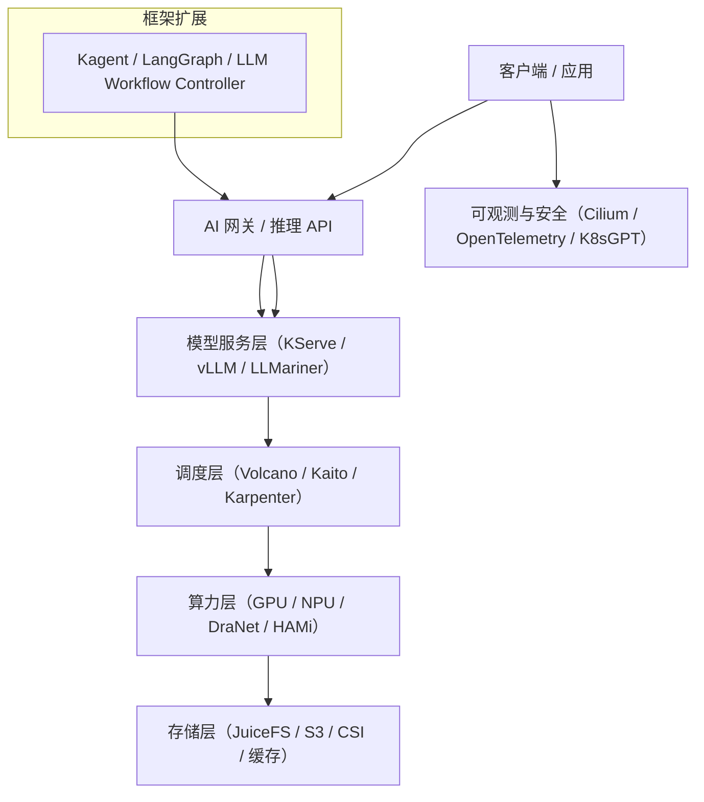

> 本文系统梳理了 Kubernetes AI 基础设施的设计原则、核心组件、硬件加速、网络与存储优化及运维实践，助力构建高效稳定的 AI 平台。

## 引言：Kubernetes 的 AI 时代使命

在 AI 原生（AI-Native）浪潮下，Kubernetes（K8s）再次成为关键的计算底座。过去，它是微服务时代的“容器编排中心”；如今，它正演变为 AI 基础设施的“模型编排核心”。

Kubernetes 通过统一的 API、调度、伸缩、服务发现和安全控制，为异构算力、模型推理、数据管理和智能代理提供了标准化的运行环境。这意味着，在 AI 时代，K8s 不再只是 DevOps 的平台，而是 AI Infra（AI 基础设施）的中枢。

## AI 技术栈总体架构

下图展示了 Kubernetes 在 AI 场景中的六大层级，帮助理解各组件的协作关系。




{width=1920 height=2734}

这一架构分为以下层级：

- AI Gateway 层：统一模型服务入口与路由。
- 模型推理层：KServe / vLLM / LLMariner。
- 调度层：Volcano、Kaito、Karpenter。
- 算力层：GPU、NPU、DraNet、HAMi。
- 存储层：JuiceFS、S3、Ceph、EdgeFS。
- 可观测与安全层：Cilium、OpenTelemetry、K8sGPT。

## AI 基础设施的设计原则

AI 应用对底层基础设施提出了更高的要求，主要体现在计算密集、数据密集和网络密集三个方面。Kubernetes 需针对这些特性进行专项优化。

### Kubernetes AI 架构设计原则

在设计 Kubernetes AI 基础设施时，建议遵循以下原则：

- 模块化与可插拔性：所有组件基于 CRD（Custom Resource Definition）、Operator、Controller 模式构建。
- 异构资源抽象化：统一管理 GPU、NPU、DPU、RDMA 等算力资源。
- 弹性与经济性：结合 KEDA 与 Karpenter 实现 Pod 与节点级弹性。
- 模型感知网络：通过 Envoy Gateway Inference Extension 实现动态路由。
- 可观测与自治：K8sGPT 与 OpenTelemetry 支持 AIOps 与自愈。
- 数据就近性与缓存优化：JuiceFS、CephFS、Local Cache 结合使用。

### 计算资源优化

为满足 AI 计算密集型需求，需关注以下优化方向：

- GPU（Graphics Processing Unit）资源管理：使用 NVIDIA GPU Operator 进行 GPU 调度。
- TPU（Tensor Processing Unit）集成：支持 Google TPU 等专用 AI 芯片。
- 异构计算：混合 CPU/GPU/TPU 集群统一管理。

### 网络性能优化

高性能网络对于 AI 任务至关重要，优化措施包括：

- RDMA（Remote Direct Memory Access）网络：提升数据传输效率。
- Infiniband：高性能集群内部网络。
- 网络拓扑感知：将 AI 工作负载调度到网络延迟低的节点。

### 存储架构优化

AI 任务对存储有高性能和高容量的双重需求，常见优化方式有：

- 高速存储：NVMe SSD 用于模型缓存。
- 分布式存储：Ceph、MinIO 等用于大数据集存储。
- 对象存储集成：S3 兼容存储用于模型版本管理。

## 核心组件分层解析

下表梳理了 Kubernetes AI 生态的主要组件及其分层功能，便于理解各层协作关系。



| 项目           | 功能               | 特点                                         | 适用场景              |
| -------------- | ------------------ | -------------------------------------------- | --------------------- |
| KServe         | 模型推理服务平台   | 支持多框架、CRD 化管理、自动伸缩、Scale-to-zero | 通用推理服务          |
| vLLM           | 高性能 LLM 推理引擎 | Paged Attention、连续批处理、高吞吐           | 大语言模型            |
| LLMariner      | LLM 托管平台        | OpenAI API 兼容，快速上线推理服务             | 企业内 ChatGPT 类服务 |
| Kaito          | 模型微调 Operator   | 自动化 Train/Tune/Infer 流程                  | 模型训练 + 部署一体   |





| 项目         | 功能             | 特点                          | 说明                   |
| ------------ | ---------------- | ----------------------------- | ---------------------- |
| Volcano      | 批处理与 AI 调度器 | Gang 调度、队列优先级、拓扑感知 | 支持训练与推理任务     |
| Karpenter    | 节点自动扩缩     | GPU 节点池弹性、快速供给      | 节点层 FinOps 工具     |
| HAMi         | 异构算力虚拟化   | CPU/GPU/NPU/DPU 统一抽象      | 提高资源利用率         |
| DraNet       | 高性能网络调度   | 支持 RDMA 与 DRA 动态资源分配 | 提升多节点 All-Reduce 效率 |





| 项目             | 功能           | 特点                         | 说明               |
| ---------------- | -------------- | ---------------------------- | ------------------ |
| JuiceFS          | 分布式文件系统 | 高吞吐 + 缓存层 + CSI Driver | 模型加载与共享存储 |
| Open Data Hub    | 数据与 AI 平台 | 支持 Ceph / Kafka / TensorFlow | 端到端 MLOps 流程  |
| EdgeFS / MinIO   | 对象存储       | S3 兼容接口、边缘优化        | 私有云与多云场景   |





| 项目                                   | 功能                         | 特点                                   |
| -------------------------------------- | ---------------------------- | -------------------------------------- |
| Envoy Gateway + Inference Extension    | 模型感知路由、A/B 测试、版本治理 | 基于 Gateway API 扩展 InferenceModel CRD |
| Cilium                                 | eBPF 网络与安全              | 零信任网络、流量观测、租户隔离         |
| Kagent                                 | AI Agents 框架               | 支持 Agent Workflow、状态管理与推理编排 |


  


| 项目                                   | 功能             | 特点                           |
| -------------------------------------- | ---------------- | ------------------------------ |
| OpenTelemetry / Prometheus / Grafana   | 指标、日志、追踪统一 | 监控推理延迟、GPU 占用、Token 吞吐 |
| K8sGPT                                 | AI 辅助诊断工具  | 使用 LLM 自动分析 K8s 状态与事件 |
| KEDA                                   | 事件驱动伸缩     | 基于消息队列/请求量动态扩容      |
| Kubewarden / Kyverno                   | 策略与安全治理   | 多租户模型服务安全控制           |





| 项目                              | 功能                | 特点                           |
| --------------------------------- | ------------------- | ------------------------------ |
| Kubeflow + Pipelines + KServe     | 全生命周期 MLOps 平台 | 数据→训练→推理全链路           |
| AIBrix                            | LLM 推理架构研究框架 | 调度 + 缓存 + K8s + Ray 混合架构 |
| LangGraph / LangServe / LangChain | AI 智能体与工作流    | LLM Workflow Controller 的雏形 |
| KubeEdge / Edge AI Stack            | 云 - 边协同推理框架   | 适用于 IoT / 边缘智能场景      |



## 硬件加速支持

Kubernetes 支持多种硬件加速方式，显著提升 AI 任务的计算能力。以下示例展示了如何在 Pod 级别指定 GPU 和 TPU 资源。

在实际部署中，推荐通过 nodeSelector 和资源限制来指定 GPU 类型：

```yaml
apiVersion: v1
kind: Pod
metadata:
  name: gpu-pod
spec:
  containers:
  - name: gpu-container
    image: nvidia/cuda:11.0-runtime-ubuntu20.04
    resources:
      limits:
        nvidia.com/gpu: 1
  nodeSelector:
    accelerator: nvidia-tesla-k80
```

对于 TPU（Tensor Processing Unit），Google Kubernetes Engine（GKE）原生支持 TPU 资源：

```yaml
apiVersion: v1
kind: Pod
spec:
  containers:
  - name: tpu-container
    image: gcr.io/tpu-pytorch/xla
    resources:
      limits:
        cloud-tpus.google.com/v3: 8
```

## 网络优化策略

高性能网络是 AI 集群的关键保障。通过结合网络插件与服务网格，可以有效提升数据传输效率和服务间通信能力。

在网络插件方面，常用优化方案包括：

- Cilium with eBPF：内核级网络加速。
- Multus：支持多网络接口。
- SR-IOV：单根 I/O 虚拟化提升网络性能。

服务网格（Service Mesh）如 Istio 可进一步优化 AI 服务间通信，具备智能路由、负载均衡和流量控制等能力。

## 存储解决方案

AI 任务对存储有高性能和高容量的双重需求。以下是常见的模型存储与数据集管理方式。

模型存储方式包括：

- PVC（PersistentVolumeClaim）：持久卷用于模型文件存储。
- NFS（Network File System）：网络文件系统共享模型。
- S3：对象存储进行模型版本控制。

数据集管理常用方案有：

- PersistentVolume：大数据集持久化存储。
- CSI（Container Storage Interface）驱动：云存储集成。
- 缓存层：如 Redis 用于热数据缓存。

## 监控与可观测性

完善的监控体系有助于及时发现基础设施瓶颈和异常。推荐采用如下工具与方法：

- Prometheus：指标收集。
- Grafana：可视化仪表板。
- GPU 监控：专门的 GPU 指标收集器。

性能调优建议关注资源利用率分析、瓶颈识别与容量规划。

## AI 生态地图与趋势

下表总结了 Kubernetes AI 生态的主要层级、典型开源项目及未来发展趋势，便于把握行业动态。
  


| 层级                | 典型开源项目                | 发展趋势                     |
| ------------------- | --------------------------- | ---------------------------- |
| 模型服务化          | KServe / vLLM / LLMariner   | 从容器到 Model Operator 化   |
| 异构调度            | Volcano / HAMi / DraNet     | GPU/NPU 混合资源调度         |
| 网络入口            | Envoy Gateway               | 模型感知流量控制             |
| 存储优化            | JuiceFS / EdgeFS            | 模型“热加载”缓存化           |
| 运维智能            | K8sGPT / KEDA               | AIOps 与自动伸缩融合         |
| Workflow Controller | LangGraph / AIBrix          | LLM Ops 与 Agent Workflow    |
| 安全治理            | Cilium / Kyverno            | 网络与模型安全统一治理       |



## 未来展望：AI 原生的 Kubernetes 复兴

Kubernetes 在 AI 时代的价值，不再只是运行容器的调度中心，而是 AI 模型、智能体与算力资源的统一编排平台。通过上述开源项目的协同，K8s 已具备从训练、微调、推理到 Agent 编排的全生命周期支撑能力。

未来的 Kubernetes 集群将呈现以下趋势：

- 模型优先（Model-Centric）
- 智能驱动（AI-Augmented）
- 自治编排（Autonomous Orchestration）

这标志着云原生迈向 AI 原生的真正拐点。Kubernetes 不仅没有老去，而是正在以新的方式重获新生。

## AI 基础设施最佳实践

结合实际运维经验，建议遵循如下架构与管理策略，以提升 AI 平台的稳定性与效率：

- 资源预留：为 AI 工作负载预留 GPU 资源。
- 节点亲和性：将相关 AI 任务调度到同一节点。
- 网络隔离：为 AI 流量创建专用网络。
- 存储分层：使用不同存储类型满足不同性能需求。

## 总结

Kubernetes AI 基础设施架构需综合考虑计算、网络、存储三大要素。通过合理的硬件选型与 Kubernetes 配置，可构建高性能、弹性、可扩展的 AI 平台，为后续 AI 组件和应用实践打下坚实基础。

## 参考文献

- [Kubernetes GPU Operator - nvidia.com](https://docs.nvidia.com/datacenter/cloud-native/gpu-operator/)
- [Google Cloud TPU 文档 - cloud.google.com](https://cloud.google.com/tpu/docs/kubernetes-engine-setup)
- [Cilium 网络插件 - cilium.io](https://docs.cilium.io/en/stable/)
- [Ceph 分布式存储 - ceph.io](https://docs.ceph.com/en/latest/)
- [Prometheus 官方文档 - prometheus.io](https://prometheus.io/docs/)
- [Istio 服务网格文档 - istio.io](https://istio.io/latest/docs/)
