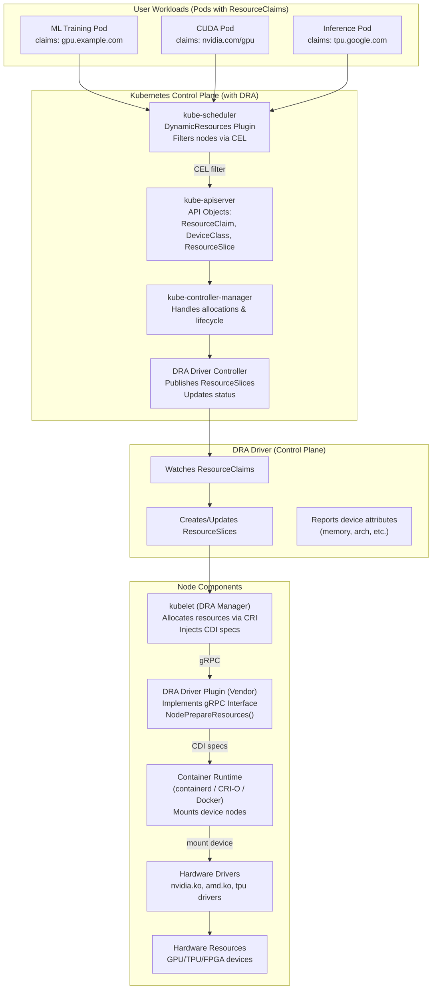

> 设备插件架构革新异构资源调度，DRA 引领 AI Native 硬件管理新纪元。

## 引言

现代云原生应用，尤其是 AI Native 时代的工作负载，常常需要利用 GPU、FPGA、特殊网络卡等异构硬件资源以提升性能和能效。Kubernetes 作为事实上的云原生基础设施标准，其内置的资源管理模型以 CPU 和内存等通用资源为核心，无法直接识别这些特殊硬件。为此，社区引入了 **设备插件（Device Plugin）** 框架，通过 gRPC 协议为 Kubernetes 扩展新的资源类型，将原本只能在节点上操作的硬件抽象为可调度资源。

本文将深入介绍设备插件的概念、工作流程及其在异构资源调度中的作用，重点分析 GPU 调度实践，并探讨动态资源分配（DRA）在最新版本中的变革。

## 设备插件的背景与概念

在 AI Native 时代，机器学习、深度学习、数据分析等工作负载普遍需要 GPU 等加速设备，这些设备通常价值昂贵且数量有限。云平台需要统一管理这些资源，实现公平分配和高利用率。传统 Kubernetes 只支持 CPU 与内存调度，无法表达 GPU 这样的特殊设备；设备插件机制正是为了解决这一痛点而设计。

### 设备插件定义与扩展资源

设备插件是运行在每个节点上的守护进程（通常通过 DaemonSet 部署），它与 kubelet 通过 gRPC 协议通信，向 kubelet 注册并汇报节点上可用的设备列表。kubelet 会将这些设备以 **扩展资源（Extended Resource）** 的形式暴露给 Kubernetes，资源名称遵循 `vendor-domain/resourcetype` 的命名规范，例如 `nvidia.com/gpu` 表示 NVIDIA 提供的 GPU 资源。

设备插件注册成功后，调度器便可以识别并分配这些扩展资源。与普通资源不同，扩展资源只允许在 Pod 的 `limits` 字段中指定，且 `requests` 和 `limits` 的值必须相同。这保证了 GPU 等设备不可超卖，提升了资源管理的确定性。

## 设备插件架构与工作流程

设备插件的核心是一个实现了 Kubernetes 设备插件 API 的 gRPC 服务器。该 API 定义了多种服务端点，用于注册、列举和分配设备等。下面梳理其工作流程，并介绍各阶段的关键要点。

### 注册与生命周期

设备插件的生命周期主要包括以下几个阶段：

- **注册（Register）**：插件启动后通过 kubelet 暴露的 `Registration` 服务注册自己，提供 Unix Socket 名称、API 版本及资源名称等信息。
- **健康监测（ListAndWatch）**：注册成功后，插件向 kubelet 提供 `ListAndWatch` 流式接口，实时汇报可用设备及其健康状态。
- **资源分配（Allocate）**：当调度器决定调度某个 Pod 并向 kubelet 发送创建请求时，kubelet 会调用设备插件的 `Allocate` 接口，请求分配指定数量的设备。插件在此步骤中可以执行诸如设备驱动初始化、cgroup 挂载、生成环境变量等操作，并返回容器运行时所需的挂载路径、环境变量等信息。
- **可选优化**：插件还可以实现 `GetPreferredAllocation`（提供最佳分配建议）和 `PreStartContainer`（容器启动前准备）等方法，以优化设备选择和初始化。

### gRPC 服务摘要

下表简要列出了设备插件 API 中常见的 gRPC 方法及其作用，便于开发者快速查阅。



| gRPC 方法                | 作用关键词             |
| ------------------------ | ---------------------- |
| `GetDevicePluginOptions` | 查询插件支持的选项     |
| `ListAndWatch`           | 设备列表与健康状态流   |
| `Allocate`               | 分配设备、返回挂载信息 |
| `GetPreferredAllocation` | 建议优先分配顺序       |
| `PreStartContainer`      | 容器启动前准备         |



### 实现注意事项

在实际开发和部署设备插件时，需关注以下细节：

- **统一路径与权限**：官方建议插件以 DaemonSet 部署，容器需挂载 `/var/lib/kubelet/device-plugins` 目录，并以 `Privileged` 模式运行。
- **版本兼容性**：设备插件 API 可能随 Kubernetes 版本变化。开发者需兼容多个版本，并在 kubelet 更新后适时重新注册。
- **监控与重连**：插件应监控与 kubelet 的连接，出现异常或 kubelet 重启时应自动重新注册。

### 设备插件架构的局限性

虽然设备插件极大扩展了 Kubernetes 对异构硬件的支持，但其架构存在如下局限：

- **资源模型简单**：设备插件仅支持整数型资源，无法表达 GPU 型号、显存大小等差异，导致调度器只能“盲目”分配，难以实现精细化管理。
- **设备不可共享**：每个设备只能分配给一个容器，无法按需切分或共享，导致高端 GPU 利用率低下。
- **缺乏参数化能力**：无法通过标准方式为设备配置如 MIG Profile、功耗等参数，厂商扩展性差，移植性弱。
- **调度器无感知**：调度器无法感知设备拓扑和全局资源，分配决策不够智能，影响分布式任务性能。

## GPU 调度实践

GPU 是最常见的异构资源之一。Kubernetes 官方提供了完善的 GPU 调度机制，以下介绍如何在集群中高效使用 NVIDIA GPU。

### 环境准备

在使用 GPU 资源前，需完成以下准备工作：

- 在 GPU 节点上安装对应的驱动及 `nvidia-container-toolkit`，确保运行时能够识别 GPU。
- 部署 NVIDIA 提供的设备插件（通常以 DaemonSet 发布）。
- 节点成功注册后，Kubernetes 会暴露 `nvidia.com/gpu` 资源。

### 请求 GPU 资源

在 Pod 描述中使用 `limits` 字段请求 GPU。如下 YAML 片段演示了如何申请 1 个 GPU：

```yaml
apiVersion: v1
kind: Pod
metadata:
  name: gpu-job
spec:
  containers:
  - name: worker
    image: your-ai-image:latest
    resources:
      limits:
        nvidia.com/gpu: 1  # 只能在 limits 指定且 requests 必须相等
    command: ["python", "train.py"]
```

> 注意：GPU 资源只能在 `limits` 字段指定，且 `requests` 必须与 `limits` 相等，防止资源超卖。

### 异构 GPU 调度

在大型集群中，可能存在不同型号或厂商的 GPU。为确保工作负载调度到合适的节点，可采用如下策略：

- **节点标签与亲和性**：为节点打上表示 GPU 类型的标签（如 `accelerator=example-gpu-x100`），并在 Pod 的调度策略中使用 `nodeSelector` 或 `nodeAffinity` 选择匹配的节点。
- **Node Feature Discovery（NFD）**：NFD 项目可自动检测节点硬件特性并添加相应标签，帮助调度器识别不同 GPU 类型。
- **多类型 GPU 支持**：若工作负载既能运行在高端 GPU 也能运行在中端 GPU 上，可在 DRA 中使用优先列表等特性（下文介绍）表达多种可接受设备组合，提升集群资源利用率。

## 动态资源分配（DRA）与设备插件

设备插件在多年实践中解决了 Kubernetes 调度异构资源的问题，但仍存在如每个 Pod 固定指定设备数量、无法共享单个设备等局限。自 Kubernetes v1.34 起，社区推出的 [**动态资源分配（Dynamic Resource Allocation，DRA）**](https://kubernetes.io/docs/concepts/scheduling-eviction/dynamic-resource-allocation/)正式进入 GA 阶段，为设备管理带来了新的弹性和表达能力。

下表对比了传统设备插件与 DRA 的主要改进：



| 问题     | 传统 Device Plugin           | DRA 改进                            |
| -------- | ---------------------------- | ----------------------------------- |
| 资源模型 | 整数计数型（只知道数量）     | 结构化模型（支持属性、拓扑、能力）  |
| 资源分配 | 整个 GPU 绑定单容器          | 可部分分配（支持共享/MIG）          |
| 资源调度 | Scheduler 不感知设备细节     | Scheduler 基于 CEL 过滤感知设备属性 |
| 可扩展性 | 驱动厂商自行实现，安全风险高 | 标准化 API + gRPC 接口（分层架构）  |



### DRA 的核心改进

Kubernetes v1.34 推出了大量 DRA 增强特性并将核心 API 升级到稳定的 `v1` 版本。DRA 为管理 GPU、FPGA 等专用硬件提供了灵活框架，使每个工作负载通过 **DeviceClass**、**ResourceClaim** 等对象描述所需设备属性，而具体设备的分配交由调度器完成。这种模式不仅提高了调度可靠性，还能提升昂贵硬件的利用率。

与设备插件相比，DRA 的主要优势包括：

- **属性驱动的请求**：开发者不再直接请求具体数量的设备，而是通过 `ResourceClaim` 对象定义对设备的要求（如显存大小、型号等），让调度器在满足条件的设备中选择合适资源。
- **设备共享与可组合容量**：v1.34 引入了 **Consumable Capacity** 等 alpha 特性，使多个 Pod 能共享同一个物理设备的容量（如按 GPU 显存分片），通过管理员定义的分享策略管理资源分配。
- **扩展资源映射**：DRA 支持将 DRA 管理的资源暴露为扩展资源，使现有使用设备插件的工作负载无需修改即可逐步迁移到 DRA。
- **优先列表与绑定条件**：用户可列出多个可接受的设备组合，调度器会按顺序选择最佳方案；绑定条件功能允许在外部资源完全准备好之前延迟 Pod 绑定，提高调度可靠性。

### DRA 架构与工作流

DRA（Dynamic Resource Allocation）架构对专用硬件资源管理进行了彻底重构。其核心思想借鉴了存储领域 PV/PVC 的模式，采用声明式 API 对象实现资源的动态、灵活分配。

- **DeviceClass**：类似 StorageClass，定义设备类别及筛选条件（如 GPU 型号、显存等），由平台管理员预先配置。
- **ResourceClaim**：类似 PVC，用户通过 CEL 表达式声明所需设备属性（如“至少 16GB 显存”），可手动创建或通过模板自动生成。
- **ResourceSlice**：由 DRA 驱动在每个节点上发布，动态汇报可用设备及详细属性（如内存、架构、厂商能力等），调度器据此全局匹配资源。

当一个 Pod 提交 GPU/TPU 等资源请求时，DRA 的处理流程如下：

1. **用户工作负载创建阶段（User Workload）**
    用户在 Pod 中声明 `ResourceClaims`（如：`gpu.example.com`），这相当于请求一个特定类型的硬件资源。
1. **控制平面调度阶段（Kubernetes Control Plane with DRA）**
   - Scheduler 调用 `DynamicResources` 插件读取 `ResourceClaims`。
   - 通过 CEL 表达式匹配 `DeviceClass`（定义了设备类型）与 `ResourceSlices`（节点上可用资源）。
   - 选择最符合条件的节点与设备。
1. **驱动控制阶段（DRA Driver Control Plane）**
   - DRA 控制器监控 `ResourceClaims` 变化。
   - 创建或更新 `ResourceSlices`。
   - 管理资源生命周期并上报设备属性。
1. **节点执行阶段（DRA Driver Plugin Node）**
   - kubelet 的 DRA Manager 调用 Node 端的 DRA Driver（通过 gRPC）。
   - 执行 `NodePrepareResources()`，为容器分配设备、生成 CDI（Container Device Interface）规范。
   - Pod 运行完后调用 `NodeUnprepareResources()` 清理设备。
1. **容器运行时阶段（CRI-O / Docker）**
   - 根据 CDI 规范挂载设备节点并设置权限。
   - 启动容器并提供相应的硬件访问能力。

下图展示了 DRA 工作流程图。




{width=1920 height=5213}

这种分层架构将控制面与节点操作解耦，提升了可扩展性和安全性。DRA 还支持设备分区、健康监控、优先级列表等高级特性，极大增强了异构资源的表达能力和利用率。

> DRA 的 DeviceClass/ResourceClaim/ResourceSlice 与 Storage 的 StorageClass/PVC/PV 类比，有助于理解其声明式和解耦设计。

## DRA 迁移建议与未来展望

DRA 作为新一代异构资源管理方案，正逐步成为云原生 GPU、FPGA 等场景的标准。迁移建议如下：

- **评估与试点**：建议平台团队在测试环境启用 DRA，熟悉 ResourceClaim、DeviceClass 等新对象及 CEL 语法。
- **渐进迁移**：利用 DRA 的扩展资源桥接功能，现有设备插件用户可平滑迁移，无需一次性重构全部工作负载。
- **厂商支持**：关注关键硬件厂商的 DRA 驱动适配进度，确保生产环境兼容性。
- **能力提升**：开发团队需掌握 DRA 的参数化、分区、健康监控等新特性，提升资源利用率和调度弹性。

DRA 仍在快速演进，未来将支持更多高级能力（如网络附加资源、设备拓扑感知等），有望彻底解决传统设备插件的架构瓶颈，推动 AI Native、HPC 等场景的资源管理进入新阶段。

## 最佳实践与展望

在实际生产环境中，建议遵循以下最佳实践：

- **善用节点标签与 NFD**：通过明确的标签和 Node Feature Discovery 自动标记硬件类型，确保工作负载匹配合适的设备。
- **合理设置资源请求**：GPU 等扩展资源只能在 `limits` 中指定且不可超卖，应与 `requests` 保持一致。建议同时为 CPU、内存设置合理的请求和限制，避免资源争用。
- **关注 DRA 的演进**：随着 DRA 在 v1.34 成为 GA，并不断引入新的共享模型和属性过滤能力，开发者应考虑在新项目中使用 DRA 管理异构资源。对于老项目，可结合扩展资源映射和平稳迁移策略逐步过渡。
- **AI Native 应用趋势**：随着生成式 AI 和 LLM 等工作负载普及，GPU 等特殊硬件成为基础设施核心。合理使用设备插件和 DRA 能提升硬件利用率并降低成本，为云原生应用打造稳定、高效的运行环境。

## 总结

Kubernetes 设备插件作为连接 Kubernetes 与异构硬件的关键桥梁，通过标准化 gRPC 接口实现了 GPU、FPGA、NIC 等资源的识别与分配，为 AI Native 应用奠定了坚实基础。

随着动态资源分配（DRA）的引入，异构资源管理迈向更高抽象层次：

- **声明式调度**：DRA 将资源请求抽象为“声明式请求 + 动态绑定”，类似 PVC/PV 模型，提升调度灵活性。
- **细粒度共享**：支持 GPU/TPU/FPGA 等设备的共享与精确分配，由 Kubernetes 原生调度器统一管控。
- **原生进化**：DRA 标志 Kubernetes 向“异构硬件原生管理”迈出关键步伐，预示更可预测的资源供应。

开发者应深入理解设备插件机制，积极拥抱 DRA 等新特性，以在云原生未来持续保障应用资源稳定性。

## 参考资料

- [Kubernetes 设备插件 - kubernetes.io](https://kubernetes.io/docs/concepts/extend-kubernetes/compute-storage-net/device-plugins/)
- [Kubernetes Primer: Dynamic Resource Allocation (DRA) for GPU Workloads - thenewstack.io](https://thenewstack.io/kubernetes-primer-dynamic-resource-allocation-dra-for-gpu-workloads/)
- [Kubernetes Dynamic Resource Allocation 官方文档 - kubernetes.io](https://kubernetes.io/docs/concepts/scheduling-eviction/dynamic-resource-allocation/)
