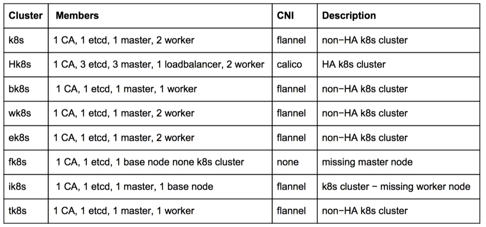
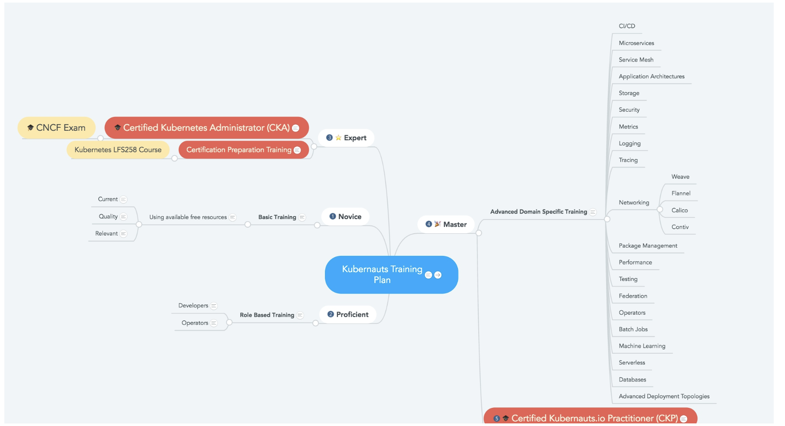

# 认证Kubernetes管理员（CKA）

这是CNCF的官方认证，详情请看[官方介绍](https://www.cncf.io/certification/expert/ )。

## 认证详情

在3~4小时内用命令行进行排障， 解决问题， 相关知识点和权重
- Installation, Configuration & Validation 安装，配置和验证12%
  -  设计一个k8s 集群
  -  安装k8s master 和 nodes
  -  配置安全的集群通信
  -  配置高可用的k8s集群
  -  知道如何获取k8s的发行的二进制文件
  -  提供底层的基础措施来部署一个集群
  -  选择一个网络方案
  -  选择你的基础设施配置
  -  在你的集群上配置端对端的测试
  -  分析端对端测试结果
  -  运行节点的端对端测试
- Core Concepts 核心概念 19%
  - 理解k8s api原语
  - 理解k8s 架构
  - 理解services和其它网络相关原语
- Application Lifecycle Management 应用生命周期管理 8%
  -  理解Deployment， 并知道如何进行rolling update 和 rollback
  -  知道各种配置应用的方式
  -  知道如何为应用扩容
  -  理解基本的应用自愈相关的内容
- Networking 网络 11%
  -  理解在集群节点上配置网络
  -  理解pod的网络概念
  -  理解service networking
  -  部署和配置网络负载均衡器
  -  知道如何使用ingress 规则
  -  知道如何使用和配置cluster dns
  -  理解CNI
- Storage  存储 7%
  -  理解持久化卷（pv），并知道如何创建它们
  -  理解卷（volumes）的access mode
  -  理解持久化卷声明（pvc）的原语
  -  理解k8s的存储对象（kubernetes storage objects）
  -  知道如何为应用配置持久化存储
- Scheduling 调度 5%
  - 使用label选择器来调度pods
  - 理解Daemonset的角色
  - 理解resource limit 会如何影响pod 调度
  - 理解如何运行多个调度器， 以及如何配置pod使用它们
  - 不使用调度器， 手动调度一个pod
  - 查看和显示调度事件events
  - 知道如何配置kubernetes scheduler
- Security 安全 12%
  -  知道如何配置认证和授权
  -  理解k8s安全相关原语
  -  理解如何配置网络策略（network policies）
  -  配合使用镜像的安全性
  -  定义安全上下文
  -  安全的持久化保存键值
- Cluster Maintenance 集群维护 11%
  - 理解k8s的集群升级过程
  - 促进操作系统的升级
  - 补充备份和还原的方法论
- Logging / Monitoring 日志/监控 5%
  - 理解如何监控所有的集群组件
  - 理解如何监控应用
  - 管理集群组件日志
  - 管理应用日志
- Troubleshooting 问题排查 10%
  - 排查应用失败故障
  - 排查控制层（control panel）故障
  - 排查工作节点（work node）故障
  - 排查网络故障

## 考试说明和checklist

- 注册考试
- 检查系统要求
- 选择考试日期
- 获取考生手册
- 验证姓名
- 阅读重要提示
- 参加考试

考试期间， 除了考试系统界面上的内容和按钮能操作外， 其它的最好不要动。所有考试无关的内容和资料不允许出现， 包括手机， 参考书等等。 

考试的时候会提供一个Linux Server Terminal ， 是基于Gateone 的web终端，一些快捷键可能跟一般的linux 终端软件不一样， 请提前了解和体验 

考试由31个问题组成， 需要你用命令来解决这些问题

有8套环境， 31个问题在这8套环境里进行操作。 

平均每套环境有3~5个问题。 




通过kubectl   config   use−context   <cluster_name>   来切换不同的环境  （集群使用的的k8s 1.6.2版本）

获取集群信息，要指定对应的context，如
kubectl   get   no   −l   name=hk8s−node−1   −−context=hk8s


> 参考 [官方考试手册]( https://www.cncf.io/certification/candidate-handbook)


## FAQ

1. 考试费用？
>  300美元， 可以重考一次

2. 考试时间长度？
>   最长4个小时，依赖考生的熟练程度

3. 如何监考？
>  屏幕共享软件可以让监考官看到考生的屏幕， 所有的音频， 视频和屏幕共享流会被保留一段时间， 用于审查

4. 系统要求？
>   chrome浏览器， 网络连接， 网络摄像头和麦克风
>   [这个连接](https://www.examslocal.com/ScheduleExam/Home/CompatibilityCheck)可以帮忙检查系统要求 ， 注意Select “Linux Foundation” as the Exam Sponsor and “CKA” as the Exam.

5. 考试期间， 我可以利用什么资源么？
>  只能打开考试页面以及[Kubernetes官网](https://kubernetes.io/)

6. 考试期间是否可以做笔记？
>  可以做笔记， 但是仅限于在考试控制页面上的工具上

7. 需要什么证件？
>  包含考生照片的官方认证证件， 比如护照， 身份证， 驾驶证等(注意，需要证件上要有你的英文名称的全名， 对中国居民来讲， 可以使用护照)
>  需要注册一个Linux Foundation的账号， 到[这里注册](https://identity.linuxfoundation.org/)

8. 考试如何打分？ 
>  24小时内会自动打分， 72~75小时内会邮件发送认证结果

9. 认证的有效期？
>  有效期2年， 在过期之前需要重新考试

10. 取消和重订
>  在预定考试日期前24小时外，取消或重订， 可以获得完整退费

## 复习资料

- [Kubernetes-Learning-Resources](https://github.com/kubernauts/Kubernetes-Learning-Resources)
- [Kubernetes-Certified-Administrator](https://github.com/walidshaari/Kubernetes-Certified-Administrator)
- [培训课程导图](https://www.mindmeister.com/zh/920845833/kubernauts-training-plan)
- [新手训练营](https://kubernetesbootcamp.github.io/kubernetes-bootcamp/index.html)
- [Linux Foundation 提供的免费入门课程]( https://training.linuxfoundation.org/linux-courses/system-administration-training/introduction-to-kubernetes)

有个CNCF网站提供了免费的[分级课程](https://kubernauts.io/en/become-a-kubernaut/) 和 [课程文档]( https://www.gitbook.com/@kubernauts)

除了认证大纲内容外， 还可以看看 [feisky的kubernetes指南](https://feisky.gitbooks.io/kubernetes/) 里面包含了上述认证的大部分内容。

该课程的课程大纲：

```
Welcome & Introduction
Container Orchestration
Kubernetes
Kubernetes Architecture - Overview
Installing Kubernetes
Setting Up a Single Node Kubernetes Cluster Using Minikube
Accessing Minikube
Kubernetes Building Blocks
Services
Deploying a Stand-Alone Application
Kubernetes Volume Management
Deploying a Multi-Tier Application
ConfigMaps and Secrets
Ingress
Advanced Topics - Overview
Kubernetes Community
Final Exam
ps： 个人觉得这个课程可以不用学， 直接看文档就行了 。
```
还有一个[收费的课程](https://training.linuxfoundation.org/linux-courses/system-administration-training/kubernetes-fundamentals) ($299)

该课程的课程大纲：

```
Kubernetes Fundamentals
Chapter 1. Course Introduction
Chapter 2. Basics of Kubernetes
Chapter 3. Kubernetes Architecture
Chapter 4. Kubernetes Installation and Configuration
Chapter 5. Accessing a k8s Cluster and Using the API
Chapter 6. Replication Controllers and Deployments
Chapter 7. Volumes and Application Data
Chapter 8. Services
Chapter 9. Ingress
Chapter 10. Additional API Objects
Chapter 11. Scheduling
Chapter 12. Logging, Monitoring, and Troubleshooting
Chapter 13. Third-Party Resources
Chapter 14. Kubernetes Federation
Chapter 15. Helm
Chapter 16. Security
ps： 个人觉得这个课程太贵了，为了省点钱 ，  仔细研究下文档就行了 。
```

[培训体系](https://www.mindmeister.com/zh/920845833/kubernauts-training-pla)



From: [Github_hackstoic](https://github.com/hackstoic/kubernetes_practice/blob/master/%E5%85%B3%E4%BA%8EK8S%E7%9B%B8%E5%85%B3%E8%AE%A4%E8%AF%81%E7%9A%84%E8%AF%B4%E6%98%8E.md)