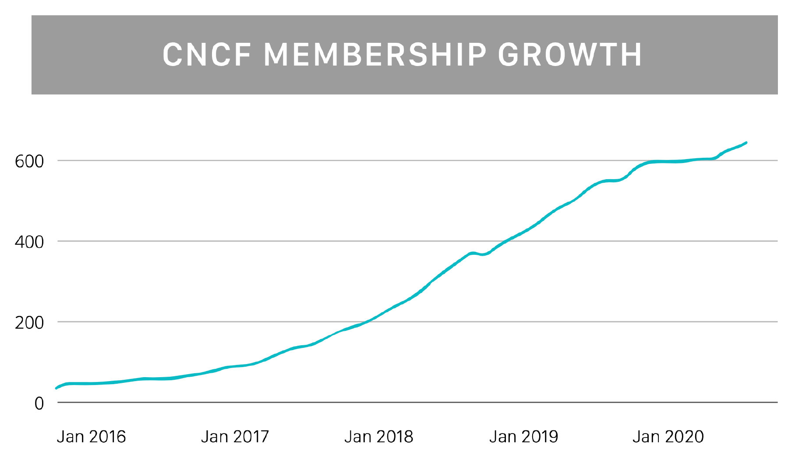
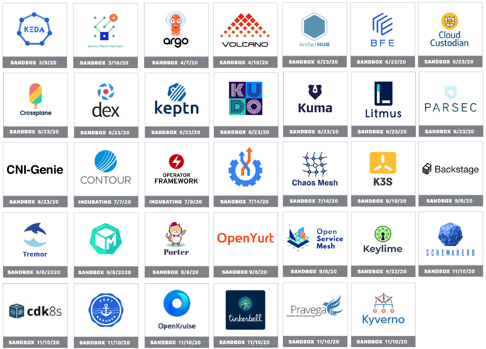
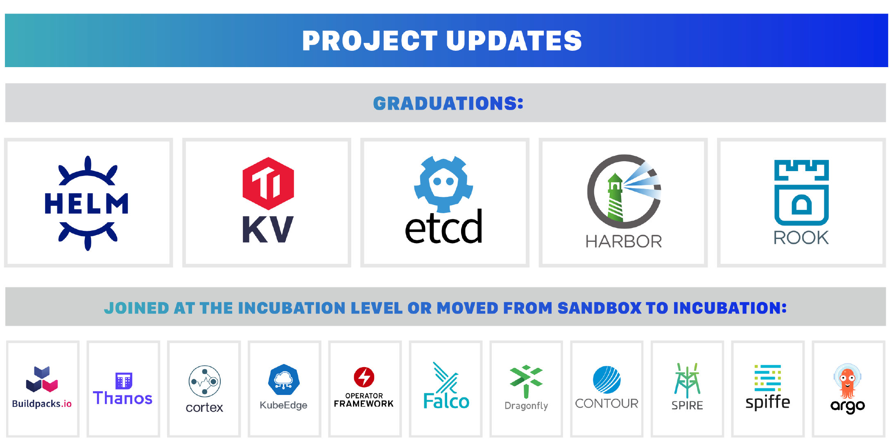

# CNCF 2020年年度报告解读

2020年底，CNCF 发布了2020年的年度报告，这是 CNCF 第四次发布发布年度报告。2020 年是非同寻常的一年，新冠肺炎疫情席卷全球，大部分线下活动都陷于停摆。那么这一年来 CNCF 取得了哪些成就呢？本文将带你一探究竟。

*注：本文最后附上了 2020 年报告的下载地址。*

## CNCF 的 2020 年

**人事变动**

这一年里，原 CNCF 执行董事 Dan Kohn 因病离世，Priyanka Sharma 接替了他的位子，CNCF 的员工总数达到了 [34 人](https://www.cncf.io/people/staff/)。

**增长**

CNCF 成立五年来，截止目前 CNCF 已经托管了超过 80 个项目，拥有超过1000 个组织，177 个国家的 110,000贡献者。

**技术雷达**

CNCF 本年度在终端用户社区中推出了类似于 ThoughtWorks 的[技术雷达](https://radar.cncf.io/)，被给出了 Assess（评估）、Trail（试用）、采纳（Adopt）的技术成熟度划分。目前已评估的技术领域包括：

- 数据库存储
- 可观察性
- 持续交付

**大会**

因为疫情原因，今年的 KubeCon + CloudNativeCon NA、EU、China 都转移到了线上。

**认证**

因为 Kubernetes 环境下对安全的需求日益迫切，CNCF 在原有的 CKA（Certified Kubernetes Administrator）和 CKAD（Certified Kubernetes Application Developer）基础上增加了 CKSS（Certified Kubernetes Security Specialist）。

**项目**

2020 年 CNCF 共接纳了 35 个项目加入基金会，如下所示。

还有些项目更新（毕业或晋级），如下所示。

## 展望 2021 

2020 年是全球和各行各业困难的一年。尽管如此，CNCF 社区已经迎接挑战，继续成为开源历史上发展最快的基金会。如今，CNCF 托管着 80 多个项目，拥有来自 177 个国家的 11 万多名贡献者。

当我们展望 2021 年和未来，分布式工作的增长为云原生和开源技术创造了更多的机会——除了在生产中已经创下的高使用率之外。我们需要无处不在的创新，不仅是为了应对这一流行病，而且是为了让我们的公司、政府和整个经济比以往任何时候都更加强大。我们的中立知识产权、丰富的贡献者计划，以及最重要的最终用户对我们的信任，使我们有能力加强跨公司合作和互操作性。我们将继续通过我们的活动、新的终端用户和会员计划以及项目服务，促进终端用户、项目创建者和增强者之间的这种创新良性循环。

## 参考

- [CNCF Annual Report 2020](https://share.weiyun.com/n4bdwGZ2)