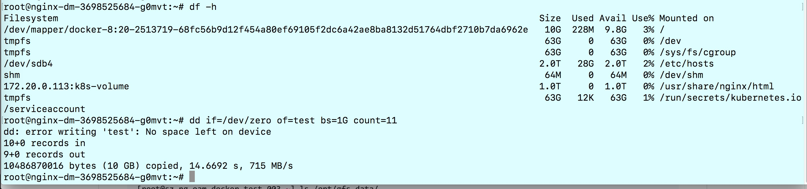

## 问题记录

安装、使用kubernetes的过程中遇到的所有问题的记录。

推荐直接在Kubernetes的GitHub上[提issue](https://github.com/kubernetes/kubernetes/issues/new)，在此记录所提交的issue。

## 1.[Failed to start ContainerManager failed to initialise top level QOS containers #43856](https://github.com/kubernetes/kubernetes/issues/43856)

重启kubelet时报错，目前的解决方法是：

1.在docker.service配置中增加的`--exec-opt native.cgroupdriver=systemd`配置。

2.手动删除slice（貌似不管用）

3.重启主机，这招最管用😄

```bash
for i in $(systemctl list-unit-files —no-legend —no-pager -l | grep —color=never -o .*.slice | grep kubepod);do systemctl stop $i;done
```

上面的几种方法在该bug修复前只有重启主机管用，该bug已于2017年4月27日修复，merge到了master分支，见https://github.com/kubernetes/kubernetes/pull/44940

## 2.[High Availability of Kube-apiserver #19816](https://github.com/kubernetes/kubernetes/issues/19816)

API server的HA如何实现？或者说这个master节点上的服务`api-server`、`scheduler`、`controller` 如何实现HA？目前的解决方案是什么？

目前的解决方案是api-server是无状态的可以启动多个，然后在前端再加一个nginx或者ha-proxy。而scheduler和controller都是直接用容器的方式启动的。

## 3.Kubelet启动时Failed to start ContainerManager systemd version does not support ability to start a slice as transient unit

CentOS系统版本7.2.1511

kubelet启动时报错systemd版本不支持start a slice as transient unit。

尝试升级CentOS版本到7.3，看看是否可以修复该问题。

与[kubeadm init waiting for the control plane to become ready on CentOS 7.2 with kubeadm 1.6.1 #228](https://github.com/kubernetes/kubeadm/issues/228)类似。

另外有一个使用systemd管理kubelet的[proposal](https://github.com/kubernetes/community/blob/master/contributors/design-proposals/kubelet-systemd.md)。

## 4.kube-proxy报错kube-proxy[2241]: E0502 15:55:13.889842    2241 conntrack.go:42] conntrack returned error: error looking for path of conntrack: exec: "conntrack": executable file not found in $PATH

**导致的现象**

kubedns启动成功，运行正常，但是service之间无法解析，kubernetes中的DNS解析异常

**解决方法**

CentOS中安装`conntrack-tools`包后重启kubernetes集群即可。

## 5. [Pod stucks in terminating if it has a privileged container but has been scheduled to a node which doesn't allow privilege issue#42568](https://github.com/kubernetes/kubernetes/issues/42568)

当pod被调度到无法权限不足的node上时，pod一直处于pending状态，且无法删除pod，删除时一直处于terminating状态。

**kubelet中的报错信息**

```
Error validating pod kube-keepalived-vip-1p62d_default(5d79ccc0-3173-11e7-bfbd-8af1e3a7c5bd) from api, ignoring: spec.containers[0].securityContext.privileged: Forbidden: disallowed by cluster policy
```
## 6.PVC中对Storage的容量设置不生效

[使用glusterfs做持久化存储](../practice/using-glusterfs-for-persistent-storage.md)文档中我们构建了PV和PVC，当时给`glusterfs-nginx`的PVC设置了8G的存储限额，`nginx-dm`这个Deployment使用了该PVC，进入该Deployment中的Pod执行测试：

```
dd if=/dev/zero of=test bs=1G count=10
```



从截图中可以看到创建了9个size为1G的block后无法继续创建了，已经超出了8G的限额。

## 7. 使用 Headless service 的时候 kubedns 解析不生效

kubelet 的配置文件 `/etc/kubernetes/kubelet` 中的配置中将集群 DNS 的 domain name 配置成了  `––cluster-domain=cluster.local.`  ，虽然对于 service 的名字能够正常的完成 DNS 解析，但是对于 headless service 中的 pod 名字解析不了，查看 pod 的 `/etc/resolv.conf` 文件可以看到以下内容：

```
nameserver 10.0.254.2
search default.svc.cluster.local. svc.cluster.local. cluster.local. jimmysong.io
options ndots:5
```

修改 `/etc/kubernetes/kubelet` 文件中的  `––cluster-domain=cluster.local.`  将 local 后面的点去掉后重启所有的 kubelet，这样新创建的 pod 中的 `/etc/resolv.conf`文件的 DNS 配置和解析就正常了。

## 8. kubernetes 集成 ceph 存储 rbd 命令组装问题

kubernetes 使用 ceph 创建 PVC 的时候会有如下报错信息：

```bash
Events:
  FirstSeen	LastSeen	Count	From				SubObjectPath	Type		Reason			Message
  ---------	--------	-----	----				-------------	--------	------			-------
  1h		12s		441	{persistentvolume-controller }			Warning		ProvisioningFailed	Failed to provision volume with StorageClass "ceph-web": failed to create rbd image: executable file not found in $PATH, command output:
```

检查 `kube-controller-manager` 的日志将看到如下错误信息：

```
Sep  4 15:25:36 bj-xg-oam-kubernetes-001 kube-controller-manager: W0904 15:25:36.032128   13211 rbd_util.go:364] failed to create rbd image, output
Sep  4 15:25:36 bj-xg-oam-kubernetes-001 kube-controller-manager: W0904 15:25:36.032201   13211 rbd_util.go:364] failed to create rbd image, output
Sep  4 15:25:36 bj-xg-oam-kubernetes-001 kube-controller-manager: W0904 15:25:36.032252   13211 rbd_util.go:364] failed to create rbd image, output
Sep  4 15:25:36 bj-xg-oam-kubernetes-001 kube-controller-manager: E0904 15:25:36.032276   13211 rbd.go:317] rbd: create volume failed, err: failed to create rbd image: fork/exec /usr/bin/rbd: invalid argument, command output:
```

该问题尚未解决，参考 [Error creating rbd image: executable file not found in $PATH#38923](https://github.com/kubernetes/kubernetes/issues/38923)

## 9. Helm: Error: no available release name found

在开启了RBAC的kubernetes集群中，当使用helm部署应用，执行`helm install`的时候，会报着个错误：

```
Error: no available release name found
Error: the server does not allow access to the requested resource (get configmaps)
```

这是因为我们使用的`2.3.1`版本的helm init的时候没有为tiller创建`serviceaccount`和`clusterrolebiding`的缘故导致的。

```bash
kubectl create serviceaccount --namespace kube-system tiller
kubectl create clusterrolebinding tiller-cluster-rule --clusterrole=cluster-admin --serviceaccount=kube-system:tiller
# helm init -i harbor-001.jimmysong.io/library/kubernetes-helm-tiller:v2.3.1
kubectl patch deploy --namespace kube-system tiller-deploy -p '{"spec":{"template":{"spec":{"serviceAccount":"tiller"}}}}'
```

**参考**

- [Helm: Error: no available release name found - StackOverflow](https://stackoverflow.com/questions/43499971/helm-error-no-available-release-name-found)
- [Helm 2.2.3 not working properly with kubeadm 1.6.1 default RBAC rules #2224](https://github.com/kubernetes/helm/issues/2224)


## 参考

[Persistent Volume](https://kubernetes.io/docs/concepts/storage/persistent-volumes/)

[Resource Design Proposals](https://github.com/kubernetes/community/blob/master/contributors/design-proposals/resources.md)

[Helm: Error: no available release name found]()
