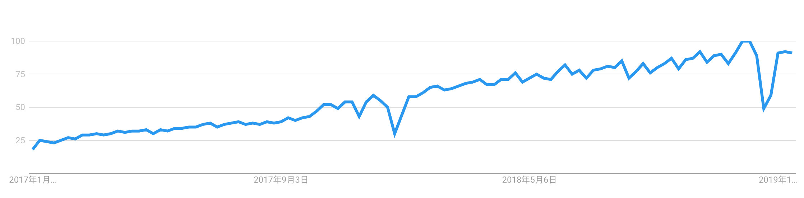
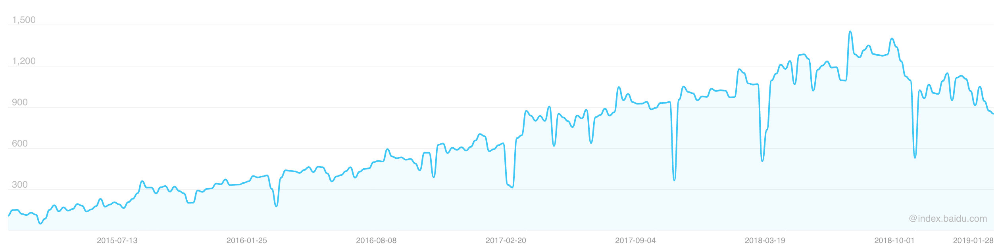
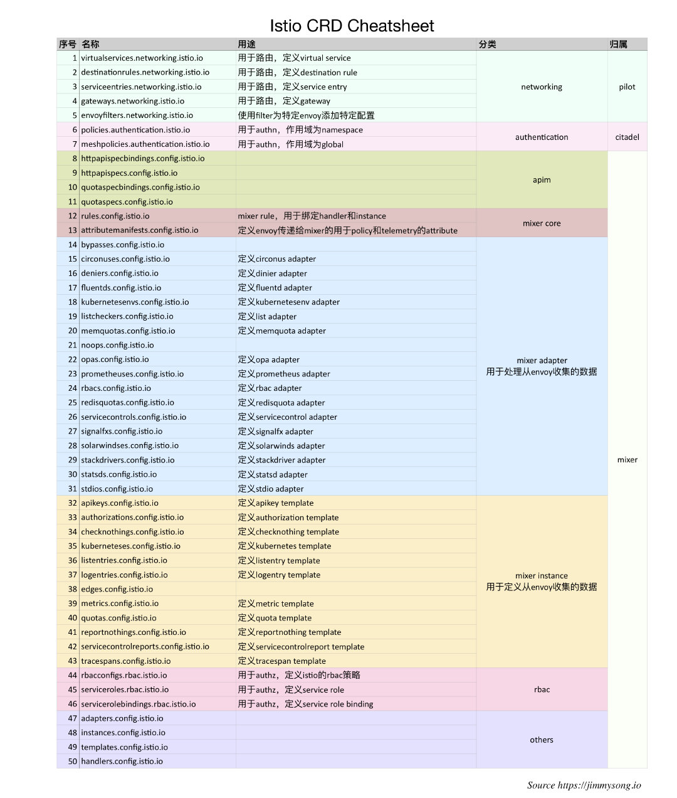
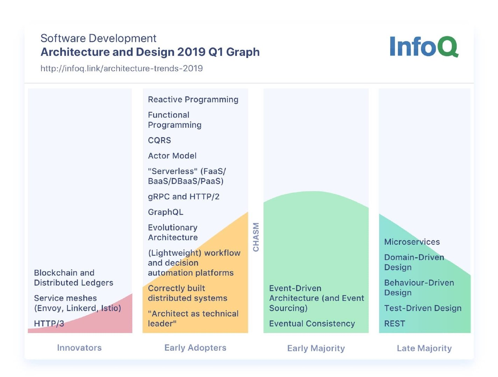
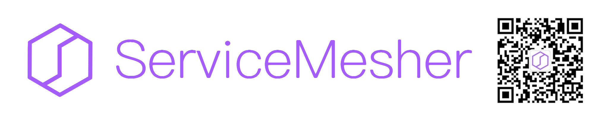
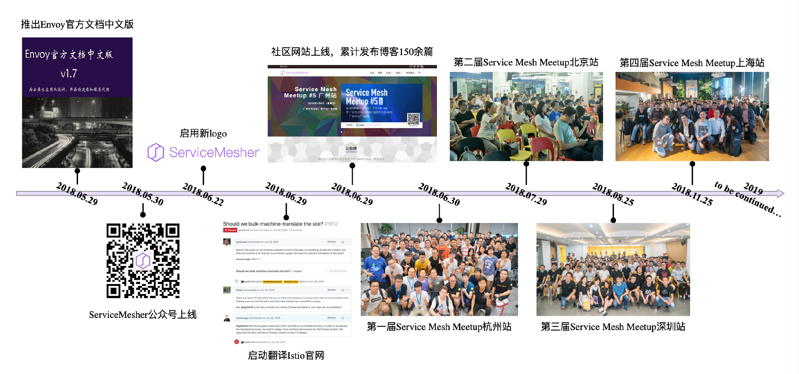
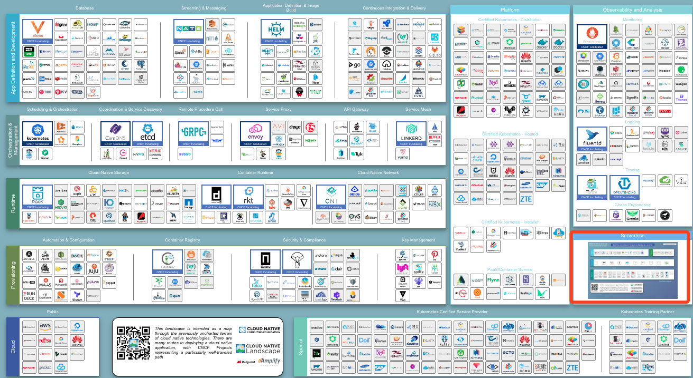

# Kubernetes 与云原生 2018 年年终总结及 2019 年展望

去年我写了 [Kubernetes 与云原生 2017 年年终总结及 2018 年展望](kubernetes-and-cloud-native-summary-in-2017-and-outlook-for-2018.md)，按照惯例也应该推出 2018 年的总结和 2019 年的展望了，写这篇文章的时候已经是 2019 年的 1 月末了，如果不写点什么回顾下 2018 年总觉得这一年过的不完整。

本文将回顾 Kubernetes 与云原生在 2018 年的进展，可以说 2018 年是 Kubernetes 大规模落地，Service Mesh 蓄势待发的一年。

## 2017 年时对 2018 年的预测

首先我先带大家回顾下 2017 年时我对 2018 年的预测。2017 年底我预测 2018 年的 Kubernetes 和云原生将向以下方向发展：

- 服务网格（Service Mesh），在 Kubernetes 上践行微服务架构进行服务治理所必须的组件；
- 无服务器架构（Serverless），以 FaaS 为代表的无服务器架构将会流行开来；
- 加强数据服务承载能力，例如在 Kubernetes 上运行大数据应用；
- 简化应用部署与运维包括云应用的监控与日志收集分析等；

下面我来分别总结下以上四点预测：

- 其中服务网格（Service Mesh）是我 2018 年一直在大力主张和推广的，并创立了 [ServiceMesher 社区](https://www.servicemesher.com/)，业界已经对服务网格有了广泛的认知，其在微服务和分布式架构领域将有广阔的前景，2018 年 7 月 31 日 [Istio](https://istio.io/) 发布 1.0，预示着服务网格即将走向成熟；
- 无服务器架构的理念提出已久但仍需找到合适的应用场景来大面积铺开，2018 年 Google、Pivotal 等公司新开源的 [knative](https://github.com/knative) 更加弱化了底层平台的差异，开发者直接定义服务，应用自动打包和部署；
- 关于 Kubernetes 承载大数据计算，已经有很多公司应用它来运行大数据应用，还有一些创业公司提供基于 Kubernetes 的异构计算平台，在大企业内部也有使用 Kubernetes 来统一大数据、机器学习、人工智能等平台的需求，大数据行业领先的两家公司 Cloudera 与 Hortonworks 的合并势必也会在云原生领域发力；
- 随着越来越多的公司选择 Kubernetes 作为底层的基础设施平台，Kubernetes 周边的生态越来越完善，围绕发布部署、监控和 APM 相关的 SaaS 类应用层出不穷；

## CNCF 的毕业项目

2018 年至今按照时间顺序，CNCF 中毕业的项目有：

- 2018 年 3 月：Kubernetes 毕业
- 2018 年 8 月，Prometheus 毕业
- 2018 年 11 月，Envoy 毕业
- 2019 年 1 月，CoreDNS 毕业

截至本文发稿，已有 4 个项目毕业，2019 将会有更多的项目走向成熟。CNCF 托管的全部项目状态请见：<https://www.cncf.io/projects-graduated/>。

## Kubernetes 在 2018 年的发展

2018 年 3 月 Kubernetes 经过 CNCF 基金会的投票正式毕业，这意味着它拥有足够多的提交者和贡献人员，并被业界广泛的采纳，已经可以依靠社区的维护健康的发展。关于 CNCF 项目的毕业标准的详情请参考 [CNCF Graduation Criteria v1.1](https://github.com/cncf/toc/blob/master/process/graduation_criteria.adoc)。

早在 2017 年的北美 KubeCon 上就有一种论调说 Kubernetes 正变得 boring，因为它已经越来越成熟，在未来不会出现大的变动，从以上更新日志中也可以看到，大多是一些功能进入 beta 或者 stable 状态，很少有新的功能出现。

下图是 Google trend 中过去一年来全球搜索 Kubernetes 的趋势图。

从图中可以看出 Kubernetes 在全球搜索趋势在2018年底已经达到了最巅峰，2019年可能会开始走下降趋势。

下图是最近5年来 Kubernetes 关键词的百度指数。

上图来自百度指数，可以大体概括 Kubernetes 关键字在中国的搜索情况，同 Kubernetes 在全球的搜索情况一样，可能已经过了巅峰期。

## Kubernetes Operator

以 Kubernetes 为核心来运维上层应用，诞生了一种名为”Kubernetes Native“的新型运维方式，真正践行 DevOps 理念的产物，开发者将于软件的运维逻辑写成代码，利用 Kubernetes 的**控制器模式（Controller Pattern）**和 [CRD](../concepts/crd.md) 来扩展 Kubernetes 的 API，各种 Operator 层出不穷，[awesome-operators](https://github.com/operator-framework/awesome-operators) 列举了目前所有的 Operator。例如我们熟悉的 [Istio](https://istio.io) 中就有50个 CRD。

CNCF 生态中的诸多应用都已支持 Kubernetes Operator，可以说 Operator 将成为云原生中默认的软件动态运行时管理工具，参考 CoreOS（已被 RedHat 收购，RedHat 已被 IBM 收购） CTO Brandon Philips 的这篇文章 [Introducing the Operator Framework: Building Apps on Kubernetes](https://www.redhat.com/en/blog/introducing-operator-framework-building-apps-kubernetes)。

## ServiceMesher社区

下图展示的是 2019 Q1 的软件架构趋势，（图片来自 [Architecture and Design InfoQ Trends Report - January 2019](https://www.infoq.com/articles/architecture-trends-2019)）我们可以看到 Service Mesh 还处于创新者阶段，如果从软件生命周期的全阶段来看，它还只是刚刚进入很多人的眼帘，对于这张的新兴技术，在蚂蚁金服的支持的下创办了 [ServiceMesher 社区](http://www.servicemesher.com)。

既然 Kubernetes 已经开始变得无聊，2018年落地 Kubernetes 已经不是初创公司的事情了，很多大公司甚至传统企业都开始试水或者大规模落地，在 Kubernetes 进一步成熟之时，以 Kubernetes 为基础向上发展，开辟新的战场就能收获更多的业务场景和需求。

Kubernetes 并不直接对外提供业务能力，而是作为应用运行的底层平台，在应用和平台间还有一个 Gap，这需要中间件的能力来补充。

## Service Mesh Meetup

这一年 [ServiceMesher 社区](http://www.servicemesher.com)为大家带来5次 Meetup 共 20 次 Topic 分享：

- 2018 年 5 月，ServiceMesher 社区由蚂蚁金服发起成立。
- 2018 年 5 月 30 日，[Envoy 最新官方文档中文版发布 —— 由 Service Mesh 爱好者倾情奉献](https://www.servicemesher.com/envoy/)。
- 2018 年 6 月 21 日，[启用新的社区 logo](https://mp.weixin.qq.com/s?__biz=MzIwNDIzODExOA==&mid=2650165956&idx=2&sn=8ef0f080fd428b6307389fce4546103a&chksm=8ec1ce8db9b6479b846b37e0fdffbc0f1a6b23c17329032af7e1b9e6dc6412966f42edcf08f9&scene=21#wechat_redirect)。
- 2018 年 6 月 30 日，[开启新域名 servicemesher.com](https://www.servicemesher.com/)。
- 2018 年 6 月 30 日，举办了第一届 Service Mesh Meetup 杭州站，见 [ServiceMesher 杭州 Meetup 圆满完成](https://www.servicemesher.com/blog/hangzhou-meetup-20180630/)。
- 2018 年 7 月，ServiceMesher 社区成为 [Istio 社区中国合作伙伴](https://istio.io/about/community/)。
- 2018 年 7 月 29 日，举办了第二届 Service Mesh Meetup 北京站，见[第二届 Service Mesh Meetup 北京站回顾、视频回放和资料下载](https://www.servicemesher.com/blog/beijing-meetup-20180729/)。
- 2018 年 8 月 25 日，举办了第三届 Service Mesh Meetup 深圳站，见 [Service Mesh Meetup 深圳站回顾、视频回放及 PPT 资料分享](https://www.servicemesher.com/blog/service-mesh-meetup-shenzhen-20180825/)。
- 2018 年 9 月 19 日，开始了开源电子书 [istio-handbook](https://github.com/rootsongjc/istio-handbook/) 的创作。
- 2018 年 11 月 13 日，[ServiceMesher 社区成员聚首 KubeCon&CloudNativeCon 上海](https://jimmysong.io/blog/kubecon-cloudnativecon-china-2018/)。
- 2018 年 11 月 25 日，举办了第四届 Service Mesh Meetup 上海站，见[第四届 Service Mesh Meetup 上海站活动回顾与资料下载](https://www.servicemesher.com/blog/service-mesh-meetup-shanghai-20181125/)。
- 2019 年 1 月 6 日，举办了第五届 Service Mesh Meetup 广州站，见[第五届 Service Mesh Meetup 广州站活动回顾与资料下载](https://www.servicemesher.com/blog/service-mesh-meetup-guangzhou-20190106/)。

## Serverless

我们再看 CNCF 的 [Landscape](https://landscape.cncf.io/)，其中右下部分有一个单列的 Serverless 单元，详见 <https://landscape.cncf.io/>。

我们再看下 Kubernetes、Service Mesh、Serviceless 三者之间的关系：

- Kubernetes 负责应用的生命周期管理，最小的治理单元是 Pod；
- Service Mesh 解决服务间的流量治理，最小的治理单元是 Service（可以类比为 Kubernetes 中 Service 资源）；
- 而 Serviceless 是更高一层的抽象，最小的治理单元是 APP；

越向上层就越不关心应用的底层实现，到了 Serverless 开发者只需要关心代码逻辑，其他的一切都是配置，因此 Google 联合 Pivotal 等其他公司于2018年7月创建了 [knative](https://github.com/knative) 这个基于 Kubernetes 和 Istio 的 Serverless 的开源项目。

## 出版物

一个繁荣的生态将有大量的开发者支持，有开发者的地方就会有出版物。2018年至本文发稿关于 Kubernetes 和云原生的中文出版物（译作或原著），根据出版时间排序如下：

- 2018年3月：[《每天5分钟玩转Kubernetes》，CloudMan 著](https://item.jd.com/12329528.html)
- 2018年7月：[《Python 云原生——构建应对海量用户数据的高可扩展 Web 应用》，Manish Sathi著，宋净超 译](https://item.jd.com/12365097.html)
- 2018年7月：[《云原生 Java——Spring Boot、Spring Cloud 与 Cloud Foundry 弹性系统设计》，Josh Long & Kenny Bastani著，张若飞 宋净超 译](https://item.jd.com/12398618.html)
- 2018年8月：[《Kubernetes 权威指南：企业级容器云实战》，闫健勇 龚正 吴治辉 刘晓红 崔秀龙 等 著](https://item.jd.com/12420042.html)
- 2018年9月：[《云原生基础架构：构建和管理现代可扩展基础架构的模式及实践》，Justin Garrision & Kris Nova著，孙杰、肖力 译](https://item.jd.com/12432007.html)
- 2018年9月：[《基于Kubernetes的容器云平台实战》，陆平 左奇 付光 张晗 著](https://item.jd.com/12433425.html)
- 2018年10月：[《Kubernetes经典实例》，Sébastien Goasguen & Michael Hausenblas 著，马晶慧 译](https://item.jd.com/12446081.html)
- 2018年11月：[《持续演进的Cloud Native：云原生架构下微服务最佳实践》，王启军 著](https://item.jd.com/12452009.html)
- 2018年11月：[《云原生分布式存储基石：etcd深入解析》，华为容器服务团队 杜军 等著](https://item.jd.com/12455265.html)
- 2018年12月：[《Kubernetes即学即用》，Kelsey Hightower & Brendan Burns & Joe Beda 著，韩波 译](https://item.jd.com/12476325.html)
- 2018年12月：[《Kubernetes 进阶实战》，马永亮 著](https://item.jd.com/12477105.html)
- 2018年12月：[《Service Mesh实战：基于Linkerd和Kubernetes的微服务实践》，杨章显 著](https://item.jd.com/12494016.html)
- 2019年1月：[《深入浅出 Istio：Service Mesh 快速入门与实践》，崔秀龙 著](https://item.jd.com/12527008.html)
- 2019年1月：[《Kubernetes in Action中文版，Marko Luksa著，七牛容器云团队 译](https://item.jd.com/12510666.html)

**注**：以上仅列举了2018年至本文发稿时已上市发售的书籍，并不代表本人立场推荐以上书籍。

预告：2019年2月，[《未来架构——从服务化到云原生》张亮 吴晟 敖小剑 宋净超 著](https://jimmysong.io/posts/future-architecture-from-soa-to-cloud-native/)即将上市。

另外还有很多线上、线下的 Kubernetes 实训课程、电子出版物不胜枚举，例如极客时间出品的[深入剖析 Kubernetes](https://jimmysong.io/posts/kubernetes-tutorial-recommendation/)。

## 2019年展望

2019年才开始学 Kubernetes 依然不晚，这可能是影响云计算未来10年的技术，甚至有人预测，未来的开发者可能一上手就是在云上开发，从提交代码、测试到发布一气呵成，直接基于 Git 操作即可完成，完全感受不到 Kubernetes 的存在。展望2019年，我在2017年的预测的趋势依然不变，2019年将更加深化。如果以 Kubernetes 的发展阶段类比，就像2017年时的 Kubernetes 一样，在一部分企业中 Service Mesh 已经开始快速落地，而 Knative 更像 2015 年时的 Kubernetes，一起才刚刚开始，毕竟也是 2018 年中才开源。

2018年11月 CNCF 在上海举办了第一届中国 KubeCon + CloudNativeCon，2019年6月大会将升级为 KubeCon + CloudNativeCon + Open Source Summit，将进一步推送中国的开源发展与云原生的应用，[查看大会详情](https://www.lfasiallc.com/events/kubecon-cloudnativecon-china-2019/)。
