> Etcd 是 Kubernetes 集群的核心分布式存储组件，本文系统梳理其架构原理、核心特性、数据结构、运维实践及安全优化，帮助读者全面理解其在云原生体系中的关键作用。

## Etcd 简介

Etcd 是 Kubernetes 集群的核心组件之一，作为分布式键值存储系统，负责保存集群的所有配置信息和状态数据。本文将深入解析 etcd 在 Kubernetes 中的作用、原理和使用方法。

## Etcd 的核心职责与特性

Etcd 作为高可用的分布式键值存储系统，采用 Raft 共识算法保证数据一致性。在 Kubernetes 生态系统中，etcd 主要承担以下职责：

- 集群状态存储：保存所有 Kubernetes 对象的状态信息和元数据
- 配置管理：存储集群配置和各种资源定义
- 服务发现：为集群组件提供服务注册和发现功能
- 分布式锁：支持分布式协调和同步操作

### 核心特性

- 简单性：定义良好的用户 API (gRPC)
- 安全性：自动 TLS，可选客户端证书认证
- 高性能：基准测试显示 10,000 次写入/秒
- 可靠性：使用 Raft 共识算法正确分布
- 一致性：强一致性读写
- 高可用性：容忍机器故障，包括 leader 故障

Etcd 在生产环境中广泛使用，特别是作为 [Kubernetes](http://kubernetes.io/) 的主要数据存储和其他需要可靠协调服务的分布式系统。

## 架构与组件解析

Etcd 遵循客户端 - 服务器架构，其中多个 etcd 服务器实例形成集群。客户端使用 etcd 客户端库或 etcdctl 命令行工具与集群通信。

### 系统架构概览

下图展示了 etcd 的主要架构组件及其交互关系。



{width=1920 height=3670}

Etcd 架构由以下关键组件组成：

- 客户端接口：为应用程序提供 gRPC API 和客户端库以与 etcd 交互
- 服务器核心 (EtcdServer)：处理客户端请求，协调集群操作
- 认证系统：管理认证和基于角色的访问控制
- MVCC 存储：多版本并发控制存储，维护版本化的键值数据
- 租约系统：管理键 TTL 和过期
- Raft 共识：实现 Raft 算法进行分布式共识
- 存储：包括预写日志 (WAL) 和 bbolt 数据库后端

### 请求处理流程

下图说明了不同类型的请求如何通过 etcd 系统处理：



{width=1920 height=2024}

读取操作可分为可序列化（可能过时）和线性化（保证最新）；写入操作始终通过 Raft 共识过程以确保跨集群一致性。

## 核心原理与组件

Etcd 采用 [Raft 共识算法](http://thesecretlivesofdata.com/raft/) 实现分布式一致性，确保即使在部分节点故障的情况下，集群仍能正常工作并保持数据一致性。

### Raft 共识算法与架构特点

- 强一致性：通过 Raft 算法保证所有节点数据一致
- 高可用性：支持集群部署，容忍少数节点故障
- 可靠性：提供数据持久化和自动故障恢复
- 性能优化：支持批量操作和 watch 机制

详细的架构分析请参考：[Etcd 架构与实现解析](http://jolestar.com/etcd-architecture/)

### 主要组件解析

#### EtcdServer

`EtcdServer` 是中央协调组件，处理客户端请求、管理 Raft 共识协议，并集成所有其他 etcd 子系统。它在 [server/etcdserver/server.go](https://github.com/etcd-io/etcd/blob/eac44d59/server/etcdserver/server.go) 中定义，并实现了多个接口，包括 `Server`、`RaftStatusGetter` 和 `Authenticator`。

主要职责：

- 将客户端请求应用到状态机
- 协调集群成员变更
- 管理租约和监听
- 编排快照和压缩

#### Raft 共识

etcd 使用 Raft 共识算法维护集群一致性。[server/etcdserver/raft.go](https://github.com/etcd-io/etcd/blob/eac44d59/server/etcdserver/raft.go) 中的 `raftNode` 结构封装了 Raft 协议实现：


{width=2062 height=882}

Raft 实现的关键方面：

- leader 选举用于协调写入
- 日志复制以维护一致性
- 安全特性以防止脑裂场景
- 成员变更（添加/删除节点）

#### 存储系统

etcd 的存储系统由多个层组成：



{width=1920 height=1638}

各层功能说明：

- MVCC：维护版本化的键值对，支持并发读取和历史查询
- bbolt 后端：持久的 B+tree 键值数据库，提供事务和持久性
- WAL：应用前记录所有变更，用于崩溃恢复
- 快照器：创建数据库状态镜像，用于恢复和成员添加

#### 认证与授权

etcd 提供全面的安全模型，具有认证和基于角色的访问控制 (RBAC)：


{width=1920 height=1902}

关键安全特性：

- 用户认证（用户名/密码、JWT 令牌）
- 基于角色的访问控制
- TLS 加密客户端与服务器通信

## Kubernetes 与 Etcd 的集成

Kubernetes 使用 etcd v3 API 进行所有操作，提供更好的性能和功能。

```bash
# 设置 etcd v3 API
export ETCDCTL_API=3
```

> 早期版本的网络插件（如 flannel）可能使用 etcd v2 API，但现代版本通常已升级到 v3 API。

### 数据存储结构

Kubernetes 将所有资源对象存储在 etcd 的 `/registry` 路径下，结构如下：

```text
/registry/
├── pods/
├── services/
├── deployments/
├── configmaps/
├── secrets/
├── namespaces/
├── nodes/
├── persistentvolumes/
├── persistentvolumeclaims/
├── storageclasses/
├── customresourcedefinitions/
└── ...
```

### 使用 etcdctl 访问 Kubernetes 数据

建议仅用于调试、排查或只读场景，**切勿直接修改 etcd 中的 Kubernetes 资源数据**，否则可能导致集群状态不一致或不可预期的故障。所有生产环境下的资源管理应通过 Kubernetes API Server 进行。

#### 基本访问方法

访问 Kubernetes 数据时，需指定 etcd v3 API：

```bash
export ETCDCTL_API=3
```

或在命令前添加环境变量：

```bash
ETCDCTL_API=3 etcdctl get /registry/namespaces/default -w=json | jq .
```

#### TLS 认证访问

对于使用 kubeadm 创建的集群，etcd 默认启用 TLS 认证。需使用相应证书文件：

```bash
ETCDCTL_API=3 etcdctl \
    --cacert=/etc/kubernetes/pki/etcd/ca.crt \
    --cert=/etc/kubernetes/pki/etcd/peer.crt \
    --key=/etc/kubernetes/pki/etcd/peer.key \
    get /registry/namespaces/default -w=json | jq .
```

参数说明：

- `--cacert`: CA 证书文件路径
- `--cert`: 客户端证书文件路径
- `--key`: 客户端私钥文件路径
- `-w`: 指定输出格式（json、table 等）

#### 常用查询命令

查看 default 命名空间的详细信息：

```bash
ETCDCTL_API=3 etcdctl get /registry/namespaces/default -w=json | jq .
```

输出示例：

```json
{
        "count": 1,
        "header": {
                "cluster_id": 12091028579527406772,
                "member_id": 16557816780141026208,
                "raft_term": 36,
                "revision": 29253467
        },
        "kvs": [
                {
                        "create_revision": 5,
                        "key": "L3JlZ2lzdHJ5L25hbWVzcGFjZXMvZGVmYXVsdA==",
                        "mod_revision": 5,
                        "value": "azhzAAoPCgJ2MRIJTmFtZXNwYWNlEmIKSAoHZGVmYXVsdBIAGgAiACokZTU2YzMzMDgtMWVhOC0xMWU3LThjZDctZjRlOWQ0OWY4ZWQwMgA4AEILCIn4sscFEKOg9xd6ABIMCgprdWJlcm5ldGVzGggKBkFjdGl2ZRoAIgA=",
                        "version": 1
                }
        ]
}
```

查看多个对象：

```bash
ETCDCTL_API=3 etcdctl get /registry/namespaces --prefix -w=json | jq .
```

列出所有键：

```bash
ETCDCTL_API=3 etcdctl get /registry --prefix --keys-only
```

查看集群节点信息：

```bash
ETCDCTL_API=3 etcdctl get /registry/minions --prefix
ETCDCTL_API=3 etcdctl get /registry/minions/node-name
```

监控资源变化：

```bash
ETCDCTL_API=3 etcdctl watch /registry/pods --prefix
ETCDCTL_API=3 etcdctl watch /registry/services/default/my-service
```

#### 数据解码

etcd 中的键值都经过 base64 编码，需要解码才能查看实际内容。

```bash
echo "L3JlZ2lzdHJ5L25hbWVzcGFjZXMvZGVmYXVsdA==" | base64 -d
# 输出：/registry/namespaces/default
```

批量解码脚本：

```bash
#!/bin/bash
export ETCDCTL_API=3
keys=$(etcdctl get /registry --prefix -w json | jq -r '.kvs[].key')
for key in $keys; do
    echo $key | base64 -d
done | sort
```

#### Kubernetes 数据结构

Kubernetes 在 etcd 中的数据遵循以下层次结构：

```text
/registry/
├── <资源类型复数形式>/
│   ├── <命名空间>/
│   │   └── <对象名称>
│   └── <集群级别对象名称>
```

主要资源类型包括：

- namespaces
- pods
- services
- configmaps
- secrets
- persistentvolumes
- persistentvolumeclaims
- deployments
- replicasets
- daemonsets
- statefulsets
- jobs
- storageclasses
- limitranges
- resourcequotas
- roles
- rolebindings
- clusterroles
- clusterrolebindings
- serviceaccounts
- apiextensions.k8s.io
- apiregistration.k8s.io

#### 实用脚本

获取所有 Kubernetes 对象键：

```bash
#!/bin/bash
export ETCDCTL_API=3

ETCD_OPTS=""
if [ -f "/etc/kubernetes/pki/etcd/ca.crt" ]; then
        ETCD_OPTS="--cacert=/etc/kubernetes/pki/etcd/ca.crt \
                             --cert=/etc/kubernetes/pki/etcd/peer.crt \
                             --key=/etc/kubernetes/pki/etcd/peer.key"
fi

etcdctl $ETCD_OPTS get /registry --prefix -w json | \
jq -r '.kvs[].key' | \
while read key; do
        echo $key | base64 -d
done | sort
```

按资源类型统计对象数量：

```bash
#!/bin/bash
export ETCDCTL_API=3

etcdctl get /registry --prefix --keys-only | \
while read key; do
        echo $key | base64 -d
done | \
cut -d'/' -f3 | \
sort | uniq -c | \
sort -nr
```

#### 注意事项

- 生产环境谨慎操作：直接操作 etcd 数据可能会破坏集群状态，建议仅用于调试和学习。
- 权限要求：访问 etcd 需要适当的权限，通常需要在 master 节点上执行。
- 数据一致性：etcd 中的数据反映的是 Kubernetes API Server 的内部状态，可能与 kubectl 输出略有差异。
- 版本兼容性：不同 Kubernetes 版本在 etcd 中的数据结构可能有所不同。

通过 etcdctl 访问 Kubernetes 数据有助于深入理解集群的内部工作机制，对于故障排查和性能优化具有重要意义。

## 集群与复制机制

etcd 使用 Raft 共识维护集群一致性，允许容忍机器故障，包括 leader 故障，同时维护数据完整性。

### 集群形成与成员管理

集群可以通过以下方式形成：

- 使用显式对等 URL 的静态配置
- 使用发现服务的动态发现
- 基于 DNS 的发现

成员可动态添加、删除或更新。新节点可作为 "learner" 添加，然后提升为完整投票成员。


{width=2422 height=979}

### Leader 选举与日志复制

在 Raft 系统中：

- 一个节点被选举为 leader
- 所有写入操作都通过 leader
- leader 将日志条目复制到 follower
- 大多数节点必须确认每个条目
- 一旦提交，条目就会应用到状态机

leader 选举过程确保在任何时候只存在一个 leader，防止脑裂场景。

## 客户端交互方式

客户端通过 etcdctl 命令行工具或客户端库与 etcd 交互。主要通信协议是 gRPC，具有用于 RESTful 访问的 HTTP/JSON 网关。

### 客户端库

主要的客户端库是 `clientv3`，为 etcd 提供 Go API，包括：

- KV 操作（Get、Put、Delete）
- 监控变更的 watch 功能
- 键 TTL 的租约管理
- 分布式并发原语（锁、选举）
- 集群管理操作


{width=1920 height=1090}

### etcdctl 命令行界面

`etcdctl` CLI 提供了从命令行与 etcd 交互的用户友好方式，支持所有核心操作。

示例操作：

- 键值操作：`put`、`get`、`del`
- 监听操作：`watch`
- 租约操作：`lease grant`、`lease revoke`
- 认证：`user add`、`role grant`
- 集群管理：`member add`、`endpoint health`

## 网络插件与 Etcd

现代网络插件（如 Calico、Flannel、Cilium）通常将网络配置存储在 etcd 中。

```bash
# 查看网络配置（以 Calico 为例）
ETCDCTL_API=3 etcdctl get /calico --prefix

# 查看 Flannel 网络配置（如果使用）
ETCDCTL_API=3 etcdctl get /coreos.com/network --prefix
```

## 数据备份与恢复实践

定期创建快照以防止数据丢失，恢复时需严格按照官方流程操作，避免数据一致性问题。

### 创建快照

```bash
# 创建 etcd 快照
ETCDCTL_API=3 etcdctl snapshot save /backup/etcd-snapshot-$(date +%Y%m%d-%H%M%S).db

# 验证快照
ETCDCTL_API=3 etcdctl snapshot status /backup/etcd-snapshot.db
```

### 恢复数据

恢复操作会将 etcd 数据目录重建为快照中的状态，建议先在隔离环境中验证快照完整性。

```bash
# 从快照恢复
ETCDCTL_API=3 etcdctl snapshot restore /backup/etcd-snapshot.db \
    --data-dir=/var/lib/etcd-restore \
    --initial-cluster-token=etcd-cluster-restore
```

## 性能优化与监控建议

### 关键指标监控

- 延迟：监控读写操作延迟
- 吞吐量：跟踪每秒操作数
- 存储空间：监控数据库大小和碎片
- 集群健康：检查节点状态和网络连接

### 优化建议

- 硬件配置：使用 SSD 存储，确保足够的 IOPS
- 网络优化：低延迟网络连接，避免跨地域部署
- 定期维护：执行数据压缩和碎片整理
- 监控告警：设置关键指标的告警阈值

### 监控和维护

etcd 提供 Prometheus 指标和内置健康检查。

- HTTP 端点用于健康检查：`/health`、`/livez`、`/readyz`
- 性能和资源使用指标
- 告警机制

维护操作包括：

- 压缩：删除旧修订以释放空间
- 碎片整理：回收磁盘空间
- 快照：创建备份
- 升级：版本升级流程

## 安全最佳实践

### TLS 加密

建议所有 etcd 节点间通信和客户端访问均启用 TLS。

```bash
# 使用 TLS 证书访问 etcd
ETCDCTL_API=3 etcdctl \
    --cacert=/etc/kubernetes/pki/etcd/ca.crt \
    --cert=/etc/kubernetes/pki/etcd/server.crt \
    --key=/etc/kubernetes/pki/etcd/server.key \
    get /registry/pods --prefix
```

### 访问控制

- 启用 RBAC 认证
- 限制网络访问
- 定期轮换证书
- 监控访问日志

## 故障排查与调试

### 常见问题

- 集群分裂：检查网络连接和节点状态
- 性能下降：分析慢查询和资源使用
- 数据不一致：验证 Raft 日志和选举状态
- 存储空间不足：清理历史数据和执行压缩

### 调试命令

```bash
# 检查集群健康状态
ETCDCTL_API=3 etcdctl endpoint health

# 查看成员列表
ETCDCTL_API=3 etcdctl member list

# 检查集群状态
ETCDCTL_API=3 etcdctl endpoint status --cluster -w table
```

## 总结

Etcd 为分布式系统提供可靠的分布式键值存储，具有强一致性保证，是存储关键配置数据的理想选择。其简单性、安全性、性能、可靠性和一致性的组合，使其成为现代云原生架构的基础，尤其在 Kubernetes 体系中发挥着不可替代的作用。

## 参考文献

1. [etcd 官方文档 - etcd.io](https://etcd.io/)
2. [Kubernetes etcd 管理指南 - kubernetes.io](https://kubernetes.io/docs/tasks/administer-cluster/configure-upgrade-etcd/)
3. [etcd 性能调优指南 - etcd.io](https://etcd.io/docs/v3.5/tuning/)
4. [Etcd 架构与实现解析 - jolestar.com](http://jolestar.com/etcd-architecture/)
5. [Raft 共识算法论文 - raft.github.io](https://raft.github.io/)
