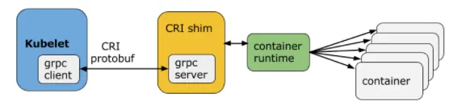

容器运行时接口（Container Runtime Interface），简称 CRI。CRI 中定义了 **容器** 和 **镜像** 的服务的接口，因为容器运行时与镜像的生命周期是彼此隔离的，因此需要定义两个服务。该接口使用 [Protocol Buffer](https://developers.google.com/protocol-buffers/)，基于 [gRPC](https://grpc.io/)，在 Kubernetes v1.10 + 版本中是在 `pkg/kubelet/apis/cri/runtime/v1alpha2` 的 `api.proto` 中定义的。

## CRI 架构

Container Runtime 实现了 CRI gRPC Server，包括 `RuntimeService` 和 `ImageService`。该 gRPC Server 需要监听本地的 Unix socket，而 kubelet 则作为 gRPC Client 运行。

{width=572 height=136}

## 启用 CRI

除非集成了 rktnetes，否则 CRI 都是被默认启用了，从 Kubernetes 1.7 版本开始，旧的预集成的 docker CRI 已经被移除。

要想启用 CRI 只需要在 kubelet 的启动参数重传入此参数：`--container-runtime-endpoint` 远程运行时服务的端点。当前 Linux 上支持 unix socket，windows 上支持 tcp。例如：`unix:///var/run/dockershim.sock`、 `tcp://localhost:373`，默认是 `unix:///var/run/dockershim.sock`，即默认使用本地的 docker 作为容器运行时。

## CRI 接口

Kubernetes 1.9 中的 CRI 接口在 `api.proto` 中的定义，其中包含了两个 gRPC 服务：

- **RuntimeService**：容器和 Sandbox 运行时管理。
- **ImageService**：提供了从镜像仓库拉取、查看、和移除镜像的 RPC。

## 当前支持的 CRI 后端

我们最初在使用 Kubernetes 时通常会默认使用 Docker 作为容器运行时，其实从 Kubernetes 1.5 开始已经支持 CRI，通过 CRI 接口可以指定使用其它容器运行时作为 Pod 的后端，目前支持 CRI 的后端有：

- [cri-o](https://github.com/kubernetes-incubator/cri-o)：cri-o 是 Kubernetes 的 CRI 标准的实现，并且允许 Kubernetes 间接使用 OCI 兼容的容器运行时，可以把 cri-o 看成 Kubernetes 使用 OCI 兼容的容器运行时的中间层。主要由 Red Hat 公司贡献开源。
- [containerd](https://github.com/containerd/containerd)：Kubernetes CRI 默认实现，由 Docker 公司贡献开源。

另外，还有两个容器运行时值得一提——katacontainers 和 gvisor 都没有直接实现 CRI 接口。它们都是通过在容器运行时和宿主机之间添加一个虚拟化层来增强安全性能的。具体来说：

- [Kata Containers](https://katacontainers.io/)：katacontainers 是一种轻量级的虚拟化技术，曾合并了 Clear Containers。它通过在容器和操作系统之间添加一个轻量级的虚拟化层来提供额外的安全性和隔离性。它可以与 Kubernetes 集成，但需要通过一些额外的工具来实现与 CRI 的交互。
- [gVisor](https://github.com/google/gvisor)：gvisor 是一种轻量级的沙箱技术，由 Google 公司开源。它通过在容器运行时和操作系统之间添加一个沙箱层来提供额外的安全性和隔离性。gvisor 可以与 Docker 和 Kubernetes 集成，但是也需要通过一些额外的工具来实现与 CRI 的交互。

总之，虽然 katacontainers 和 gvisor 都不能直接实现 CRI 接口，但它们都是为容器提供增强安全性和隔离性的重要技术，并且可以与 Kubernetes 集成来实现容器管理和调度。

## 参考

- [Kubernetes CRI and Minikube - sreeninet.wordpress.com](https://sreeninet.wordpress.com/2017/02/11/kubernetes-cri-and-minikube/)
- [CRI-O and Alternative Runtimes in Kubernetes - projectatomic.io](https://projectatomic.io/blog/2017/02/crio-runtimes/)
- [Docker、Containerd、RunC...：你应该知道的所有](https://www.infoq.cn/article/2017/02/Docker-Containerd-RunC/)
- [Introducing Container Runtime Interface (CRI) in Kubernetes - blog.kubernetes.io](https://kubernetes.io/blog/2016/12/container-runtime-interface-cri-in-kubernetes/)
- [cri-o 官网 - cri-o.io](https://cri-o.io/)
- [Kata Containers Architecture - github.com](https://github.com/kata-containers/documentation/blob/master/design/architecture.md#kubernetes-support)
