> Kubernetes 架构奠定了云原生时代的技术基石，引领分布式系统创新。

## Kubernetes 的前身 Borg

要谈到 Kubernetes 就要不得从 Borg 系统开始谈起。Borg 是 Google 内部运行超过 15 年的大规模集群管理系统，管理着数十万个应用跨越数千个集群。它为 Kubernetes 的设计提供了宝贵的实践经验和理论基础。



{width=2300 height=1052}

### Borg 核心组件

- **BorgMaster**：集群大脑，负责状态管理和决策制定，使用 Paxos 协议保证一致性
- **Scheduler**：智能调度器，基于资源需求和约束条件进行任务分配
- **Borglet**：节点代理，管理容器生命周期和资源监控
- **borgcfg**：声明式配置工具，定义应用的期望状态

## Kubernetes 架构总览

Kubernetes 采用分布式架构，控制面与工作节点分离，实现了决策集中与任务分布的高可用设计。


{width=1920 height=867}

## 控制面组件

控制面负责全局决策与事件响应，核心组件如下：



| 组件                    | 描述                 | 主要职责                 |
| ----------------------- | -------------------- | ------------------------ |
| kube-apiserver          | 控制面的前端入口     | 提供 API，处理所有请求   |
| etcd                    | 一致性高可用键值存储 | 存储集群所有数据         |
| kube-scheduler          | 监听新建 Pod         | 根据资源调度 Pod 到节点  |
| kube-controller-manager | 运行控制器进程       | 通过控制循环维护集群状态 |



## 节点组件

每个节点运行以下组件，负责 Pod 的实际运行与网络管理。


{width=1920 height=3272}



| 组件       | 描述         | 主要职责                                 |
| ---------- | ------------ | ---------------------------------------- |
| kubelet    | 节点代理     | 保证 Pod 中容器运行                      |
| kube-proxy | 网络代理     | 维护节点网络规则                         |
| 容器运行时 | 容器执行环境 | 运行容器（如 Docker、containerd、CRI-O） |



## Kubernetes API 与对象模型

Kubernetes API 定义了一组资源类型（对象），所有操作均通过 API Server 完成，负责对象的校验与配置。

### API 概念



{width=1920 height=1485}

Kubernetes API 遵循 RESTful 设计：

- 资源通过 HTTP 动词（`GET`、`POST`、`PUT`、`DELETE`、`PATCH`）访问
- 资源按 API 组组织（如 `apps`、`batch`、`networking.k8s.io`）
- 对象包含 `metadata`、`spec`、`status` 等字段

### 对象的声明式管理

Kubernetes 对象是集群状态的持久实体，描述：

- 运行的容器化应用
- 可用资源
- 行为策略

每个对象有两个关键字段：

1. **`spec`**：用户声明的期望状态
2. **`status`**：Kubernetes 实际观测到的状态

### 对象命名与标识

每个对象通过以下标识唯一确定：



| 标识      | 描述             | 示例                                   |
| --------- | ---------------- | -------------------------------------- |
| Name      | 用户自定义名称   | `nginx-deployment`                     |
| UID       | 系统生成唯一标识 | `a8f3d1c8-0aeb-11e9-a4c2-000c29ed5138` |
| Namespace | 命名空间范围     | `default`、`kube-system`               |



命名空间内资源名称唯一，集群级资源全局唯一。

### 标签与选择器

标签（Label）是附加在对象上的键值对，用于组织和筛选对象。


{width=1920 height=1407}

标签常用于：

- 服务选择 Pod
- 对象分组与组织
- 批量操作对象

### 字段选择器

字段选择器（Field Selector）可根据对象字段筛选资源，例如：

```bash
kubectl get pods --field-selector status.phase=Running
```



| 资源类型 | 支持字段                                                   |
| -------- | ---------------------------------------------------------- |
| Pod      | `status.phase`, `spec.nodeName`, `spec.serviceAccountName` |
| Node     | `spec.unschedulable`                                       |
| Event    | `involvedObject.kind`, `reason`, `type`                    |



## 命名空间与资源隔离

命名空间用于在单集群内隔离资源，适合多租户场景。



{width=1920 height=2195}

Kubernetes 默认包含四个命名空间：

- `default`：默认命名空间
- `kube-system`：系统组件
- `kube-public`：所有用户可读，公开资源
- `kube-node-lease`：节点心跳对象

## 对象所有权与垃圾回收

Kubernetes 通过 ownerReference 管理对象生命周期，实现级联删除。



{width=1920 height=1619}

删除对象时可选择：

- **前台删除**：先删除依赖对象，再删除所有者
- **后台删除**：立即删除所有者，依赖对象后台清理
- **孤立删除**：仅删除所有者，保留依赖对象

## API Server 工作机制

API Server 是控制面的核心，负责所有组件间通信与 API 暴露。

### API Server 请求处理流程



{width=1920 height=273}

处理流程：

1. **认证**：校验客户端身份
2. **鉴权**：检查权限
3. **准入控制**：执行策略或修改对象
4. **校验**：结构合法性检查
5. **存储**：持久化到 etcd

### Server-Side Apply

Server-Side Apply 支持多客户端协作管理资源字段，自动冲突检测与合并。


{width=1920 height=2536}

主要特性：

- 跟踪字段归属
- 冲突自动检测与提示
- 支持控制器与人工协作

## Kubernetes 扩展机制

Kubernetes 支持多种扩展方式，无需修改核心代码即可适配不同场景。



{width=1920 height=5819}



| 扩展类型       | 作用                   | 示例                               |
| -------------- | ---------------------- | ---------------------------------- |
| 自定义资源     | 扩展 API 对象类型      | CRD、API 聚合                      |
| 准入 Webhook   | 拦截 API 请求校验/变更 | ValidatingWebhook、MutatingWebhook |
| 调度扩展       | 自定义 Pod 调度逻辑    | 调度插件、多调度器                 |
| 认证模块       | 新增认证方式           | OIDC、Webhook Token Auth           |
| 网络插件       | 实现 Pod 网络          | Calico、Cilium、Flannel            |
| 存储插件       | 支持多种存储系统       | CSI 插件                           |



## 日志与监控

Kubernetes 提供多种日志与监控能力，便于集群与应用的运维。

### 系统组件日志

各组件日志路径如下：



| 组件                    | Linux 路径                                                   | Windows 路径                                                 |
| ----------------------- | ------------------------------------------------------------ | ------------------------------------------------------------ |
| kube-apiserver          | `/var/log/kube-apiserver.log`                                | `C:\var\logs\kube-apiserver.log`                             |
| kube-scheduler          | `/var/log/kube-scheduler.log`                                | `C:\var\logs\kube-scheduler.log`                             |
| kube-controller-manager | `/var/log/kube-controller-manager.log`                       | `C:\var\logs\kube-controller-manager.log`                    |
| kubelet                 | `/var/log/kubelet.log`                                       | `C:\var\logs\kubelet.log`                                    |
| containers              | `/var/log/pods/<namespace>_<pod-name>_<uid>/<container-name>/` | `C:\var\log\pods\<namespace>_<pod-name>_<uid>\<container-name>\` |



### 指标采集

Kubernetes 组件通过 `/metrics` 端点暴露 Prometheus 格式指标。


{width=1920 height=1470}

这些指标有助于集群健康与性能监控。

## 分布式追踪

Kubernetes 支持分布式追踪，便于跨组件操作的监控与故障排查。


{width=1920 height=743}

系统组件通过 OpenTelemetry 协议记录操作延迟与依赖关系。

## 总结

本文系统梳理了 Kubernetes 的核心架构、对象模型、命名空间、对象管理与扩展机制等基础内容。掌握这些核心概念，是高效使用和运维 Kubernetes 集群的前提。更多专题内容请参阅相关章节。

## 参考资料

- [Borg, Omega, and Kubernetes - ACM Queue](https://queue.acm.org/detail.cfm?id=2898444)
- [Large-scale cluster management at Google with Borg](https://research.google/pubs/pub43438/)
- [Kubernetes 官方文档 - kubernetes.io](https://kubernetes.io/docs/concepts/)
- [Kubernetes API 参考 - kubernetes.io](https://kubernetes.io/docs/reference/generated/kubernetes-api/)
- [Kubernetes 扩展机制 - kubernetes.io](https://kubernetes.io/docs/concepts/extend-kubernetes/)
