> Kubernetes 通过声明式资源对象实现集群的自动化管理与弹性扩展，理解对象类型、规范与状态是高效运维的基础。

## Kubernetes 资源对象分类

Kubernetes 资源对象用于描述集群中各种实体和功能。下表总结了常用对象类型及其主要用途：



| 类别         | 资源对象                                                                                 | 说明                         |
| ------------ | ---------------------------------------------------------------------------------------- | ---------------------------- |
| 工作负载     | Pod、Deployment、StatefulSet、DaemonSet、Job、CronJob、ReplicaSet                         | 应用部署与调度               |
| 服务与网络   | Service、Ingress                                                                         | 服务发现与负载均衡           |
| 配置与存储   | ConfigMap、Secret、Volume、PersistentVolume（PV）、PersistentVolumeClaim（PVC）           | 配置管理与持久化存储         |
| 集群管理     | Node、Namespace、Label                                                                   | 节点管理与资源隔离           |
| 安全与权限   | ServiceAccount、Role、ClusterRole、SecurityContext                                       | 身份认证与权限控制           |
| 资源管理     | ResourceQuota、LimitRange、HorizontalPodAutoscaler（HPA）                                 | 资源分配与自动扩缩容         |
| 扩展性       | CustomResourceDefinition（CRD）                                                          | 自定义资源类型               |



## 工作负载对象

工作负载对象用于定义和管理应用的运行方式。常见类型包括：

- **Pod**：最小部署单元，包含一个或多个容器。
- **Deployment**：管理无状态应用的部署和扩展。
- **StatefulSet**：管理有状态应用，支持有序部署和持久化存储。
- **DaemonSet**：确保每个节点运行特定 Pod。
- **Job**：运行一次性任务。
- **CronJob**：按计划运行任务。
- **ReplicaSet**：维护指定数量的 Pod 副本。

## 服务发现与负载均衡

- **Service**：为 Pod 提供稳定的网络访问入口。
- **Ingress**：管理外部访问集群服务的 HTTP 和 HTTPS 路由。

## 配置与存储

- **ConfigMap**：存储非敏感配置数据。
- **Secret**：存储敏感信息如密码、令牌。
- **Volume**：为容器提供存储。
- **PersistentVolume（PV）**：集群级别的存储资源。
- **PersistentVolumeClaim（PVC）**：用户对存储的请求。

## 集群管理

- **Node**：集群中的工作节点。
- **Namespace**：虚拟集群，用于资源隔离。
- **Label**：键值对标签，用于资源选择和组织。

## 安全与权限

- **ServiceAccount**：为 Pod 提供身份标识。
- **Role**：命名空间级别的权限规则。
- **ClusterRole**：集群级别的权限规则。
- **SecurityContext**：定义 Pod 或容器的安全设置。

## 资源管理

- **ResourceQuota**：限制命名空间的资源使用。
- **LimitRange**：设置资源使用的默认值和限制。
- **HorizontalPodAutoscaler（HPA）**：基于 CPU/内存使用率自动扩缩容。

## 扩展性

- **CustomResourceDefinition（CRD）**：定义自定义资源类型，扩展 Kubernetes API。

## 理解 Kubernetes 对象

Kubernetes 对象（Object）是集群中的持久化实体，用于描述期望状态。每个对象定义了：

- **运行内容**：哪些容器化应用在运行，运行在哪些节点上。
- **可用资源**：应用可以使用的计算、存储和网络资源。
- **行为策略**：重启策略、升级策略、容错策略等。

Kubernetes 采用**声明式管理**模式：用户声明期望状态，Kubernetes 控制平面持续确保实际状态与期望状态一致。

### 对象规范与状态

每个对象包含两个关键字段：

- **spec（规范）**：描述对象的期望状态，由用户提供。例如，Deployment 中指定副本数为 3。
- **status（状态）**：描述对象的当前实际状态，由 Kubernetes 系统维护。例如，当前实际运行的副本数。

Kubernetes 控制器持续监控对象状态，发现实际状态与期望状态不符时会自动修正。

### 对象定义格式

Kubernetes 对象通常使用 YAML 文件定义，包含以下必需字段：

```yaml
apiVersion: apps/v1      # API 版本
kind: Deployment         # 对象类型  
metadata:               # 元数据
  name: nginx-deployment # 对象名称
  namespace: default     # 命名空间（可选）
  labels:                # 标签（可选）
    app: nginx
spec:                   # 对象规范
  replicas: 3           # 期望状态配置
  selector:
    matchLabels:
      app: nginx
  template:
    metadata:
      labels:
        app: nginx
    spec:
      containers:
      - name: nginx
        image: nginx:1.25
        ports:
        - containerPort: 80
```

### 对象生命周期与管理流程

Kubernetes 对象的声明、创建、变更和删除遵循标准流程。下图展示了对象生命周期的主要阶段：



{width=1920 height=4915}

## 对象管理操作

Kubernetes 支持多种对象管理操作，常用命令如下：

- **创建对象**：

  ```bash
  kubectl apply -f nginx-deployment.yaml
  ```

- **查看对象状态**：

  ```bash
  kubectl get deployment nginx-deployment
  kubectl describe deployment nginx-deployment  
  ```

- **更新对象**：

  ```bash
  # 修改 YAML 文件后重新应用
  kubectl apply -f nginx-deployment.yaml
  ```

- **删除对象**：

  ```bash
  kubectl delete -f nginx-deployment.yaml
  # 或者
  kubectl delete deployment nginx-deployment
  ```

## 最佳实践

在实际管理 Kubernetes 资源对象时，建议遵循以下最佳实践：

- **使用声明式管理**：优先使用 `kubectl apply` 而非命令式操作。
- **版本控制**：将 YAML 文件纳入版本控制系统，便于审计和回滚。
- **标签规范**：为对象添加有意义的标签，便于资源选择和管理。
- **命名规范**：使用清晰、一致的命名约定，提升可维护性。
- **资源限制**：为容器设置合适的资源请求和限制，防止资源争用。

## 总结

Kubernetes 通过丰富的资源对象体系，实现了集群的声明式管理和自动化运维。掌握对象类型、规范与状态，有助于高效构建和维护云原生应用。

## 参考文献

- [Kubernetes API 参考文档 - kubernetes.io](https://kubernetes.io/docs/reference/kubernetes-api/)
- [kubectl 命令参考 - kubernetes.io](https://kubernetes.io/docs/reference/kubectl/)
- [YAML 语法指南 - yaml.org](https://yaml.org/spec/1.2/spec.html)
