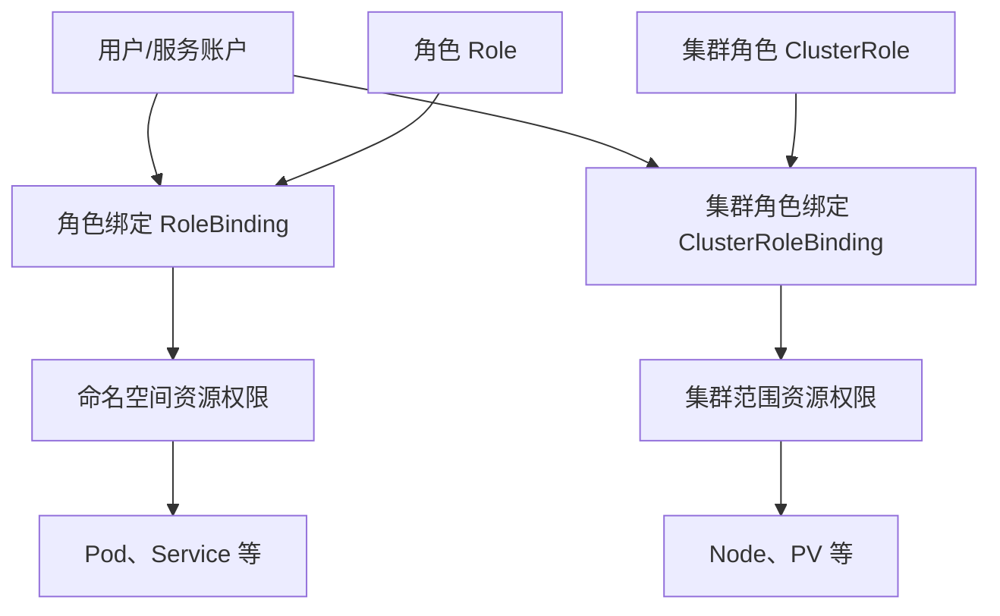
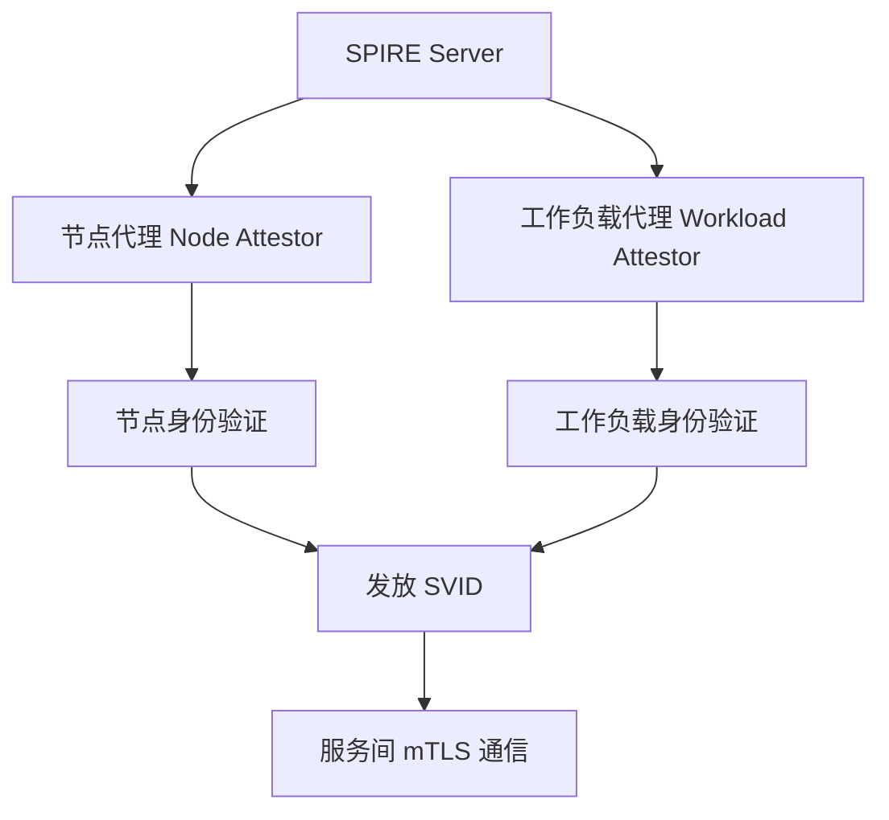
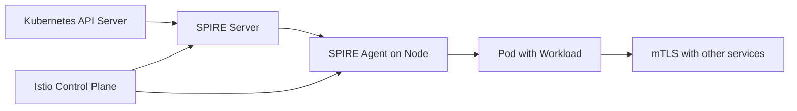

> 在云原生世界，身份不仅是安全的基石，更是实现自动化与零信任架构的关键驱动力。

在微服务和云原生架构中，身份管理是确保系统安全的核心。本章聚焦于 Kubernetes 环境中的身份问题，重点介绍基于角色的访问控制（RBAC）、SPIRE（SPIFFE Runtime Environment）和 SPIFFE（Secure Production Identity Framework For Everyone）等关键技术。

## 为什么身份管理如此重要

在分布式系统中，服务之间的相互认证和授权变得异常复杂。传统的用户名/密码或 API 密钥方式无法满足：

- **动态扩展**：服务实例频繁创建和销毁
- **零信任安全**：不信任网络，验证每个请求
- **服务间通信**：自动化服务发现和安全通信

身份管理框架如 SPIFFE 提供了标准化的解决方案，确保工作负载具有可验证的身份。

## 基于角色的访问控制 (RBAC)

RBAC 是 Kubernetes 最核心的权限管理机制，以下是其核心组件关系图：




{width=1920 height=1501}

- **角色（Role）**：定义命名空间内的权限集合
- **集群角色（ClusterRole）**：定义集群范围的权限
- **角色绑定**：将角色关联到用户、服务账户或组
- **最小权限原则**：只授予必要的权限

## SPIFFE：安全身份框架

SPIFFE（Secure Production Identity Framework For Everyone）是一个开放标准，为工作负载提供身份标识：

**核心概念**

- **SVID (SPIFFE Verifiable Identity Document)**：可验证的身份凭证
- **信任域**：身份的信任边界，通常是一个组织或集群
- **工作负载身份**：基于服务名称和位置的唯一标识

**SPIFFE 身份格式**

```text
spiffe://trust-domain/path
```

例如：`spiffe://example.com/ns/production/sa/web-server`

## SPIRE：SPIFFE 运行时环境

SPIRE 是 SPIFFE 规范的开源实现，提供身份管理和凭证分发：




{width=1920 height=2351}

**SPIRE 组件**

- **SPIRE Server**：中央权威，管理身份注册和凭证发放
- **SPIRE Agent**：在每个节点运行，处理工作负载身份请求
- **工作负载插件**：支持 Kubernetes、Docker 等运行时

**身份分发流程**

1. 工作负载启动时向 SPIRE Agent 请求身份
2. Agent 验证工作负载身份并请求 Server 发放 SVID
3. Server 生成并签名 SVID 返回
4. 工作负载使用 SVID 进行 mTLS 通信

## Kubernetes 中的 SPIRE 集成

SPIRE 可以与 Kubernetes 深度集成：

**Service Account 集成**

- 使用 Kubernetes Service Account Token 作为初始凭证
- 自动为 Pod 注入 SPIRE Agent 身份

**Istio 服务网格集成**

- 与 Istio 结合实现零信任网络
- 自动配置 mTLS，使用 SPIFFE 身份

**典型部署架构**




{width=1920 height=282}

## RBAC 与 SPIFFE/SPIRE 的结合

现代身份管理系统通常结合多种技术：

- **RBAC**：提供粗粒度权限控制
- **SPIFFE/SPIRE**：提供细粒度身份验证和 mTLS
- **集成方案**：RBAC 控制 API 访问，SPIFFE 确保服务间通信安全

## 本章内容

本章将深入探讨：

- Kubernetes RBAC 的详细配置和最佳实践
- SPIFFE 规范的原理和身份格式
- SPIRE 的部署、配置和 Kubernetes 集成
- 实际案例：使用 SPIRE 实现服务网格安全
- 身份管理在零信任架构中的应用

通过掌握这些技术，您将能够构建基于身份的现代化安全架构，确保服务间的可信通信和精细化权限控制。
