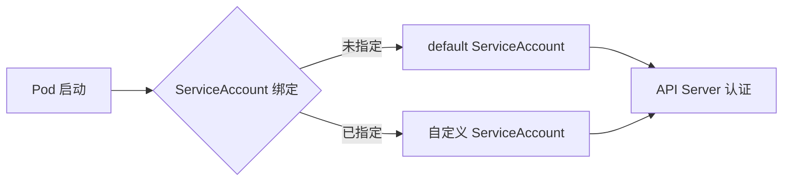
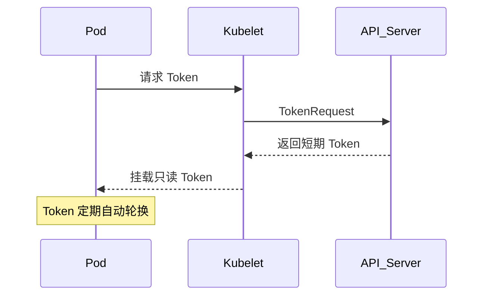

> ServiceAccount 是 Kubernetes 集群中 Pod 身份认证与权限控制的基础机制，合理配置可提升安全性与自动化水平。

## ServiceAccount 基本概念

在 Kubernetes 中，ServiceAccount（服务账号）为 Pod 内进程提供身份凭证。与用户账号（User Account）不同，ServiceAccount 主要用于 Pod 与 API Server 的通信认证。

每个 namespace 默认存在名为 `default` 的 ServiceAccount。Pod 若需访问 Kubernetes API，会自动使用 ServiceAccount 的凭证进行身份验证。




{width=1920 height=374}

## 使用默认的 ServiceAccount

当创建 Pod 时，若未指定 ServiceAccount，系统会自动分配同 namespace 下的 `default` ServiceAccount。

你可以通过如下命令查看 Pod 的 ServiceAccount 配置：

```bash
kubectl get pod <pod-name> -o yaml
```

输出中的 `spec.serviceAccountName` 字段即为当前 Pod 绑定的 ServiceAccount。

### 访问 API 权限

ServiceAccount 能否访问 API 取决于 RBAC（基于角色的访问控制）配置。Pod 内应用可通过自动挂载的 ServiceAccount Token 访问 Kubernetes API。

### 禁用自动挂载

自 Kubernetes v1.6 起，可在 ServiceAccount 或 Pod 级别禁用凭证自动挂载：

```yaml
apiVersion: v1
kind: Pod
metadata:
  name: my-pod
spec:
  serviceAccountName: build-robot
  automountServiceAccountToken: false
```


如果在 Pod 和 ServiceAccount 中同时设置了 `automountServiceAccountToken`，Pod 设置中的优先级更高。


> **更新（2025）**  
>
> - 自 Kubernetes v1.24 起，ServiceAccount 默认不再自动创建 Secret 类型的长期 Token，推荐使用 BoundServiceAccountTokenVolume（短期 Token，自动轮换）。
> - `secrets` 字段已不推荐使用，建议通过 `TokenRequest` API 获取临时 Token。

## 创建和管理 ServiceAccount

### 查看现有 ServiceAccount

列出当前 namespace 下所有 ServiceAccount：

```bash
kubectl get serviceaccounts
```

### 创建自定义 ServiceAccount

通过 YAML 或命令行创建 ServiceAccount：

```yaml
apiVersion: v1
kind: ServiceAccount
metadata:
  name: build-robot
  namespace: default
```

```bash
kubectl create serviceaccount build-robot
```

### 查看 ServiceAccount 详情

```bash
kubectl get serviceaccounts/build-robot -o yaml
```

### 在 Pod 中使用自定义 ServiceAccount

在 Pod 规范中指定 ServiceAccount：

```yaml
apiVersion: v1
kind: Pod
metadata:
  name: my-pod
spec:
  serviceAccountName: build-robot
  containers:
  - name: my-container
    image: nginx
```



- ServiceAccount 必须在 Pod 创建前存在，否则创建会被拒绝。
- 已创建的 Pod 不可更改其 ServiceAccount。


## Token 管理

### 现代 Token 机制

自 Kubernetes v1.24 起，默认启用 BoundServiceAccountTokenVolume：

- Token 自动轮换，存储于只读投影卷
- Token 具备时间和受众限制，提升安全性




{width=1920 height=1184}

> **注意**  
>
> - 默认不再为每个 ServiceAccount 自动创建 Secret 类型 Token。
> - 推荐通过 `TokenRequest` API 获取短期 Token，避免长期 Token 泄露风险。

### 手动创建长期 Token（不推荐）

如确需长期有效 Token，可手动创建 Secret：

```yaml
apiVersion: v1
kind: Secret
metadata:
  name: build-robot-secret
  annotations:
    kubernetes.io/service-account.name: build-robot
type: kubernetes.io/service-account-token
```

```bash
kubectl describe secret build-robot-secret
```


手动创建的长期 Token 存在安全风险，建议优先使用 TokenRequest API 或短期 Token。


## 配置镜像拉取密钥

### 创建镜像拉取密钥

创建包含镜像仓库凭证的 Secret：

```bash
kubectl create secret docker-registry myregistrykey \
  --docker-server=<your-registry-server> \
  --docker-username=<your-name> \
  --docker-password=<your-password> \
  --docker-email=<your-email>
```

### 添加到 ServiceAccount

方法一：patch 命令

```bash
kubectl patch serviceaccount default -p '{"imagePullSecrets": [{"name": "myregistrykey"}]}'
```

方法二：编辑 YAML

```yaml
apiVersion: v1
kind: ServiceAccount
metadata:
  name: default
  namespace: default
imagePullSecrets:
- name: myregistrykey
```

> **更新（2025）**  
> Kubernetes 1.24+ 推荐通过 `imagePullSecrets` 字段直接关联 Secret，避免依赖自动创建的 ServiceAccount Token Secret。

配置后，该 namespace 新建 Pod 会自动包含镜像拉取密钥。

## ServiceAccount 与 RBAC 权限管理

通过 RBAC（Role-Based Access Control）可为 ServiceAccount 赋予精细化权限。

### 创建 ServiceAccount

```bash
kubectl create serviceaccount sample-sa
```

### 获取 ServiceAccount Token

Kubernetes v1.24+ 推荐获取短期 Token：

```bash
kubectl create token sample-sa
```

如需长期 Token，需手动创建 Secret。

### 创建 ClusterRole

```yaml
apiVersion: rbac.authorization.k8s.io/v1
kind: ClusterRole
metadata:
  name: viewer-role
rules:
- apiGroups: [""]
  resources:
  - pods
  - pods/status
  - pods/log
  - services
  - services/status
  - endpoints
  - endpoints/status
  verbs:
  - get
  - list
  - watch
- apiGroups: ["apps"]
  resources:
  - deployments
  - deployments/status
  verbs:
  - get
  - list
  - watch
```

### 创建 ClusterRoleBinding

```yaml
apiVersion: rbac.authorization.k8s.io/v1
kind: ClusterRoleBinding
metadata:
  name: sample-role-binding
roleRef:
  apiGroup: rbac.authorization.k8s.io
  kind: ClusterRole
  name: viewer-role
subjects:
- kind: ServiceAccount
  name: sample-sa
  namespace: default
```

### 配置 kubeconfig

```yaml
apiVersion: v1
clusters:
- cluster:
    certificate-authority-data: <BASE64_ENCODED_CA_CERT>
    server: https://your-k8s-api-server:6443
  name: my-cluster
contexts:
- context:
    cluster: my-cluster
    user: sample-user
  name: sample-context
current-context: sample-context
kind: Config
preferences: {}
users:
- name: sample-user
  user:
    token: <SERVICE_ACCOUNT_TOKEN>
```

## 管理多个 ServiceAccount

每个 namespace 默认有 `default` ServiceAccount，可通过如下命令列出：

```bash
kubectl get serviceaccounts
```

创建自定义 ServiceAccount：

```bash
kubectl apply -f - <<EOF
apiVersion: v1
kind: ServiceAccount
metadata:
  name: build-robot
EOF
```

查看详情：

```bash
kubectl get serviceaccounts/build-robot -o yaml
```

在 Pod 中指定 ServiceAccount：

```yaml
apiVersion: v1
kind: Pod
metadata:
  name: my-pod
spec:
  serviceAccountName: build-robot
  containers:
  - name: my-container
    image: nginx
```

**注意事项**：

- Pod 创建前 ServiceAccount 必须已存在
- 已创建 Pod 不可更改 ServiceAccount

清理 ServiceAccount：

```bash
kubectl delete serviceaccount/build-robot
```

## 总结

ServiceAccount 是 Kubernetes 集群安全与自动化治理的基石。自 v1.24 起，Token 管理机制全面升级，推荐优先使用短期 Token 与 BoundServiceAccountTokenVolume，结合 RBAC 精细化授权，提升集群安全性和可维护性。

## 参考文献

1. [Configure Service Accounts for Pods - kubernetes.io](https://kubernetes.io/docs/tasks/configure-pod-container/configure-service-account/)
2. [Managing Service Accounts - kubernetes.io](https://kubernetes.io/docs/reference/access-authn-authz/service-accounts-admin/)
3. [Bound ServiceAccount Token Volume - kubernetes.io](https://kubernetes.io/docs/tasks/configure-pod-container/configure-service-account/#bound-serviceaccount-token-volume)
