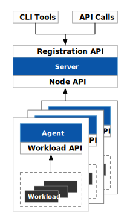
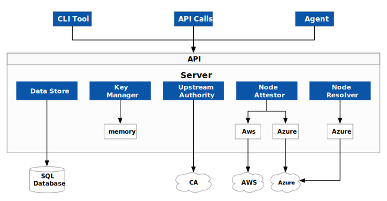
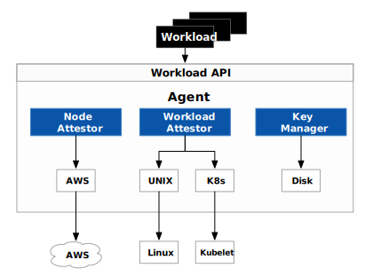
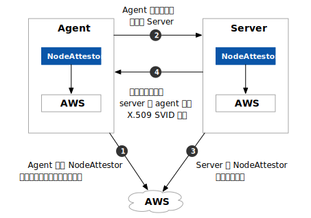

这篇文章将向你介绍 SPIRE 的架构、基本概念及原理。

SPIRE 是 [SPIFFE API](../spiffe) 的一个生产就绪的实现，它执行节点和工作负载认证，以便根据一组预先定义的条件，安全地向工作负载发出 SVID，并验证其他工作负载的 SVID。

## SPIRE 架构和组件

SPIRE 部署由一个 SPIRE 服务器和一个或多个 SPIRE 代理组成。服务器充当通过代理向一组工作负载发放身份的签名机构。它还维护一个工作负载身份的注册表，以及为签发这些身份而必须验证的条件。代理在本地向工作负载公开 SPIFFE 工作负载 API，必须安装在工作负载运行的每个节点上。

## 服务器

SPIRE 服务器负责管理和发布其配置的 SPIFFE 信任域中的所有身份。它存储注册条目（指定决定特定 SPIFFE ID 应被签发的条件的选择器）和签名密钥，使用节点证明来自动验证代理的身份，并在被验证的代理请求时为工作负载创建 SVID。

服务器的行为是通过一系列的插件决定的。SPIRE 包含几个插件，你可以建立额外的插件来扩展 SPIRE 以满足特定的使用情况。插件的类型包括：
- **节点证明器插件**：与代理节点证明器一起，验证代理运行的节点的身份。
- **节点解析器插件**：它通过验证关于节点的额外属性来扩展服务器可以用来识别节点的选择器集合。
- **数据存储插件**：服务器用它来存储、查询和更新各种信息，如注册条目、哪些节点已认证、这些节点的选择器是什么。有一个内置的数据存储插件，可以使用 MySQL、SQLite3 或 PostgresSQL 数据库来存储必要的数据。默认情况下，使用 SQLite 3。
- **密钥管理器插件**：控制服务器如何存储用于签署 X.509-SVID 和 JWT-SVID 的私钥。
- **上游权威机构插件**：默认情况下，SPIRE 服务器充当其自身的证书授权机构。但是，你可以使用上游权威机构插件来使用来自不同 PKI 系统的不同 CA。

你可以通过配置插件和其他各种配置变量来定制服务器的行为。详见 [SPIRE 服务器配置参考](https://spiffe.io/docs/latest/deploying/spire_server/)。

## 代理

SPIRE 代理在已识别的工作负载所运行的每个节点上运行。该代理：

-   从服务器上请求 SVID，并将其缓存起来，直到工作负载请求其 SVID 为止。
-   向节点上的工作负载公开 SPIFFE 工作负载 API，并证明调用它的工作负载的身份
-   为已识别的工作负载提供其 SVID

该代理的主要组成部分包括：

-  **节点证明器插件**：与服务器节点证明器一起，验证代理运行的节点的身份。
-  **工作负载证明器插件**：通过从节点操作系统中查询有关工作负载进程的信息，并将其与你在使用选择器注册工作负载属性时提供给服务器的信息进行比较，来验证节点上工作负载进程的身份。
-  **密钥管理器插件**：代理用来生成和使用颁发给工作负载的 X.509-SVID 的私钥。

你可以通过配置插件和其他配置变量来定制代理的行为。详见《[SPIRE 代理配置参考》](https://spiffe.io/docs/latest/deploying/spire_agent/)。

## 自定义服务器和代理插件

你可以为特定的平台和架构创建自定义的服务器和代理插件，而 SPIRE 并不包括这些插件。例如，你可以为一个架构创建服务器和代理节点验证器，而不是在节点验证下总结的那些。或者你可以创建一个自定义密钥管理器插件，以 SPIRE 目前不支持的方式处理私钥。因为 SPIRE 在运行时加载自定义插件，你不需要重新编译 SPIRE 来启用它们。

## 工作负载注册

为了让 SPIRE 识别工作负载，你必须通过注册条目向 SPIRE 服务器注册工作负载。工作负载注册告诉 SPIRE 如何识别工作负载以及为其提供哪个 SPIFFE ID。

注册条目将身份（以 SPIFFE ID 的形式）映射到一组称为选择器的属性，工作负载必须拥有这些属性才能获得特定身份。在工作负载证明期间，代理使用这些选择器值来验证工作负载的身份。

[SPIRE 文档](https://spiffe.io/docs/latest/spire/using/registering/)中详细介绍了工作负载注册。

## 证明

SPIRE 上下文中的证明（attestation）是断言工作负载的身份。SPIRE 通过从受信任的第三方收集工作负载进程本身和运行 SPIRE 代理的节点的属性并将它们与工作负载注册时定义的一组选择器进行比较来实现这一点。

用于执行证明的可信第三方 SPIRE 查询是特定于平台的。

SPIRE 分两个阶段执行证明：首先是节点证明（其中验证工作负载正在运行的节点的身份），然后是工作负载证明（其中验证节点上的工作负载）。

SPIRE 有一个灵活的架构，允许它根据工作负载运行的环境，使用许多不同的受信第三方进行节点和工作负载验证。你通过代理和服务器配置文件中的条目告诉 SPIRE 使用哪些受信任的第三方，并通过你在注册工作负载时指定的选择器值告诉 SPIRE 使用哪些类型的信息进行验证。

### 节点证明

SPIRE 要求每个代理在首次连接到服务器时进行身份验证和自我验证；这个过程称为节点证明（Node Attestation）。在节点证明期间，代理和服务器一起验证运行代理的节点的身份。他们通过称为节点证明器的插件来做到这一点。所有节点证明器都向节点及其环境询问只有该节点拥有的信息片段，以证明该节点的身份。

节点证明的成功后，代理收到唯一的 SPIFFE ID。然后，代理的 SPIFFE ID 充当其负责的工作负载的“父级”。

节点身份证明的示例包括：

- 通过云平台交付给节点的身份证明文件（例如 AWS Instance 身份证明文件）
- 验证存储在连接到节点的硬件安全模块或可信平台模块上的私钥
- 安装代理时通过加入令牌提供的手动验证
- 多节点软件系统安装在节点上时提供的标识凭据（例如 Kubernetes 服务账户令牌）
- 其他机器身份证明（例如部署的服务器证书）

节点证明器向服务器返回一组（可选）节点选择器，用于标识特定机器（例如 Amazon 实例 ID）。由于在定义工作负载的身份时，单个机器的特定身份通常没有用处，因此 SPIRE 会查询[节点解析器](https://spiffe.io/docs/latest/spire-about/spire-concepts/#node-resolution)（如果有）以查看可以验证被证明节点的哪些附加属性（例如，如果节点是 AWS 安全组的成员）。来自证明器和解析者的选择器集成为与代理节点的 SPIFFE ID 关联的选择器集。


节点证明不需要节点选择器，除非你[将工作负载映射到多个节点](https://spiffe.io/docs/latest/spire/using/registering/#mapping-workloads-to-multiple-nodes)。


下图说明了节点证明中的步骤。在此图中，底层平台是 AWS：

#### 步骤总结：节点证明

1. 代理 AWS 节点证明器插件向 AWS 查询节点身份证明，并将该信息提供给代理。
2. 代理将此身份证明传递给服务器。服务器将此数据传递给其 AWS 节点证明器。
3. 服务器 AWS 节点证明器独立验证身份证明，或者通过调用 AWS API，使用它在步骤 2 中获得的信息。节点证明器还为代理创建一个 SPIFFE ID，并将其传递回服务器进程，以及它发现的任何节点选择器。
4. 服务器发回代理节点的 SVID。

#### 节点证明器

代理和服务器通过它们各自的节点证明器询问底层平台。SPIRE 支持节点证明器在各种环境中证明节点身份，包括：

- AWS 上的 EC2 实例（使用 EC2 实例身份文档）
- Microsoft Azure 上的 VM（使用 Azure 托管服务标识）
- Google Cloud Platform 上的 Google Compute Engine 实例（使用 GCE 实例身份令牌）
- 作为 Kubernetes 集群成员的节点（使用 Kubernetes 服务账户令牌）

对于没有平台可以直接识别节点的情况，SPIRE 包括用于证明的节点证明器：

**使用服务器生成的加入令牌**—— 加入令牌（join token）是 SPIRE 服务器和代理之间的预共享密钥。服务器可以在安装后生成加入令牌，该令牌可用于在代理启动时对其进行验证。为帮助防止滥用，加入令牌在使用后立即过期。

**使用现有的 X.509 证书**—— 有关配置节点证明器的信息，请参阅 [SPIRE 服务器配置参考](https://spiffe.io/docs/latest/deploying/spire_server/)和 [SPIRE 代理配置参考](https://spiffe.io/docs/latest/deploying/spire_agent/)。

#### 节点解析

一旦验证了单个节点的身份，“节点解析器”插件就会扩展一组选择器，这些选择器可用于通过验证节点的其他属性来识别节点（例如，如果节点是特定 AWS 安全组的成员） ，或具有与之关联的特定标签）。只有服务器参与节点解析。SPIRE 在证明之后直接运行一次节点解析器。

#### 节点解析器

服务器支持以下平台的节点解析器插件：

- 亚马逊网络服务（AWS）
- 微软 Azure

### 工作负载证明

工作负载证明提出了一个问题：“这是谁的进程？”代理通过询问本地可用的权限（例如节点的操作系统内核，或在同一节点上运行的本地 kubelet）来回答这个问题，以确定调用工作负载 API 的进程的属性。

然后，当你使用选择器注册工作负载的属性时，将这些属性与提供给服务器的信息进行比较。

这些类型的信息可能包括：

- 底层操作系统如何调度进程。在基于 Unix 的系统上，这可能是用户 ID (uid)、组 ID (gid)、文件系统路径等。）
- 进程是如何由 Kubernetes 等编排系统调度的。在这种情况下，工作负载可能由运行它的 Kubernetes 服务账户或命名空间来描述。

虽然代理和服务器都在节点证明中发挥作用，但只有代理参与工作负载证明。

下图说明了工作负载证明的步骤：

#### 步骤摘要：工作负载证明

1. 工作负载调用工作负载 API 以请求 SVID。在 Unix 系统上，这被暴露为 Unix 域套接字。
2. 代理询问节点的内核以识别调用者的进程 ID。然后，它调用任何已配置的工作负载证明器插件，为它们提供工作负载的进程 ID。
3. 工作负载证明者使用进程 ID 来发现有关工作负载的其他信息，并根据需要查询相邻平台特定的组件，例如 Kubernetes kubelet。通常，这些组件也与代理驻留在同一节点上。
4. 证明者将发现的信息以选择器的形式返回给代理。
5. 代理通过将发现的选择器与注册条目进行比较来确定工作负载的身份，并将正确的缓存 SVID 返回给工作负载。

#### 工作负载证明者

SPIRE 包括适用于 Unix、Kubernetes 和 Docker 的工作负载证明器插件。

## 参考

- [SPIRE Concepts - spiffe.io](https://spiffe.io/docs/latest/spire-about/spire-concepts/)

