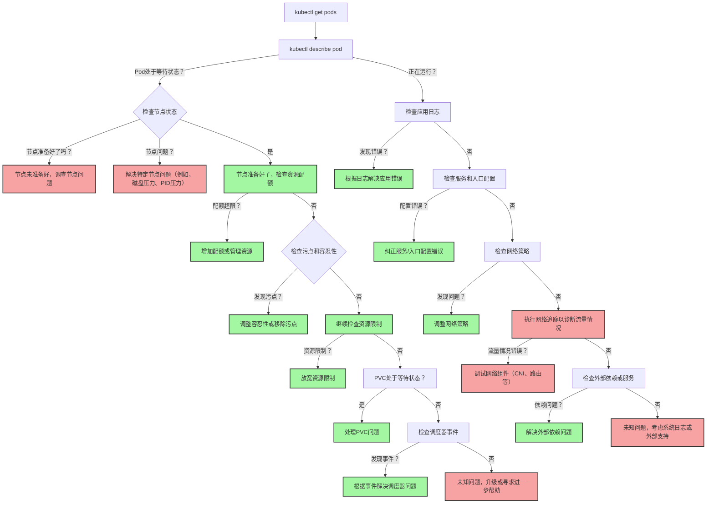

> 系统化的调试流程是高效定位和解决 Kubernetes 集群中 Pod 问题的关键，覆盖从状态检查到网络排障的全链路实践。

## 调试流程概览

下图展示了调试 Kubernetes 集群中 Pod 的完整流程，帮助你理清排查思路：




{width=1981 height=1414}

## 基础状态检查

调试 Pod 问题的第一步是获取其状态和详细信息。

### 获取 Pod 状态

使用以下命令获取 Pod 的基本状态信息：

```bash
kubectl get pods -o wide
```

### 查看详细信息

针对有问题的 Pod，查看其详细描述信息：

```bash
kubectl describe pod <pod-name>
```

## Pending 状态问题排查

当 Pod 处于 Pending 状态时，通常表示调度或资源分配存在问题。需要从节点、资源、调度等多维度排查。

### 节点状态检查

检查集群节点的健康状态：

```bash
kubectl get nodes
kubectl describe node <node-name>
```

如果节点状态为 NotReady，需要关注以下常见问题：

- 磁盘压力（DiskPressure）
- 内存压力（MemoryPressure）
- PID 压力（PIDPressure）
- 网络连接问题

### 资源配额验证

检查命名空间的资源配额限制：

```bash
kubectl describe quota -n <namespace>
kubectl describe limitrange -n <namespace>
```

### 调度约束检查

验证以下调度相关配置：

- 节点选择器（nodeSelector）
- 污点与容忍（Taints & Tolerations）
- 亲和性规则（Affinity）
- 资源请求（CPU/内存）

### 存储问题排查

检查 PVC（持久卷声明）状态：

```bash
kubectl get pvc
kubectl describe pvc <pvc-name>
```

## 运行时问题诊断

当 Pod 已经 Running，但仍有异常时，需进一步分析日志和容器状态。

### 应用日志分析

查看 Pod 内应用程序的日志：

```bash
kubectl logs <pod-name> -c <container-name>
kubectl logs <pod-name> --previous  # 查看上一次重启前的日志
```

### 容器状态检查

检查容器的运行状态和重启历史：

```bash
kubectl get pods <pod-name> -o jsonpath='{.status.containerStatuses[*].restartCount}'
```

## 网络连接排障

网络问题是 Pod 故障常见原因之一，需系统性排查服务、Ingress、网络策略等配置。

### 服务配置验证

检查 Service 配置和端点：

```bash
kubectl get svc
kubectl describe svc <service-name>
kubectl get endpoints <service-name>
```

### Ingress 配置检查

验证 Ingress 规则配置：

```bash
kubectl get ingress
kubectl describe ingress <ingress-name>
```

### 网络策略分析

检查是否有网络策略影响 Pod 通信：

```bash
kubectl get networkpolicy
kubectl describe networkpolicy <policy-name>
```

### 网络连通性测试

使用工具 Pod 进行网络连通性测试：

```bash
kubectl run debug-pod --image=nicolaka/netshoot -it --rm -- /bin/bash
```

## 高级调试技巧

对于复杂或疑难问题，可结合以下高级调试手段进一步定位。

### 进入容器调试

直接进入 Pod 容器进行调试：

```bash
kubectl exec -it <pod-name> -- /bin/bash
```

### 端口转发

将本地端口转发到 Pod 端口进行调试：

```bash
kubectl port-forward <pod-name> 8080:80
```

### 资源使用监控

实时监控 Pod 资源使用情况：

```bash
kubectl top pods
kubectl top nodes
```

## 最佳实践建议

为提升调试效率和集群稳定性，建议遵循以下实践：



| 类别           | 建议与说明                                 |
|----------------|--------------------------------------------|
| 系统化排查     | 按照流程图逐步检查，避免遗漏关键环节       |
| 日志集中化     | 使用日志聚合工具进行集中管理               |
| 监控告警       | 设置完善的监控和告警机制                   |
| 文档记录       | 记录常见问题和解决方案，建立知识库         |
| 定期检查       | 定期检查集群健康状态，预防问题发生         |



## 总结

通过系统化的调试流程和工具组合，Kubernetes 集群管理员能够高效定位和解决 Pod 相关问题，提升运维效率与系统稳定性。建议结合实际场景，持续完善调试流程和知识库，构建高可用的云原生基础设施。

## 参考文献

- [Kubernetes Pod Troubleshooting - kubernetes.io](https://kubernetes.io/docs/tasks/debug/debug-application/debug-pod-replication-controller/)
- [kubectl 官方文档 - kubernetes.io](https://kubernetes.io/docs/reference/kubectl/)
