下图展示是调试 Kubernetes 集群中 Pod 的流程。

首先，使用 `kubectl get pods` 获取 Pod 状态，然后使用 `kubectl describe pod <pod-name>` 查看具体 Pod 的详细信息。如果 Pod 处于 Pending 状态，检查节点状态并根据节点是否 Ready 解决相应的节点问题，如磁盘或 PID 压力。若节点正常，则检查资源配额，Taints 和 Tolerations，资源限制，并解决任何存在的 PVC 或调度问题。对于运行中的 Pod，先检查应用日志以解决错误，再审查服务、入口配置和网络策略，最后通过网络跟踪诊断流量问题或检查外部依赖。这为集群管理员提供了一套清晰的故障排除指南，帮助快速定位和解决问题。
