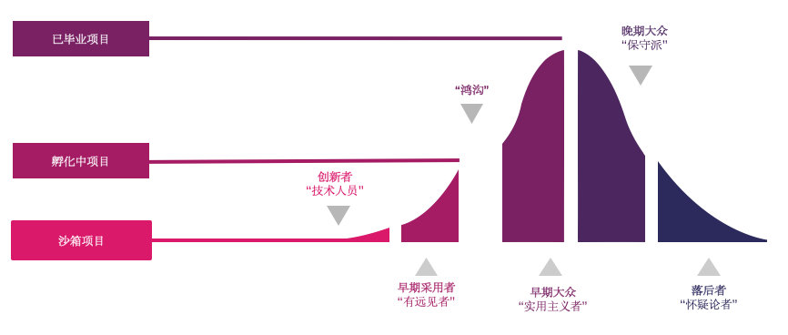
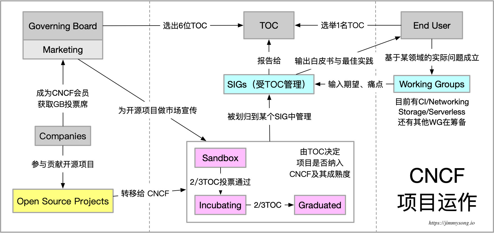

## CNCF中的项目治理

CNCF 根据“[鸿沟理论](https://www.jianshu.com/p/a305fa93580b)”将其托管的项目分成三个成熟阶段，并设置了项目晋级到更高阶段的标准。

> “[鸿沟理论](https://www.jianshu.com/p/a305fa93580b)”是由Geoffrey A. Moore提出的高科技产品的市场营销理论。新技术要想跨越鸿沟，必须能够实现一些跨越式的发展，**拥有某一些以前不可能实现的功能**，具有某种内在价值并能够**赢得非技术人员的**青睐。

目前处于沙箱、孵化中、已毕业项目的数量比例为5：16：13，详见 <https://cncf.io/projects>。其中沙箱（sandbox）项目因为其处于早期阶段并没有直接在上面的链接页面中列出，而是一个单独的 [Sandbox](https://www.cncf.io/sandbox-projects/) 页面，因为 CNCF 为 sandbox 阶段的项目会谨慎背书。

## 纳入CNCF开源版图的项目需要符合其对云原生的定义

CNCF 中托管的开源项目要符合云原生定义：

- 云原生技术有利于各组织在公有云、私有云和混合云等新型动态环境中，构建和运行可弹性扩展的应用。**云原生的代表技术包括容器、服务网格、微服务、不可变基础设施和声明式API**。
- 这些技术能够构建容错性好、易于管理和便于观察的松耦合系统。结合可靠的自动化手段，云原生技术使工程师能够轻松地对系统作出频繁和可预测的重大变更。
- 云原生计算基金会（CNCF）致力于培育和维护一个厂商中立的开源生态系统，来推广云原生技术。我们通过将最前沿的模式民主化，让这些创新为大众所用。

## 项目运作流程

下图演示了开源项目加入 CNCF 后的整个运作流程。

## 开源项目如何加入 CNCF

1. 开源项目所支持的公司成为 CNCF 会员
2. 开源项目满足 CNCF 的要求（见后文）
3. 在 GitHub 上提交[proposal](https://github.com/cncf/toc/issues/113)（GitHub Issue）列举项目介绍、现状、目标、license、用户与社区等
4. 由 Chris Aniszczyk 安排该项目在某个TOC双月会议上介绍给 TOC 成员
5. 1.TOC 会将开源项目指定到某个 [SIG](cncf-sig.md) 中
6. 项目获得两个TOC成员的赞成可进入[sandbox](https://github.com/cncf/toc/blob/master/process/sandbox.md)（也可以直接获得2/3多数TOC 投票进入Incubating状态）
7. 知识产权转移给 CNCF
8. CNCF 安排博客撰写、PR等
9. 每年一次评审，晋升到 incubating需要2/3的 TOC 成员投票赞成；至少3家用户成功在生产上使用；通过TOC的尽职调查；贡献者数量健康稳定
10. Sandbox 中的项目没有时效性质，可能永远都无法进入incubating 状态，被CNCF谨慎宣传

## CNCF 开源项目成熟度演进

CNCF 的开源项目遵循如下图所示的成熟度演进。

- 加入Sandbox只需要2个TOC成员赞成
- 成熟一点的项目可以直接进入incubating阶段，但是 CNCF 会控制不同阶段的项目比例
- 晋级到Incubating或Graduated 需要至少2/3的 TOC成员（6名或以上）投票赞成
- 每年将评审一次

## 开源项目加入 CNCF 的最低要求（Sandbox）

一个开源项目要想加入 CNCF 必须满足以下要求：

- 项目名称必须在 CNCF 中唯一

- 项目描述（用途、价值、起源、历史）

- 与 CNCF 章程一致的声明

- 来自 TOC 的 sponsor（项目辅导）

- license（默认为 Apache 2）

- 源码控制（Github）

- 网站（英文）

- 外部依赖（包括 license）

- 成熟度模型评估（参考 [开源项目加入CNCF Sandbox的要求](cncf-sandbox-criteria.md)）
- 创始 committer（贡献项目的时长）
- 基础设施需求（CI/CNCF集群）
- 沟通渠道（slack、irc、邮件列表）
- issue 追踪（GitHub）
- 发布方法和机制
- 社交媒体账号
- 社区规模和已有的赞助商
-  svg 格式的项目 logo

## 由 Sandbox 升级到 Incubating 的要求

- 通过 TOC 的[尽职调查](https://github.com/cncf/toc/blob/master/process/due-diligence-guidelines.md)
- 至少有 3 个独立的终端用户在在生产上使用该项目：一般在项目的官网列举实际用户
- 足够健康数量的贡献者：项目的 GitHub 上有明确的 committer 权限划分、职责说明及成员列表，TOC 将根据项目大小来确认多少committer才算健康
- **展示项目在持续进行、良好的发布节奏、贡献频率十分重要**

## 由Incubating升级到Graduated的要求

- 满足 Sandbox 和 Incubating 的所有要求
- **至少有来自两个组织的贡献者**
- 明确定义的项目治理及 committer 身份、权限管理
- 接受 CNCF 的[行为准则](https://github.com/cncf/foundation/blob/master/code-of-conduct.md)，参考[Prometheus](https://bestpractices.coreinfrastructure.org/en/projects/486)
- 获得CII 最佳实践徽章
- 在项目主库或项目官网有公开的采用者的 logo

参考归档的 Review：https://github.com/cncf/toc/tree/master/reviews

## 参考

- [鸿沟理论 - jianshu.com](https://www.jianshu.com/p/a305fa93580b)
- [CNCF Graduation Criteria v1.2 - github.com](https://github.com/cncf/toc/blob/master/process/graduation_criteria.adoc)

