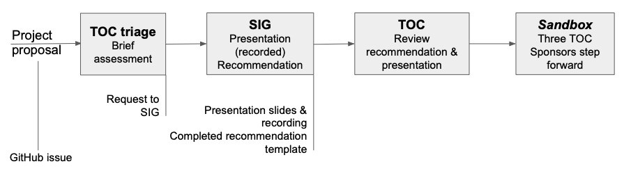

## 开源项目加入CNCF Sandbox的要求

[CNCF Project Proposal Process](https://github.com/cncf/toc/blob/master/process/project_proposals.adoc) 中指出开源项目要想加入 CNCF 必须满足以下条件：

1. 项目名称必须在 CNCF 中唯一
2. 项目描述（用途、价值、起源、历史）
3. 与 CNCF 章程一致的声明
4. 来自 TOC 的 sponsor（项目辅导）
5. 成熟度模型评估（参考 [CNCF Graduation Criteria](https://github.com/cncf/toc/blob/master/process/project_proposals.adoc)）
6. license（默认为 Apache 2）
7. 源码控制（Github）
8. 外部依赖（包括 license）
9. 创始 committer（贡献项目的时长）
10. 基础设施需求（CI/CNCF集群）
11. 沟通渠道（slack、irc、邮件列表）
12. issue 追踪（GitHub）
13. 网站
14. 发布方法和机制
15. 社交媒体账号
16. 社区规模和已有的赞助商
17. 用户、使用规模、是否用在生产环境，要有证据说明
18. svg 格式的项目 logo

### 项目接纳过程

整个流程比较复杂，持续时间也不比较久，如 CNCF 提供的这张图所示。

大体流程如下：

1. 通过 [GitHub Issue](https://github.com/cncf/toc/issues) 提交 proposal
1. TOC 确认项目分类，归类到一个 [CNCF SIG](https://github.com/cncf/toc/blob/master/sigs/cncf-sigs.md) 中（两周）
1. SIG 评估（1到 2 个月）
1. TOC review
1. TOC 拉票，至少 3 票（2 个月）
1. 治理和法律问题（CNCF 来处理）

## 参考

- [CNCF Project Proposal Process - github.com](https://github.com/cncf/toc/blob/master/process/project_proposals.adoc)
