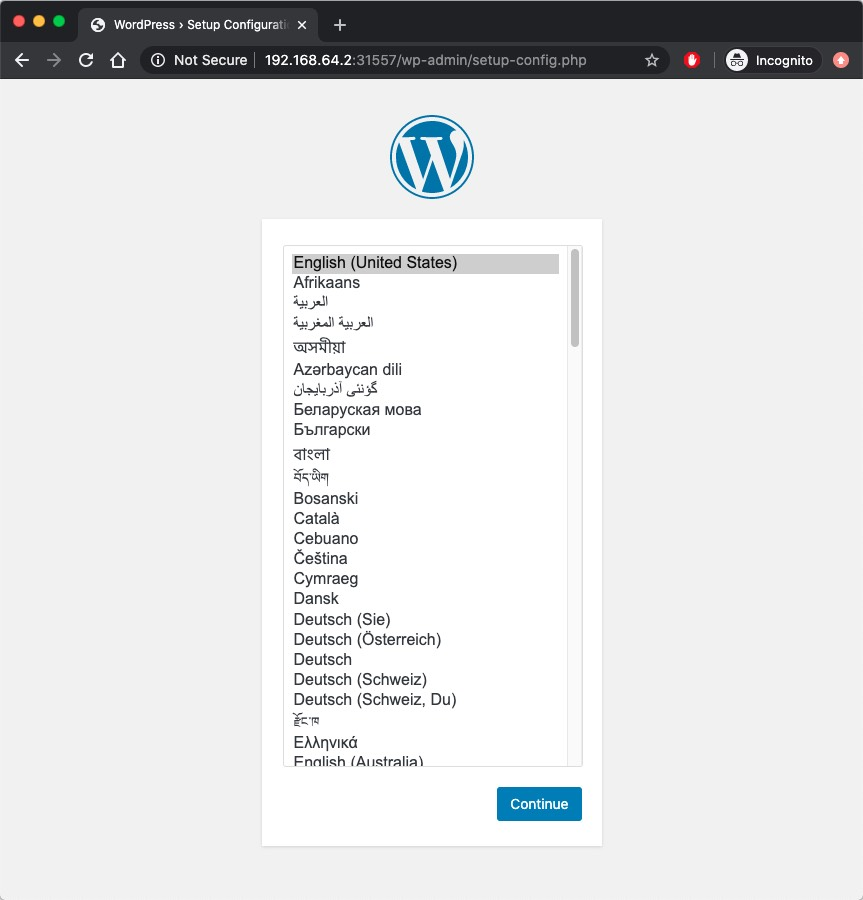

# Crossplane

本文主要为读者介绍 Crossplane 是什么及如何结合 OAM 来管理 Kubernetes 应用。

## Crossplane 是什么？

[Crossplane](https://crossplane.io/) 是一个开源的 Kubernetes 插件，可以使用 kubectl 配置和管理基础设施、服务和应用。它的意义在使用 Kubernetes 风格的 API 统一了云基础设施和应用程序的管理。

该项目是由 [Upbound](https://upbound.io/) 公司和 [Rook](https://rook.io) 项目的创始人于 2018 年 12 月发起，开源社区主要参与者来自微软、阿里巴巴、Gitlab、红帽等。

## Crossplane 的特性

下面几点是 Crossplane 的基本特性。

**支持自定义 API（CRD）**

在 Crossplane 提供的 CRD 之上构建自己的内部基础设施抽象。您的自定义 API 可以包含策略保护，隐藏基础设施的复杂性，并使其安全地供应用程序消费。

**支持 OAM**

Crossplane 实现了 [OAM（开放应用模型）](./oam.md)，帮助统一应用和基础架构管理，以团队为中心的流程。通过 Crossplane 和 OAM，应用和基础架构配置可以共存，并使用相同的工具进行部署。

**支持混合云**

无论你使用的是 EKS、AKS、GKE、ACK、PKS 中的单个 Kubernetes 集群，还是 Rancher 或 Anthos 这样的多集群管理器，Crossplane 都能很好地与它们集成。Crossplane 安装到任何现有的集群中，暴露出 CRD 和跨基础设施和服务提供商的标准 API，使供应和管理变得轻而易举。

## 准备条件

在安装使用 Crossplane 之前需要确保您的系统满足以下要求：

- Kubernetes v1.16+
- Helm 3
- [Crossplane](https://github.com/crossplane/crossplane) v0.11+

## 安装 Crossplane

在准备好以上条件之后，执行下面的命令安装 Crossplane。

```bash
kubectl create namespace crossplane-system
helm repo add crossplane-alpha https://charts.crossplane.io/alpha
helm install crossplane --namespace crossplane-system crossplane-alpha/crossplane
```

该步骤会创建一个 `crossplane-system` 的 namespace 和如下的 CRD。

```ini
# OAM 的 CRD
applicationconfigurations.core.oam.dev
components.core.oam.dev
containerizedworkloads.core.oam.dev
manualscalertraits.core.oam.dev
scopedefinitions.core.oam.dev
traitdefinitions.core.oam.dev
workloaddefinitions.core.oam.dev
buckets.storage.crossplane.io

# crossplane 原生的 CRD
clusterpackageinstalls.packages.crossplane.io
compositions.apiextensions.crossplane.io
infrastructuredefinitions.apiextensions.crossplane.io
infrastructurepublications.apiextensions.crossplane.io
kubernetesapplicationresources.workload.crossplane.io
kubernetesapplications.workload.crossplane.io
kubernetesclusters.compute.crossplane.io
kubernetestargets.workload.crossplane.io
machineinstances.compute.crossplane.io
mysqlinstances.database.crossplane.io
nosqlinstances.database.crossplane.io
packageinstalls.packages.crossplane.io
packages.packages.crossplane.io
postgresqlinstances.database.crossplane.io
providers.kubernetes.crossplane.io
redisclusters.cache.crossplane.io
stackdefinitions.packages.crossplane.io
```

安装 OAM controller。

```bash
kubectl create namespace oam-system
helm install controller -n oam-system ./manifests/charts/oam-core-resources/ 
```

## 部署示例

部署一个 WordPress 示例应用。

```bash
kubectl apply -f manifests/oam/containerized-workload
```

该应用采用 [OAM 规范定义](./oam.md)，包括 Workload、Component、Trait 和 ApplicationConfiguration，感兴趣的读者可以到 [manifests/oam/containerized-workload](https://github.com/rootsongjc/kubernetes-handbook/tree/master/manifests/oam/containerized-workload) 目录下查看，其中 `sample_workload_definition.yaml` 文件的内容如下：

```yaml
apiVersion: core.oam.dev/v1alpha2
kind: WorkloadDefinition
metadata:
  name: containerizedworkloads.core.oam.dev
spec:
  definitionRef:
    name: containerizedworkloads.core.oam.dev
  childResourceKinds:
    - apiVersion: apps/v1
      kind: Deployment
    - apiVersion: v1
      kind: Service
```

此处定义了一个 `containerizedworkloads.core.oam.dev` Workload，其中添加一个 `childResourceKinds` 字段。目前，`workloadDefinition` 不过是真正的 CRD 的一个注册器。Workload 所有者在向 OAM 系统注册控制器时填写这个字段，声明其工作负载控制器实际生成的 Kubernetes 资源类型。在本示例中该 Workload 生成的是 Kubernetes 的 Deployment 和 Service。

关于此处配置的详细原理请参考 [Traits and workloads interaction mechanism in OAM](https://github.com/crossplane/oam-kubernetes-runtime/blob/master/design/one-pager-trait-workload-interaction-mechanism.md)。

## 验证

在部署了上面的示例后，会创建一个名为 `example-appconfig-workload` 的 Deployment 和名为 `example-appconfig-workload` 的 Service。

```bash
$ kubectl get deployment
NAME                            READY   UP-TO-DATE   AVAILABLE   AGE
example-appconfig-workload      3/3     3            3           9h

$ kubectl get svc
NAME                         TYPE       CLUSTER-IP     EXTERNAL-IP   PORT(S)        AGE
example-appconfig-workload   NodePort   10.99.30.250   <none>        80:31557/TCP   9h
```

查看该 Service 的 NodePort（本示例中为 31557） 及 minikube 的 IP 地址（本示例中为 `192.168.64.2`）。在浏览器中访问 `http://192.168.64.2:31557` 即可看到 Workpress 的启动页面。



## 参考

- [crossplane/addon-oam-kubernetes-local - github.com](https://github.com/crossplane/addon-oam-kubernetes-local)
- [Traits and workloads interaction mechanism in OAM - github.com](https://github.com/crossplane/oam-kubernetes-runtime/blob/master/design/one-pager-trait-workload-interaction-mechanism.md)
- [Crossplane CNCF Sandbox - docs.google.com](https://docs.google.com/presentation/d/1HEQtVMwQxrpkQg2UWUNi0RPdjmJ6TaZLr50Cr_anNeQ/edit#slide=id.g8801599ecb_0_72)