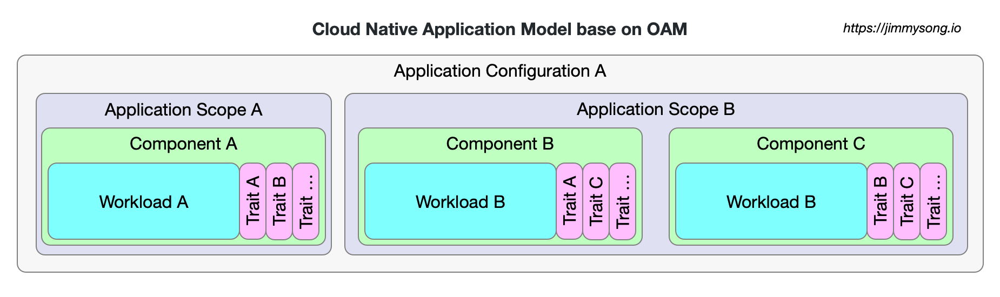

# 定义云原生应用

本文参考的是 [OAM 规范](https://github.com/oam-dev/spec)中对云原生应用的定义，并做出了引申。

云原生应用是一个相互关联但又不独立的组件（service、task、worker）的集合，这些组件与配置结合在一起并在适当的运行时实例化后，共同完成统一的功能目的。

## 云原生应用模型

下图是 OAM 定义的云原生应用模型示意图，为了便于理解，图中相同颜色的部分为同一类别的对象定义。

OAM 的规范中定义了以下对象，它们既是 OAM 规范中的基本术语也是云原生应用的基本组成。

- **[Workload](./workload.md)（工作负载）**：应用程序的工作负载类型，由平台提供。
- **[Component](./component.md)（组件）**：定义了一个 `Workload` 的实例，并以基础设施中立的术语声明其运维特性。
- **[Trait](./trait.md)（特征）**：用于将运维特性分配给组件实例。
- **[ApplicationScope](./application-scope.md)（应用作用域）**：用于将组件分组成具有共同特性的松散耦合的应用。
- **[ApplicationConfiguration](./application-configuration.md)（应用配置）**：描述 `Component` 的部署、`Trait` 和 `ApplicationScope`。

OAM 规范中提供了一个使用以上对象定义云原生应用的[工作流示例](https://github.com/oam-dev/spec/blob/master/examples/workflow.md)。

## 关注点分离

下图是不同角色对于该模型的关注点示意图。

我们可以看到对于一个云原生应用来说，不同的对象是由不同的角色来负责的：

- 基础设施运维：提供不同的 `Workload` 类型供开发者使用；
- 应用运维：定义适用于不同 `Workload` 的运维属性 `Trait` 和管理 `Component` 的 `ApplicationScope` 即作用域；
- 应用开发者：负责应用组件 `Component` 的定义；
- 应用开发者和运维：共同将 `Component` 与运维属性 `Trait` 绑定在一起，维护应用程序的生命周期；

基于 OAM 中的对象定义的云原生应用可以充分利用平台能力自由组合，开发者和运维人员的职责可以得到有效分离，组件的复用性得到大幅提高。

## 定义标准

CNCF 中的有几个定义标准的「开源项目」，其中有的项目都已经毕业。

- [SMI（Service Mesh Interface）](https://github.com/servicemeshinterface/smi-spec)：服务网格接口
- [Cloud Events](https://github.com/cloudevents/spec)：Serverless 中的事件标准
- [TUF](https://github.com/theupdateframework/specification)：更新框架标准
- [SPIFFE](https://github.com/spiffe/spiffe)：身份安全标准

这其中唯独没有应用定义标准，[CNCF SIG App delivery](https://github.com/cncf/sig-app-delivery) 即是要做这个的。当然既然要指定标准，自然要对不同平台和场景的逻辑做出更高级别的抽象（这也意味着你在掌握了底层逻辑的情况下还要学习更多的概念），这样才能屏蔽底层差异。

## 参考

- [The Open Application Model specification - github.com](https://github.com/oam-dev/spec)