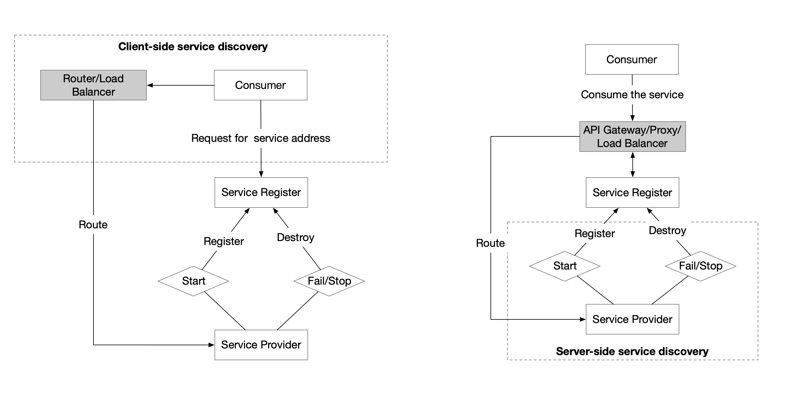

# 云原生应用之路——从Kubernetes到Cloud Native

**从Kubernetes到Cloud Native——云原生应用之路**，这是我最近在 [ArchSummit2017北京站](http://bj2017.archsummit.com/presentation/306) 和 [数人云&TalkingData合办的Service Mesh is coming meetup](https://www.kubernetes.org.cn/3211.html) 中分享的话题。

本文简要介绍了容器技术发展的路径，为何Kubernetes的出现是容器技术发展到这一步的必然选择，而为何Kubernetes又将成为云原生应用的基石。

我的分享按照这样的主线展开：容器->Kubernetes->微服务->Cloud Native（云原生）->Service Mesh（服务网格）->使用场景->Open Source（开源）。

## 容器

> 容器——Cloud Native的基石

容器最初是通过开发者工具而流行，可以使用它来做隔离的开发测试环境和持续集成环境，这些都是因为容器轻量级，易于配置和使用带来的优势，docker和docker-compose这样的工具极大的方便的了应用开发环境的搭建，开发者就像是化学家一样在其中小心翼翼的进行各种调试和开发。

随着容器的在开发者中的普及，已经大家对CI流程的熟悉，容器周边的各种工具蓬勃发展，俨然形成了一个小生态，在2016年达到顶峰，下面这张是我画的容器生态图：


该生态涵盖了容器应用中从镜像仓库、服务编排、安全管理、持续集成与发布、存储和网络管理等各个方面，随着在单主机中运行容器的成熟，集群管理和容器编排成为容器技术亟待解决的问题。譬如化学家在实验室中研究出来的新产品，如何推向市场，进行大规模生产，成了新的议题。

## 为什么使用Kubernetes

> Kubernetes——让容器应用进入大规模工业生产。

**Kubernetes是容器编排系统的事实标准**

在单机上运行容器，无法发挥它的最大效能，只有形成集群，才能最大程度发挥容器的良好隔离、资源分配与编排管理的优势，而对于容器的编排管理，Swarm、Mesos和Kubernetes的大战已经基本宣告结束，Kubernetes成为了无可争议的赢家。

下面这张图是Kubernetes的架构图（图片来自网络），其中显示了组件之间交互的接口CNI、CRI、OCI等，这些将Kubernetes与某款具体产品解耦，给用户最大的定制程度，使得Kubernetes有机会成为跨云的真正的云原生应用的操作系统。


随着Kubernetes的日趋成熟，“Kubernetes is becoming boring”，基于该“操作系统”之上构建的适用于不同场景的应用将成为新的发展方向，就像我们将石油开采出来后，提炼出汽油、柴油、沥青等等，所有的材料都将找到自己的用途，Kubernetes也是，毕竟我们谁也不是为了部署和管理容器而用Kubernetes，承载其上的应用才是价值之所在。

**云原生的核心目标**


云已经可以为我们提供稳定可以唾手可得的基础设施，但是业务上云成了一个难题，Kubernetes的出现与其说是从最初的容器编排解决方案，倒不如说是为了解决应用上云（即云原生应用）这个难题。

包括微服务和FaaS/Serverless架构，都可以作为云原生应用的架构。


但就2017年为止，Kubernetes的主要使用场景也主要作为应用开发测试环境、CI/CD和运行Web应用这几个领域，如下图[TheNewStack](http://thenewstack.io)的Kubernetes生态状况调查报告所示。


另外基于Kubernetes的构建PaaS平台和Serverless也处于爆发的准备的阶段，如下图中Gartner的报告中所示：


当前各大公有云如Google GKE、微软Azure ACS、亚马逊EKS（2018年上线）、VMWare、Pivotal、腾讯云、阿里云等都提供了Kubernetes服务。

## 微服务

> 微服务——Cloud Native的应用架构。

下图是[Bilgin Ibryam](https://developers.redhat.com/blog/author/bibryam/)给出的微服务中应该关心的主题，图片来自[RedHat Developers](https://developers.redhat.com/blog/2016/12/09/spring-cloud-for-microservices-compared-to-kubernetes/)。


微服务带给我们很多开发和部署上的灵活性和技术多样性，但是也增加了服务调用的开销、分布式系统管理、调试与服务治理方面的难题。

当前最成熟最完整的微服务框架可以说非[Spring](https://spring.io/)莫属，而Spring又仅限于Java语言开发，其架构本身又跟Kubernetes存在很多重合的部分，如何探索将Kubernetes作为微服务架构平台就成为一个热点话题。

就拿微服务中最基础的**服务注册发现**功能来说，其方式分为**客户端服务发现**和**服务端服务发现**两种，Java应用中常用的方式是使用Eureka和Ribbon做服务注册发现和负载均衡，这属于客户端服务发现，而在Kubernetes中则可以使用DNS、Service和Ingress来实现，不需要修改应用代码，直接从网络层面来实现。



## Cloud Native

> DevOps——通向云原生的云梯

CNCF（云原生计算基金会）给出了云原生应用的三大特征：

- **容器化包装**：软件应用的进程应该包装在容器中独立运行。
- **动态管理**：通过集中式的编排调度系统来动态的管理和调度。
- **微服务化**：明确服务间的依赖，互相解耦。

下图是我整理的关于云原生所需要的能力和特征。


[CNCF](https://cncf.io)所托管的应用（目前已达12个），即朝着这个目标发展，其公布的[Cloud Native Landscape](https://github.com/cncf/landscape)，给出了云原生生态的参考体系。


**使用Kubernetes构建云原生应用**

我们都是知道Heroku推出了适用于PaaS的[12 factor app](https://12factor.net/)的规范，包括如下要素：

1. 基准代码
2. 依赖管理
3. 配置
4. 后端服务
5. 构建，发布，运行
6. 无状态进程
7. 端口绑定
8. 并发
9. 易处理
10. 开发环境与线上环境等价
11. 日志作为事件流
12. 管理进程

另外还有补充的三点：

- API声明管理
- 认证和授权
- 监控与告警

如果落实的具体的工具，请看下图，使用Kubernetes构建云原生架构：


结合这12因素对开发或者改造后的应用适合部署到Kubernetes之上，基本流程如下图所示：


**迁移到云架构**

迁移到云端架构，相对单体架构来说会带来很多挑战。比如自动的持续集成与发布、服务监控的变革、服务暴露、权限的管控等。这些具体细节请参考**Kubernetes-handbook**中的说明：<https://jimmysong.io/kubernetes-handbook>，在此就不细节展开，另外推荐一本我翻译的由Pivotal出品的电子书——[Migrating to Cloud Native Application Architectures](https://content.pivotal.io/ebooks/migrating-to-cloud-native-application-architectures)，地址：<https://jimmysong.io/migrating-to-cloud-native-application-architectures/>。

## Service Mesh

> Services for show, meshes for a pro.

Kubernetes中的应用将作为微服务运行，但是Kubernetes本身并没有给出微服务治理的解决方案，比如服务的限流、熔断、良好的灰度发布支持等。

**Service Mesh可以用来做什么**

- Traffic Management：API网关
- Observability：服务调用和性能分析
- Policy Enforcment：控制服务访问策略
- Service Identity and Security：安全保护

**Service Mesh的特点**

- 专用的基础设施层
- 轻量级高性能网络代理
- 提供安全的、快速的、可靠地服务间通讯
- 扩展kubernetes的应用负载均衡机制，实现灰度发布
- 完全解耦于应用，应用可以无感知，加速应用的微服务和云原生转型

使用Service Mesh将可以有效的治理Kubernetes中运行的服务，当前开源的Service Mesh有：

- Linkderd：<https://linkerd.io>，由最早提出Service Mesh的公司[Buoyant](https://buoyant.io)开源，创始人来自Twitter
- Envoy：<https://www.envoyproxy.io/>，Lyft开源的，可以在Istio中使用Sidecar模式运行
- Istio：<https://istio.io>，由Google、IBM、Lyft联合开发并开源
- Conduit：<https://conduit.io>，同样由Buoyant开源的轻量级的基于Kubernetes的Service Mesh

此外还有很多其它的Service Mesh鱼贯而出，请参考[awesome-cloud-native](https://jimmysong.io/awesome-cloud-native)。

**Istio VS Linkerd**

Linkerd和Istio是最早开源的Service Mesh，它们都支持Kubernetes，下面是它们之间的一些特性对比。

| **Feature** | **Istio**     | **Linkerd**                  |
| ----------- | ------------- | ---------------------------- |
| 部署架构        | Envoy/Sidecar | DaemonSets                   |
| 易用性         | 复杂            | 简单                           |
| 支持平台        | Kubernetes    | Kubernetes/Mesos/Istio/Local |
| 当前版本        | 0.8         | 1.4.3                        |
| 是否已有生产部署    | 否             | 是                            |

关于两者的架构可以参考各自的官方文档，我只从其在Kubernetes上的部署结构来说明其区别。


Istio的组件复杂，可以分别部署在Kubernetes集群中，但是作为核心路由组件**Envoy**是以**Sidecar**形式与应用运行在同一个Pod中的，所有进入该Pod中的流量都需要先经过Envoy。

Linker的部署十分简单，本身就是一个镜像，使用Kubernetes的[DaemonSet](https://jimmysong.io/kubernetes-handbook/concepts/daemonset.html)方式在每个node节点上运行。

更多信息请参考[kubernetes-handbook](https://jimmysong.io/kubernetes-handbook)。

## 使用场景

> Cloud Native的大规模工业生产

**GitOps**

给开发者带来最大的配置和上线的灵活性，践行DevOps流程，改善研发效率，下图这样的情况将更少发生。


我们知道Kubernetes中的所有应用的部署都是基于YAML文件的，这实际上就是一种**Infrastructure as code**，完全可以通过Git来管控基础设施和部署环境的变更。

**Big Data**

Spark现在已经非官方支持了基于Kubernetes的原生调度，其具有以下特点：

- Kubernetes原生调度：与yarn、mesos同级
- 资源隔离，粒度更细：以namespace来划分用户
- 监控的变革：单次任务资源计量
- 日志的变革：pod的日志收集

| **Feature**   | **Yarn**         | **Kubernetes** |
| ------------- | ---------------- | -------------- |
| queue         | queue            | namespace      |
| instance      | ExcutorContainer | Executor Pod   |
| network       | host             | plugin         |
| heterogeneous | no               | yes            |
| security      | RBAC             | ACL            |

下图是在Kubernetes上运行三种调度方式的spark的单个节点的应用部分对比：


从上图中可以看到在Kubernetes上使用YARN调度、standalone调度和Kubernetes原生调度的方式，每个node节点上的Pod内的Spark Executor分布，毫无疑问，使用Kubernetes原生调度的Spark任务才是最节省资源的。

提交任务的语句看起来会像是这样的：

```bash
./spark-submit \
  --deploy-mode cluster \
  --class com.talkingdata.alluxio.hadooptest \
  --master k8s://https://172.20.0.113:6443 \
  --kubernetes-namespace spark-cluster \
  --conf spark.kubernetes.driverEnv.SPARK_USER=hadoop \
  --conf spark.kubernetes.driverEnv.HADOOP_USER_NAME=hadoop \
  --conf spark.executorEnv.HADOOP_USER_NAME=hadoop \
  --conf spark.executorEnv.SPARK_USER=hadoop \
  --conf spark.kubernetes.authenticate.driver.serviceAccountName=spark \
  --conf spark.driver.memory=100G \
  --conf spark.executor.memory=10G \
  --conf spark.driver.cores=30 \
  --conf spark.executor.cores=2 \
  --conf spark.driver.maxResultSize=10240m \
  --conf spark.kubernetes.driver.limit.cores=32 \
  --conf spark.kubernetes.executor.limit.cores=3 \
  --conf spark.kubernetes.executor.memoryOverhead=2g \
  --conf spark.executor.instances=5 \
  --conf spark.app.name=spark-pi \
  --conf spark.kubernetes.driver.docker.image=spark-driver:v2.1.0-kubernetes-0.3.1-1 \
  --conf spark.kubernetes.executor.docker.image=spark-executor:v2.1.0-kubernetes-0.3.1-1 \
  --conf spark.kubernetes.initcontainer.docker.image=spark-init:v2.1.0-kubernetes-0.3.1-1 \
  --conf spark.kubernetes.resourceStagingServer.uri=http://172.20.0.114:31000 \
~/Downloads/tendcloud_2.10-1.0.jar
```

关于支持Kubernetes原生调度的Spark请参考：https://jimmysong.io/spark-on-k8s/

## Open Source

> Contributing is Not only about code, it is about helping a community.

下图是我们刚调研准备使用Kubernetes时候的调研方案选择。


对于一个初次接触Kubernetes的人来说，看到这样一个庞大的架构选型时会望而生畏，但是Kubernetes的开源社区帮助了我们很多。


我组建了**K8S&Cloud Native实战**、**ServiceMesher**微信群，参与了k8smeetup、KEUC2017、[kubernetes-docs-cn](https://github.com/kubernetes/kubernetes-docs-cn) Kubernetes官方中文文档项目。

**有用的资料和链接**

- 我的博客： <https://jimmysong.io>
- 微信群：k8s&cloud native实战群、ServiceMesher（见：<https://jimmysong.io/about>）
- Meetup：k8smeetup、[ServiceMesher](http://www.servicemesher.com)
- Cloud Native Go - 基于Go和React云原生Web应用开发：https://jimmysong.io/cloud-native-go
- Gitbook：<https://jimmysong.io/kubernetes-handbook>
- Cloud native开源生态：<https://jimmysong.io/awesome-cloud-native/>
- 资料分享整理：<https://github.com/rootsongjc/cloud-native-slides-share>
- 迁移到云原生架构：<https://jimmysong.io/migrating-to-cloud-native-application-architectures/>
- KubeCon + CloudNativeCon 2018年11月14-15日 上海
