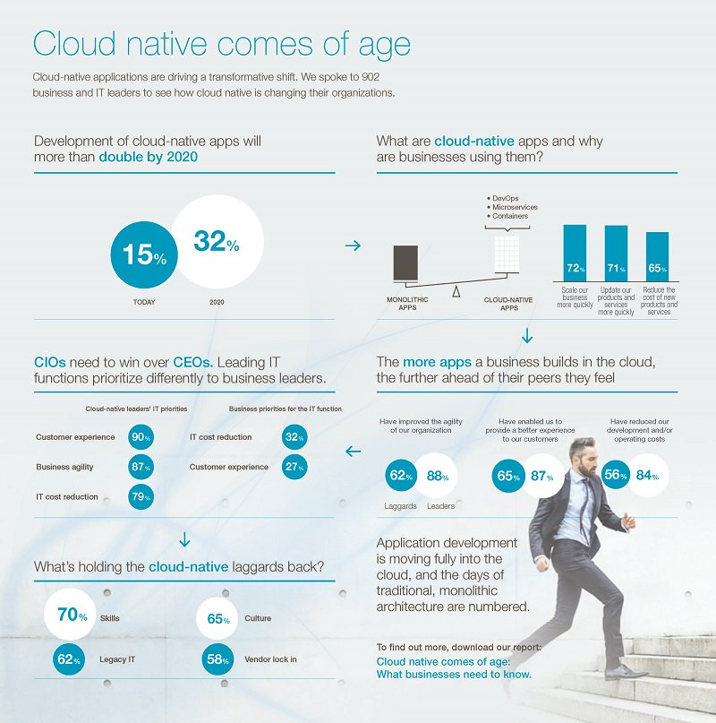

# Kubernetes与云原生应用概览

几个月前Mesos已经宣布支持Kubernetes，而在2017年10月份的DockerCon EU上，Docker公司宣布官方同时支持Swarm和Kubernetes容器编排，Kubernetes已然成为容器编排调度的标准。

作为全书的开头，首先从历史、生态和应用角度介绍一下Kubernetes与云原生应用，深入浅出，高屋建瓴，没有深入到具体细节，主要是为了给初次接触Kubernetes的小白扫盲，具体细节请参考链接。

## 从云计算到微服务再到云原生计算

下面将从云计算的发展历程引入云原生计算，请先看下图：


云原生应用到2020年将比目前至少翻一番，下图是Marc Wilczek的调查报告。



### 云计算介绍

云计算包含的内容十分繁杂，也有很多技术和公司牵强附会说自己是云计算公司，说自己是做云的，实际上可能风马牛不相及。说白了，云计算就是一种配置资源的方式，根据资源配置方式的不同我们可以把云计算从宏观上分为以下三种类型：

* IaaS：这是为了想要建立自己的商业模式并进行自定义的客户，例如亚马逊的EC2、S3存储、Rackspace虚拟机等都是IaaS。
* PaaS：工具和服务的集合，对于想用它来构建自己的应用程序或者想快速得将应用程序部署到生产环境而不必关心底层硬件的用户和开发者来说是特别有用的，比如Cloud Foundry、Google App Engine、Heroku等。
* SaaS：终端用户可以直接使用的应用程序。这个就太多，我们生活中用到的很多软件都是SaaS服务，只要基于互联网来提供的服务基本都是SaaS服务，有的服务是免费的，比如Google Docs，还有更多的是根据我们购买的Plan和使用量付费，比如GitHub、各种云存储。

### 微服务介绍

微服务（Microservices）这个词比较新颖，但是其实这种架构设计理念早就有了。微服务是一种分布式架构设计理念，为了推动细粒度服务的使用，这些服务要能协同工作，每个服务都有自己的生命周期。一个微服务就是一个独立的实体，可以独立的部署在PAAS平台上，也可以作为一个独立的进程在主机中运行。服务之间通过API访问，修改一个服务不会影响其它服务。

要想了解微服务的详细内容推荐阅读《微服务设计》（Sam Newman著），我写过这本书的读书笔记 - [微服务设计读书笔记](https://jimmysong.io/posts/microservice-reading-notes/)。

下文中会谈到Kubernetes与微服务的关系，其中Kubernetes的service天生就适合于微服务。

### 云原生概念介绍

下面是Cloud Native概念思维导图


云原生准确来说是一种文化，更是一种潮流，它是云计算的一个必然导向。它的意义在于让云成为云化战略成功的基石，而不是阻碍，如果业务应用上云之后开发和运维人员比原先还痛苦，成本还高的话，这样的云我们宁愿不上。

自从云的概念开始普及，许多公司都部署了实施云化的策略，纷纷搭建起云平台，希望完成传统应用到云端的迁移。但是这个过程中会遇到一些技术难题，上云以后，效率并没有变得更高，故障也没有迅速定位。

为了解决传统应用升级缓慢、架构臃肿、不能快速迭代、故障不能快速定位、问题无法快速解决等问题，云原生这一概念横空出世。云原生可以改进应用开发的效率，改变企业的组织结构，甚至会在文化层面上直接影响一个公司的决策。

另外，云原生也很好地解释了云上运行的应用应该具备什么样的架构特性——敏捷性、可扩展性、故障可恢复性。

综上所述，云原生应用应该具备以下几个关键词：

* 敏捷
* 可靠
* 高弹性
* 易扩展
* 故障隔离保护
* 不中断业务持续更新

以上特性也是云原生区别于传统云应用的优势特点。

从宏观概念上讲，云原生是不同思想的集合，集目前各种热门技术之大成，具体包括如下图所示的几个部分。

## Kubernetes与云原生的关系

Kuberentes可以说是乘着Docker和微服务的东风，一经推出便迅速蹿红，它的很多设计思想都契合了微服务和云原生应用的设计法则，这其中最著名的就是开发了[Heroku](https://www.heroku.com) PaaS平台的工程师们总结的 [Twelve-factor App](https://12factor.net/)了。

下面我将讲解Kubernetes设计时是如何按照了十二因素应用法则，并给出Kubernetes中的应用示例，并附上一句话简短的介绍。

### Kubernetes介绍

[Kubernetes](http://kubernetes.io)是Google基于[Borg](https://research.google.com/pubs/pub43438.html)开源的容器编排调度引擎，作为[CNCF](http://cncf.io)（Cloud Native Computing Foundation）最重要的组件之一，它的目标不仅仅是一个编排系统，而是提供一个规范，可以让你来描述集群的架构，定义服务的最终状态，Kubernetes可以帮你将系统自动得达到和维持在这个状态。

更直白的说，Kubernetes用户可以通过编写一个yaml或者json格式的配置文件，也可以通过工具/代码生成或直接请求Kubernetes API创建应用，该配置文件中包含了用户想要应用程序保持的状态，不论整个Kubernetes集群中的个别主机发生什么问题，都不会影响应用程序的状态，你还可以通过改变该配置文件或请求Kubernetes API来改变应用程序的状态。

### 12因素应用

12因素应用提出已经有几年的时间了，每个人对其可能都有自己的理解，切不可生搬硬套，也不一定所有云原生应用都必须符合这12条法则，其中有几条法则可能还有点争议，有人对其的解释和看法不同。

大家不要孤立的来看这每一个因素，将其与自己软件开发流程联系起来，这12个因素大致就是按照软件从开发到交付的流程顺序来写的。


**1.基准代码**

每个代码仓库（repo）都生成docker image保存到镜像仓库中，并使用唯一的ID管理，在Jenkins中使用编译时的ID。

**2.依赖**

显式的声明代码中的依赖，使用软件包管理工具声明，比如Go中的Glide。

**3.配置**

将配置与代码分离，应用部署到Kubernetes中可以使用容器的环境变量或ConfigMap挂载到容器中。

**4.后端服务**

把后端服务当作附加资源，实质上是计算存储分离和降低服务耦合，分解单体应用。

**5.构建、发布、运行**

严格分离构建和运行，每次修改代码生成新的镜像，重新发布，不能直接修改运行时的代码和配置。

**6.进程**

应用程序进程应该是无状态的，这意味着再次重启后还可以计算出原先的状态。

**7.端口绑定**

在Kubernetes中每个Pod都有独立的IP，每个运行在Pod中的应用不必关心端口是否重复，只需在service中指定端口，集群内的service通过配置互相发现。

**8.并发**

每个容器都是一个进程，通过增加容器的副本数实现并发。

**9.易处理**

快速启动和优雅终止可最大化健壮性，Kuberentes优秀的[Pod生存周期控制](https://jimmysong.io/posts/pod-lifecycle/)。

**10.开发环境与线上环境等价**

在Kubernetes中可以创建多个namespace，使用相同的镜像可以很方便的复制一套环境出来，镜像的使用可以很方便的部署一个后端服务。

**11.日志**

把日志当作事件流，使用stdout输出并收集汇聚起来，例如到ES中统一查看。

**12.管理进程**

后台管理任务当作一次性进程运行，`kubectl exec`进入容器内部操作。

另外，[Cloud Native Go](https://jimmysong.io/cloud-native-go) 这本书的作者，CapitalOne公司的Kevin Hoffman在TalkingData T11峰会上的[High Level Cloud Native](https://jimmysong.io/posts/high-level-cloud-native-from-kevin-hoffman/)的演讲中讲述了云原生应用的15个因素，在原先的12因素应用的基础上又增加了如下三个因素：

**API优先**

* 服务间的合约
* 团队协作的规约
* 文档化、规范化
* RESTful或RPC

**监控**

* 实时监控远程应用
* 应用性能监控（APM）
* 应用健康监控
* 系统日志
* 不建议在线Debug

**认证授权**

* 不要等最后才去考虑应用的安全性
* 详细设计、明确声明、文档化
* Bearer token、OAuth、OIDC认证
* 操作审计

详见[High Level Cloud Native From Kevin Hoffman](https://jimmysong.io/posts/high-level-cloud-native-from-kevin-hoffman/)。

## Kubernetes中的资源管理与容器设计模式

Kubernetes通过声明式配置，真正让开发人员能够理解应用的状态，并通过同一份配置可以立马启动一个一模一样的环境，大大提高了应用开发和部署的效率，其中Kubernetes设计的多种资源类型可以帮助我们定义应用的运行状态，并使用资源配置来细粒度的明确限制应用的资源使用。

而容器生态的成熟是 Kubernetes 诞生的前提，在谈到容器的设计模式之前我们先来了解下容器生态，请看下图：


关于 Docker 容器的更多内容请参考 [Docker最佳实践](../appendix/docker-best-practice.md)。

### 容器的设计模式

Kubernetes提供了多种资源对象，用户可以根据自己应用的特性加以选择。这些对象有：

| 类别 | 名称 |
| :--- | --- |
| 资源对象 | Pod、ReplicaSet、ReplicationController、Deployment、StatefulSet、DaemonSet、Job、CronJob、HorizontalPodAutoscaler |
| 配置对象 | Node、Namespace、Service、Secret、ConfigMap、Ingress、Label、CustomResourceDefinition、   ServiceAccount |
| 存储对象 | Volume、Persistent Volume |
| 策略对象 | SecurityContext、ResourceQuota、LimitRange |

在 Kubernetes 系统中，_Kubernetes 对象_ 是持久化的条目。Kubernetes 使用这些条目去表示整个集群的状态。特别地，它们描述了如下信息：

* 什么容器化应用在运行（以及在哪个 Node 上）
* 可以被应用使用的资源
* 关于应用如何表现的策略，比如重启策略、升级策略，以及容错策略

Kubernetes 对象是 “目标性记录” —— 一旦创建对象，Kubernetes 系统将持续工作以确保对象存在。通过创建对象，可以有效地告知 Kubernetes 系统，所需要的集群工作负载看起来是什么样子的，这就是 Kubernetes 集群的 **期望状态**。

详见[Kubernetes Handbook - Objects](https://jimmysong.io/kubernetes-handbook/concepts/objects.html)。

### 资源限制与配额

两层的资源限制与配置

* Pod级别，最小的资源调度单位
* Namespace级别，限制资源配额和每个Pod的资源使用区间

请参考[Kubernetes中的ResourceQuota和LimitRange配置资源限额](https://jimmysong.io/posts/kubernetes-resourcequota-limitrange-management/)

## 管理Kubernetes集群

手工部署Kubernetes是一个很艰巨的活，你需要了解网络配置、Docker的安装与使用、镜像仓库的构建、角色证书的创建、Kubernetes的基本原理和构成、Kubernetes应用程序的yaml文件编写等。

我编写了一本[kubernetes-handbook](https://jimmysong.io/kubernetes-handbook/)可供大家免费阅读，该书记录了本人从零开始学习和使用Kubernetes的心路历程，着重于经验分享和总结，同时也会有相关的概念解析，希望能够帮助大家少踩坑，少走弯路。

### 部署Kubernetes集群

使用二进制部署 `kubernetes` 集群的所有组件和插件，而不是使用 `kubeadm` 等自动化方式来部署集群，同时开启了集群的TLS安全认证，这样可以帮助我们解系统各组件的交互原理，进而能快速解决实际问题。详见[在CentOS上部署Kubernetes集群](../practice/install-kubernetes-on-centos.md)。

**集群详情**

* Kubernetes 1.6.0
* Docker 1.12.5（使用yum安装）
* Etcd 3.1.5
* Flanneld 0.7 vxlan 网络
* TLS 认证通信 \(所有组件，如 etcd、kubernetes master 和 node\)
* RBAC 授权
* kubelet TLS BootStrapping
* kubedns、dashboard、heapster\(influxdb、grafana\)、EFK\(elasticsearch、fluentd、kibana\) 集群插件
* 私有Docker镜像仓库[Harbor](https://github.com/vmware/harbor)（请自行部署，Harbor提供离线安装包，直接使用docker-compose启动即可）

**步骤介绍**

1. [创建 TLS 证书和秘钥](../practice/create-tls-and-secret-key.md)
2. [创建kubeconfig文件](../practice/create-kubeconfig.md)
3. [创建高可用etcd集群](../practice/etcd-cluster-installation.md)
4. [安装kubectl命令行工具](../practice/kubectl-installation.md)
5. [部署master节点](../practice/master-installation.md)
6. [安装flannel网络插件](../practice/flannel-installation.md)
7. [部署node节点](../practice/node-installation.md)
8. [安装kubedns插件](../practice/kubedns-addon-installation.md)
9. [安装dashboard插件](../practice/dashboard-addon-installation.md)
10. [安装heapster插件](../practice/heapster-addon-installation.md)
11. [安装EFK插件](../practice/efk-addon-installation.md)

### 服务发现与负载均衡

Kubernetes在设计之初就充分考虑了针对容器的服务发现与负载均衡机制，提供了Service资源，并通过kube-proxy配合cloud provider来适应不同的应用场景。随着Kubernetes用户的激增，用户场景的不断丰富，又产生了一些新的负载均衡机制。目前，Kubernetes中的负载均衡大致可以分为以下几种机制，每种机制都有其特定的应用场景：

* **Service**：直接用Service提供cluster内部的负载均衡，并借助cloud provider提供的LB提供外部访问
* **Ingress**：还是用Service提供cluster内部的负载均衡，但是通过自定义LB提供外部访问
* **Service Load Balancer**：把load balancer直接跑在容器中，实现Bare Metal的Service Load Balancer
* **Custom Load Balancer**：自定义负载均衡，并替代kube-proxy，一般在物理部署Kubernetes时使用，方便接入公司已有的外部服务

详见[Kubernetes Handbook - 服务发现与负载均衡](https://jimmysong.io/kubernetes-handbook/practice/service-discovery-and-loadbalancing.html)。

### 持续集成与发布


应用构建和发布流程说明：

1. 用户向Gitlab提交代码，代码中必须包含`Dockerfile`
2. 将代码提交到远程仓库
3. 用户在发布应用时需要填写git仓库地址和分支、服务类型、服务名称、资源数量、实例个数，确定后触发Jenkins自动构建
4. Jenkins的CI流水线自动编译代码并打包成Docker镜像推送到Harbor镜像仓库
5. Jenkins的CI流水线中包括了自定义脚本，根据我们已准备好的Kubernetes的YAML模板，将其中的变量替换成用户输入的选项
6. 生成应用的Kubernetes YAML配置文件
7. 更新Ingress的配置，根据新部署的应用的名称，在Ingress的配置文件中增加一条路由信息
8. 更新PowerDNS，向其中插入一条DNS记录，IP地址是边缘节点的IP地址。关于边缘节点，请查看[边缘节点配置](https://jimmysong.io/kubernetes-handbook/practice/edge-node-configuration.html)
9. Jenkins调用Kubernetes的API，部署应用

### 日志收集与监控

基于现有的ELK日志收集方案，稍作改造，选用[filebeat](https://www.elastic.co/products/beats/filebeat)来收集日志，可以作为sidecar的形式跟应用运行在同一个Pod中，比较轻量级消耗资源比较少。


详见[Kubernetes Handbook - 应用日志收集](https://jimmysong.io/kubernetes-handbook/practice/app-log-collection.html)。

### 安全性与权限管理

Kubernetes是一个多租户的云平台，因此必须对用户的权限加以限制，对用户空间进行隔离。Kubernetes中的隔离主要包括这几种：

* 网络隔离：需要使用网络插件，比如[flannel](https://coreos.com/flannel/), [calico](https://www.projectcalico.org/)。
* 资源隔离：kubernetes原生支持资源隔离，pod就是资源就是隔离和调度的最小单位，同时使用[namespace](https://jimmysong.io/kubernetes-handbook/concepts/namespace.html)限制用户空间和资源限额。
* 身份隔离：使用[RBAC-基于角色的访问控制](https://jimmysong.io/kubernetes-handbook/guide/rbac.html)，多租户的身份认证和权限控制。

## 如何开发Kubernetes原生应用步骤介绍

当我们有了一个kubernetes集群后，如何在上面开发和部署应用，应该遵循怎样的流程？下面我将展示如何使用go语言开发和部署一个Kubernetes native应用，使用wercker进行持续集成与持续发布，我将以一个很简单的前后端访问，获取伪造数据并展示的例子来说明。

### 云原生应用开发示例

我们将按照如下步骤来开发部署一个Kubernetes原生应用并将它部署到Kubernetes集群上开放给集群外访问：

1. 服务API的定义
2. 使用Go语言开发Kubernetes原生应用
3. 一个持续构建与发布工具与环境
4. 使用traefik和VIP做边缘节点提供外部访问路由

我写了两个示例用于演示，开发部署一个伪造的 metric 并显示在 web 页面上，包括两个service：

* [k8s-app-monitor-test](https://github.com/rootsongjc/k8s-app-monitor-test)：生成模拟的监控数据，发送http请求，获取json返回值
* [K8s-app-monitor-agent](https://github.com/rootsongjc/k8s-app-monitor-agent)：获取监控数据并绘图，访问浏览器获取图表

**定义API生成API文档**

使用`API blueprint`格式，定义API文档，格式类似于markdown，再使用[aglio](https://github.com/danielgtaylor/aglio)生成HTML文档。


详见：[如何开发部署Kubernetes Native应用](https://jimmysong.io/posts/creating-cloud-native-app-with-kubernetes/)。

## 如何迁移到云原生应用架构

[Pivotal](https://pivotal.io/) 是云原生应用的提出者，并推出了 [Pivotal Cloud Foundry](https://pivotal.io/platform) 云原生应用平台和 [Spring](https://spring.io/) 开源 Java 开发框架，成为云原生应用架构中先驱者和探路者。

原书作于2015年，其中的示例主要针对 Java 应用，实际上也适用于任何应用类型，云原生应用架构适用于异构语言的程序开发，不仅仅是针对 Java 语言的程序开发。截止到本人翻译本书时，云原生应用生态系统已经初具规模，[CNCF](https://cncf.io/) 成员不断发展壮大，基于 Cloud Native 的创业公司不断涌现，[kubernetes](https://kubernetes.io/) 引领容器编排潮流，和 Service Mesh 技术（如 [Linkerd](https://linkerd.io/) 和 [Istio](https://istio.io/)） 的出现，Go 语言的兴起（参考另一本书 [Cloud Native Go](http://rootsongjc.github.io/cloud-native-go)）等为我们将应用迁移到云原生架构的提供了更多的方案选择。

### 迁移到云原生应用架构指南

指出了迁移到云原生应用架构需要做出的企业文化、组织架构和技术变革，并给出了迁移指南。

主要讨论的应用程序架构包括：

* 十二因素应用程序：云原生应用程序架构模式的集合
* 微服务：独立部署的服务，只做一件事情
* 自助服务的敏捷基础设施：快速，可重复和一致地提供应用环境和后台服务的平台
* 基于API的协作：发布和版本化的API，允许在云原生应用程序架构中的服务之间进行交互
* 抗压性：根据压力变强的系统

详见：[迁移到云原生应用架构](https://jimmysong.io/migrating-to-cloud-native-application-architectures/)

### 迁移案例解析

迁移步骤示意图如下：


步骤说明：

1. 将原有应用拆解为服务
2. 容器化、制作镜像
3. 准备应用配置文件
4. 准备Kubernetes YAML文件
5. 编写bootstarp脚本
6. 创建ConfigMaps

详见：[迁移传统应用到Kubernetes步骤详解——以Hadoop YARN为例](https://jimmysong.io/posts/migrating-hadoop-yarn-to-kubernetes/)。

## Service Mesh基本原理和示例介绍

Service Mesh现在一般被翻译作服务网格，目前主流的Service mesh有如下两款：

* [Istio](https://istio.io)：IBM、Google、Lyft共同开源，详细文档见[Istio官方文档中文版](http://istio.doczh.cn/)
* [Linkerd](https://linkerd.io)：原Twitter工程师开发，现为[CNCF](https://cncf.io)中的项目之一

### 什么是Service Mesh

如果用一句话来解释什么是 Service Mesh，可以将它比作是应用程序或者说微服务间的 TCP/IP，负责服务之间的网络调用、限流、熔断和监控。对于编写应用程序来说一般无须关心 TCP/IP 这一层（比如通过 HTTP 协议的 RESTful 应用），同样使用 Service Mesh 也就无须关系服务之间的那些原来是通过应用程序或者其他框架实现的事情，比如 Spring Cloud、OSS，现在只要交给 Service Mesh 就可以了。


详见[什么是 Service Mesh - jimmysong.io](https://jimmysong.io/posts/what-is-a-service-mesh/)。

### Service Mesh使用指南

两款Service Mesh各有千秋，我分别写了他们的使用案例指南：

* [微服务管理框架Service Mesh——Linkerd安装试用笔记](https://jimmysong.io/posts/linkerd-user-guide/)
* [微服务管理框架Service Mesh——Istio安装试用笔记](https://jimmysong.io/posts/istio-installation/)

更多关于 Service Mesh 的内容请访问 [Service Mesh 中文网](http://www.servicemesh.cn)。

## 使用案例

Kubernetes作为云原生计算的基本组件之一，开源2年时间以来热度与日俱增，它可以跟我们的生产结合，擦出很多火花，比如FaaS和Serverless类应用，都很适合运行在kubernetes上。

关于Cloud Native开源软件生态请参考 [Awesome Cloud Native - jimmysong.io](https://jimmysong.io/awesome-cloud-native)。

### DevOps

下面是社区中Kubernetes开源爱好者的分享内容，我觉得是对Kubernetes在DevOps中应用的很好的形式值得大家借鉴。

真正践行DevOps，让开发人员在掌握自己的开发和测试环境，让环境一致，让开发效率提升，让运维没有堆积如山的tickets，让监控更加精准，从Kubernetes平台开始。

**行动指南**

1. 根据环境（比如开发、测试、生产）划分`namespace`，也可以根据项目来划分
2. 再为每个用户划分一个`namespace`、创建一个`serviceaccount`和`kubeconfig`文件，不同`namespace`间的资源隔离，目前不隔离网络，不同`namespace`间的服务可以互相访问
3. 创建yaml模板，降低编写Kubernetes yaml文件编写难度
4. 在`kubectl`命令上再封装一层，增加用户身份设置和环境初始化操作，简化`kubectl`命令和常用功能
5. 管理员通过dashboard查看不同`namespace`的状态，也可以使用它来使操作更便捷
6. 所有应用的日志统一收集到ElasticSearch中，统一日志访问入口
7. 可以通过Grafana查看所有namespace中的应用的状态和kubernetes集群本身的状态
8. 需要持久化的数据保存在分布式存储中，例如GlusterFS或Ceph中

**使用Kibana查看日志**

日志字段中包括了应用的标签、容器名称、主机名称、宿主机名称、IP地址、时间、


**使用Grafana查看应用状态**

**注**：感谢【K8S🤘Cloud Native实战群】尊贵的黄金会员小刚同学提供下面的Grafana监控图🙏

监控分类示意图：


Kubernetes集群全局监控图1

该监控图可以看到集群硬件使用情况。


Kubernetes全局监控图2

该监控可以看到单个用户的namespace下的所有资源的使用情况。


### Spark on Kubernetes

TL;DR [https://jimmysong.io/spark-on-k8s](https://jimmysong.io/spark-on-k8s)

Spark原生支持standalone、mesos和YARN资源调度，现已支持Kubernetes原生调度，详见[运行支持Kubernetes原生调度的spark程序-Spark on Kubernetes](https://jimmysong.io/posts/running-spark-with-kubernetes-native-scheduler/)。

**为何要使用spark on kubernetes**

使用Kubernetes原生调度的spark on kubernetes是对原先的spark on yarn和yarn on docker的改变是革命性的，主要表现在以下几点：

1. **Kubernetes原生调度**：不再需要二层调度，直接使用Kubernetes的资源调度功能，跟其他应用共用整个kubernetes管理的资源池；
2. **资源隔离，粒度更细**：原先yarn中的queue在spark on kubernetes中已不存在，取而代之的是kubernetes中原生的namespace，可以为每个用户分别指定一个namespace，限制用户的资源quota；
3. **细粒度的资源分配**：可以给每个spark任务指定资源限制，实际指定多少资源就使用多少资源，因为没有了像yarn那样的二层调度（圈地式的），所以可以更高效和细粒度的使用资源；
4. **监控的变革**：因为做到了细粒度的资源分配，所以可以对用户提交的每一个任务做到资源使用的监控，从而判断用户的资源使用情况，所有的metric都记录在数据库中，甚至可以为每个用户的每次任务提交计量；
5. **日志的变革**：用户不再通过yarn的web页面来查看任务状态，而是通过pod的log来查看，可将所有的kuberentes中的应用的日志等同看待收集起来，然后可以根据标签查看对应应用的日志；

**如何提交任务**

仍然使用`spark-submit`提交spark任务，可以直接指定Kubernetes API server地址，下面的命令提交本地jar包到Kubernetes集群上运行，同时指定了运行任务的用户、提交命名的用户、运行的excutor实例数、driver和executor的资源限制、使用的spark版本等信息。

详细使用说明见[Apache Spark on Kubernetes用户指南 - jimmysong.io](https://jimmysong.io/spark-on-k8s/user-guide.html)。

```bash
./spark-submit \
  --deploy-mode cluster \
  --class com.talkingdata.alluxio.hadooptest \
  --master k8s://https://172.20.0.113:6443 \
  --kubernetes-namespace spark-cluster \
  --conf spark.kubernetes.driverEnv.SPARK_USER=hadoop \
  --conf spark.kubernetes.driverEnv.HADOOP_USER_NAME=hadoop \
  --conf spark.executorEnv.HADOOP_USER_NAME=hadoop \
  --conf spark.executorEnv.SPARK_USER=hadoop \
  --conf spark.kubernetes.authenticate.driver.serviceAccountName=spark \
  --conf spark.driver.memory=100G \
  --conf spark.executor.memory=10G \
  --conf spark.driver.cores=30 \
  --conf spark.executor.cores=2 \
  --conf spark.driver.maxResultSize=10240m \
  --conf spark.kubernetes.driver.limit.cores=32 \
  --conf spark.kubernetes.executor.limit.cores=3 \
  --conf spark.kubernetes.executor.memoryOverhead=2g \
  --conf spark.executor.instances=5 \
  --conf spark.app.name=spark-pi \
  --conf spark.kubernetes.driver.docker.image=harbor-001.jimmysong.io/library/spark-driver:v2.1.0-kubernetes-0.3.1-1 \
  --conf spark.kubernetes.executor.docker.image=harbor-001.jimmysong.io/library/spark-executor:v2.1.0-kubernetes-0.3.1-1 \
  --conf spark.kubernetes.initcontainer.docker.image=harbor-001.jimmysong.io/library/spark-init:v2.1.0-kubernetes-0.3.1-1 \
  --conf spark.kubernetes.resourceStagingServer.uri=http://172.20.0.114:31000 \
~/Downloads/tendcloud_2.10-1.0.jar
```

**监控**

下图是从Kubernetes dashboard上看到的spark-cluster这个namespace上运行的应用情况。


下图是从Grafana监控页面上查看到的某个executor资源占用情况。


## 参考

* [迁移到云原生应用架构指南](https://jimmysong.io/migrating-to-cloud-native-application-architectures)
* [Cloud Native Go - 已由电子工业出版社出版](https://jimmysong.io/cloud-native-go)
* [Cloud Native Python - 将由电子工业出版社出版](https://jimmysong.io/posts/cloud-native-python)
* [Istio Service Mesh 中文文档](http://istio.doczh.cn/)


