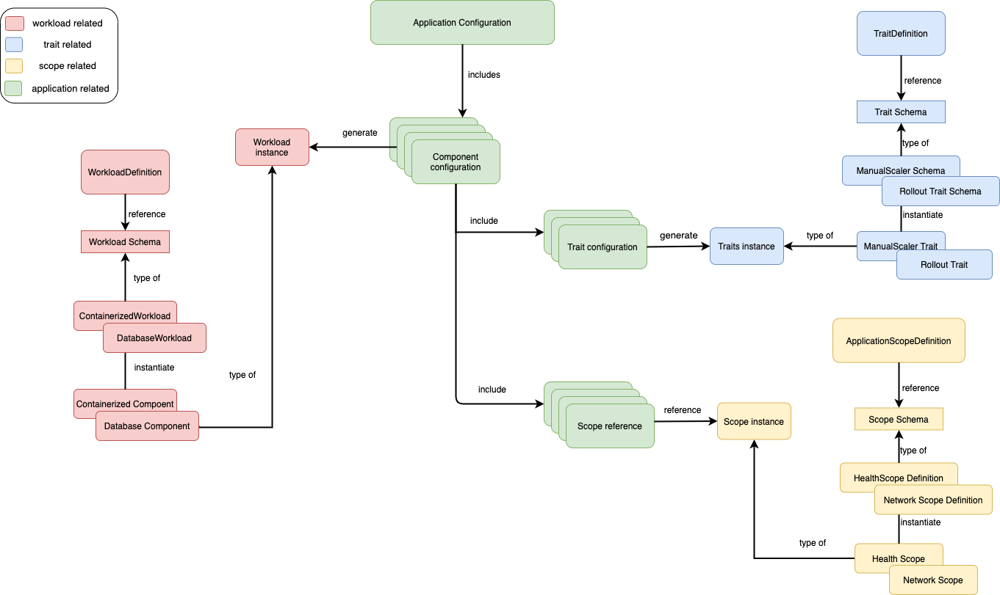
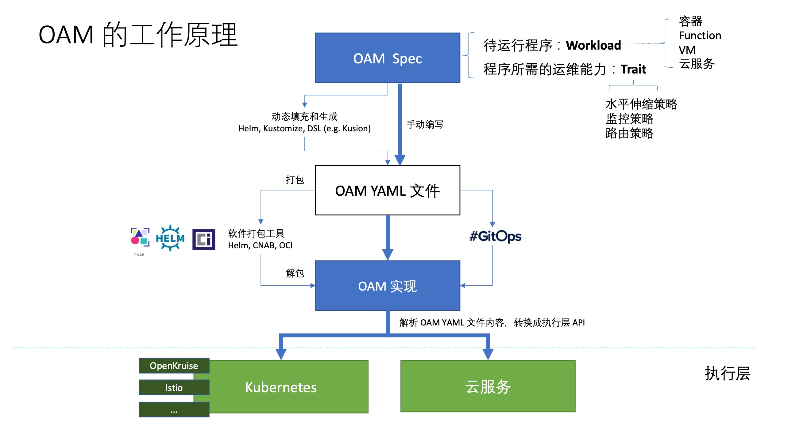

# OAM（开放应用模型）

[OAM（Open Application Model）](https://oam.dev/)是阿里巴巴和微软共同开源的云原生应用规范模型，自 2019 年 10 月宣布开源以来截止本文发稿已经有快半年时间了。

当前可能大部分人才刚刚开始了解 OAM，所以这篇文章将从最基础出发，为大家介绍 OAM 的诞生背景和要解决的问题，以及它在云原生生态中的作用。

## Takeaways

如果你没有兴趣或者时间阅读下面的全文，那么建议阅读下面这些核心观点：

- OAM 的本质是根据软件设计的“兴趣点分离”原则对负责的 DevOps 流程的高度抽象和封装，这背后还是“**康威定律**”在起作用。
- OAM 仅定义云原生应用的规范，OAM 开源之初推出的 [Rudr](https://github.com/oam-dev/rudr) 可以看做是 OAM 规范的 Kubernetes 解释器（已停止维护），将云原生应用定义翻译成 Kubernetes 的资源对象。
- OAM 与 [Crossplane](https://crossplane.io/) 将展开合作，就 Kubernetes 式以 API 为中心的应用定义发扬光大，并深度参与 [CNCF SIG App Delivery](https://github.com/cncf/sig-app-delivery)，以共同定义云原生应用标准。

> **康威定律（Conway’s Law）**
>
> [康威定律](https://zh.wikipedia.org/zh-hans/%E5%BA%B7%E5%A8%81%E5%AE%9A%E5%BE%8B)是马尔文·康威（Melvin Conway）1967年提出的： "设计系统的架构受制于产生这些设计的组织的沟通结构。" 

## OAM 简介

OAM 全称是 Open Application Model，从名称上来看它所定义的就是一种模型，同时也实现了基于 OAM 的我认为这种模型旨在定义了云原生应用的标准。

- 开放（Open）：支持异构的平台、容器运行时、调度系统、云供应商、硬件配置等，总之与底层无关
- 应用（Application）：云原生应用
- 模型（Model）：定义标准，以使其与底层平台无关

既然要制定标准，自然要对不同平台和场景的逻辑做出更高级别的抽象（这也意味着你在掌握了底层逻辑的情况下还要学习更多的概念），这样才能屏蔽底层差异。本文将默认底层平台为 Kubernetes。

- 是从管理大量 CRD 中汲取的经验。
- 业务和研发的沟通成本，比如 YAML 配置中很多字段是开发人员不关心的。

## 设计原则

OAM 规范的设计遵循了以下[原则](https://github.com/oam-dev/spec/blob/master/9.design_principles.md)：

- 关注点分离：根据功能和行为来定义模型，以此划分不同角色的职责，
- 平台中立：OAM 的实现不绑定到特定平台；
- 优雅：尽量减少设计复杂性；
- 复用性：可移植性好，同一个应用程序可以在不同的平台上不加改动地执行；
- 不作为编程模型：OAM 提供的是应用程序模型，描述了应用程序的组成和组件的拓扑结构，而不关注应用程序的具体实现。

下图是 OAM 规范示意图。

图片来自 [oam/spec issue #346](https://github.com/oam-dev/spec/issues/346)。

### OAM 基本对象

OAM 模型中包含以下基本对象，以本文发稿时的最新 API 版本 `core.oam.dev/v1alpha2` 为准：

- [**Component**](https://github.com/oam-dev/spec/blob/master/4.component.md)：OAM 中最基础的对象，该配置与基础设施无关，定义负载实例的运维特性。例如一个微服务 [workload](https://github.com/oam-dev/spec/blob/master/3.workload.md) 的定义。
- [**TraitDefinition**](https://github.com/oam-dev/spec/blob/master/6.traits.md)：一个组件所需的**运维策略与配置**，例如环境变量、Ingress、AutoScaler、Volume 等。（注意：该对象在 `apiVersion: core.oam.dev/v1alpha1` 中的名称为 `Trait`）。
- [**ScopeDefinition**](https://github.com/oam-dev/spec/blob/master/5.application_scopes.md)：多个 Component 的共同边界。可以根据组件的特性或者作用域来划分 Scope，一个 Component 可能同时属于多个 Scope。
- [**ApplicationConfiguration**](https://github.com/oam-dev/spec/blob/master/7.application_configuration.md)：将 Component（必须）、Trait（必须）、Scope（非必须）等组合到一起形成一个完整的应用配置。

###  OAM API 的演变

因为 OAM 还处在发展早起，API 变化较快，以上四个对象在不同的 API 版本中的 `kind` 名称不同，请大家使用时注意区别。

| 名称                      | core.oam.dev/v1alpha1    | core.oam.dev/v1alpha2    |
| ------------------------- | ------------------------ | ------------------------ |
| Component                 | ComponentSchematic       | Component                |
| Trait                     | Trait                    | TraitDefinition          |
| Scope                     | Scope                    | ScopeDefinition          |
| Application configuration | ApplicationConfiguration | ApplicationConfiguration |

总的来说，OAM 模型对象的定义格式与 [Kubernetes 对象的类型字段](https://kubernetes.io/docs/concepts/overview/working-with-objects/kubernetes-objects/#required-fields)相似。关于 OAM 的基本概念模型的更多信息请访问 [Overview and Terminology](https://github.com/oam-dev/spec/blob/master/2.overview_and_terminology.md)。

### OAM 工作原理

OAM 的工作原理如下图所示（图片引用自孙健波在《OAM:云原生时代的应用模型与 下一代 DevOps 技术》中的分享）。

OAM Spec 定义了云原生应用的规范（使用一些 CRD 定义）， [KubeVela](https://kubevela.io/) 可以看做是 OAM 规范的解析器，将应用定义翻译为 Kubernetes 中的资源对象。可以将上图分为三个层次：

- **汇编层**：即人工或者使用工具来根据 OAM 规范定义汇编出一个云原生应用的定义，其中包含了该应用的工作负载和运维能力配置。
- **转义层**：汇编好的文件将打包为 YAML 文件，由 [KubeVela](https://kubevela.io/) 或其他 OAM 的实现将其转义为 Kubernetes 或其他云服务（例如 Istio）上可运行的资源对象。
- **执行层**：执行经过转义好的云平台上的资源对象并执行资源配置。

## 未来

从以上描述中可以看出 OAM 对于定义云原生应用标准的野望，其目标不仅限于 Kubernetes 之上的又一上层抽象，而是对于一切云服务，在基于资源对象的基础上，Trait 来控制 Kubernetes 中的一众高层次非可调度的资源对象，如 AutoScaler、Volume、Ingress，Istio 中的流量配置对象 VirtualService、DestinationRule 等，还可容纳更多的云服务，对于 Serverless 时代的去基础设施化的思想不谋而合，未来可期。

## 参考

- [OAM 官方网站 - oam.dev](https://oam.dev)
