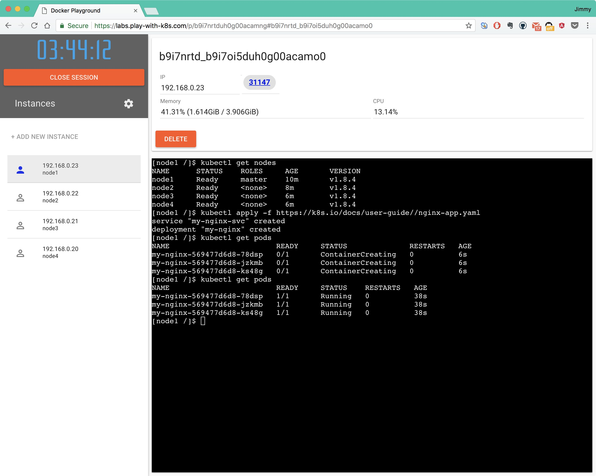

# Play with Kubernetes

本书的主角是 Kubernetes，在开始后面几章的长篇大论之前让大家可以零基础上手，揭开 Kubernetes 的神秘面纱。

本文不是讲解 Kubernetes 的高深原理也不是讲 Kuberentes 的具体用法，而是通过 [Play with Kubernetes](https://labs.play-with-k8s.com/) 来带您进入 Kubernetes 的世界，相当于 Kubernetes 世界的 “Hello World”！而且除了一台可以上网的电脑和浏览器之外不需要再准备任何东西，甚至（至少目前为止）不需要注册账号，上手即玩。

当然免费使用也是有限制的，当前的限制如下：

- 内置 kubeadm 来创建 kubernetes 集群，版本为 v1.8.4
- 每个实例配置为 1 core，4G Memory，最多创建 5 个实例
- 每个集群的使用时间是 4 个小时（当然你可以同时启动多个集群，根据浏览器的 session 来判断集群）
- 在 Kubernetes 集群中创建的服务无法通过外网访问，只能在 Play with Kubernetes 的网络内访问

登陆 [Play with Kubernetes](https://labs.play-with-k8s.com/)，点击【登陆】-【开始】即可开始你的 Kubernetes 之旅！

## 创建 Kubernetes 集群

启动第一个实例作为 Master 节点，在 web 终端上执行：

**1.** 初始化 master 节点：

```bash
kubeadm init --apiserver-advertise-address $(hostname -i)
```

**2.** 初始化集群网络：

```bash
kubectl apply -n kube-system -f  "https://cloud.weave.works/k8s/net?k8s-version=$(kubectl version | base64 | tr -d '\n')"
```

**3.** 执行下列初始化命令：

```bash
mkdir -p $HOME/.kube
cp -i /etc/kubernetes/admin.conf $HOME/.kube/config
chown $(id -u):$(id -g) $HOME/.kube/config
```

**4.** 启动新的实例作为 node 节点，根据 master 节点上的提示，在新的 web 终端上执行：

```bash
kubeadm join --token 513212.cfea0165b8988d18 192.168.0.13:6443 --discovery-token-ca-cert-hash sha256:b7b6dcc98f3ead3f9e363cb3928fbc04774ee0d63e8eb2897ae30e05aebf8070
```

注意：`192.168.0.13` 是 master 节点的 IP，请替换您的 master 节点的实际 IP。

再添加几个实例，重复执行第四步，即可向 Kubernetes 集群中增加节点。

此时在 master 节点上执行 `kubectl get nodes` 查看节点所有节点状态，并创建 nginx deployment，如下图所示：



