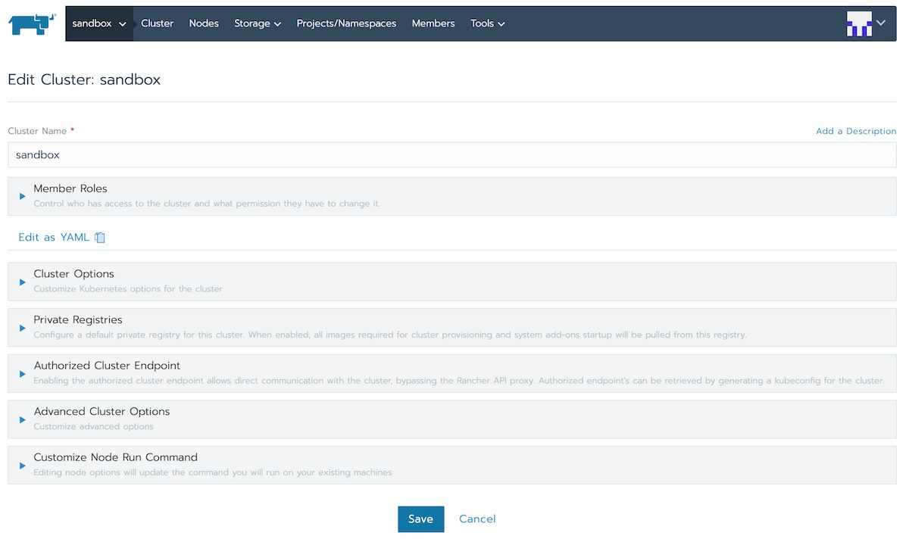
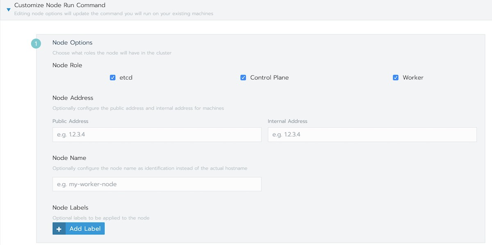
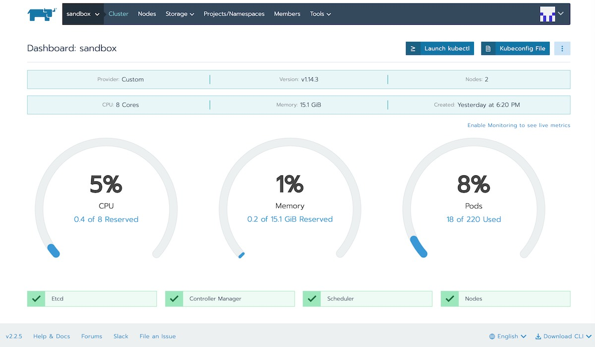

# 使用Rancher在阿里云上部署Kubernetes集群

如果您已经购买了阿里云的 ECS，那么您可以使用 Rancher 很方便的构建起一套 Kubernetes 集群用于测试及小规模使用。使用 Rancher 可以自动和可视化的完成 Kubernetes 集群的安装工作，省去的繁琐的人工安装过程，然您快速投入的业务开发中。下文根据 Rancher 2.x 安装 Kubernetes 集群。

**注：阿里云上已支持[容器服务 ACK](https://cn.aliyun.com/product/kubernetes)，如果您需要高性能、企业级的 Kubernetes 服务不妨考虑一下。**

## 准备

要想使用阿里云 ECS 和 Rancher 直接搭建一套 Kubernetes 集群，需要准备以下条件：

- 开通了公网 IP 的 ECS
- ECS 规格建议至少 4C8G
- ECS 使用的阿里云的经典网络
- 为 ECS 设置安全组规则，开放 UDP/8472 端口（阿里云默认禁止了 UDP，我们使用的 flannel 网络插件的VXLAN 模式，需要将 ECS 的安全组设置 UDP/8472 端口开放）

## 步骤

假设现在我们有两个节点 master 和 node，请参考 [Rancher Quick Start Guide](https://rancher.com/docs/rancher/v2.x/en/quick-start-guide/deployment/quickstart-manual-setup/) 安装 Rancher。



**Master**

先在 Master 节点安装 Rancher server、control、etcd 和 worker。

选择网络组件为 Flannel，同时在自定义主机运行命令中选择主机角色、填写主机的内网和外网 IP。



```bash
docker run -d --restart=unless-stopped -p 80:80 -p 443:443 rancher/rancher
```

Rancher 将自动创建 Kubernetes 集群，并默认在 80 端口运行 web server。

**Node**

添加 Node 节点时只需要在 Rancher 的 web 界面上找到您刚安装的集群并选择【编辑集群】并选择节点角色为 Worker 即可增加一台 Kubenretes 集群节点。

## 集群交互



如果您习惯使用命令行与集群交互可以 Rancher 的 web 上找到集群首页上的 `Kubeconfig File` 下载按钮，将该文件中的内容保存到您自己电脑的 `~/.kube/config` 文件中。然后现在对应 Kubernetes 版本的 `kubectl` 命令并放到 `PATH` 路径下即可。

 如果您没有在本地安装 `kubectl` 工具，也可以通过 Rancher 的集群页面上的 `Launch kubectl` 命令通过 web 来操作集群。

## 参考

- [Rancher - rancher.com](https://rancher.com/products/rancher/)
- [阿里云容器服务 ACK - aliyun.com](https://cn.aliyun.com/product/kubernetes)