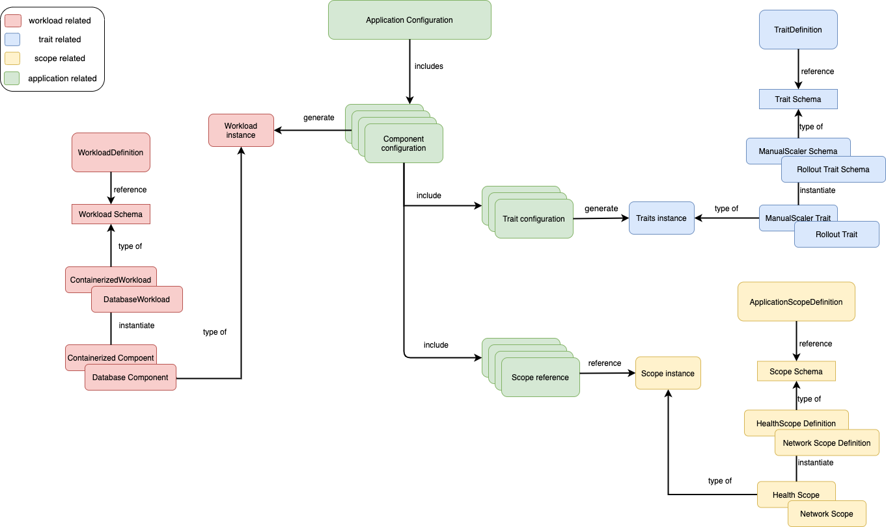

OAM 规范的设计遵循了以下[原则](https://github.com/oam-dev/spec/blob/master/9.design_principles.md)：

- 关注点分离：根据功能和行为来定义模型，以此划分不同角色的职责;
- 平台中立：OAM 的实现不绑定到特定平台；
- 优雅：尽量减少设计复杂性；
- 复用性：可移植性好，同一个应用程序可以在不同的平台上不加改动地执行；
- 不作为编程模型：OAM 提供的是应用程序模型，描述了应用程序的组成和组件的拓扑结构，而不关注应用程序的具体实现。

下图是 OAM 规范示意图。

图片来自 [oam/spec issue #346](https://github.com/oam-dev/spec/issues/346)。
