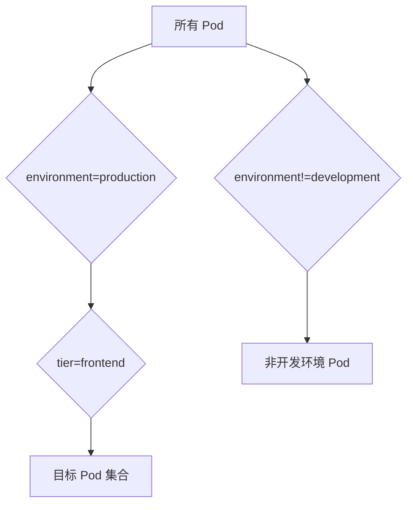
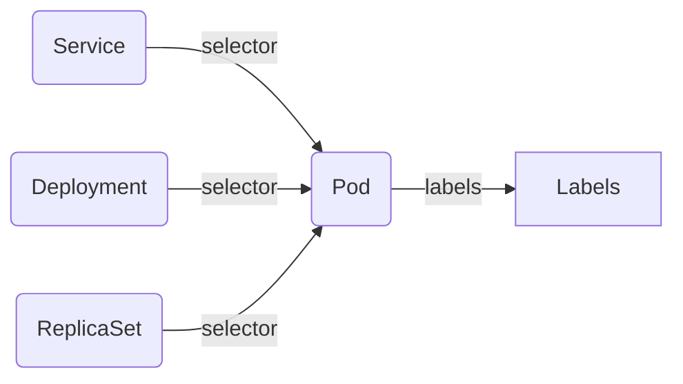

> Label（标签）是 Kubernetes 资源管理的基础机制之一，通过灵活的标签体系，可以高效地组织、筛选和管理集群中的各类对象，是实现自动化运维和资源治理的关键。

## Label 基本概念

Label 是附着到 Kubernetes 对象（如 Pod、Service 等）上的键值对标签。可以在对象创建时指定，也可后续添加或修改。Label 的值对系统本身没有语义，仅用于用户识别和资源组织。

下面是一个典型的 Label 配置示例：

```text
"labels": {
  "app": "nginx",
  "version": "v1.2.0",
  "environment": "production"
}
```

Kubernetes 会为 Label 建立索引和反向索引，以优化查询和监听操作。在 UI 和命令行中，Label 会按字母顺序排序显示。建议不要在 Label 中存储大型或结构化数据，这类信息应使用 Annotation。

## Label 的应用场景与最佳实践

合理设计 Label 能将组织架构映射到系统架构，便于微服务管理和运维。常见标签类型包括环境、架构、业务、版本等。

- **环境标识**：如 `environment: dev|staging|production`，`release: stable|canary|beta`
- **应用架构**：如 `tier: frontend|backend|database`，`component: web|api|cache`
- **业务划分**：如 `team: platform|product|data`，`project: project-a|project-b`，`customer: customer-x|customer-y`
- **版本管理**：如 `version: v1.2.0`，`track: daily|weekly`

通过统一的标签规范，可以实现资源的灵活分组与高效检索。

## Label 语法规则

Label 的 key 和 value 均有严格的格式要求，确保标签的唯一性和可读性。

### Label Key 规范

- 总长度不超过 63 个字符
- 可使用前缀，格式为 `prefix/name`，用 `/` 分隔
- 前缀为有效 DNS 子域名，不超过 253 个字符
- 系统组件创建的 Label 必须包含前缀
- `kubernetes.io/` 和 `k8s.io/` 前缀为 Kubernetes 保留
- 必须以字母或数字开头和结尾，中间可包含字母、数字、连字符（`-`）、下划线（`_`）、点（`.`）

### Label Value 规范

- 长度不超过 63 个字符
- 可以为空字符串
- 非空时必须以字母或数字开头和结尾
- 中间可包含字母、数字、连字符（`-`）、下划线（`_`）、点（`.`）

## Label Selector 选择器

Label Selector 用于根据标签筛选对象集合，是 Kubernetes 资源编排的核心能力。主要分为等值选择器和集合选择器两种。

### 等值选择器（Equality-based）

等值选择器通过 `=`、`==`、`!=` 操作符筛选对象。如下示例：

以下命令选择环境为 production 且层级为 frontend 的 Pod：

```bash
kubectl get pods -l environment=production,tier=frontend
```

选择不在 development 环境的 Pod：

```bash
kubectl get pods -l environment!=development
```

### 集合选择器（Set-based）

集合选择器通过 `in`、`notin`、`exists` 操作符实现更复杂的筛选逻辑。

选择环境为 production 或 qa 的 Pod：

```bash
kubectl get pods -l 'environment in (production,qa)'
```

选择层级为 frontend 但环境不是 development 的 Pod：

```bash
kubectl get pods -l 'tier in (frontend),environment notin (development)'
```

选择包含 environment 标签的 Pod（无论值是什么）：

```bash
kubectl get pods -l environment
```

选择不包含 environment 标签的 Pod：

```bash
kubectl get pods -l '!environment'
```

### Label Selector 关系示意图

下图展示了 Label Selector 如何通过不同的选择器筛选出目标对象：




{width=1920 height=2837}

## Label 在 API 对象中的用法

Label Selector 可在多种 Kubernetes API 对象中使用，支持不同复杂度的选择器。

### 简单选择器

在 Service、ReplicationController 等对象中，常用等值选择器：

以下 YAML 示例展示了 Service 通过 selector 选择目标 Pod：

```yaml
apiVersion: v1
kind: Service
metadata:
  name: my-service
spec:
  selector:
    app: nginx
    environment: production
  ports:
  - port: 80
```

### 高级选择器

在 Deployment、ReplicaSet、DaemonSet、Job 等对象中，支持复杂的 matchLabels 和 matchExpressions：

```yaml
apiVersion: apps/v1
kind: Deployment
metadata:
  name: nginx-deployment
spec:
  selector:
    matchLabels:
      app: nginx
    matchExpressions:
    - key: tier
      operator: In
      values: [frontend, backend]
    - key: environment
      operator: NotIn
      values: [development]
    - key: version
      operator: Exists
```

### 节点和 Pod 亲和性

在调度策略中，Label Selector 可用于节点亲和性（NodeAffinity）和 Pod 亲和性（PodAffinity）等场景，实现更灵活的调度约束。

以下 YAML 展示了复杂的亲和性配置：

```yaml
apiVersion: v1
kind: Pod
spec:
  affinity:
    nodeAffinity:
      requiredDuringSchedulingIgnoredDuringExecution:
        nodeSelectorTerms:
        - matchExpressions:
          - key: kubernetes.io/arch
            operator: In
            values: [amd64, arm64]
          - key: node-type
            operator: NotIn
            values: [spot]
    podAffinity:
      preferredDuringSchedulingIgnoredDuringExecution:
      - weight: 100
        podAffinityTerm:
          labelSelector:
            matchLabels:
              app: cache
          topologyKey: kubernetes.io/hostname
```

### 标签传播关系示意图

下图展示了 Service、Pod、Deployment 等对象之间通过 Label 进行关联和选择的关系：




{width=1920 height=1092}

## 实际应用示例

通过 Label Selector，Service 可以将具有相同标签的 Pod 组合成一个服务对外提供访问。

下图展示了 Label 在服务发现中的作用：


{width=803 height=588}

## 注意事项

在实际使用 Label 时，需注意以下几点：

- **性能考虑**：避免使用过多唯一标签值，否则会影响索引性能。
- **命名约定**：建立统一的标签命名规范，便于团队协作。
- **必要标签**：为所有资源添加基本标签，如 `app`、`version`、`environment`。
- **标签传播**：确保相关资源使用一致的标签，便于管理和选择。

## 总结

Label 是 Kubernetes 资源管理和自动化运维的基石。通过合理设计标签体系和选择器，可以实现资源的灵活分组、精准调度和高效治理。建议在实际项目中制定统一的标签规范，充分发挥 Label 的强大能力。

## 参考文献

1. [Kubernetes 官方文档 - kubernetes.io](https://kubernetes.io/zh/docs/concepts/overview/working-with-objects/labels/)
2. [Kubernetes Label 和 Annotation 设计规范 - 云原生社区](https://cloudnative.jimmysong.io/blog/kubernetes-label-annotation-best-practice/)
