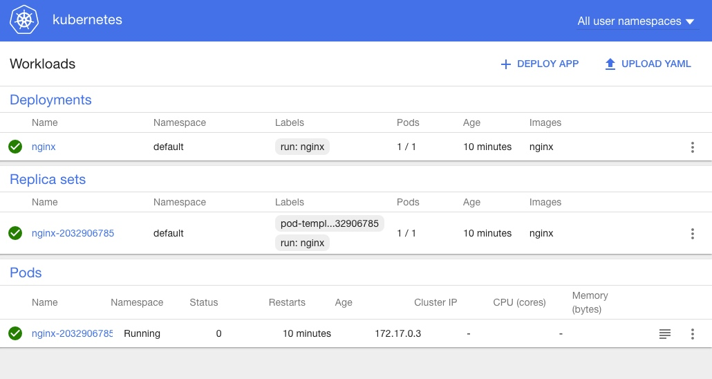

# Minikube

相比Docker一个二进制文件解决所有问题，Kubernetes则为不同的服务提供了不同的二进制文件，并将一些服务放到了addons中。故而，Kubernetes的部署相对要麻烦的多。借助[minikube](https://github.com/kubernetes/minikube)项目，现在可以很方便的在本机快速启动一个单节点的Kubernetes集群。

## 安装minikube

minikube最新release版本为v0.15.0，支持Kubernetes v1.3.0到v1.5.1的各个版本，默认启动Kubernetes v1.5.1。

OSX

```
curl -Lo minikube https://storage.googleapis.com/minikube/releases/v0.15.0/minikube-darwin-amd64 && chmod +x minikube && sudo mv minikube /usr/local/bin/
```

Linux

```
curl -Lo minikube https://storage.googleapis.com/minikube/releases/v0.15.0/minikube-linux-amd64 && chmod +x minikube && sudo mv minikube /usr/local/bin/
```

Windows

```
下载https://storage.googleapis.com/minikube/releases/v0.15.0/minikube-windows-amd64.exe，并重命名为minikube.exe
```

minikube支持xhyve(on OSX)、VirtualBox、VMWare Fusion等多种不同的driver，这些driver也需要单独安装，比如在OSX上安装xhyve driver:

```sh
brew install docker-machine-driver-xhyve
# docker-machine-driver-xhyve need root owner and uid
sudo chown root:wheel $(brew --prefix)/opt/docker-machine-driver-xhyve/bin/docker-machine-driver-xhyve
sudo chmod u+s $(brew --prefix)/opt/docker-machine-driver-xhyve/bin/docker-machine-driver-xhyve
```

另外，还需要安装一个`kubectl`客户端，用来跟kubernetes交互：

```
gcloud components install kubectl
```

## 启动Kubernetes Cluster

启动Kubernetes Cluster就非常简单了，一个命令即可：

```
$ minikube start
Starting local Kubernetes cluster...
Kubectl is now configured to use the cluster.
```

当然了，国内环境下，最好加上代理：

```
minikube start --docker-env HTTP_PROXY=http://proxy-ip:port --docker-env HTTPS_PROXY=http://proxy-ip:port
```

然后就可以通过kubectl来玩Kubernetes了，比如启动一个简单的nginx服务：

```
$ kubectl run nginx --image=nginx --port=80
deployment "nginx" created
$ kubectl expose deployment nginx --port=80 --type=NodePort --name=nginx-http
service "nginx-http" exposed
$ kubectl get pods
NAME                     READY     STATUS    RESTARTS   AGE
nginx-2032906785-81t56   1/1       Running   0          2m
$ kubectl get services
NAME         CLUSTER-IP   EXTERNAL-IP   PORT(S)   AGE
kubernetes   10.0.0.1     <none>        443/TCP   20m
nginx-http   10.0.0.146   <none>        80/TCP    2m
$ minikube service nginx-http --url
http://192.168.64.10:30569
```

这样就可以通过`http://192.168.64.10:30569`来直接访问nginx服务。

minikube默认还部署了最新的dashboard，可以通过`minikube dashboard`命令在默认浏览器中打开：




更多的玩法可以参考minikube的帮助文档：

```
Usage:
  minikube [command]

Available Commands:
  dashboard        Opens/displays the kubernetes dashboard URL for your local cluster
  delete           Deletes a local kubernetes cluster.
  docker-env       sets up docker env variables; similar to '$(docker-machine env)'
  get-k8s-versions Gets the list of available kubernetes versions available for minikube.
  ip               Retrieve the IP address of the running cluster.
  logs             Gets the logs of the running localkube instance, used for debugging minikube, not user code.
  service          Gets the kubernetes URL for the specified service in your local cluster
  ssh              Log into or run a command on a machine with SSH; similar to 'docker-machine ssh'
  start            Starts a local kubernetes cluster.
  status           Gets the status of a local kubernetes cluster.
  stop             Stops a running local kubernetes cluster.
  version          Print the version of minikube.
```  

更多请参考https://github.com/kubernetes/minikube。

