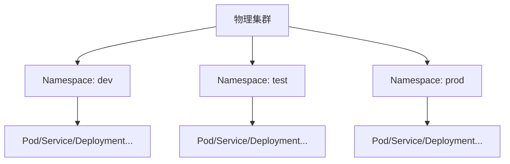
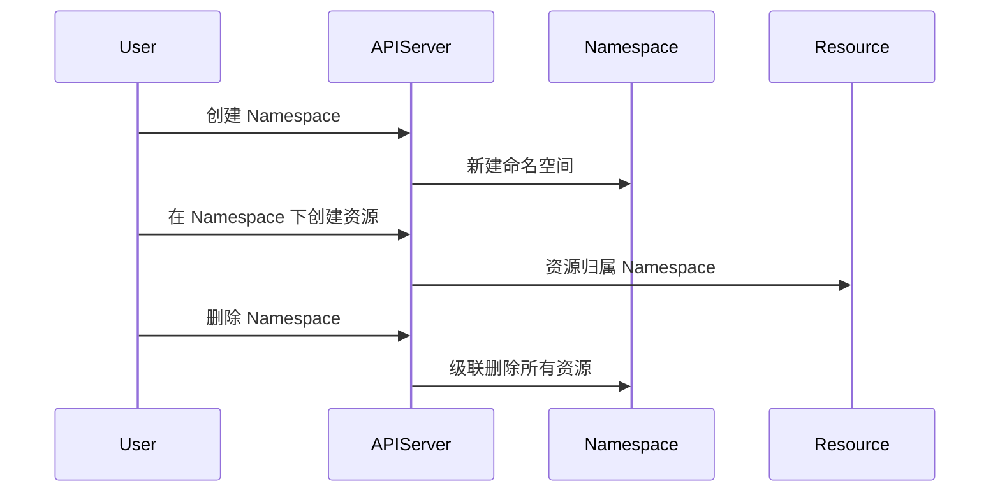
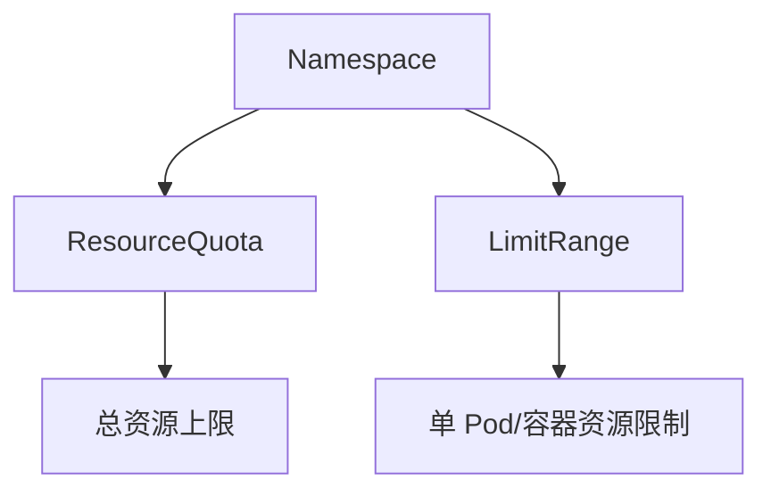

> Namespace 是 Kubernetes 实现资源隔离、环境划分和多租户管理的基础机制，合理设计有助于提升集群安全性与可维护性。

## 什么是 Namespace

Namespace（命名空间）是 Kubernetes 中的一个抽象概念，用于在同一个物理集群中创建多个虚拟的集群环境。它为资源对象提供作用域，使得不同 Namespace 中的资源可以使用相同的名称而不会冲突，实现逻辑分组和隔离。




{width=1920 height=805}

## 使用场景

Namespace 适用于以下典型场景：

- **环境隔离**：将开发、测试、预生产和生产环境部署在不同的 Namespace 中，互不影响。
- **团队隔离**：为不同团队或项目分配独立的 Namespace，便于权限和资源管理。
- **资源配额管理**：对不同 Namespace 设置资源使用限制，实现资源公平分配。
- **权限控制**：基于 Namespace 配合 RBAC 实现细粒度的访问控制和多租户安全。

## 基本操作

### 查看 Namespace

使用如下命令查看集群中所有 Namespace：

```bash
kubectl get namespaces
# 或简写
kubectl get ns
```

### 创建 Namespace

可以通过命令或 YAML 文件创建新的 Namespace：

```bash
# 命令方式
kubectl create namespace <namespace-name>

# YAML 文件方式
kubectl apply -f namespace.yaml
```

### 指定 Namespace 操作

在特定 Namespace 下操作资源，或设置默认 Namespace：

```bash
# 在指定 namespace 下查看 Pod
kubectl get pods -n <namespace-name>

# 设置当前上下文默认 namespace
kubectl config set-context --current --namespace=<namespace-name>
```

## 默认 Namespace

Kubernetes 集群默认包含以下 Namespace：



| 名称              | 作用描述                                   |
|-------------------|--------------------------------------------|
| default           | 用户应用的默认部署位置                      |
| kube-system       | Kubernetes 系统组件的部署位置               |
| kube-public       | 所有用户都可访问的公共资源                  |
| kube-node-lease   | 节点心跳检测的租约对象（提升大规模集群性能） |



## 资源作用域

并非所有 Kubernetes 资源都属于 Namespace 作用域，需注意区分：



| 资源类型         | Namespace 作用域 | 集群作用域 |
|------------------|:---------------:|:----------:|
| Pod              |       ✔️        |            |
| Service          |       ✔️        |            |
| Deployment       |       ✔️        |            |
| ConfigMap        |       ✔️        |            |
| Secret           |       ✔️        |            |
| PersistentVolumeClaim |   ✔️        |            |
| Node             |                 |     ✔️     |
| PersistentVolume |                 |     ✔️     |
| StorageClass     |                 |     ✔️     |
| ClusterRole      |                 |     ✔️     |
| Namespace        |                 |     ✔️     |



## Namespace 生命周期与资源隔离

下图展示了 Namespace 的创建、资源隔离与删除流程：




{width=1920 height=956}

## 资源配额与限制

在多团队或多租户场景下，合理分配和限制每个 Namespace 的资源使用非常关键。Kubernetes 提供了 ResourceQuota 和 LimitRange 两种机制：

- **ResourceQuota**：限制 Namespace 内所有资源对象的总量（如 Pod 数量、CPU/内存总量、PVC 数量等）。
- **LimitRange**：为单个 Pod 或容器设置默认和最大/最小的资源 request/limit。




{width=1920 height=1603}

### ResourceQuota 示例

```yaml
apiVersion: v1
kind: ResourceQuota
metadata:
  name: compute-resources
  namespace: dev
spec:
  hard:
    pods: "20"
    requests.cpu: "10"
    requests.memory: 40Gi
    limits.cpu: "20"
    limits.memory: 80Gi
```

应用后，可通过如下命令查看配额使用情况：

```bash
kubectl -n dev describe resourcequota compute-resources
```

### LimitRange 示例

```yaml
apiVersion: v1
kind: LimitRange
metadata:
  name: mem-limit-range
  namespace: dev
spec:
  limits:
  - default:
      memory: 2Gi
      cpu: 1
    defaultRequest:
      memory: 512Mi
      cpu: 0.2
    type: Container
```

应用后，未显式声明资源的 Pod/容器会自动继承默认 request/limit。

### 配置与管理建议

- 启用 ResourceQuota 和 LimitRange 准入控制器（现代集群默认已启用）：

  ```bash
  --enable-admission-plugins=ResourceQuota,LimitRange
  ```

- 为每个 Namespace 规划合理的配额，避免资源争抢或浪费。
- 定期监控配额使用情况，及时调整。

## 最佳实践

- **命名规范**：采用 `项目-环境` 格式（如 `shop-prod`、`shop-dev`），便于识别和管理。
- **资源配额**：为每个 Namespace 配置合理的 ResourceQuota 和 LimitRange，防止资源争抢。
- **网络策略**：根据安全需求配置 NetworkPolicy，限制 Namespace 间的网络访问。
- **标签管理**：为 Namespace 添加标签，便于自动化管理和资源筛选。
- **权限控制**：结合 RBAC，实现基于 Namespace 的最小权限访问控制。
- **定期清理**：定期检查并清理不再使用的 Namespace，保持集群整洁。

## 总结

Namespace 是 Kubernetes 实现多租户、资源隔离和环境划分的核心机制。通过合理设计和管理 Namespace，可提升集群的安全性、可维护性和资源利用率。结合资源配额、网络策略和 RBAC，可实现企业级的多团队协作与治理。

## 参考文献

1. [Namespaces - kubernetes.io](https://kubernetes.io/zh-cn/docs/concepts/overview/working-with-objects/namespaces/)
2. [Resource Quotas - kubernetes.io](https://kubernetes.io/zh-cn/docs/concepts/policy/resource-quotas/)
3. [Network Policies - kubernetes.io](https://kubernetes.io/zh-cn/docs/concepts/services-networking/network-policies/)
4. [限制范围 - kubernetes.io](https://kubernetes.io/zh-cn/docs/concepts/policy/limit-range/)
5. [为命名空间配置默认的内存请求与限额 - kubernetes.io](https://kubernetes.io/zh-cn/docs/tasks/administer-cluster/manage-resources/memory-default-namespace/)
6. [在命名空间中配置默认的 CPU 请求与限额 - kubernetes.io](https://kubernetes.io/zh-cn/docs/tasks/administer-cluster/manage-resources/cpu-default-namespace/)
