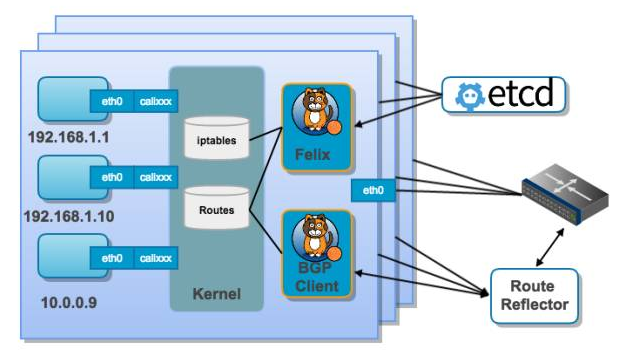

# Kubernetes中的网络解析——以calico为例

[Calico](https://www.projectcalico.org/) 原意为”有斑点的“，如果说一只猫为 calico cat 的话，就是说这是只花猫，也叫三色猫，所以 calico 的 logo 是只三色猫。


## 概念

Calico创建和管理一个扁平的三层网络（不需要overlay），每个容器会分配一个可路由的IP。由于通信时不需要解包和封包，网络性能损耗小，易于排查，且易于水平扩展。

小规模部署时可以通过BGP client直接互联，大规模下可通过指定的BGP Route Reflector来完成，这样保证所有的数据流量都是通过IP路由的方式完成互联的。

Calico基于iptables还提供了丰富而灵活的网络Policy，保证通过各个节点上的ACL来提供Workload的多租户隔离、安全组以及其他可达性限制等功能。

## Calico架构



Calico主要由Felix、etcd、BGP client、BGP Route Reflector组成。

- [Etcd](https://docs.projectcalico.org/v3.0/reference/architecture/)：负责存储网络信息
- [BGP client](https://docs.projectcalico.org/v3.0/reference/architecture/)：负责将Felix配置的路由信息分发到其他节点
- [Felix](https://docs.projectcalico.org/v3.0/reference/architecture/)：Calico Agent，每个节点都需要运行，主要负责配置路由、配置ACLs、报告状态
- [BGP Route Reflector](https://docs.projectcalico.org/v3.0/reference/architecture/)：大规模部署时需要用到，作为BGP client的中心连接点，可以避免每个节点互联

## 部署

运行下面的命令可以部署 calico 网络。

```bash
mkdir /etc/cni/net.d/

kubectl apply -f https://docs.projectcalico.org/v3.0/getting-started/kubernetes/installation/rbac.yaml

wget https://docs.projectcalico.org/v3.0/getting-started/kubernetes/installation/hosted/calico.yaml

# 修改etcd_endpoints的值和默认的192.168.0.0/16(不能和已有网段冲突)

kubectl apply -f calico.yaml

wget  https://github.com/projectcalico/calicoctl/releases/download/v2.0.0/calicoctl

mv calicoctl /usr/loca/bin && chmod +x /usr/local/bin/calicoctl

calicoctl get ippool

calicoctl get node
```

如果安装时启用应用层策略的话还需要安装 [istio](https://istio.io/zh)，详见 [Enabling application layer policy](https://docs.projectcalico.org/v3.4/getting-started/kubernetes/installation/app-layer-policy#about-enabling-application-layer-policy)。

## 参考

- [安装Calico - docs.projectcalico.org](https://docs.projectcalico.org/v3.4/usage/calicoctl/install)
- [calicoctl命令参考 - docs.projectcalico.org](https://docs.projectcalico.org/v3.4/reference/calicoctl/commands/)
- [Calico架构 - docs.projectcalico.org](https://docs.projectcalico.org/v3.4/reference/architecture/)
