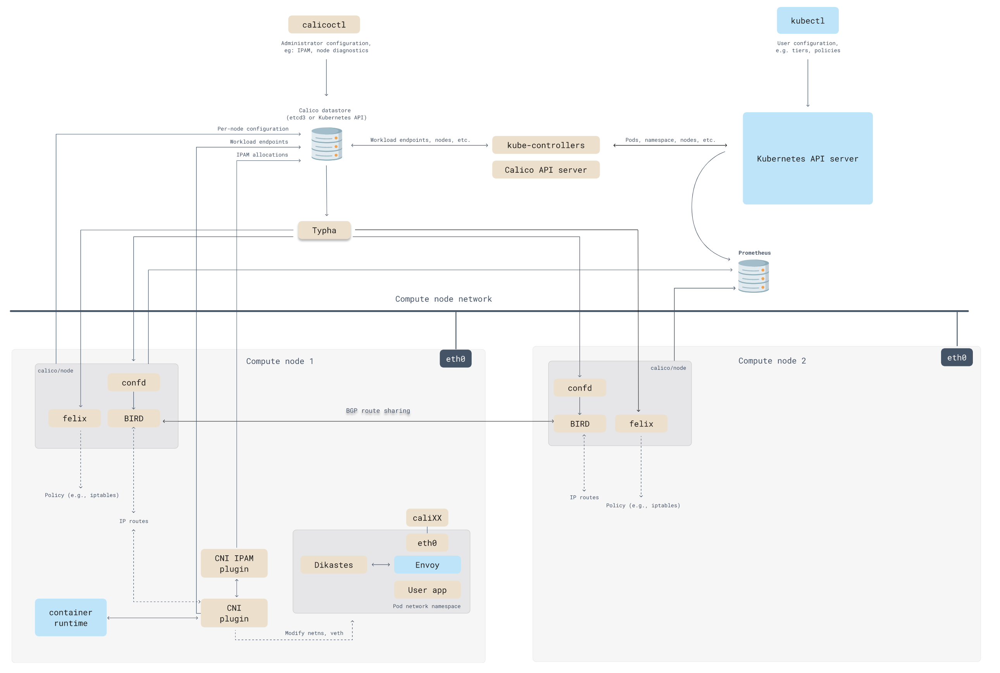

# 非 Overlay 扁平网络 Calico

[Calico](https://www.projectcalico.org/) 原意为”有斑点的“，如果说一只猫为 calico cat 的话，就是说这是只花猫，也叫三色猫，所以 calico 的 logo 是只三色猫。

## 概念

Calico 创建和管理一个扁平的三层网络（不需要 overlay），每个容器会分配一个可路由的 IP。由于通信时不需要解包和封包，网络性能损耗小，易于排查，且易于水平扩展。

小规模部署时可以通过 BGP client 直接互联，大规模下可通过指定的 BGP Route Reflector 来完成，这样保证所有的数据流量都是通过 IP 路由的方式完成互联的。

Calico 基于 iptables 还提供了丰富而灵活的网络 Policy，保证通过各个节点上的 ACL 来提供 Workload 的多租户隔离、安全组以及其他可达性限制等功能。

## Calico 架构

Calico 由以下组件组成，在部署 Calico 的时候部分组件是可选的。

- [Calico API server](https://projectcalico.docs.tigera.io/reference/architecture/overview#calico-api-server)
- [Felix](https://projectcalico.docs.tigera.io/reference/architecture/overview#felix)
- [BIRD](https://projectcalico.docs.tigera.io/reference/architecture/overview#bird)
- [confd](https://projectcalico.docs.tigera.io/reference/architecture/overview#confd)
- [Dikastes](https://projectcalico.docs.tigera.io/reference/architecture/overview#dikastes)
- [CNI 插件](https://projectcalico.docs.tigera.io/reference/architecture/overview#cni-plugin)
- [数据存储插件](https://projectcalico.docs.tigera.io/reference/architecture/overview#datastore-plugin)
- [IPAM 插件](https://projectcalico.docs.tigera.io/reference/architecture/overview#ipam-plugin)
- [kube-controllers](https://projectcalico.docs.tigera.io/reference/architecture/overview#kube-controllers)
- [Typha](https://projectcalico.docs.tigera.io/reference/architecture/overview#typha)
- [calicoctl](https://projectcalico.docs.tigera.io/reference/architecture/overview#calicoctl)
- [云编排器插件](https://projectcalico.docs.tigera.io/reference/architecture/overview#plugins-for-cloud-orchestrators)

Calico 的架构图如下所示：

注：图片来自 [Calico 官网](https://projectcalico.docs.tigera.io/reference/architecture/overview)。

### Calico API Server

可以使用 kubectl 直接管理 Calico。

### Felix

Felix 以 agent 代理的形式在每台机器端点上运行。对路由和 ACL 以及主机编程，为该主机上的端点提供所需的连接。

根据具体的编排器环境，Felix负责：

**接口管理**

将有关接口的信息编入内核，以便内核能够正确处理来自该端点的流量。特别是，确保主机响应来自每个工作负载的ARP请求，提供主机的MAC，并为它所管理的接口启用IP转发。它还监控接口，以确保编程在适当的时候应用。

**路由编程**

将其主机上的端点的路由编程到Linux内核的FIB（转发信息库）。这可以确保到达主机上的以这些端点为目的地的数据包被相应地转发。

**ACL编程**

在Linux内核中编程ACL，以确保只有有效的流量可以在端点之间发送，并且端点不能规避Calico的安全措施。

**状态报告**

提供网络健康数据。特别是在配置其主机时报告错误和问题。这些数据被写入数据存储，以便对网络的其他组件和运营商可见。

### BIRD

BGP Internet Routing Daemon，简称 BIRD。从Felix获取路由，并分发到网络上的BGP peer，用于主机间的路由。在每个Felix代理的节点上运行。

BGP客户端负责：

**路由分配**

当Felix将路由插入Linux内核的FIB时，BGP客户端将它们分配给部署中的其他节点。这确保了部署中的有效流量路由。

**BGP路由反射器的配置**

BGP路由反射器通常是为大型部署而配置的，而不是一个标准的BGP客户端。BGP路由反射器作为连接BGP客户端的一个中心点。(标准BGP要求每个BGP客户端在网状拓扑结构中与其他每个BGP客户端连接，这很难维护)。

为了实现冗余，你可以无缝部署多个BGP路由反射器。BGP路由反射器只参与网络的控制：没有终端数据通过它们。当Calico BGP客户端将其FIB中的路由通告给路由反射器时，路由反射器将这些路由通告给部署中的其他节点。

### confd

开源的、轻量级的配置管理工具。监控Calico数据存储对BGP配置和全局默认的日志变更，如AS号、日志级别和IPAM信息。

Confd根据存储中的数据更新，动态生成BIRD配置文件。当配置文件发生变化时，confd会触发BIRD加载新的文件。

### Dikastes

执行Istio服务网格的网络策略。作为Istio Envoy的一个Sidecar代理，在集群上运行。

Dikastes 是可选的。Calico在Linux内核（使用iptables，在三、四层）和三到七层使用Envoy的Sidecar代理Dikastes为工作负载执行网络策略，对请求进行加密认证。使用多个执行点可以根据多个标准确定远程端点的身份。即使工作负载Pod破坏，Envoy代理被绕过，主机Linux内核的执行也能保护你的工作负载。

### CNI 插件

为Kubernetes集群提供Calico网络。

向Kubernetes展示该API的Calico二进制文件被称为CNI插件，必须安装在Kubernetes集群的每个节点上。Calico CNI插件允许你为任何使用[CNI](../concepts/cni.md)网络规范的编排调度器使用Calico网络。

### 数据存储插件

通过减少每个节点对数据存储的影响来增加规模。它是Calico CNI的插件之一。

**Kubernetes API datastore（kdd）**

在Calico中使用Kubernetes API数据存储（kdd）的优点是：

- 管理更简单，因为不需要额外的数据存储
- 使用Kubernetes RBAC来控制对Calico资源的访问
- 使用Kubernetes审计日志来生成对Calico资源变化的审计日志

**etcd**

[etcd](../concepts/etcd.md)是一个一致的、高可用的分布式键值存储，为Calico网络提供数据存储，并用于组件之间的通信。etcd仅支持保护非集群主机（从Calico v3.1开始）。etcd的优点是：

- 让你在非Kubernetes平台上运行Calico
- 分离Kubernetes和Calico资源之间的关注点，例如允许你独立地扩展数据存储。
- 让你运行的Calico集群不仅仅包含一个Kubernetes集群，例如，让带有Calico主机保护的裸机服务器与Kubernetes集群互通；或者多个Kubernetes集群。

### IPAM 插件

使用Calico的IP池资源来控制如何将IP地址分配给集群中的pod。它是大多数Calico安装所使用的默认插件。它是Calico CNI插件之一。

### kube-controller

监控Kubernetes的API，并根据集群状态执行行动。

`tigera/kube-controllers` 容器包括以下控制器：

- Policy 控制器
- Namespace 控制器
- ServiceAccount 控制器
- WorkloadEndpoint 控制器
- Node 控制器

### Typha

通过减少每个节点对数据存储的影响来增加规模。作为数据存储和Felix实例之间的一个守护程序运行。默认安装，但没有配置。

Typha代表Felix和confd等所有客户端维护一个单一的数据存储连接。它缓存数据存储的状态，并复制事件，以便它们可以被推广到更多监听器。因为一个Typha实例可以支持数百个Felix实例，可以将数据存储的负载降低很多。由于Typha可以过滤掉与Felix无关的更新，它也减少了Felix的CPU使用。在一个大规模（100多个节点）的Kubernetes集群中，这是至关重要的，因为API服务器产生的更新数量随着节点数量的增加而增加。

### calicoctl

Calicoctl命令行作为二进制或容器需要单独安装，可以在任何可以通过网络访问Calico数据存储的主机上使用。

## 云编排器插件

将管理网络的编排器API翻译成Calico的数据模型和数据存储。

对于云供应商，Calico为每个主要的云编排平台提供了一个单独的插件。这使得Calico能够与编排器紧密结合，因此用户可以使用他们的编排器工具来管理Calico网络。当需要时，编排器插件会将Calico网络的反馈信息提供给编排器。例如，提供关于Felix liveness的信息，并在网络设置失败时将特定端点标记为失败。

## 参考

- [Calico 组件架构 - docs.projectcalico.org](https://projectcalico.docs.tigera.io/reference/architecture/overview)