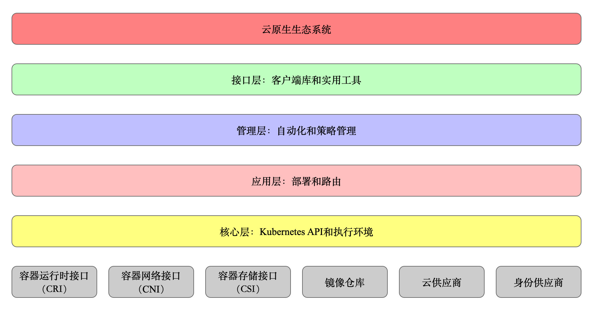

# Kubernetes 的设计理念

这一章将介绍 Kubernetes 的设计理念及基本概念。

### Kubernetes 设计理念与分布式系统

分析和理解 Kubernetes 的设计理念可以使我们更深入地了解 Kubernetes 系统，更好地利用它管理分布式部署的云原生应用，另一方面也可以让我们借鉴其在分布式系统设计方面的经验。

### 分层架构

Kubernetes 设计理念和功能其实就是一个类似 Linux 的分层架构，如下图所示

* 核心层：Kubernetes 最核心的功能，对外提供 API 构建高层的应用，对内提供插件式应用执行环境
* 应用层：部署（无状态应用、有状态应用、批处理任务、集群应用等）和路由（服务发现、DNS 解析等）
* 管理层：系统度量（如基础设施、容器和网络的度量），自动化（如自动扩展、动态 Provision 等）以及策略管理（RBAC、Quota、PSP、NetworkPolicy 等）
* 接口层：kubectl 命令行工具、客户端 SDK 以及集群联邦
* 生态系统：在接口层之上的庞大容器集群管理调度的生态系统，可以划分为两个范畴
  * Kubernetes 外部：日志、监控、配置管理、CI、CD、Workflow、FaaS、OTS 应用、ChatOps 等
  * Kubernetes 内部：CRI、CNI、CVI、镜像仓库、Cloud Provider、集群自身的配置和管理等

### API 设计原则

对于云计算系统，系统 API 实际上处于系统设计的统领地位，正如本文前面所说，Kubernetes 集群系统每支持一项新功能，引入一项新技术，一定会新引入对应的 API 对象，支持对该功能的管理操作，理解掌握的 API，就好比抓住了 Kubernetes 系统的牛鼻子。Kubernetes 系统 API 的设计有以下几条原则：

1. **所有 API 应该是声明式的**。正如前文所说，声明式的操作，相对于命令式操作，对于重复操作的效果是稳定的，这对于容易出现数据丢失或重复的分布式环境来说是很重要的。另外，声明式操作更容易被用户使用，可以使系统向用户隐藏实现的细节，隐藏实现的细节的同时，也就保留了系统未来持续优化的可能性。此外，声明式的 API，同时隐含了所有的 API 对象都是名词性质的，例如 Service、Volume 这些 API 都是名词，这些名词描述了用户所期望得到的一个目标分布式对象。 
2. **API 对象是彼此互补而且可组合的**。这里面实际是鼓励 API 对象尽量实现面向对象设计时的要求，即 “高内聚，松耦合”，对业务相关的概念有一个合适的分解，提高分解出来的对象的可重用性。事实上，Kubernetes 这种分布式系统管理平台，也是一种业务系统，只不过它的业务就是调度和管理容器服务。 
3. **高层 API 以操作意图为基础设计**。如何能够设计好 API，跟如何能用面向对象的方法设计好应用系统有相通的地方，高层设计一定是从业务出发，而不是过早的从技术实现出发。因此，针对 Kubernetes 的高层 API 设计，一定是以 Kubernetes 的业务为基础出发，也就是以系统调度管理容器的操作意图为基础设计。 
4. **低层 API 根据高层 API 的控制需要设计**。设计实现低层 API 的目的，是为了被高层 API 使用，考虑减少冗余、提高重用性的目的，低层 API 的设计也要以需求为基础，要尽量抵抗受技术实现影响的诱惑。 
5. **尽量避免简单封装，不要有在外部 API 无法显式知道的内部隐藏的机制**。简单的封装，实际没有提供新的功能，反而增加了对所封装 API 的依赖性。内部隐藏的机制也是非常不利于系统维护的设计方式，例如 StatefulSet 和 ReplicaSet，本来就是两种 Pod 集合，那么 Kubernetes 就用不同 API 对象来定义它们，而不会说只用同一个 ReplicaSet，内部通过特殊的算法再来区分这个 ReplicaSet 是有状态的还是无状态。 
6. **API 操作复杂度与对象数量成正比**。这一条主要是从系统性能角度考虑，要保证整个系统随着系统规模的扩大，性能不会迅速变慢到无法使用，那么最低的限定就是 API 的操作复杂度不能超过 O\(N\)，N 是对象的数量，否则系统就不具备水平伸缩性了。 
7. **API 对象状态不能依赖于网络连接状态**。由于众所周知，在分布式环境下，网络连接断开是经常发生的事情，因此要保证 API 对象状态能应对网络的不稳定，API 对象的状态就不能依赖于网络连接状态。 
8. **尽量避免让操作机制依赖于全局状态，因为在分布式系统中要保证全局状态的同步是非常困难的**。

### 控制机制设计原则

* **控制逻辑应该只依赖于当前状态**。这是为了保证分布式系统的稳定可靠，对于经常出现局部错误的分布式系统，如果控制逻辑只依赖当前状态，那么就非常容易将一个暂时出现故障的系统恢复到正常状态，因为你只要将该系统重置到某个稳定状态，就可以自信的知道系统的所有控制逻辑会开始按照正常方式运行。 
* **假设任何错误的可能，并做容错处理**。在一个分布式系统中出现局部和临时错误是大概率事件。错误可能来自于物理系统故障，外部系统故障也可能来自于系统自身的代码错误，依靠自己实现的代码不会出错来保证系统稳定其实也是难以实现的，因此要设计对任何可能错误的容错处理。 
* **尽量避免复杂状态机，控制逻辑不要依赖无法监控的内部状态**。因为分布式系统各个子系统都是不能严格通过程序内部保持同步的，所以如果两个子系统的控制逻辑如果互相有影响，那么子系统就一定要能互相访问到影响控制逻辑的状态，否则，就等同于系统里存在不确定的控制逻辑。 
* **假设任何操作都可能被任何操作对象拒绝，甚至被错误解析**。由于分布式系统的复杂性以及各子系统的相对独立性，不同子系统经常来自不同的开发团队，所以不能奢望任何操作被另一个子系统以正确的方式处理，要保证出现错误的时候，操作级别的错误不会影响到系统稳定性。 
* **每个模块都可以在出错后自动恢复**。由于分布式系统中无法保证系统各个模块是始终连接的，因此每个模块要有自我修复的能力，保证不会因为连接不到其他模块而自我崩溃。 
* **每个模块都可以在必要时优雅地降级服务**。所谓优雅地降级服务，是对系统鲁棒性的要求，即要求在设计实现模块时划分清楚基本功能和高级功能，保证基本功能不会依赖高级功能，这样同时就保证了不会因为高级功能出现故障而导致整个模块崩溃。根据这种理念实现的系统，也更容易快速地增加新的高级功能，因为不必担心引入高级功能影响原有的基本功能。

## Kubernetes 的核心技术概念和 API 对象

API 对象是 Kubernetes 集群中的管理操作单元。Kubernetes 集群系统每支持一项新功能，引入一项新技术，一定会新引入对应的 API 对象，支持对该功能的管理操作。例如副本集 Replica Set 对应的 API 对象是 RS。

每个 API 对象都有 3 大类属性：元数据 metadata、规范 spec 和状态 status。元数据是用来标识 API 对象的，每个对象都至少有 3 个元数据：namespace，name 和 uid；除此以外还有各种各样的标签 labels 用来标识和匹配不同的对象，例如用户可以用标签 env 来标识区分不同的服务部署环境，分别用 env=dev、env=testing、env=production 来标识开发、测试、生产的不同服务。规范描述了用户期望 Kubernetes 集群中的分布式系统达到的理想状态（Desired State），例如用户可以通过复制控制器 Replication Controller 设置期望的 Pod 副本数为 3；status 描述了系统实际当前达到的状态（Status），例如系统当前实际的 Pod 副本数为 2；那么复制控制器当前的程序逻辑就是自动启动新的 Pod，争取达到副本数为 3。

Kubernetes 中所有的配置都是通过 API 对象的 spec 去设置的，也就是用户通过配置系统的理想状态来改变系统，这是 Kubernetes 重要设计理念之一，即所有的操作都是声明式（Declarative）的而不是命令式（Imperative）的。声明式操作在分布式系统中的好处是稳定，不怕丢操作或运行多次，例如设置副本数为 3 的操作运行多次也还是一个结果，而给副本数加 1 的操作就不是声明式的，运行多次结果就错了。

### Pod

Kubernetes 有很多技术概念，同时对应很多 API 对象，最重要的也是最基础的是 Pod。Pod 是在 Kubernetes 集群中运行部署应用或服务的最小单元，它是可以支持多容器的。Pod 的设计理念是支持多个容器在一个 Pod 中共享网络地址和文件系统，可以通过进程间通信和文件共享这种简单高效的方式组合完成服务。Pod 对多容器的支持是 K8 最基础的设计理念。比如你运行一个操作系统发行版的软件仓库，一个 Nginx 容器用来发布软件，另一个容器专门用来从源仓库做同步，这两个容器的镜像不太可能是一个团队开发的，但是他们一块儿工作才能提供一个微服务；这种情况下，不同的团队各自开发构建自己的容器镜像，在部署的时候组合成一个微服务对外提供服务。

Pod 是 Kubernetes 集群中所有业务类型的基础，可以看作运行在 Kubernetes 集群中的小机器人，不同类型的业务就需要不同类型的小机器人去执行。目前 Kubernetes 中的业务主要可以分为长期伺服型（long-running）、批处理型（batch）、节点后台支撑型（node-daemon）和有状态应用型（stateful application）；分别对应的小机器人控制器为 Deployment、Job、DaemonSet 和 StatefulSet，本文后面会一一介绍。

### 副本控制器（Replication Controller，RC）

RC 是 Kubernetes 集群中最早的保证 Pod 高可用的 API 对象。通过监控运行中的 Pod 来保证集群中运行指定数目的 Pod 副本。指定的数目可以是多个也可以是 1 个；少于指定数目，RC 就会启动运行新的 Pod 副本；多于指定数目，RC 就会杀死多余的 Pod 副本。即使在指定数目为 1 的情况下，通过 RC 运行 Pod 也比直接运行 Pod 更明智，因为 RC 也可以发挥它高可用的能力，保证永远有 1 个 Pod 在运行。RC 是 Kubernetes 较早期的技术概念，只适用于长期伺服型的业务类型，比如控制小机器人提供高可用的 Web 服务。

### 副本集（Replica Set，RS）

RS 是新一代 RC，提供同样的高可用能力，区别主要在于 RS 后来居上，能支持更多种类的匹配模式。副本集对象一般不单独使用，而是作为 Deployment 的理想状态参数使用。

### 部署（Deployment）

部署表示用户对 Kubernetes 集群的一次更新操作。部署是一个比 RS 应用模式更广的 API 对象，可以是创建一个新的服务，更新一个新的服务，也可以是滚动升级一个服务。滚动升级一个服务，实际是创建一个新的 RS，然后逐渐将新 RS 中副本数增加到理想状态，将旧 RS 中的副本数减小到 0 的复合操作；这样一个复合操作用一个 RS 是不太好描述的，所以用一个更通用的 Deployment 来描述。以 Kubernetes 的发展方向，未来对所有长期伺服型的的业务的管理，都会通过 Deployment 来管理。

### 服务（Service）

RC、RS 和 Deployment 只是保证了支撑服务的微服务 Pod 的数量，但是没有解决如何访问这些服务的问题。一个 Pod 只是一个运行服务的实例，随时可能在一个节点上停止，在另一个节点以一个新的 IP 启动一个新的 Pod，因此不能以确定的 IP 和端口号提供服务。要稳定地提供服务需要服务发现和负载均衡能力。服务发现完成的工作，是针对客户端访问的服务，找到对应的的后端服务实例。在 K8 集群中，客户端需要访问的服务就是 Service 对象。每个 Service 会对应一个集群内部有效的虚拟 IP，集群内部通过虚拟 IP 访问一个服务。在 Kubernetes 集群中微服务的负载均衡是由 Kube-proxy 实现的。Kube-proxy 是 Kubernetes 集群内部的负载均衡器。它是一个分布式代理服务器，在 Kubernetes 的每个节点上都有一个；这一设计体现了它的伸缩性优势，需要访问服务的节点越多，提供负载均衡能力的 Kube-proxy 就越多，高可用节点也随之增多。与之相比，我们平时在服务器端做个反向代理做负载均衡，还要进一步解决反向代理的负载均衡和高可用问题。

### 任务（Job）

Job 是 Kubernetes 用来控制批处理型任务的 API 对象。批处理业务与长期伺服业务的主要区别是批处理业务的运行有头有尾，而长期伺服业务在用户不停止的情况下永远运行。Job 管理的 Pod 根据用户的设置把任务成功完成就自动退出了。成功完成的标志根据不同的 spec.completions 策略而不同：单 Pod 型任务有一个 Pod 成功就标志完成；定数成功型任务保证有 N 个任务全部成功；工作队列型任务根据应用确认的全局成功而标志成功。

### 后台支撑服务集（DaemonSet）

长期伺服型和批处理型服务的核心在业务应用，可能有些节点运行多个同类业务的 Pod，有些节点上又没有这类 Pod 运行；而后台支撑型服务的核心关注点在 Kubernetes 集群中的节点（物理机或虚拟机），要保证每个节点上都有一个此类 Pod 运行。节点可能是所有集群节点也可能是通过 nodeSelector 选定的一些特定节点。典型的后台支撑型服务包括，存储，日志和监控等在每个节点上支持 Kubernetes 集群运行的服务。

### 有状态服务集（StatefulSet）

Kubernetes 在 1.3 版本里发布了 Alpha 版的 PetSet 功能，在 1.5 版本里将 PetSet 功能升级到了 Beta 版本，并重新命名为 StatefulSet，最终在 1.9 版本里成为正式 GA 版本。在云原生应用的体系里，有下面两组近义词；第一组是无状态（stateless）、牲畜（cattle）、无名（nameless）、可丢弃（disposable）；第二组是有状态（stateful）、宠物（pet）、有名（having name）、不可丢弃（non-disposable）。RC 和 RS 主要是控制提供无状态服务的，其所控制的 Pod 的名字是随机设置的，一个 Pod 出故障了就被丢弃掉，在另一个地方重启一个新的 Pod，名字变了。名字和启动在哪儿都不重要，重要的只是 Pod 总数；而 StatefulSet 是用来控制有状态服务，StatefulSet 中的每个 Pod 的名字都是事先确定的，不能更改。StatefulSet 中 Pod 的名字的作用，并不是《千与千寻》的人性原因，而是关联与该 Pod 对应的状态。

对于 RC 和 RS 中的 Pod，一般不挂载存储或者挂载共享存储，保存的是所有 Pod 共享的状态，Pod 像牲畜一样没有分别（这似乎也确实意味着失去了人性特征）；对于 StatefulSet 中的 Pod，每个 Pod 挂载自己独立的存储，如果一个 Pod 出现故障，从其他节点启动一个同样名字的 Pod，要挂载上原来 Pod 的存储继续以它的状态提供服务。

适合于 StatefulSet 的业务包括数据库服务 MySQL 和 PostgreSQL，集群化管理服务 ZooKeeper、etcd 等有状态服务。StatefulSet 的另一种典型应用场景是作为一种比普通容器更稳定可靠的模拟虚拟机的机制。传统的虚拟机正是一种有状态的宠物，运维人员需要不断地维护它，容器刚开始流行时，我们用容器来模拟虚拟机使用，所有状态都保存在容器里，而这已被证明是非常不安全、不可靠的。使用 StatefulSet，Pod 仍然可以通过漂移到不同节点提供高可用，而存储也可以通过外挂的存储来提供高可靠性，StatefulSet 做的只是将确定的 Pod 与确定的存储关联起来保证状态的连续性。

### 集群联邦（Federation）

Kubernetes 在 1.3 版本里发布了 beta 版的 Federation 功能。在云计算环境中，服务的作用距离范围从近到远一般可以有：同主机（Host，Node）、跨主机同可用区（Available Zone）、跨可用区同地区（Region）、跨地区同服务商（Cloud Service Provider）、跨云平台。Kubernetes 的设计定位是单一集群在同一个地域内，因为同一个地区的网络性能才能满足 Kubernetes 的调度和计算存储连接要求。而联合集群服务就是为提供跨 Region 跨服务商 Kubernetes 集群服务而设计的。

每个 Kubernetes Federation 有自己的分布式存储、API Server 和 Controller Manager。用户可以通过 Federation 的 API Server 注册该 Federation 的成员 Kubernetes Cluster。当用户通过 Federation 的 API Server 创建、更改 API 对象时，Federation API Server 会在自己所有注册的子 Kubernetes Cluster 都创建一份对应的 API 对象。在提供业务请求服务时，Kubernetes Federation 会先在自己的各个子 Cluster 之间做负载均衡，而对于发送到某个具体 Kubernetes Cluster 的业务请求，会依照这个 Kubernetes Cluster 独立提供服务时一样的调度模式去做 Kubernetes Cluster 内部的负载均衡。而 Cluster 之间的负载均衡是通过域名服务的负载均衡来实现的。

Federation V1 的设计是尽量不影响 Kubernetes Cluster 现有的工作机制，这样对于每个子 Kubernetes 集群来说，并不需要更外层的有一个 Kubernetes Federation，也就是意味着所有现有的 Kubernetes 代码和机制不需要因为 Federation 功能有任何变化。

目前正在开发的 Federation V2，在保留现有 Kubernetes API 的同时，会开发新的 Federation 专用的 API 接口，详细内容可以在 [这里](https://github.com/kubernetes/community/tree/master/sig-multicluster) 找到。

### 存储卷（Volume）

Kubernetes 集群中的存储卷跟 Docker 的存储卷有些类似，只不过 Docker 的存储卷作用范围为一个容器，而 Kubernetes 的存储卷的生命周期和作用范围是一个 Pod。每个 Pod 中声明的存储卷由 Pod 中的所有容器共享。Kubernetes 支持非常多的存储卷类型，特别的，支持多种公有云平台的存储，包括 AWS，Google 和 Azure 云；支持多种分布式存储包括 GlusterFS 和 Ceph；也支持较容易使用的主机本地目录 emptyDir, hostPath 和 NFS。Kubernetes 还支持使用 Persistent Volume Claim 即 PVC 这种逻辑存储，使用这种存储，使得存储的使用者可以忽略后台的实际存储技术（例如 AWS，Google 或 GlusterFS 和 Ceph），而将有关存储实际技术的配置交给存储管理员通过 Persistent Volume 来配置。

### 持久存储卷（Persistent Volume，PV）和持久存储卷声明（Persistent Volume Claim，PVC）

PV 和 PVC 使得 Kubernetes 集群具备了存储的逻辑抽象能力，使得在配置 Pod 的逻辑里可以忽略对实际后台存储技术的配置，而把这项配置的工作交给 PV 的配置者，即集群的管理者。存储的 PV 和 PVC 的这种关系，跟计算的 Node 和 Pod 的关系是非常类似的；PV 和 Node 是资源的提供者，根据集群的基础设施变化而变化，由 Kubernetes 集群管理员配置；而 PVC 和 Pod 是资源的使用者，根据业务服务的需求变化而变化，有 Kubernetes 集群的使用者即服务的管理员来配置。

### 节点（Node）

Kubernetes 集群中的计算能力由 Node 提供，最初 Node 称为服务节点 Minion，后来改名为 Node。Kubernetes 集群中的 Node 也就等同于 Mesos 集群中的 Slave 节点，是所有 Pod 运行所在的工作主机，可以是物理机也可以是虚拟机。不论是物理机还是虚拟机，工作主机的统一特征是上面要运行 kubelet 管理节点上运行的容器。

### 密钥对象（Secret）

Secret 是用来保存和传递密码、密钥、认证凭证这些敏感信息的对象。使用 Secret 的好处是可以避免把敏感信息明文写在配置文件里。在 Kubernetes 集群中配置和使用服务不可避免的要用到各种敏感信息实现登录、认证等功能，例如访问 AWS 存储的用户名密码。为了避免将类似的敏感信息明文写在所有需要使用的配置文件中，可以将这些信息存入一个 Secret 对象，而在配置文件中通过 Secret 对象引用这些敏感信息。这种方式的好处包括：意图明确，避免重复，减少暴漏机会。

### 用户帐户（User Account）和服务帐户（Service Account）

顾名思义，用户帐户为人提供账户标识，而服务账户为计算机进程和 Kubernetes 集群中运行的 Pod 提供账户标识。用户帐户和服务帐户的一个区别是作用范围；用户帐户对应的是人的身份，人的身份与服务的 namespace 无关，所以用户账户是跨 namespace 的；而服务帐户对应的是一个运行中程序的身份，与特定 namespace 是相关的。

### 命名空间（Namespace）

命名空间为 Kubernetes 集群提供虚拟的隔离作用，Kubernetes 集群初始有两个命名空间，分别是默认命名空间 default 和系统命名空间 kube-system，除此以外，管理员可以可以创建新的命名空间满足需要。

### RBAC 访问授权

Kubernetes 在 1.3 版本中发布了 alpha 版的基于角色的访问控制（Role-based Access Control，RBAC）的授权模式。相对于基于属性的访问控制（Attribute-based Access Control，ABAC），RBAC 主要是引入了角色（Role）和角色绑定（RoleBinding）的抽象概念。在 ABAC 中，Kubernetes 集群中的访问策略只能跟用户直接关联；而在 RBAC 中，访问策略可以跟某个角色关联，具体的用户在跟一个或多个角色相关联。显然，RBAC 像其他新功能一样，每次引入新功能，都会引入新的 API 对象，从而引入新的概念抽象，而这一新的概念抽象一定会使集群服务管理和使用更容易扩展和重用。

## 总结

从 Kubernetes 的系统架构、技术概念和设计理念，我们可以看到 Kubernetes 系统最核心的两个设计理念：一个是 **容错性**，一个是 **易扩展性**。容错性实际是保证 Kubernetes 系统稳定性和安全性的基础，易扩展性是保证 Kubernetes 对变更友好，可以快速迭代增加新功能的基础。

按照分布式系统一致性算法 Paxos 发明人计算机科学家 [Leslie Lamport](http://research.microsoft.com/users/lamport/pubs/pubs.html) 的理念，一个分布式系统有两类特性：安全性 Safety 和活性 Liveness。安全性保证系统的稳定，保证系统不会崩溃，不会出现业务错误，不会做坏事，是严格约束的；活性使得系统可以提供功能，提高性能，增加易用性，让系统可以在用户 “看到的时间内” 做些好事，是尽力而为的。Kubernetes 系统的设计理念正好与 Lamport 安全性与活性的理念不谋而合，也正是因为 Kubernetes 在引入功能和技术的时候，非常好地划分了安全性和活性，才可以让 Kubernetes 能有这么快版本迭代，快速引入像 RBAC、Federation 和 PetSet 这种新功能。

## 参考

- [《Kubernetes 与云原生应用》系列之 Kubernetes 的系统架构与设计理念](https://www.infoq.cn/article/kubernetes-and-cloud-native-applications-part01/)
