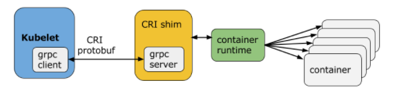

# CRI - Container Runtime Interface（容器运行时接口）

CRI中定义了**容器**和**镜像**的服务的接口，因为容器运行时与镜像的生命周期是彼此隔离的，因此需要定义两个服务。该接口使用[Protocol Buffer](https://developers.google.com/protocol-buffers/)，基于[gRPC](https://grpc.io/)，在Kubernetes v1.10+版本中是在[pkg/kubelet/apis/cri/runtime/v1alpha2](https://github.com/kubernetes/kubernetes/tree/master/pkg/kubelet/apis/cri/runtime/v1alpha2)的`api.proto`中定义的。

## CRI架构

Container Runtime实现了CRI gRPC Server，包括`RuntimeService`和`ImageService`。该gRPC Server需要监听本地的Unix socket，而kubelet则作为gRPC Client运行。



## 启用CRI

除非集成了rktnetes，否则CRI都是被默认启用了，从Kubernetes1.7版本开始，旧的预集成的docker CRI已经被移除。

要想启用CRI只需要在kubelet的启动参数重传入此参数：`--container-runtime-endpoint`远程运行时服务的端点。当前Linux上支持unix socket，windows上支持tcp。例如：`unix:///var/run/dockershim.sock`、 `tcp://localhost:373`，默认是`unix:///var/run/dockershim.sock`，即默认使用本地的docker作为容器运行时。

关于CRI的详细进展请参考[CRI: the Container Runtime Interface](https://github.com/kubernetes/community/blob/master/contributors/devel/container-runtime-interface.md)。

## CRI接口

Kubernetes 1.9中的CRI接口在`api.proto`中的定义如下：

```protobuf
// Runtime service defines the public APIs for remote container runtimes
service RuntimeService {
    // Version returns the runtime name, runtime version, and runtime API version.
    rpc Version(VersionRequest) returns (VersionResponse) {}

    // RunPodSandbox creates and starts a pod-level sandbox. Runtimes must ensure
    // the sandbox is in the ready state on success.
    rpc RunPodSandbox(RunPodSandboxRequest) returns (RunPodSandboxResponse) {}
    // StopPodSandbox stops any running process that is part of the sandbox and
    // reclaims network resources (e.g., IP addresses) allocated to the sandbox.
    // If there are any running containers in the sandbox, they must be forcibly
    // terminated.
    // This call is idempotent, and must not return an error if all relevant
    // resources have already been reclaimed. kubelet will call StopPodSandbox
    // at least once before calling RemovePodSandbox. It will also attempt to
    // reclaim resources eagerly, as soon as a sandbox is not needed. Hence,
    // multiple StopPodSandbox calls are expected.
    rpc StopPodSandbox(StopPodSandboxRequest) returns (StopPodSandboxResponse) {}
    // RemovePodSandbox removes the sandbox. If there are any running containers
    // in the sandbox, they must be forcibly terminated and removed.
    // This call is idempotent, and must not return an error if the sandbox has
    // already been removed.
    rpc RemovePodSandbox(RemovePodSandboxRequest) returns (RemovePodSandboxResponse) {}
    // PodSandboxStatus returns the status of the PodSandbox. If the PodSandbox is not
    // present, returns an error.
    rpc PodSandboxStatus(PodSandboxStatusRequest) returns (PodSandboxStatusResponse) {}
    // ListPodSandbox returns a list of PodSandboxes.
    rpc ListPodSandbox(ListPodSandboxRequest) returns (ListPodSandboxResponse) {}

    // CreateContainer creates a new container in specified PodSandbox
    rpc CreateContainer(CreateContainerRequest) returns (CreateContainerResponse) {}
    // StartContainer starts the container.
    rpc StartContainer(StartContainerRequest) returns (StartContainerResponse) {}
    // StopContainer stops a running container with a grace period (i.e., timeout).
    // This call is idempotent, and must not return an error if the container has
    // already been stopped.
    // TODO: what must the runtime do after the grace period is reached?
    rpc StopContainer(StopContainerRequest) returns (StopContainerResponse) {}
    // RemoveContainer removes the container. If the container is running, the
    // container must be forcibly removed.
    // This call is idempotent, and must not return an error if the container has
    // already been removed.
    rpc RemoveContainer(RemoveContainerRequest) returns (RemoveContainerResponse) {}
    // ListContainers lists all containers by filters.
    rpc ListContainers(ListContainersRequest) returns (ListContainersResponse) {}
    // ContainerStatus returns status of the container. If the container is not
    // present, returns an error.
    rpc ContainerStatus(ContainerStatusRequest) returns (ContainerStatusResponse) {}
    // UpdateContainerResources updates ContainerConfig of the container.
    rpc UpdateContainerResources(UpdateContainerResourcesRequest) returns (UpdateContainerResourcesResponse) {}

    // ExecSync runs a command in a container synchronously.
    rpc ExecSync(ExecSyncRequest) returns (ExecSyncResponse) {}
    // Exec prepares a streaming endpoint to execute a command in the container.
    rpc Exec(ExecRequest) returns (ExecResponse) {}
    // Attach prepares a streaming endpoint to attach to a running container.
    rpc Attach(AttachRequest) returns (AttachResponse) {}
    // PortForward prepares a streaming endpoint to forward ports from a PodSandbox.
    rpc PortForward(PortForwardRequest) returns (PortForwardResponse) {}

    // ContainerStats returns stats of the container. If the container does not
    // exist, the call returns an error.
    rpc ContainerStats(ContainerStatsRequest) returns (ContainerStatsResponse) {}
    // ListContainerStats returns stats of all running containers.
    rpc ListContainerStats(ListContainerStatsRequest) returns (ListContainerStatsResponse) {}

    // UpdateRuntimeConfig updates the runtime configuration based on the given request.
    rpc UpdateRuntimeConfig(UpdateRuntimeConfigRequest) returns (UpdateRuntimeConfigResponse) {}

    // Status returns the status of the runtime.
    rpc Status(StatusRequest) returns (StatusResponse) {}
}

// ImageService defines the public APIs for managing images.
service ImageService {
    // ListImages lists existing images.
    rpc ListImages(ListImagesRequest) returns (ListImagesResponse) {}
    // ImageStatus returns the status of the image. If the image is not
    // present, returns a response with ImageStatusResponse.Image set to
    // nil.
    rpc ImageStatus(ImageStatusRequest) returns (ImageStatusResponse) {}
    // PullImage pulls an image with authentication config.
    rpc PullImage(PullImageRequest) returns (PullImageResponse) {}
    // RemoveImage removes the image.
    // This call is idempotent, and must not return an error if the image has
    // already been removed.
    rpc RemoveImage(RemoveImageRequest) returns (RemoveImageResponse) {}
    // ImageFSInfo returns information of the filesystem that is used to store images.
    rpc ImageFsInfo(ImageFsInfoRequest) returns (ImageFsInfoResponse) {}
}
```

这其中包含了两个gRPC服务：

- **RuntimeService**：容器和Sandbox运行时管理。
- **ImageService**：提供了从镜像仓库拉取、查看、和移除镜像的RPC。

## 当前支持的CRI后端

我们最初在使用Kubernetes时通常会默认使用Docker作为容器运行时，其实从Kubernetes 1.5开始已经开始支持CRI，目前是处于Alpha版本，通过CRI接口可以指定使用其它容器运行时作为Pod的后端，目前支持 CRI 的后端有：

- [cri-o](https://github.com/kubernetes-incubator/cri-o)：同时兼容OCI和CRI的容器运行时
- [cri-containerd](https://github.com/containerd/cri-containerd)：基于[Containerd](https://github.com/containerd/containerd)的Kubernetes CRI 实现
- [rkt](https://coreos.com/rkt/)：由于CoreOS主推的用来跟docker抗衡的容器运行时
- [frakti](https://github.com/kubernetes/frakti)：基于hypervisor的CRI
- [docker](https://www.docker.com)：kuberentes最初就开始支持的容器运行时，目前还没完全从kubelet中解耦，docker公司同时推广了[OCI](https://www.opencontainers.org/)标准
- [Clear Containers](https://github.com/clearcontainers)：由Intel推出的同时兼容OCI和CRI的容器运行时
- [Kata Containers](https://katacontainers.io/)：符合OCI规范同时兼容CRI
- [gVisor](https://github.com/google/gvisor)：由谷歌推出的容器运行时沙箱(Experimental)

CRI是由[SIG-Node](https://kubernetes.slack.com/archives/sig-node)来维护的。

## 参考

- [Kubernetes CRI and Minikube](https://sreeninet.wordpress.com/2017/02/11/kubernetes-cri-and-minikube/)
- [CRI-O and Alternative Runtimes in Kubernetes](https://www.projectatomic.io/blog/2017/02/crio-runtimes/)
- [Docker、Containerd、RunC...：你应该知道的所有](http://www.infoq.com/cn/news/2017/02/Docker-Containerd-RunC)
