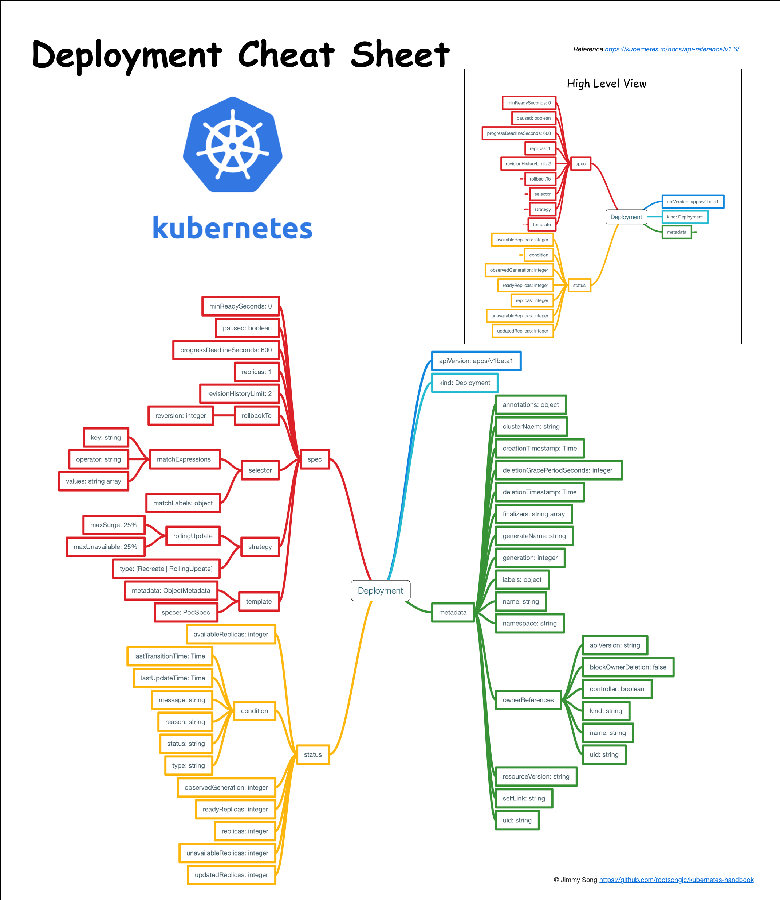

# Deployment

Deployment 为 Pod 和 ReplicaSet 提供了一个声明式定义（declarative）方法，用来替代以前的 ReplicationController 来方便的管理应用。典型的应用场景包括：

- 定义 Deployment 来创建 Pod 和 ReplicaSet
- 滚动升级和回滚应用
- 扩容和缩容
- 暂停和继续 Deployment

比如一个简单的 nginx 应用可以定义为：

```yaml
apiVersion: extensions/v1beta1
kind: Deployment
metadata:
  name: nginx-deployment
spec:
  replicas: 3
  template:
    metadata:
      labels:
        app: nginx
    spec:
      containers:
      - name: nginx
        image: nginx:1.7.9
        ports:
        - containerPort: 80
```

扩容：

```bash
kubectl scale deployment nginx-deployment --replicas 10
```

如果集群支持 horizontal pod autoscaling 的话，还可以为 Deployment 设置自动扩展：

```bash
kubectl autoscale deployment nginx-deployment --min=10 --max=15 --cpu-percent=80
```

更新镜像也比较简单：

```bash
kubectl set image deployment/nginx-deployment nginx=nginx:1.9.1
```

回滚：

```bash
kubectl rollout undo deployment/nginx-deployment
```

## Deployment 结构示意图



## Deployment 概念详细解析

本文翻译自 kubernetes 官方文档：https://kubernetes.io/docs/concepts/workloads/controllers/deployment

根据 2017 年 5 月 10 日的 Commit 8481c02 翻译。

## Deployment 是什么？

Deployment 为 Pod 和 Replica Set（下一代 Replication Controller）提供声明式更新。

您只需要在 Deployment 中描述您想要的目标状态是什么，Deployment controller 就会帮您将 Pod 和 ReplicaSet 的实际状态改变到您的目标状态。您可以定义一个全新的 Deployment 来创建 ReplicaSet 或者删除已有的 Deployment 并创建一个新的来替换。

**注意**：您不该手动管理由 Deployment 创建的 ReplicaSet，否则您就篡越了 Deployment controller 的职责！下文罗列了 Deployment 对象中已经覆盖了所有的用例。如果未有覆盖您所有需要的用例，请直接在 Kubernetes 的代码库中提 issue。

典型的用例如下：

- 使用 Deployment 来创建 ReplicaSet。ReplicaSet 在后台创建 pod。检查启动状态，看它是成功还是失败。
- 然后，通过更新 Deployment 的 PodTemplateSpec 字段来声明 Pod 的新状态。这会创建一个新的 ReplicaSet，Deployment 会按照控制的速率将 pod 从旧的 ReplicaSet 移动到新的 ReplicaSet 中。
- 如果当前状态不稳定，回滚到之前的 Deployment revision。每次回滚都会更新 Deployment 的 revision。
- 扩容 Deployment 以满足更高的负载。
- 暂停 Deployment 来应用 PodTemplateSpec 的多个修复，然后恢复上线。
- 根据 Deployment 的状态判断上线是否 hang 住了。
- 清除旧的不必要的 ReplicaSet。

## 创建 Deployment

下面是一个 Deployment 示例，它创建了一个 ReplicaSet 来启动 3 个 nginx pod。

下载示例文件并执行命令：

```bash
$ kubectl create -f https://kubernetes.io/docs/user-guide/nginx-deployment.yaml --record
deployment "nginx-deployment" created
```

将 kubectl 的`--record`的 flag 设置为`true` 可以在 annotation 中记录当前命令创建或者升级了该资源。这在未来会很有用，例如，查看在每个 Deployment revision 中执行了哪些命令。

然后立即执行 `get` 将获得如下结果：

```bash
$ kubectl get deployments
NAME               DESIRED   CURRENT   UP-TO-DATE   AVAILABLE   AGE
nginx-deployment   3         0         0            0           1s
```

输出结果表明我们希望的 repalica 数是 3（根据 deployment 中的`.spec.replicas`配置）当前 replica 数（`.status.replicas`）是 0, 最新的 replica 数（`.status.updatedReplicas`）是 0，可用的 replica 数（`.status.availableReplicas`）是 0。

过几秒后再执行 `get` 命令，将获得如下输出：

```bash
$ kubectl get deployments
NAME               DESIRED   CURRENT   UP-TO-DATE   AVAILABLE   AGE
nginx-deployment   3         3         3            3           18s
```

我们可以看到 Deployment 已经创建了 3 个 replica，所有的 replica 都已经是最新的了（包含最新的 pod template），可用的（根据 Deployment 中的`.spec.minReadySeconds`声明，处于已就绪状态的 pod 的最少个数）。执行`kubectl get rs`和`kubectl get pods`会显示 Replica Set（RS）和 Pod 已创建。

```bash
$ kubectl get rs
NAME                          DESIRED   CURRENT   READY   AGE
nginx-deployment-2035384211   3         3         0       18s
```

您可能会注意到 ReplicaSet 的名字总是`<Deployment 的名字>-<pod template 的 hash 值>`。

```bash
$ kubectl get pods --show-labels
NAME                                READY     STATUS    RESTARTS   AGE       LABELS
nginx-deployment-2035384211-7ci7o   1/1       Running   0          18s       app=nginx,pod-template-hash=2035384211
nginx-deployment-2035384211-kzszj   1/1       Running   0          18s       app=nginx,pod-template-hash=2035384211
nginx-deployment-2035384211-qqcnn   1/1       Running   0          18s       app=nginx,pod-template-hash=2035384211
```

刚创建的 Replica Set 将保证总是有 3 个 nginx 的 pod 存在。

**注意：** 您必须在 Deployment 中的 selector 指定正确的 pod template label（在该示例中是 `app = nginx`），不要跟其他的 controller 的 selector 中指定的 pod template label 搞混了（包括 Deployment、Replica Set、Replication Controller 等）。**Kubernetes 本身并不会阻止您任意指定 pod template label**，但是如果您真的这么做了，这些 controller 之间会相互打架，并可能导致不正确的行为。

### Pod-template-hash label

**注意**：这个 label 不是用户指定的！

注意上面示例输出中的 pod label 里的 pod-template-hash label。当 Deployment 创建或者接管 ReplicaSet 时，Deployment controller 会自动为 Pod 添加 pod-template-hash label。这样做的目的是防止 Deployment 的子 ReplicaSet 的 pod 名字重复。通过将 ReplicaSet 的 PodTemplate 进行哈希散列，使用生成的哈希值作为 label 的值，并添加到 ReplicaSet selector 里、 pod template label 和 ReplicaSet 管理中的 Pod 上。

## 更新 Deployment

**注意：**Deployment 的 rollout 当且仅当 Deployment 的 pod template（例如 `.spec.template`）中的 label 更新或者镜像更改时被触发。其他更新，例如扩容 Deployment 不会触发 rollout。

假如我们现在想要让 nginx pod 使用 `nginx:1.9.1` 的镜像来代替原来的 `nginx:1.7.9` 的镜像。

```bash
$ kubectl set image deployment/nginx-deployment nginx=nginx:1.9.1
deployment "nginx-deployment" image updated
```

我们可以使用`edit`命令来编辑 Deployment，修改`.spec.template.spec.containers [0].image`，将`nginx:1.7.9`改写成`nginx:1.9.1`。

```bash
$ kubectl edit deployment/nginx-deployment
deployment "nginx-deployment" edited
```

查看 rollout 的状态，只要执行：

```bash
$ kubectl rollout status deployment/nginx-deployment
Waiting for rollout to finish: 2 out of 3 new replicas have been updated...
deployment "nginx-deployment" successfully rolled out
```

Rollout 成功后，`get`Deployment：

```bash
$ kubectl get deployments
NAME               DESIRED   CURRENT   UP-TO-DATE   AVAILABLE   AGE
nginx-deployment   3         3         3            3           36s
```

UP-TO-DATE 的 replica 的数目已经达到了配置中要求的数目。

CURRENT 的 replica 数表示 Deployment 管理的 replica 数量，AVAILABLE 的 replica 数是当前可用的 replica 数量。

我们通过执行 `kubectl get rs` 可以看到 Deployment 更新了 Pod，通过创建一个新的 ReplicaSet 并扩容了 3 个 replica，同时将原来的 ReplicaSet 缩容到了 0 个 replica。

```bash
$ kubectl get rs
NAME                          DESIRED   CURRENT   READY   AGE
nginx-deployment-1564180365   3         3         0       6s
nginx-deployment-2035384211   0         0         0       36s
```

执行`get pods`只会看到当前的新的 pod：

```bash
$ kubectl get pods
NAME                                READY     STATUS    RESTARTS   AGE
nginx-deployment-1564180365-khku8   1/1       Running   0          14s
nginx-deployment-1564180365-nacti   1/1       Running   0          14s
nginx-deployment-1564180365-z9gth   1/1       Running   0          14s
```

下次更新这些 pod 的时候，只需要更新 Deployment 中的 pod 的 template 即可。

Deployment 可以保证在升级时只有一定数量的 Pod 是 down 的。默认的，它会确保至少有比期望的 Pod 数量少一个是 up 状态（最多一个不可用）。

Deployment 同时也可以确保只创建出超过期望数量的一定数量的 Pod。默认的，它会确保最多比期望的 Pod 数量多一个的 Pod 是 up 的（最多 1 个 surge ）。

**在未来的 Kuberentes 版本中，将从 1-1 变成 25%-25%。**

例如，如果您自己看下上面的 Deployment，您会发现，开始创建一个新的 Pod，然后删除一些旧的 Pod 再创建一个新的。当新的 Pod 创建出来之前不会杀掉旧的 Pod。这样能够确保可用的 Pod 数量至少有 2 个，Pod 的总数最多 4 个。

```bash
$ kubectl describe deployments
Name:           nginx-deployment
Namespace:      default
CreationTimestamp:  Tue, 15 Mar 2016 12:01:06 -0700
Labels:         app=nginx
Selector:       app=nginx
Replicas:       3 updated | 3 total | 3 available | 0 unavailable
StrategyType:       RollingUpdate
MinReadySeconds:    0
RollingUpdateStrategy:  1 max unavailable, 1 max surge
OldReplicaSets:     <none>
NewReplicaSet:      nginx-deployment-1564180365 (3/3 replicas created)
Events:
  FirstSeen LastSeen    Count   From                     SubobjectPath   Type        Reason              Message
  --------- --------    -----   ----                     -------------   --------    ------              -------
  36s       36s         1       {deployment-controller}                 Normal      ScalingReplicaSet   Scaled up replica set nginx-deployment-2035384211 to 3
  23s       23s         1       {deployment-controller}                 Normal      ScalingReplicaSet   Scaled up replica set nginx-deployment-1564180365 to 1
  23s       23s         1       {deployment-controller}                 Normal      ScalingReplicaSet   Scaled down replica set nginx-deployment-2035384211 to 2
  23s       23s         1       {deployment-controller}                 Normal      ScalingReplicaSet   Scaled up replica set nginx-deployment-1564180365 to 2
  21s       21s         1       {deployment-controller}                 Normal      ScalingReplicaSet   Scaled down replica set nginx-deployment-2035384211 to 0
  21s       21s         1       {deployment-controller}                 Normal      ScalingReplicaSet   Scaled up replica set nginx-deployment-1564180365 to 3
```

我们可以看到当我们刚开始创建这个 Deployment 的时候，创建了一个 ReplicaSet（nginx-deployment-2035384211），并直接扩容到了 3 个 replica。

当我们更新这个 Deployment 的时候，它会创建一个新的 ReplicaSet（nginx-deployment-1564180365），将它扩容到 1 个 replica，然后缩容原先的 ReplicaSet 到 2 个 replica，此时满足至少 2 个 Pod 是可用状态，同一时刻最多有 4 个 Pod 处于创建的状态。

接着继续使用相同的 rolling update 策略扩容新的 ReplicaSet 和缩容旧的 ReplicaSet。最终，将会在新的 ReplicaSet 中有 3 个可用的 replica，旧的 ReplicaSet 的 replica 数目变成 0。

### Rollover（多个 rollout 并行）

每当 Deployment controller 观测到有新的 deployment 被创建时，如果没有已存在的 ReplicaSet 来创建期望个数的 Pod 的话，就会创建出一个新的 ReplicaSet 来做这件事。已存在的 ReplicaSet 控制 label 与 `.spec.selector` 匹配但是 template 跟 `.spec.template` 不匹配的 Pod 缩容。最终，新的 ReplicaSet 将会扩容出 `.spec.replicas` 指定数目的 Pod，旧的 ReplicaSet 会缩容到 0。

如果您更新了一个的已存在并正在进行中的 Deployment，每次更新 Deployment 都会创建一个新的 ReplicaSet 并扩容它，同时回滚之前扩容的 ReplicaSet —— 将它添加到旧的 ReplicaSet 列表中，开始缩容。

例如，假如您创建了一个有 5 个 `niginx:1.7.9` replica 的 Deployment，但是当还只有 3 个 `nginx:1.7.9` 的 replica 创建出来的时候您就开始更新含有 5 个 `nginx:1.9.1` replica 的 Deployment。在这种情况下，Deployment 会立即杀掉已创建的 3 个 `nginx:1.7.9` 的 Pod，并开始创建 `nginx:1.9.1` 的 Pod。它不会等到所有的 5 个 `nginx:1.7.9` 的 Pod 都创建完成后才开始改变航道。

### Label selector 更新

我们通常不鼓励更新 label selector，我们建议事先规划好您的 selector。

任何情况下，只要您想要执行 label selector 的更新，请一定要谨慎并确认您已经预料到所有可能因此导致的后果。

- 增添 selector 需要同时在 Deployment 的 spec 中更新新的 label，否则将返回校验错误。此更改是不可覆盖的，这意味着新的 selector 不会选择使用旧 selector 创建的 ReplicaSet 和 Pod，从而导致所有旧版本的 ReplicaSet 都被丢弃，并创建新的 ReplicaSet。
- 更新 selector，即更改 selector key 的当前值，将导致跟增添 selector 同样的后果。
- 删除 selector，即删除 Deployment selector 中的已有的 key，不需要对 Pod template label 做任何更改，现有的 ReplicaSet 也不会成为孤儿，但是请注意，删除的 label 仍然存在于现有的 Pod 和 ReplicaSet 中。

## 回退 Deployment

有时候您可能想回退一个 Deployment，例如，当 Deployment 不稳定时，比如一直 crash looping。

默认情况下，kubernetes 会在系统中保存前两次的 Deployment 的 rollout 历史记录，以便您可以随时回退（您可以修改 `revision history limit` 来更改保存的 revision 数）。

**注意：**只要 Deployment 的 rollout 被触发就会创建一个 revision。也就是说当且仅当 Deployment 的 Pod template（如 `.spec.template`）被更改，例如更新 template 中的 label 和容器镜像时，就会创建出一个新的 revision。

其他的更新，比如扩容 Deployment 不会创建 revision—— 因此我们可以很方便的手动或者自动扩容。这意味着当您回退到历史 revision 时，只有 Deployment 中的 Pod template 部分才会回退。

假设我们在更新 Deployment 的时候犯了一个拼写错误，将镜像的名字写成了 `nginx:1.91`，而正确的名字应该是 `nginx:1.9.1`：

```bash
$ kubectl set image deployment/nginx-deployment nginx=nginx:1.91
deployment "nginx-deployment" image updated
```

Rollout 将会卡住。

```bash
$ kubectl rollout status deployments nginx-deployment
Waiting for rollout to finish: 2 out of 3 new replicas have been updated...
```

按住 Ctrl-C 停止上面的 rollout 状态监控。

您会看到旧的 replica（nginx-deployment-1564180365 和 nginx-deployment-2035384211）和新的 replica （nginx-deployment-3066724191）数目都是 2 个。

```bash
$ kubectl get rs
NAME                          DESIRED   CURRENT   READY   AGE
nginx-deployment-1564180365   2         2         0       25s
nginx-deployment-2035384211   0         0         0       36s
nginx-deployment-3066724191   2         2         2       6s
```

看下创建 Pod，您会看到有两个新的 ReplicaSet 创建的 Pod 处于 ImagePullBackOff 状态，循环拉取镜像。

```bash
$ kubectl get pods
NAME                                READY     STATUS             RESTARTS   AGE
nginx-deployment-1564180365-70iae   1/1       Running            0          25s
nginx-deployment-1564180365-jbqqo   1/1       Running            0          25s
nginx-deployment-3066724191-08mng   0/1       ImagePullBackOff   0          6s
nginx-deployment-3066724191-eocby   0/1       ImagePullBackOff   0          6s
```

注意，Deployment controller 会自动停止坏的 rollout，并停止扩容新的 ReplicaSet。

```bash
$ kubectl describe deployment
Name:           nginx-deployment
Namespace:      default
CreationTimestamp:  Tue, 15 Mar 2016 14:48:04 -0700
Labels:         app=nginx
Selector:       app=nginx
Replicas:       2 updated | 3 total | 2 available | 2 unavailable
StrategyType:       RollingUpdate
MinReadySeconds:    0
RollingUpdateStrategy:  1 max unavailable, 1 max surge
OldReplicaSets:     nginx-deployment-1564180365 (2/2 replicas created)
NewReplicaSet:      nginx-deployment-3066724191 (2/2 replicas created)
Events:
  FirstSeen LastSeen    Count   From                    SubobjectPath   Type        Reason              Message
  --------- --------    -----   ----                    -------------   --------    ------              -------
  1m        1m          1       {deployment-controller}                Normal      ScalingReplicaSet   Scaled up replica set nginx-deployment-2035384211 to 3
  22s       22s         1       {deployment-controller}                Normal      ScalingReplicaSet   Scaled up replica set nginx-deployment-1564180365 to 1
  22s       22s         1       {deployment-controller}                Normal      ScalingReplicaSet   Scaled down replica set nginx-deployment-2035384211 to 2
  22s       22s         1       {deployment-controller}                Normal      ScalingReplicaSet   Scaled up replica set nginx-deployment-1564180365 to 2
  21s       21s         1       {deployment-controller}                Normal      ScalingReplicaSet   Scaled down replica set nginx-deployment-2035384211 to 0
  21s       21s         1       {deployment-controller}                Normal      ScalingReplicaSet   Scaled up replica set nginx-deployment-1564180365 to 3
  13s       13s         1       {deployment-controller}                Normal      ScalingReplicaSet   Scaled up replica set nginx-deployment-3066724191 to 1
  13s       13s         1       {deployment-controller}                Normal      ScalingReplicaSet   Scaled down replica set nginx-deployment-1564180365 to 2
  13s       13s         1       {deployment-controller}                Normal      ScalingReplicaSet   Scaled up replica set nginx-deployment-3066724191 to 2
```

为了修复这个问题，我们需要回退到稳定的 Deployment revision。

### 检查 Deployment 升级的历史记录

首先，检查下 Deployment 的 revision：

```bash
$ kubectl rollout history deployment/nginx-deployment
deployments "nginx-deployment":
REVISION    CHANGE-CAUSE
1           kubectl create -f https://kubernetes.io/docs/user-guide/nginx-deployment.yaml--record
2           kubectl set image deployment/nginx-deployment nginx=nginx:1.9.1
3           kubectl set image deployment/nginx-deployment nginx=nginx:1.91
```

因为我们创建 Deployment 的时候使用了`--record` 参数可以记录命令，我们可以很方便的查看每次 revision 的变化。

查看单个 revision 的详细信息：

```bash
$ kubectl rollout history deployment/nginx-deployment --revision=2
deployments "nginx-deployment" revision 2
  Labels:       app=nginx
          pod-template-hash=1159050644
  Annotations:  kubernetes.io/change-cause=kubectl set image deployment/nginx-deployment nginx=nginx:1.9.1
  Containers:
   nginx:
    Image:      nginx:1.9.1
    Port:       80/TCP
     QoS Tier:
        cpu:      BestEffort
        memory:   BestEffort
    Environment Variables:      <none>
  No volumes.
```

### 回退到历史版本

现在，我们可以决定回退当前的 rollout 到之前的版本：

```bash
$ kubectl rollout undo deployment/nginx-deployment
deployment "nginx-deployment" rolled back
```

也可以使用`--revision`参数指定某个历史版本：

```bash
$ kubectl rollout undo deployment/nginx-deployment --to-revision=2
deployment "nginx-deployment" rolled back
```

该 Deployment 现在已经回退到了先前的稳定版本。如您所见，Deployment controller 产生了一个回退到 revison 2 的`DeploymentRollback`的 event。

```bash
$ kubectl get deployment
NAME               DESIRED   CURRENT   UP-TO-DATE   AVAILABLE   AGE
nginx-deployment   3         3         3            3           30m

$ kubectl describe deployment
Name:           nginx-deployment
Namespace:      default
CreationTimestamp:  Tue, 15 Mar 2016 14:48:04 -0700
Labels:         app=nginx
Selector:       app=nginx
Replicas:       3 updated | 3 total | 3 available | 0 unavailable
StrategyType:       RollingUpdate
MinReadySeconds:    0
RollingUpdateStrategy:  1 max unavailable, 1 max surge
OldReplicaSets:     <none>
NewReplicaSet:      nginx-deployment-1564180365 (3/3 replicas created)
Events:
  FirstSeen LastSeen    Count   From                    SubobjectPath   Type        Reason              Message
  --------- --------    -----   ----                    -------------   --------    ------              -------
  30m       30m         1       {deployment-controller}                Normal      ScalingReplicaSet   Scaled up replica set nginx-deployment-2035384211 to 3
  29m       29m         1       {deployment-controller}                Normal      ScalingReplicaSet   Scaled up replica set nginx-deployment-1564180365 to 1
  29m       29m         1       {deployment-controller}                Normal      ScalingReplicaSet   Scaled down replica set nginx-deployment-2035384211 to 2
  29m       29m         1       {deployment-controller}                Normal      ScalingReplicaSet   Scaled up replica set nginx-deployment-1564180365 to 2
  29m       29m         1       {deployment-controller}                Normal      ScalingReplicaSet   Scaled down replica set nginx-deployment-2035384211 to 0
  29m       29m         1       {deployment-controller}                Normal      ScalingReplicaSet   Scaled up replica set nginx-deployment-3066724191 to 2
  29m       29m         1       {deployment-controller}                Normal      ScalingReplicaSet   Scaled up replica set nginx-deployment-3066724191 to 1
  29m       29m         1       {deployment-controller}                Normal      ScalingReplicaSet   Scaled down replica set nginx-deployment-1564180365 to 2
  2m        2m          1       {deployment-controller}                Normal      ScalingReplicaSet   Scaled down replica set nginx-deployment-3066724191 to 0
  2m        2m          1       {deployment-controller}                Normal      DeploymentRollback  Rolled back deployment "nginx-deployment" to revision 2
  29m       2m          2       {deployment-controller}                Normal      ScalingReplicaSet   Scaled up replica set nginx-deployment-1564180365 to 3
```

### 清理 Policy

您可以通过设置 `.spec.revisonHistoryLimit` 项来指定 deployment 最多保留多少 revision 历史记录。默认的会保留所有的 revision；如果将该项设置为 0，Deployment 就不允许回退了。

## Deployment 扩容

您可以使用以下命令扩容 Deployment：

```bash
$ kubectl scale deployment nginx-deployment --replicas 10
deployment "nginx-deployment" scaled
```

假设您的集群中启用了 [horizontal pod autoscaling](https://kubernetes.io/docs/tasks/run-application/horizontal-pod-autoscale-walkthrough)，您可以给 Deployment 设置一个 autoscaler，基于当前 Pod 的 CPU 利用率选择最少和最多的 Pod 数。

```bash
$ kubectl autoscale deployment nginx-deployment --min=10 --max=15 --cpu-percent=80
deployment "nginx-deployment" autoscaled
```

### 比例扩容

RollingUpdate Deployment 支持同时运行一个应用的多个版本。或者 autoscaler 扩 容 RollingUpdate Deployment 的时候，正在中途的 rollout（进行中或者已经暂停的），为了降低风险，Deployment controller 将会平衡已存在的活动中的 ReplicaSet（有 Pod 的 ReplicaSet）和新加入的 replica。这被称为比例扩容。

例如，您正在运行中含有 10 个 replica 的 Deployment。maxSurge=3，maxUnavailable=2。

```bash
$ kubectl get deploy
NAME                 DESIRED   CURRENT   UP-TO-DATE   AVAILABLE   AGE
nginx-deployment     10        10        10           10          50s
```

您更新了一个镜像，而在集群内部无法解析。

```bash
$ kubectl set image deploy/nginx-deployment nginx=nginx:sometag
deployment "nginx-deployment" image updated
```

镜像更新启动了一个包含 ReplicaSet nginx-deployment-1989198191 的新的 rollout，但是它被阻塞了，因为我们上面提到的 maxUnavailable。

```bash
$ kubectl get rs
NAME                          DESIRED   CURRENT   READY     AGE
nginx-deployment-1989198191   5         5         0         9s
nginx-deployment-618515232    8         8         8         1m
```

然后发起了一个新的 Deployment 扩容请求。autoscaler 将 Deployment 的 repllica 数目增加到了 15 个。Deployment controller 需要判断在哪里增加这 5 个新的 replica。如果我们没有谁用比例扩容，所有的 5 个 replica 都会加到一个新的 ReplicaSet 中。如果使用比例扩容，新添加的 replica 将传播到所有的 ReplicaSet 中。大的部分加入 replica 数最多的 ReplicaSet 中，小的部分加入到 replica 数少的 ReplciaSet 中。0 个 replica 的 ReplicaSet 不会被扩容。

在我们上面的例子中，3 个 replica 将添加到旧的 ReplicaSet 中，2 个 replica 将添加到新的 ReplicaSet 中。rollout 进程最终会将所有的 replica 移动到新的 ReplicaSet 中，假设新的 replica 成为健康状态。

```bash
$ kubectl get deploy
NAME                 DESIRED   CURRENT   UP-TO-DATE   AVAILABLE   AGE
nginx-deployment     15        18        7            8           7m
$ kubectl get rs
NAME                          DESIRED   CURRENT   READY     AGE
nginx-deployment-1989198191   7         7         0         7m
nginx-deployment-618515232    11        11        11        7m
```

## 删除 autoscale

```bash
kubectl get hpa
kubectl delete hpa ${name of hpa}
```

## 暂停和恢复 Deployment

您可以在发出一次或多次更新前暂停一个 Deployment，然后再恢复它。这样您就能在 Deployment 暂停期间进行多次修复工作，而不会发出不必要的 rollout。

例如使用刚刚创建 Deployment：

```bash
$ kubectl get deploy
NAME      DESIRED   CURRENT   UP-TO-DATE   AVAILABLE   AGE
nginx     3         3         3            3           1m
[mkargaki@dhcp129-211 kubernetes]$ kubectl get rs
NAME               DESIRED   CURRENT   READY     AGE
nginx-2142116321   3         3         3         1m
```

使用以下命令暂停 Deployment：

```bash
$ kubectl rollout pause deployment/nginx-deployment
deployment "nginx-deployment" paused
```

然后更新 Deplyment 中的镜像：

```bash
$ kubectl set image deploy/nginx nginx=nginx:1.9.1
deployment "nginx-deployment" image updated
```

注意新的 rollout 启动了：

```bash
$ kubectl rollout history deploy/nginx
deployments "nginx"
REVISION  CHANGE-CAUSE
1   <none>

$ kubectl get rs
NAME               DESIRED   CURRENT   READY     AGE
nginx-2142116321   3         3         3         2m
```

您可以进行任意多次更新，例如更新使用的资源：

```bash
$ kubectl set resources deployment nginx -c=nginx --limits=cpu=200m,memory=512Mi
deployment "nginx" resource requirements updated
```

Deployment 暂停前的初始状态将继续它的功能，而不会对 Deployment 的更新产生任何影响，只要 Deployment 是暂停的。

最后，恢复这个 Deployment，观察完成更新的 ReplicaSet 已经创建出来了：

```bash
$ kubectl rollout resume deploy nginx
deployment "nginx" resumed
$ KUBECTL get rs -w
NAME               DESIRED   CURRENT   READY     AGE
nginx-2142116321   2         2         2         2m
nginx-3926361531   2         2         0         6s
nginx-3926361531   2         2         1         18s
nginx-2142116321   1         2         2         2m
nginx-2142116321   1         2         2         2m
nginx-3926361531   3         2         1         18s
nginx-3926361531   3         2         1         18s
nginx-2142116321   1         1         1         2m
nginx-3926361531   3         3         1         18s
nginx-3926361531   3         3         2         19s
nginx-2142116321   0         1         1         2m
nginx-2142116321   0         1         1         2m
nginx-2142116321   0         0         0         2m
nginx-3926361531   3         3         3         20s
^C
$ KUBECTL get rs
NAME               DESIRED   CURRENT   READY     AGE
nginx-2142116321   0         0         0         2m
nginx-3926361531   3         3         3         28s
```

**注意：**在恢复 Deployment 之前您无法回退一个已经暂停的 Deployment。

## Deployment 状态

Deployment 在生命周期中有多种状态。在创建一个新的 ReplicaSet 的时候它可以是 [progressing](https://kubernetes.io/docs/concepts/workloads/controllers/deployment#progressing-deployment) 状态， [complete](https://kubernetes.io/docs/concepts/workloads/controllers/deployment#complete-deployment) 状态，或者 [fail to progress](https://kubernetes.io/docs/concepts/workloads/controllers/deployment#failed-deployment) 状态。

### 进行中的 Deployment

Kubernetes 将执行过下列任务之一的 Deployment 标记为 *progressing* 状态：

- Deployment 正在创建新的 ReplicaSet 过程中。
- Deployment 正在扩容一个已有的 ReplicaSet。
- Deployment 正在缩容一个已有的 ReplicaSet。
- 有新的可用的 pod 出现。

您可以使用 `kubectl rollout status` 命令监控 Deployment 的进度。

### 完成的 Deployment

Kubernetes 将包括以下特性的 Deployment 标记为 *complete* 状态：

- Deployment 最小可用。最小可用意味着 Deployment 的可用 replica 个数等于或者超过 Deployment 策略中的期望个数。
- 所有与该 Deployment 相关的 replica 都被更新到了您指定版本，也就说更新完成。
- 该 Deployment 中没有旧的 Pod 存在。

您可以用 `kubectl rollout status` 命令查看 Deployment 是否完成。如果 rollout 成功完成，`kubectl rollout status` 将返回一个 0 值的 Exit Code。

```bash
$ kubectl rollout status deploy/nginx
Waiting for rollout to finish: 2 of 3 updated replicas are available...
deployment "nginx" successfully rolled out
$ echo $?
0
```

### 失败的 Deployment

您的 Deployment 在尝试部署新的 ReplicaSet 的时候可能卡住，永远也不会完成。这可能是因为以下几个因素引起的：

- 无效的引用
- 不可读的 probe failure
- 镜像拉取错误
- 权限不够
- 范围限制
- 程序运行时配置错误

探测这种情况的一种方式是，在您的 Deployment spec 中指定 [`spec.progressDeadlineSeconds`](https://kubernetes.io/docs/concepts/workloads/controllers/deployment#progress-deadline-seconds)。`spec.progressDeadlineSeconds` 表示 Deployment controller 等待多少秒才能确定（通过 Deployment status）Deployment 进程是卡住的。

下面的 `kubectl` 命令设置 `progressDeadlineSeconds` 使 controller 在 Deployment 在进度卡住 10 分钟后报告：

```bash
$ kubectl patch deployment/nginx-deployment -p '{"spec":{"progressDeadlineSeconds":600}}'
"nginx-deployment" patched
```

当超过截止时间后，Deployment controller 会在 Deployment 的`status.conditions` 中增加一条 DeploymentCondition，它包括如下属性：

- Type=Progressing
- Status=False
- Reason=ProgressDeadlineExceeded

**注意：**kubernetes 除了报告 `Reason=ProgressDeadlineExceeded` 状态信息外不会对卡住的 Deployment 做任何操作。更高层次的协调器可以利用它并采取相应行动，例如，回滚 Deployment 到之前的版本。

**注意：**如果您暂停了一个 Deployment，在暂停的这段时间内 kubernetnes 不会检查您指定的 deadline。您可以在 Deployment 的 rollout 途中安全的暂停它，然后再恢复它，这不会触发超过 deadline 的状态。

您可能在使用 Deployment 的时候遇到一些短暂的错误，这些可能是由于您设置了太短的 timeout，也有可能是因为各种其他错误导致的短暂错误。例如，假设您使用了无效的引用。当您 Describe Deployment 的时候可能会注意到如下信息：

```bash
$ kubectl describe deployment nginx-deployment
<...>
Conditions:
  Type            Status  Reason
----            ------  ------
  Available       True    MinimumReplicasAvailable
  Progressing     True    ReplicaSetUpdated
  ReplicaFailure  True    FailedCreate
<...>
```

执行`kubectl get deployment nginx-deployment -o yaml`，Deployement 的状态可能看起来像这个样子：

```yaml
status:
  availableReplicas: 2
  conditions:
  - lastTransitionTime: 2016-10-04T12:25:39Z
    lastUpdateTime: 2016-10-04T12:25:39Z
    message: Replica set "nginx-deployment-4262182780" is progressing.
    reason: ReplicaSetUpdated
    status: "True"
    type: Progressing
  - lastTransitionTime: 2016-10-04T12:25:42Z
    lastUpdateTime: 2016-10-04T12:25:42Z
    message: Deployment has minimum availability.
    reason: MinimumReplicasAvailable
    status: "True"
    type: Available
  - lastTransitionTime: 2016-10-04T12:25:39Z
    lastUpdateTime: 2016-10-04T12:25:39Z
    message: 'Error creating: pods "nginx-deployment-4262182780-" is forbidden: exceeded quota:
      object-counts, requested: pods=1, used: pods=3, limited: pods=2'
    reason: FailedCreate
    status: "True"
    type: ReplicaFailure
    observedGeneration: 3
    replicas: 2
    unavailableReplicas: 2
```

最终，一旦超过 Deployment 进程的 deadline，kubernetes 会更新状态和导致 Progressing 状态的原因：

```bash
Conditions:
    Type            Status  Reason
----            ------  ------
  Available       True    MinimumReplicasAvailable
  Progressing     False   ProgressDeadlineExceeded
  ReplicaFailure  True    FailedCreate

```

您可以通过缩容 Deployment 的方式解决配额不足的问题，或者增加您的 namespace 的配额。如果您满足了配额条件后，Deployment controller 就会完成您的 Deployment rollout，您将看到 Deployment 的状态更新为成功状态（`Status=True`并且`Reason=NewReplicaSetAvailable`）。

```bash
Conditions:
  Type          Status  Reason
----          ------  ------
  Available     True    MinimumReplicasAvailable
  Progressing   True    NewReplicaSetAvailable
```

`Type=Available`、 `Status=True` 意味着您的 Deployment 有最小可用性。 最小可用性是在 Deployment 策略中指定的参数。`Type=Progressing` 、 `Status=True` 意味着您的 Deployment 或者在部署过程中，或者已经成功部署，达到了期望的最少的可用 replica 数量（查看特定状态的 Reason—— 在我们的例子中 `Reason=NewReplicaSetAvailable` 意味着 Deployment 已经完成）。

您可以使用 `kubectl rollout status` 命令查看 Deployment 进程是否失败。当 Deployment 过程超过了 deadline，`kubectl rollout status` 将返回非 0 的 exit code。

```bash
$ kubectl rollout status deploy/nginx
Waiting for rollout to finish: 2 out of 3 new replicas have been updated...
error: deployment "nginx" exceeded its progress deadline
$ echo $?
1
```

### 操作失败的 Deployment

所有对完成的 Deployment 的操作都适用于失败的 Deployment。您可以对它扩 / 缩容，回退到历史版本，您甚至可以多次暂停它来应用 Deployment pod template。

## 清理 Policy

您可以设置 Deployment 中的 `.spec.revisionHistoryLimit` 项来指定保留多少旧的 ReplicaSet。 余下的将在后台被当作垃圾收集。默认的，所有的 revision 历史就都会被保留。在未来的版本中，将会更改为 2。

**注意：**将该值设置为 0，将导致所有的 Deployment 历史记录都会被清除，该 Deployment 就无法再回退了。

## 用例

### 金丝雀 Deployment

如果您想要使用 Deployment 对部分用户或服务器发布 release，您可以创建多个 Deployment，每个 Deployment 对应一个 release，参照 [managing resources](https://kubernetes.io/docs/concepts/cluster-administration/manage-deployment/#canary-deployments) 中对金丝雀模式的描述。

## 编写 Deployment Spec

在所有的 Kubernetes 配置中，Deployment 也需要 `apiVersion`，`kind` 和 `metadata` 这些配置项。配置文件的通用使用说明查看 [部署应用](https://kubernetes.io/docs/tasks/run-application/run-stateless-application-deployment/)，配置容器，和使用 kubectl 管理资源文档。

### Pod Template

`.spec.template` 是 `.spec` 中唯一要求的字段。

`.spec.template` 是 [pod template](https://kubernetes.io/docs/user-guide/replication-controller/#pod-template). 它跟 [Pod](https://kubernetes.io/docs/user-guide/pods) 有一模一样的 schema，除了它是嵌套的并且不需要 `apiVersion` 和 `kind` 字段。

另外为了划分 Pod 的范围，Deployment 中的 pod template 必须指定适当的 label（不要跟其他 controller 重复了，参考 [selector](https://kubernetes.io/docs/concepts/workloads/controllers/deployment#selector)）和适当的重启策略。

[`.spec.template.spec.restartPolicy`](https://kubernetes.io/docs/concepts/workloads/pods/pod-lifecycle) 可以设置为 `Always` , 如果不指定的话这就是默认配置。

### Replicas

`.spec.replicas` 是可以选字段，指定期望的 pod 数量，默认是 1。

### Selector

`.spec.selector` 是可选字段，用来指定 [label selector](https://kubernetes.io/docs/concepts/overview/working-with-objects/labels) ，圈定 Deployment 管理的 pod 范围。

如果被指定， `.spec.selector` 必须匹配 `.spec.template.metadata.labels`，否则它将被 API 拒绝。如果 `.spec.selector` 没有被指定， `.spec.selector.matchLabels` 默认是 `.spec.template.metadata.labels`。

在 Pod 的 template 跟 `.spec.template` 不同或者数量超过了 `.spec.replicas` 规定的数量的情况下，Deployment 会杀掉 label 跟 selector 不同的 Pod。

**注意：**您不应该再创建其他 label 跟这个 selector 匹配的 pod，或者通过其他 Deployment，或者通过其他 Controller，例如 ReplicaSet 和 ReplicationController。否则该 Deployment 会被把它们当成都是自己创建的。Kubernetes 不会阻止您这么做。

如果您有多个 controller 使用了重复的 selector，controller 们就会互相打架并导致不正确的行为。

### 策略

`.spec.strategy` 指定新的 Pod 替换旧的 Pod 的策略。 `.spec.strategy.type` 可以是 "Recreate" 或者是 "RollingUpdate"。"RollingUpdate" 是默认值。

#### Recreate Deployment

`.spec.strategy.type==Recreate` 时，在创建出新的 Pod 之前会先杀掉所有已存在的 Pod。

#### Rolling Update Deployment

`.spec.strategy.type==RollingUpdate` 时，Deployment 使用 [rolling update](https://kubernetes.io/docs/tasks/run-application/rolling-update-replication-controller) 的方式更新 Pod 。您可以指定 `maxUnavailable` 和 `maxSurge` 来控制 rolling update 进程。

##### Max Unavailable

`.spec.strategy.rollingUpdate.maxUnavailable` 是可选配置项，用来指定在升级过程中不可用 Pod 的最大数量。该值可以是一个绝对值（例如 5），也可以是期望 Pod 数量的百分比（例如 10%）。通过计算百分比的绝对值向下取整。如果 `.spec.strategy.rollingUpdate.maxSurge` 为 0 时，这个值不可以为 0。默认值是 1。

例如，该值设置成 30%，启动 rolling update 后旧的 ReplicatSet 将会立即缩容到期望的 Pod 数量的 70%。新的 Pod ready 后，随着新的 ReplicaSet 的扩容，旧的 ReplicaSet 会进一步缩容，确保在升级的所有时刻可以用的 Pod 数量至少是期望 Pod 数量的 70%。

##### Max Surge

`.spec.strategy.rollingUpdate.maxSurge` 是可选配置项，用来指定可以超过期望的 Pod 数量的最大个数。该值可以是一个绝对值（例如 5）或者是期望的 Pod 数量的百分比（例如 10%）。当 `MaxUnavailable` 为 0 时该值不可以为 0。通过百分比计算的绝对值向上取整。默认值是 1。

例如，该值设置成 30%，启动 rolling update 后新的 ReplicatSet 将会立即扩容，新老 Pod 的总数不能超过期望的 Pod 数量的 130%。旧的 Pod 被杀掉后，新的 ReplicaSet 将继续扩容，旧的 ReplicaSet 会进一步缩容，确保在升级的所有时刻所有的 Pod 数量和不会超过期望 Pod 数量的 130%。

### Progress Deadline Seconds

`.spec.progressDeadlineSeconds` 是可选配置项，用来指定在系统报告 Deployment 的 [failed progressing](https://kubernetes.io/docs/concepts/workloads/controllers/deployment#failed-deployment) —— 表现为 resource 的状态中 `type=Progressing`、`Status=False`、 `Reason=ProgressDeadlineExceeded` 前可以等待的 Deployment 进行的秒数。Deployment controller 会继续重试该 Deployment。未来，在实现了自动回滚后， deployment controller 在观察到这种状态时就会自动回滚。

如果设置该参数，该值必须大于 `.spec.minReadySeconds`。

### Min Ready Seconds

`.spec.minReadySeconds` 是一个可选配置项，用来指定没有任何容器 crash 的 Pod 并被认为是可用状态的最小秒数。默认是 0（Pod 在 ready 后就会被认为是可用状态）。进一步了解什么什么后 Pod 会被认为是 ready 状态，参阅 [Container Probes](https://kubernetes.io/docs/concepts/workloads/pods/pod-lifecycle/#container-probes)。

### Rollback To

`.spec.rollbackTo` 是一个可以选配置项，用来配置 Deployment 回退的配置。设置该参数将触发回退操作，每次回退完成后，该值就会被清除。

#### Revision

`.spec.rollbackTo.revision` 是一个可选配置项，用来指定回退到的 revision。默认是 0，意味着回退到上一个 revision。

### Revision History Limit

Deployment revision history 存储在它控制的 ReplicaSets 中。

`.spec.revisionHistoryLimit` 是一个可选配置项，用来指定可以保留的旧的 ReplicaSet 数量。该理想值取决于心 Deployment 的频率和稳定性。如果该值没有设置的话，默认所有旧的 Replicaset 或会被保留，将资源存储在 etcd 中，是用 `kubectl get rs` 查看输出。每个 Deployment 的该配置都保存在 ReplicaSet 中，然而，一旦您删除的旧的 RepelicaSet，您的 Deployment 就无法再回退到那个 revison 了。

如果您将该值设置为 0，所有具有 0 个 replica 的 ReplicaSet 都会被删除。在这种情况下，新的 Deployment rollout 无法撤销，因为 revision history 都被清理掉了。

### Paused

`.spec.paused` 是可以可选配置项，boolean 值。用来指定暂停和恢复 Deployment。Paused 和没有 paused 的 Deployment 之间的唯一区别就是，所有对 paused deployment 中的 PodTemplateSpec 的修改都不会触发新的 rollout。Deployment 被创建之后默认是非 paused。