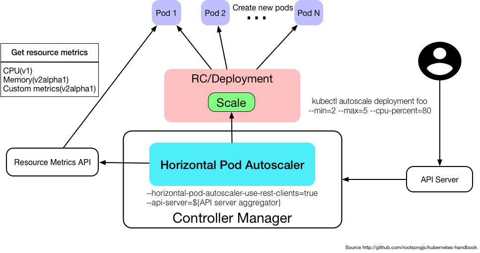

# Horizontal Pod Autoscaling

应用的资源使用率通常都有高峰和低谷的时候，如何削峰填谷，提高集群的整体资源利用率，让service中的Pod个数自动调整呢？这就有赖于Horizontal Pod Autoscaling了，顾名思义，使Pod水平自动缩放。这个Object（跟Pod、Deployment一样都是API resource）也是最能体现kubernetes之于传统运维价值的地方，不再需要手动扩容了，终于实现自动化了，还可以自定义指标，没准未来还可以通过人工智能自动进化呢！

HPA属于Kubernetes中的**autoscaling** SIG（Special Interest Group），其下有两个feature：

- [Arbitrary/Custom Metrics in the Horizontal Pod Autoscaler#117](https://github.com/kubernetes/features/issues/117)
- [Monitoring Pipeline Metrics HPA API #118](https://github.com/kubernetes/features/issues/118)

Kubernetes自1.2版本引入HPA机制，到1.6版本之前一直是通过kubelet来获取监控指标来判断是否需要扩缩容，1.6版本之后必须通过API server、Heapseter或者kube-aggregator来获取监控指标。

对于1.6以前版本中开启自定义HPA请参考[Kubernetes autoscaling based on custom metrics without using a host port](https://medium.com/@marko.luksa/kubernetes-autoscaling-based-on-custom-metrics-without-using-a-host-port-b783ed6241ac)，对于1.7及以上版本请参考[Configure Kubernetes Autoscaling With Custom Metrics in Kubernetes 1.7 - Bitnami](https://docs.bitnami.com/kubernetes/how-to/configure-autoscaling-custom-metrics/)。

## HPA解析

Horizontal Pod Autoscaling仅适用于Deployment和ReplicaSet，在V1版本中仅支持根据Pod的CPU利用率扩所容，在v1alpha版本中，支持根据内存和用户自定义的metric扩缩容。

如果你不想看下面的文章可以直接看下面的示例图，组件交互、组件的配置、命令示例，都画在图上了。

Horizontal Pod Autoscaling由API server和controller共同实现。



## Metrics支持

在不同版本的API中，HPA autoscale时可以根据以下指标来判断：

- autoscaling/v1
  - CPU
- autoscaling/v1alpha1
  - 内存
  - 自定义metrics
    - kubernetes1.6起支持自定义metrics，但是必须在kube-controller-manager中配置如下两项：
      - `--horizontal-pod-autoscaler-use-rest-clients=true`
      - `--api-server`指向[kube-aggregator](https://github.com/kubernetes/kube-aggregator)，也可以使用heapster来实现，通过在启动heapster的时候指定`--api-server=true`。查看[kubernetes metrics](https://github.com/kubernetes/metrics)
  - 多种metrics组合
    - HPA会根据每个metric的值计算出scale的值，并将最大的那个值作为扩容的最终结果。

## 使用kubectl管理

Horizontal Pod Autoscaling作为API resource也可以像Pod、Deployment一样使用kubeclt命令管理，使用方法跟它们一样，资源名称为`hpa`。

```bash
kubectl create hpa
kubectl get hpa
kubectl describe hpa
kubectl delete hpa
```

有一点不同的是，可以直接使用`kubectl autoscale`直接通过命令行的方式创建Horizontal Pod Autoscaler。

用法如下：

```bash
kubectl autoscale (-f FILENAME | TYPE NAME | TYPE/NAME) [--min=MINPODS] --max=MAXPODS
[--cpu-percent=CPU] [flags] [options]
```

举个例子：

```bash
kubectl autoscale deployment foo --min=2 --max=5 --cpu-percent=80
```

为Deployment foo创建 一个autoscaler，当Pod的CPU利用率达到80%的时候，RC的replica数在2到5之间。

**注意** ：如果为ReplicaSet创建HPA的话，无法使用rolling update，但是对于Deployment来说是可以的，因为Deployment在执行rolling update的时候会自动创建新的ReplicationController。

## 什么是 Horizontal Pod Autoscaling？

利用 Horizontal Pod Autoscaling，kubernetes 能够根据监测到的 CPU 利用率（或者在 alpha 版本中支持的应用提供的 metric）自动的扩容 replication controller，deployment 和 replica set。

Horizontal Pod Autoscaler 作为 kubernetes API resource 和 controller 的实现。Resource 确定 controller 的行为。Controller 会根据监测到用户指定的目标的 CPU 利用率周期性得调整 replication controller 或 deployment 的 replica 数量。

## Horizontal Pod Autoscaler 如何工作？

Horizontal Pod Autoscaler 由一个控制循环实现，循环周期由 controller manager 中的 `--horizontal-pod-autoscaler-sync-period` 标志指定（默认是 30 秒）。

在每个周期内，controller manager 会查询 HorizontalPodAutoscaler 中定义的 metric 的资源利用率。Controller manager 从 resource metric API（每个 pod 的 resource metric）或者自定义 metric API（所有的metric）中获取 metric。

- 每个 Pod 的 resource metric（例如 CPU），controller 通过 resource metric API 获取 HorizontalPodAutoscaler 中定义的每个 Pod 中的 metric。然后，如果设置了目标利用率，controller 计算利用的值与每个 Pod 的容器里的 resource request 值的百分比。如果设置了目标原始值，将直接使用该原始 metric 值。然后 controller 计算所有目标 Pod 的利用率或原始值（取决于所指定的目标类型）的平均值，产生一个用于缩放所需 replica 数量的比率。 请注意，如果某些 Pod 的容器没有设置相关的 resource request ，则不会定义 Pod 的 CPU 利用率，并且 Aucoscaler 也不会对该 metric 采取任何操作。 
- 对于每个 Pod 自定义的 metric，controller 功能类似于每个 Pod 的 resource metric，只是它使用原始值而不是利用率值。
- 对于 object metric，获取单个度量（描述有问题的对象），并与目标值进行比较，以产生如上所述的比率。

HorizontalPodAutoscaler 控制器可以以两种不同的方式获取 metric ：直接的 Heapster 访问和 REST 客户端访问。

当使用直接的 Heapster 访问时，HorizontalPodAutoscaler 直接通过 API 服务器的服务代理子资源查询 Heapster。需要在集群上部署 Heapster 并在 kube-system namespace 中运行。

Autoscaler 访问相应的 replication controller，deployment 或 replica set 来缩放子资源。

Scale 是一个允许您动态设置副本数并检查其当前状态的接口。

## API Object

Horizontal Pod Autoscaler 是 kubernetes 的 `autoscaling` API 组中的 API 资源。当前的稳定版本中，只支持 CPU 自动扩缩容，可以在`autoscaling/v1` API 版本中找到。

在 alpha 版本中支持根据内存和自定义 metric 扩缩容，可以在`autoscaling/v2alpha1` 中找到。`autoscaling/v2alpha1` 中引入的新字段在`autoscaling/v1` 中是做为 annotation 而保存的。

## 在 kubectl 中支持 Horizontal Pod Autoscaling

Horizontal Pod Autoscaler 和其他的所有 API 资源一样，通过 `kubectl` 以标准的方式支持。

我们可以使用`kubectl create`命令创建一个新的 autoscaler。

我们可以使用`kubectl get hpa`列出所有的 autoscaler，使用`kubectl describe hpa`获取其详细信息。

最后我们可以使用`kubectl delete hpa`删除 autoscaler。

另外，可以使用`kubectl autoscale`命令，很轻易的就可以创建一个 Horizontal Pod Autoscaler。

例如，执行`kubectl autoscale rc foo —min=2 —max=5 —cpu-percent=80`命令将为 replication controller *foo* 创建一个 autoscaler，目标的 CPU 利用率是`80%`，replica 的数量介于 2 和 5 之间。

## 滚动更新期间的自动扩缩容

目前在Kubernetes中，可以通过直接管理 replication controller 或使用 deployment 对象来执行 [滚动更新](https://kubernetes.io/docs/tasks/run-application/rolling-update-replication-controller)，该 deployment 对象为您管理基础 replication controller。

Horizontal Pod Autoscaler 仅支持后一种方法：Horizontal Pod Autoscaler 被绑定到 deployment 对象，它设置 deployment 对象的大小，deployment 负责设置底层 replication controller 的大小。

Horizontal Pod Autoscaler 不能使用直接操作 replication controller 进行滚动更新，即不能将 Horizontal Pod Autoscaler 绑定到 replication controller，并进行滚动更新（例如使用`kubectl rolling-update`）。

这不行的原因是，当滚动更新创建一个新的 replication controller 时，Horizontal Pod Autoscaler 将不会绑定到新的 replication controller 上。

## 支持多个 metric

Kubernetes 1.6 中增加了支持基于多个 metric 的扩缩容。您可以使用`autoscaling/v2alpha1` API 版本来为 Horizontal Pod Autoscaler 指定多个 metric。然后 Horizontal Pod Autoscaler controller 将权衡每一个 metric，并根据该 metric 提议一个新的 scale。在所有提议里最大的那个 scale 将作为最终的 scale。

## 支持自定义 metric

**注意：** Kubernetes 1.2 根据特定于应用程序的 metric ，通过使用特殊注释的方式，增加了对缩放的 alpha 支持。

在 Kubernetes 1.6中删除了对这些注释的支持，有利于`autoscaling/v2alpha1` API。 虽然旧的收集自定义 metric 的旧方法仍然可用，但是这些 metric 将不可供 Horizontal Pod Autoscaler 使用，并且用于指定要缩放的自定义 metric 的以前的注释也不在受 Horizontal Pod Autoscaler 认可。

Kubernetes 1.6增加了在 Horizontal Pod Autoscale r中使用自定义 metric 的支持。

您可以为`autoscaling/v2alpha1` API 中使用的 Horizontal Pod Autoscaler 添加自定义 metric 。

Kubernetes 然后查询新的自定义 metric API 来获取相应自定义 metric 的值。

## 前提条件

为了在 Horizontal Pod Autoscaler 中使用自定义 metric，您必须在您集群的 controller manager 中将 `--horizontal-pod-autoscaler-use-rest-clients` 标志设置为 true。然后，您必须通过将 controller manager 的目标 API server 设置为 API server aggregator（使用`--apiserver`标志），配置您的 controller manager 通过 API server aggregator 与API server 通信。 Resource metric API和自定义 metric API 也必须向 API server aggregator 注册，并且必须由集群上运行的 API server 提供。

您可以使用 Heapster 实现 resource metric API，方法是将 `--api-server` 标志设置为 true 并运行 Heapster。 单独的组件必须提供自定义 metric API（有关自定义metric API的更多信息，可从 [k8s.io/metrics repository](https://github.com/kubernetes/metrics) 获得）。

## 参考

- HPA说明：https://kubernetes.io/docs/tasks/run-application/horizontal-pod-autoscale/

- HPA详解：https://kubernetes.io/docs/tasks/run-application/horizontal-pod-autoscale-walkthrough/

- 自定义metrics开发：https://github.com/kubernetes/metrics

- 1.7版本的kubernetes中启用自定义HPA：[Configure Kubernetes Autoscaling With Custom Metrics in Kubernetes 1.7 - Bitnami](https://docs.bitnami.com/kubernetes/how-to/configure-autoscaling-custom-metrics/)