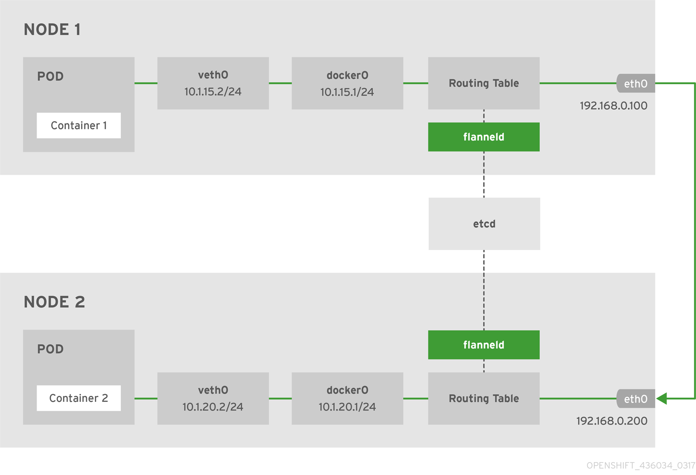

### Kubernetes中的网络解析——以flannel为例

我们当初使用[kubernetes-vagrant-centos-cluster](https://github.com/rootsongjc/kubernetes-vagrant-centos-cluster)安装了拥有三个节点的kubernetes集群，节点的状态如下所述。

```bash
[root@node1 ~]# kubectl get nodes -o wide
NAME      STATUS    ROLES     AGE       VERSION   EXTERNAL-IP   OS-IMAGE                KERNEL-VERSION               CONTAINER-RUNTIME
node1     Ready     <none>    2d        v1.9.1    <none>        CentOS Linux 7 (Core)   3.10.0-693.11.6.el7.x86_64   docker://1.12.6
node2     Ready     <none>    2d        v1.9.1    <none>        CentOS Linux 7 (Core)   3.10.0-693.11.6.el7.x86_64   docker://1.12.6
node3     Ready     <none>    2d        v1.9.1    <none>        CentOS Linux 7 (Core)   3.10.0-693.11.6.el7.x86_64   docker://1.12.6
```

当前Kubernetes集群中运行的所有Pod信息：

```bash
[root@node1 ~]# kubectl get pods --all-namespaces -o wide
NAMESPACE     NAME                                              READY     STATUS    RESTARTS   AGE       IP            NODE
kube-system   coredns-5984fb8cbb-sjqv9                          1/1       Running   0          1h        172.33.68.2   node1
kube-system   coredns-5984fb8cbb-tkfrc                          1/1       Running   1          1h        172.33.96.3   node3
kube-system   heapster-v1.5.0-684c7f9488-z6sdz                  4/4       Running   0          1h        172.33.31.3   node2
kube-system   kubernetes-dashboard-6b66b8b96c-mnm2c             1/1       Running   0          1h        172.33.31.2   node2
kube-system   monitoring-influxdb-grafana-v4-54b7854697-tw9cd   2/2       Running   2          1h        172.33.96.2   node3
```

当前etcd中的注册的宿主机的pod地址网段信息：

```bash
[root@node1 ~]# etcdctl ls /kube-centos/network/subnets
/kube-centos/network/subnets/172.33.68.0-24
/kube-centos/network/subnets/172.33.31.0-24
/kube-centos/network/subnets/172.33.96.0-24
```

而每个node上的Pod子网是根据我们在安装flannel时配置来划分的，在etcd中查看该配置：

```bash
[root@node1 ~]# etcdctl get /kube-centos/network/config
{"Network":"172.33.0.0/16","SubnetLen":24,"Backend":{"Type":"host-gw"}}
```

我们知道Kubernetes集群内部存在三类IP，分别是：

- Node IP：宿主机的IP地址
- Pod IP：使用网络插件创建的IP（如flannel），使夸主机的Pod可以互通
- Cluster IP：虚拟IP，通过iptables规则访问服务

在安装node节点的时候，节点上的进程是按照flannel -> docker -> kubelet -> kube-proxy的顺序启动的，我们下面也会按照该顺序来讲解，flannel的网络划分和如何与docker交互，如何通过iptables访问service。

### Flannel

Flannel是作为一个二进制文件的方式部署在每个node上，主要实现两个功能：

- 为每个node分配subnet，容器将自动从该子网中获取IP地址
- 当有node加入到网络中时，为每个node增加路由配置

下面是使用`host-gw` backend的flannel网络架构图：



**注意**：以上IP非本示例中的IP，但是不影响读者理解。

Node1上的flannel配置如下:

```bash
[root@node1 ~]# cat /usr/lib/systemd/system/flanneld.service
[Unit]
Description=Flanneld overlay address etcd agent
After=network.target
After=network-online.target
Wants=network-online.target
After=etcd.service
Before=docker.service

[Service]
Type=notify
EnvironmentFile=/etc/sysconfig/flanneld
EnvironmentFile=-/etc/sysconfig/docker-network
ExecStart=/usr/bin/flanneld-start $FLANNEL_OPTIONS
ExecStartPost=/usr/libexec/flannel/mk-docker-opts.sh -k DOCKER_NETWORK_OPTIONS -d /run/flannel/docker
Restart=on-failure

[Install]
WantedBy=multi-user.target
RequiredBy=docker.service
```

其中有两个环境变量文件的配置如下：

```bash
[root@node1 ~]# cat /etc/sysconfig/flanneld
# Flanneld configuration options
FLANNEL_ETCD_ENDPOINTS="http://172.17.8.101:2379"
FLANNEL_ETCD_PREFIX="/kube-centos/network"
FLANNEL_OPTIONS="-iface=eth2"
```

上面的配置文件仅供flanneld使用。

```bash
[root@node1 ~]# cat /etc/sysconfig/docker-network
# /etc/sysconfig/docker-network
DOCKER_NETWORK_OPTIONS=
```

还有一个`ExecStartPost=/usr/libexec/flannel/mk-docker-opts.sh -k DOCKER_NETWORK_OPTIONS -d /run/flannel/docker`，其中的`/usr/libexec/flannel/mk-docker-opts.sh`脚本是在flanneld启动后运行，将会生成两个环境变量配置文件：

- /run/flannel/docker
- /run/flannel/subnet.env

我们再来看下`/run/flannel/docker`的配置。

```bash
[root@node1 ~]# cat /run/flannel/docker
DOCKER_OPT_BIP="--bip=172.33.68.1/24"
DOCKER_OPT_IPMASQ="--ip-masq=true"
DOCKER_OPT_MTU="--mtu=1500"
DOCKER_NETWORK_OPTIONS=" --bip=172.33.68.1/24 --ip-masq=true --mtu=1500"
```

如果你使用`systemctl`命令先启动flannel后启动docker的话，docker讲会读取以上环境变量。

我们再来看下`/run/flannel/subnet.env`的配置。

```bash
[root@node1 ~]# cat /run/flannel/subnet.env
FLANNEL_NETWORK=172.33.0.0/16
FLANNEL_SUBNET=172.33.68.1/24
FLANNEL_MTU=1500
FLANNEL_IPMASQ=false
```

以上环境变量是flannel向etcd中注册的。

### Docker

Node1的docker配置如下：

```bash
[root@node1 ~]# cat /usr/lib/systemd/system/docker.service
[Unit]
Description=Docker Application Container Engine
Documentation=http://docs.docker.com
After=network.target rhel-push-plugin.socket registries.service
Wants=docker-storage-setup.service
Requires=docker-cleanup.timer

[Service]
Type=notify
NotifyAccess=all
EnvironmentFile=-/run/containers/registries.conf
EnvironmentFile=-/etc/sysconfig/docker
EnvironmentFile=-/etc/sysconfig/docker-storage
EnvironmentFile=-/etc/sysconfig/docker-network
Environment=GOTRACEBACK=crash
Environment=DOCKER_HTTP_HOST_COMPAT=1
Environment=PATH=/usr/libexec/docker:/usr/bin:/usr/sbin
ExecStart=/usr/bin/dockerd-current \
          --add-runtime docker-runc=/usr/libexec/docker/docker-runc-current \
          --default-runtime=docker-runc \
          --exec-opt native.cgroupdriver=systemd \
          --userland-proxy-path=/usr/libexec/docker/docker-proxy-current \
          $OPTIONS \
          $DOCKER_STORAGE_OPTIONS \
          $DOCKER_NETWORK_OPTIONS \
          $ADD_REGISTRY \
          $BLOCK_REGISTRY \
          $INSECURE_REGISTRY\
	      $REGISTRIES
ExecReload=/bin/kill -s HUP $MAINPID
LimitNOFILE=1048576
LimitNPROC=1048576
LimitCORE=infinity
TimeoutStartSec=0
Restart=on-abnormal
MountFlags=slave
KillMode=process

[Install]
WantedBy=multi-user.target
```

查看Node1上的docker启动参数：

```bash
[root@node1 ~]# systemctl status -l docker
● docker.service - Docker Application Container Engine
   Loaded: loaded (/usr/lib/systemd/system/docker.service; enabled; vendor preset: disabled)
  Drop-In: /usr/lib/systemd/system/docker.service.d
           └─flannel.conf
   Active: active (running) since Fri 2018-02-02 22:52:43 CST; 2h 28min ago
     Docs: http://docs.docker.com
 Main PID: 4334 (dockerd-current)
   CGroup: /system.slice/docker.service
           ‣ 4334 /usr/bin/dockerd-current --add-runtime docker-runc=/usr/libexec/docker/docker-runc-current --default-runtime=docker-runc --exec-opt native.cgroupdriver=systemd --userland-proxy-path=/usr/libexec/docker/docker-proxy-current --selinux-enabled --log-driver=journald --signature-verification=false --bip=172.33.68.1/24 --ip-masq=true --mtu=1500
```

我们可以看到在docker在启动时有如下参数：`--bip=172.33.68.1/24 --ip-masq=true --mtu=1500`。上述参数flannel启动时运行的脚本生成的，通过环境变量传递过来的。

我们查看下node1宿主机上的网络接口：

```bash
[root@node1 ~]# ip addr
1: lo: <LOOPBACK,UP,LOWER_UP> mtu 65536 qdisc noqueue state UNKNOWN qlen 1
    link/loopback 00:00:00:00:00:00 brd 00:00:00:00:00:00
    inet 127.0.0.1/8 scope host lo
       valid_lft forever preferred_lft forever
    inet6 ::1/128 scope host
       valid_lft forever preferred_lft forever
2: eth0: <BROADCAST,MULTICAST,UP,LOWER_UP> mtu 1500 qdisc pfifo_fast state UP qlen 1000
    link/ether 52:54:00:00:57:32 brd ff:ff:ff:ff:ff:ff
    inet 10.0.2.15/24 brd 10.0.2.255 scope global dynamic eth0
       valid_lft 85095sec preferred_lft 85095sec
    inet6 fe80::5054:ff:fe00:5732/64 scope link
       valid_lft forever preferred_lft forever
3: eth1: <BROADCAST,MULTICAST,UP,LOWER_UP> mtu 1500 qdisc pfifo_fast state UP qlen 1000
    link/ether 08:00:27:7b:0f:b1 brd ff:ff:ff:ff:ff:ff
    inet 172.17.8.101/24 brd 172.17.8.255 scope global eth1
       valid_lft forever preferred_lft forever
4: eth2: <BROADCAST,MULTICAST,UP,LOWER_UP> mtu 1500 qdisc pfifo_fast state UP qlen 1000
    link/ether 08:00:27:ef:25:06 brd ff:ff:ff:ff:ff:ff
    inet 172.30.113.231/21 brd 172.30.119.255 scope global dynamic eth2
       valid_lft 85096sec preferred_lft 85096sec
    inet6 fe80::a00:27ff:feef:2506/64 scope link
       valid_lft forever preferred_lft forever
5: docker0: <BROADCAST,MULTICAST,UP,LOWER_UP> mtu 1500 qdisc noqueue state UP
    link/ether 02:42:d0:ae:80:ea brd ff:ff:ff:ff:ff:ff
    inet 172.33.68.1/24 scope global docker0
       valid_lft forever preferred_lft forever
    inet6 fe80::42:d0ff:feae:80ea/64 scope link
       valid_lft forever preferred_lft forever
7: veth295bef2@if6: <BROADCAST,MULTICAST,UP,LOWER_UP> mtu 1500 qdisc noqueue master docker0 state UP
    link/ether 6a:72:d7:9f:29:19 brd ff:ff:ff:ff:ff:ff link-netnsid 0
    inet6 fe80::6872:d7ff:fe9f:2919/64 scope link
       valid_lft forever preferred_lft forever
```

我们分类来解释下该虚拟机中的网络接口。

- lo：回环网络，127.0.0.1
- eth0：NAT网络，虚拟机创建时自动分配，仅可以在几台虚拟机之间访问
- eth1：bridge网络，使用vagrant分配给虚拟机的地址，虚拟机之间和本地电脑都可以访问
- eth2：bridge网络，使用DHCP分配，用于访问互联网的网卡
- docker0：bridge网络，docker默认使用的网卡，作为该节点上所有容器的虚拟交换机
- veth295bef2@if6：veth pair，连接docker0和Pod中的容器。veth pair可以理解为使用网线连接好的两个接口，把两个端口放到两个namespace中，那么这两个namespace就能打通。参考[linux 网络虚拟化： network namespace 简介](http://cizixs.com/2017/02/10/network-virtualization-network-namespace)。

我们再看下该节点的docker上有哪些网络。

```bash
[root@node1 ~]# docker network ls
NETWORK ID          NAME                DRIVER              SCOPE
940bb75e653b        bridge              bridge              local
d94c046e105d        host                host                local
2db7597fd546        none                null                local
```

再检查下bridge网络`940bb75e653b`的信息。

```bash
[root@node1 ~]# docker network inspect 940bb75e653b
[
    {
        "Name": "bridge",
        "Id": "940bb75e653bfa10dab4cce8813c2b3ce17501e4e4935f7dc13805a61b732d2c",
        "Scope": "local",
        "Driver": "bridge",
        "EnableIPv6": false,
        "IPAM": {
            "Driver": "default",
            "Options": null,
            "Config": [
                {
                    "Subnet": "172.33.68.1/24",
                    "Gateway": "172.33.68.1"
                }
            ]
        },
        "Internal": false,
        "Containers": {
            "944d4aa660e30e1be9a18d30c9dcfa3b0504d1e5dbd00f3004b76582f1c9a85b": {
                "Name": "k8s_POD_coredns-5984fb8cbb-sjqv9_kube-system_c5a2e959-082a-11e8-b4cd-525400005732_0",
                "EndpointID": "7397d7282e464fc4ec5756d6b328df889cdf46134dbbe3753517e175d3844a85",
                "MacAddress": "02:42:ac:21:44:02",
                "IPv4Address": "172.33.68.2/24",
                "IPv6Address": ""
            }
        },
        "Options": {
            "com.docker.network.bridge.default_bridge": "true",
            "com.docker.network.bridge.enable_icc": "true",
            "com.docker.network.bridge.enable_ip_masquerade": "true",
            "com.docker.network.bridge.host_binding_ipv4": "0.0.0.0",
            "com.docker.network.bridge.name": "docker0",
            "com.docker.network.driver.mtu": "1500"
        },
        "Labels": {}
    }
]
```

我们可以看到该网络中的`Config`与docker的启动配置相符。

Node1上运行的容器：

```bash
[root@node1 ~]# docker ps
CONTAINER ID        IMAGE                                                                                               COMMAND                  CREATED             STATUS              PORTS               NAMES
a37407a234dd        docker.io/coredns/coredns@sha256:adf2e5b4504ef9ffa43f16010bd064273338759e92f6f616dd159115748799bc   "/coredns -conf /etc/"   About an hour ago   Up About an hour                        k8s_coredns_coredns-5984fb8cbb-sjqv9_kube-system_c5a2e959-082a-11e8-b4cd-525400005732_0
944d4aa660e3        docker.io/openshift/origin-pod                                                                      "/usr/bin/pod"           About an hour ago   Up About an hour                        k8s_POD_coredns-5984fb8cbb-sjqv9_kube-system_c5a2e959-082a-11e8-b4cd-525400005732_0
```

我们可以看到当前已经有2个容器在运行。

Node1上的路由信息：

```bash
[root@node1 ~]# route -n
Kernel IP routing table
Destination     Gateway         Genmask         Flags Metric Ref    Use Iface
0.0.0.0         10.0.2.2        0.0.0.0         UG    100    0        0 eth0
0.0.0.0         172.30.116.1    0.0.0.0         UG    101    0        0 eth2
10.0.2.0        0.0.0.0         255.255.255.0   U     100    0        0 eth0
172.17.8.0      0.0.0.0         255.255.255.0   U     100    0        0 eth1
172.30.112.0    0.0.0.0         255.255.248.0   U     100    0        0 eth2
172.33.68.0     0.0.0.0         255.255.255.0   U     0      0        0 docker0
172.33.96.0     172.30.118.65   255.255.255.0   UG    0      0        0 eth2
```

以上路由信息是由flannel添加的，当有新的节点加入到Kubernetes集群中后，每个节点上的路由表都将增加。

我们在node上来`traceroute`下node3上的`coredns-5984fb8cbb-tkfrc`容器，其IP地址是`172.33.96.3`，看看其路由信息。

```bash
[root@node1 ~]# traceroute 172.33.96.3
traceroute to 172.33.96.3 (172.33.96.3), 30 hops max, 60 byte packets
 1  172.30.118.65 (172.30.118.65)  0.518 ms  0.367 ms  0.398 ms
 2  172.33.96.3 (172.33.96.3)  0.451 ms  0.352 ms  0.223 ms
```

我们看到路由直接经过node3的公网IP后就到达了node3节点上的Pod。

Node1的iptables信息：

```bash
[root@node1 ~]# iptables -L
Chain INPUT (policy ACCEPT)
target     prot opt source               destination
KUBE-FIREWALL  all  --  anywhere             anywhere
KUBE-SERVICES  all  --  anywhere             anywhere             /* kubernetes service portals */

Chain FORWARD (policy ACCEPT)
target     prot opt source               destination
KUBE-FORWARD  all  --  anywhere             anywhere             /* kubernetes forward rules */
DOCKER-ISOLATION  all  --  anywhere             anywhere
DOCKER     all  --  anywhere             anywhere
ACCEPT     all  --  anywhere             anywhere             ctstate RELATED,ESTABLISHED
ACCEPT     all  --  anywhere             anywhere
ACCEPT     all  --  anywhere             anywhere

Chain OUTPUT (policy ACCEPT)
target     prot opt source               destination
KUBE-FIREWALL  all  --  anywhere             anywhere
KUBE-SERVICES  all  --  anywhere             anywhere             /* kubernetes service portals */

Chain DOCKER (1 references)
target     prot opt source               destination

Chain DOCKER-ISOLATION (1 references)
target     prot opt source               destination
RETURN     all  --  anywhere             anywhere

Chain KUBE-FIREWALL (2 references)
target     prot opt source               destination
DROP       all  --  anywhere             anywhere             /* kubernetes firewall for dropping marked packets */ mark match 0x8000/0x8000

Chain KUBE-FORWARD (1 references)
target     prot opt source               destination
ACCEPT     all  --  anywhere             anywhere             /* kubernetes forwarding rules */ mark match 0x4000/0x4000
ACCEPT     all  --  10.254.0.0/16        anywhere             /* kubernetes forwarding conntrack pod source rule */ ctstate RELATED,ESTABLISHED
ACCEPT     all  --  anywhere             10.254.0.0/16        /* kubernetes forwarding conntrack pod destination rule */ ctstate RELATED,ESTABLISHED

Chain KUBE-SERVICES (2 references)
target     prot opt source               destination
```

从上面的iptables中可以看到注入了很多Kuberentes service的规则，请参考[iptables 规则](https://www.cnyunwei.cc/archives/393)获取更多详细信息。

## 参考

- [coreos/flannel - github.com](https://github.com/coreos/flannel)
- [linux 网络虚拟化： network namespace 简介](http://cizixs.com/2017/02/10/network-virtualization-network-namespace)
- [Linux虚拟网络设备之veth](https://segmentfault.com/a/1190000009251098)
- [iptables 规则](https://www.cnyunwei.cc/archives/393)
- [flannel host-gw network](http://hustcat.github.io/flannel-host-gw-network/)
- [flannel - openshift.com](https://docs.openshift.com/container-platform/3.4/architecture/additional_concepts/flannel.html)