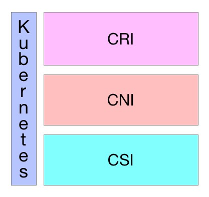

# 开放接口

Kubernetes作为云原生应用的基础调度平台，相当于云原生的操作系统，为了便于系统的扩展，Kubernetes中开放的以下接口，可以分别对接不同的后端，来实现自己的业务逻辑：

- **CRI（Container Runtime Interface）**：容器运行时接口，提供计算资源
- **CNI（Container Network Interface）**：容器网络接口，提供网络资源
- **CSI（Container Storage Interface**）：容器存储接口，提供存储资源

以上三种资源相当于一个分布式操作系统的最基础的几种资源类型，而Kuberentes是将他们粘合在一起的纽带。

