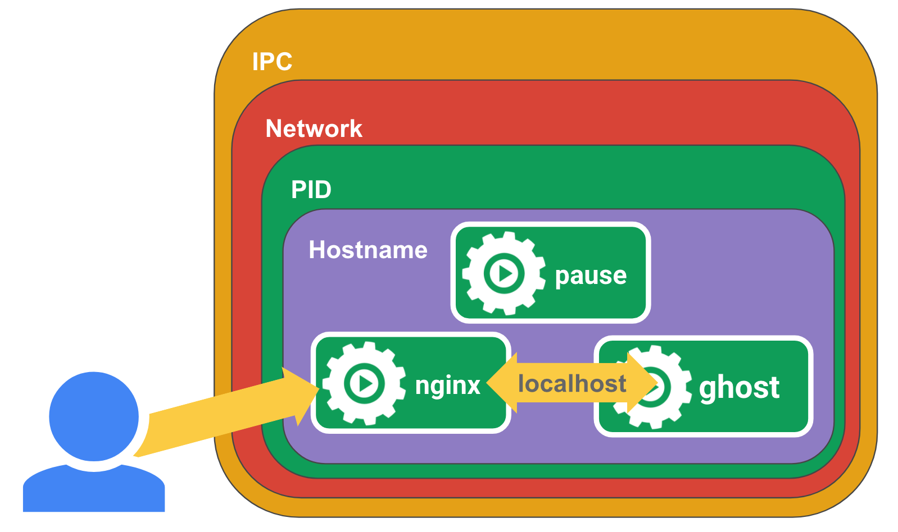

# Pause 容器

Pause 容器，又叫 Infra 容器，本文将探究该容器的作用与原理。

我们知道在 kubelet 的配置中有这样一个参数：

```bash
KUBELET_POD_INFRA_CONTAINER=--pod-infra-container-image=registry.access.redhat.com/rhel7/pod-infrastructure:latest
```

上面是 openshift 中的配置参数，kubernetes 中默认的配置参数是：

```bash
KUBELET_POD_INFRA_CONTAINER=--pod-infra-container-image=gcr.io/google_containers/pause-amd64:3.0
```

Pause 容器，是可以自己来定义，官方使用的 `gcr.io/google_containers/pause-amd64:3.0` 容器的代码见 [Github](https://github.com/kubernetes/kubernetes/tree/master/build/pause)，使用 C 语言编写。

## Pause 容器特点

- 镜像非常小，目前在 700KB 左右
- 永远处于 Pause (暂停) 状态

## Pause 容器背景

像 Pod 这样一个东西，本身是一个逻辑概念。那在机器上，它究竟是怎么实现的呢？这就是我们要解释的一个问题。

既然说 Pod 要解决这个问题，核心就在于如何让一个 Pod 里的多个容器之间最高效的共享某些资源和数据。

因为容器之间原本是被 Linux Namespace 和 cgroups 隔开的，所以现在实际要解决的是怎么去打破这个隔离，然后共享某些事情和某些信息。这就是 Pod 的设计要解决的核心问题所在。

所以说具体的解法分为两个部分：网络和存储。

Pause 容器就是为解决 Pod 中的网络问题而生的。

## Pause 容器实现

Pod 里的多个容器怎么去共享网络？下面是个例子：

比如说现在有一个 Pod，其中包含了一个容器 A 和一个容器 B，它们两个就要共享 Network Namespace。在 Kubernetes 里的解法是这样的：它会在每个 Pod 里，额外起一个 Infra container 小容器来共享整个 Pod 的 Network Namespace。

Infra container 是一个非常小的镜像，大概 700KB 左右，是一个 C 语言写的、永远处于 “暂停” 状态的容器。由于有了这样一个 Infra container 之后，其他所有容器都会通过 Join Namespace 的方式加入到 Infra container 的 Network Namespace 中。

所以说一个 Pod 里面的所有容器，它们看到的网络视图是完全一样的。即：它们看到的网络设备、IP 地址、Mac 地址等等，跟网络相关的信息，其实全是一份，这一份都来自于 Pod 第一次创建的这个 Infra container。这就是 Pod 解决网络共享的一个解法。

在 Pod 里面，一定有一个 IP 地址，是这个 Pod 的 Network Namespace 对应的地址，也是这个 Infra container 的 IP 地址。所以大家看到的都是一份，而其他所有网络资源，都是一个 Pod 一份，并且被 Pod 中的所有容器共享。这就是 Pod 的网络实现方式。

由于需要有一个相当于说中间的容器存在，所以整个 Pod 里面，必然是 Infra container 第一个启动。并且整个 Pod 的生命周期是等同于 Infra container 的生命周期的，与容器 A 和 B 是无关的。这也是为什么在 Kubernetes 里面，它是允许去单独更新 Pod 里的某一个镜像的，即：做这个操作，整个 Pod 不会重建，也不会重启，这是非常重要的一个设计。

## Pause 容器的作用

我们检查 node 节点的时候会发现每个 node 上都运行了很多的 pause 容器，例如如下。

```bash
$ docker ps
CONTAINER ID        IMAGE                                                                                                                    COMMAND                  CREATED             STATUS              PORTS               NAMES
2c7d50f1a7be        docker.io/jimmysong/heapster-grafana-amd64@sha256:d663759b3de86cf62e64a43b021f133c383e8f7b0dc2bdd78115bc95db371c9a       "/run.sh"                3 hours ago         Up 3 hours                              k8s_grafana_monitoring-influxdb-grafana-v4-5697c6b59-76zqs_kube-system_5788a3c5-29c0-11e8-9e88-525400005732_0
5df93dea877a        docker.io/jimmysong/heapster-influxdb-amd64@sha256:a217008b68cb49e8f038c4eeb6029261f02adca81d8eae8c5c01d030361274b8      "influxd --config ..."   3 hours ago         Up 3 hours                              k8s_influxdb_monitoring-influxdb-grafana-v4-5697c6b59-76zqs_kube-system_5788a3c5-29c0-11e8-9e88-525400005732_0
9cec6c0ef583        jimmysong/pause-amd64:3.0                                                                                                "/pause"                 3 hours ago         Up 3 hours                              k8s_POD_monitoring-influxdb-grafana-v4-5697c6b59-76zqs_kube-system_5788a3c5-29c0-11e8-9e88-525400005732_0
54d06e30a4c7        docker.io/jimmysong/kubernetes-dashboard-amd64@sha256:668710d034c4209f8fa9a342db6d8be72b6cb5f1f3f696cee2379b8512330be4   "/dashboard --inse..."   3 hours ago         Up 3 hours                              k8s_kubernetes-dashboard_kubernetes-dashboard-65486f5fdf-lshl7_kube-system_27c414a1-29c0-11e8-9e88-525400005732_0
5a5ef33b0d58        jimmysong/pause-amd64:3.0                                                                                                "/pause"                 3 hours ago         Up 3 hours                              k8s_POD_kubernetes-dashboard-65486f5fdf-lshl7_kube-system_27c414a1-29c0-11e8-9e88-525400005732_0
```

kubernetes 中的 pause 容器主要为每个业务容器提供以下功能：

- 在 pod 中担任 Linux 命名空间共享的基础；
- 启用 pid 命名空间，开启 init 进程。

[这篇文章](https://www.ianlewis.org/en/almighty-pause-container)做出了详细的说明，pause 容器的作用可以从这个例子中看出，首先见下图：



我们首先在节点上运行一个 pause 容器。

```bash
docker run -d --name pause -p 8880:80 --ipc=shareable jimmysong/pause-amd64:3.0
```

然后再运行一个 nginx 容器，nginx 将为 `localhost:2368` 创建一个代理。

```bash
$ cat <<EOF >> nginx.conf
error_log stderr;
events { worker_connections  1024; }
http {
    access_log /dev/stdout combined;
    server {
        listen 80 default_server;
        server_name example.com www.example.com;
        location / {
            proxy_pass http://127.0.0.1:2368;
        }
    }
}
EOF
$ docker run -d --name nginx -v `pwd`/nginx.conf:/etc/nginx/nginx.conf --net=container:pause --ipc=container:pause --pid=container:pause nginx
```

然后再为 [ghost](https://github.com/TryGhost/Ghost) 创建一个应用容器，这是一款博客软件。

```bash
$ docker run -d --name ghost --net=container:pause --ipc=container:pause --pid=container:pause ghost
```

现在访问 http://localhost:8880/ 就可以看到 ghost 博客的界面了。

**解析**

pause 容器将内部的 80 端口映射到宿主机的 8880 端口，pause 容器在宿主机上设置好了网络 namespace 后，nginx 容器加入到该网络 namespace 中，我们看到 nginx 容器启动的时候指定了 `--net=container:pause`，ghost 容器同样加入到了该网络 namespace 中，这样三个容器就共享了网络，互相之间就可以使用 `localhost` 直接通信，`--ipc=container:pause --pid=container:pause` 就是三个容器处于同一个 namespace 中，init 进程为 `pause`，这时我们进入到 ghost 容器中查看进程情况。

```bash
# ps aux
USER       PID %CPU %MEM    VSZ   RSS TTY      STAT START   TIME COMMAND
root         1  0.0  0.0   1024     4 ?        Ss   13:49   0:00 /pause
root         5  0.0  0.1  32432  5736 ?        Ss   13:51   0:00 nginx: master p
systemd+     9  0.0  0.0  32980  3304 ?        S    13:51   0:00 nginx: worker p
node        10  0.3  2.0 1254200 83788 ?       Ssl  13:53   0:03 node current/in
root        79  0.1  0.0   4336   812 pts/0    Ss   14:09   0:00 sh
root        87  0.0  0.0  17500  2080 pts/0    R+   14:10   0:00 ps aux
```

在 ghost 容器中同时可以看到 pause 和 nginx 容器的进程，并且 pause 容器的 PID 是 1。而在 Kubernetes 中容器的 PID=1 的进程即为容器本身的业务进程。

## 参考

- [The Almighty Pause Container - ianlewis.org](https://www.ianlewis.org/en/almighty-pause-container)
- [Kubernetes 之 Pause 容器 - o-my-chenjian.com](https://o-my-chenjian.com/2017/10/17/The-Pause-Container-Of-Kubernetes/)
