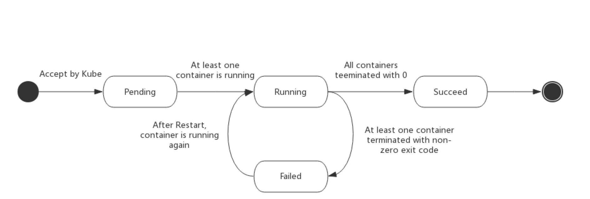

# Pod 的生命周期

## Pod phase

Pod 的 `status` 字段是一个 PodStatus 对象，PodStatus中有一个 `phase` 字段。

Pod 的相位（phase）是 Pod 在其生命周期中的简单宏观概述。该阶段并不是对容器或 Pod 的综合汇总，也不是为了做为综合状态机。

Pod 相位的数量和含义是严格指定的。除了本文档中列举的状态外，不应该再假定 Pod 有其他的 `phase` 值。

下面是 `phase` 可能的值：

- 挂起（Pending）：Pod 已被 Kubernetes 系统接受，但有一个或者多个容器镜像尚未创建。等待时间包括调度 Pod 的时间和通过网络下载镜像的时间，这可能需要花点时间。
- 运行中（Running）：该 Pod 已经绑定到了一个节点上，Pod 中所有的容器都已被创建。至少有一个容器正在运行，或者正处于启动或重启状态。
- 成功（Succeeded）：Pod 中的所有容器都被成功终止，并且不会再重启。
- 失败（Failed）：Pod 中的所有容器都已终止了，并且至少有一个容器是因为失败终止。也就是说，容器以非0状态退出或者被系统终止。
- 未知（Unknown）：因为某些原因无法取得 Pod 的状态，通常是因为与 Pod 所在主机通信失败。

下图是Pod的生命周期示意图，从图中可以看到Pod状态的变化。



## Pod 状态

Pod 有一个 PodStatus 对象，其中包含一个 PodCondition 数组。 PodCondition 数组的每个元素都有一个 `type` 字段和一个 `status` 字段。`type` 字段是字符串，可能的值有 PodScheduled、Ready、Initialized、Unschedulable和ContainersReady。`status` 字段是一个字符串，可能的值有 True、False 和 Unknown。

## 容器探针

探针是由 [kubelet](https://kubernetes.io/docs/admin/kubelet/) 对容器执行的定期诊断。要执行诊断，kubelet 调用由容器实现的 [Handler](https://godoc.org/k8s.io/kubernetes/pkg/api/v1#Handler)。有三种类型的处理程序：

- ExecAction：在容器内执行指定命令。如果命令退出时返回码为 0 则认为诊断成功。
- TCPSocketAction：对指定端口上的容器的 IP 地址进行 TCP 检查。如果端口打开，则诊断被认为是成功的。
- HTTPGetAction：对指定的端口和路径上的容器的 IP 地址执行 HTTP Get 请求。如果响应的状态码大于等于200 且小于 400，则诊断被认为是成功的。

每次探测都将获得以下三种结果之一：

- 成功：容器通过了诊断。
- 失败：容器未通过诊断。
- 未知：诊断失败，因此不会采取任何行动。

Kubelet 可以选择是否执行在容器上运行的两种探针执行和做出反应：

- `livenessProbe`：指示容器是否正在运行。如果存活探测失败，则 kubelet 会杀死容器，并且容器将受到其 [重启策略](https://kubernetes.io/docs/concepts/workloads/pods/pod-lifecycle/#restart-policy) 的影响。如果容器不提供存活探针，则默认状态为 `Success`。
- `readinessProbe`：指示容器是否准备好服务请求。如果就绪探测失败，端点控制器将从与 Pod 匹配的所有 Service 的端点中删除该 Pod 的 IP 地址。初始延迟之前的就绪状态默认为 `Failure`。如果容器不提供就绪探针，则默认状态为 `Success`。

### 该什么时候使用存活（liveness）和就绪（readiness）探针?

如果容器中的进程能够在遇到问题或不健康的情况下自行崩溃，则不一定需要存活探针; kubelet 将根据 Pod 的`restartPolicy` 自动执行正确的操作。

如果您希望容器在探测失败时被杀死并重新启动，那么请指定一个存活探针，并指定`restartPolicy` 为 Always 或 OnFailure。

如果要仅在探测成功时才开始向 Pod 发送流量，请指定就绪探针。在这种情况下，就绪探针可能与存活探针相同，但是 spec 中的就绪探针的存在意味着 Pod 将在没有接收到任何流量的情况下启动，并且只有在探针探测成功后才开始接收流量。

如果您希望容器能够自行维护，您可以指定一个就绪探针，该探针检查与存活探针不同的端点。

请注意，如果您只想在 Pod 被删除时能够排除请求，则不一定需要使用就绪探针；在删除 Pod 时，Pod 会自动将自身置于未完成状态，无论就绪探针是否存在。当等待 Pod 中的容器停止时，Pod 仍处于未完成状态。

## Pod 和容器状态

有关 Pod 容器状态的详细信息，请参阅 PodStatus 和 ContainerStatus。请注意，报告的 Pod 状态信息取决于当前的 ContainerState。

## 重启策略

PodSpec 中有一个 `restartPolicy` 字段，可能的值为 Always、OnFailure 和 Never。默认为 Always。 `restartPolicy` 适用于 Pod 中的所有容器。`restartPolicy` 仅指通过同一节点上的 kubelet 重新启动容器。失败的容器由 kubelet 以五分钟为上限的指数退避延迟（10秒，20秒，40秒...）重新启动，并在成功执行十分钟后重置。如 [Pod 文档](https://kubernetes.io/docs/user-guide/pods/#durability-of-pods-or-lack-thereof) 中所述，一旦绑定到一个节点，Pod 将永远不会重新绑定到另一个节点。

## Pod 的生命

一般来说，Pod 不会消失，直到人为销毁他们。这可能是一个人或控制器。这个规则的唯一例外是成功或失败的 `phase` 超过一段时间（由 master 确定）的Pod将过期并被自动销毁。

有三种可用的控制器：

- 使用 [Job](https://kubernetes.io/docs/concepts/jobs/run-to-completion-finite-workloads/) 运行预期会终止的 Pod，例如批量计算。Job 仅适用于重启策略为 `OnFailure` 或 `Never` 的 Pod。


- 对预期不会终止的 Pod 使用 [ReplicationController](https://kubernetes.io/docs/concepts/workloads/controllers/replicationcontroller/)、[ReplicaSet](https://kubernetes.io/docs/concepts/workloads/controllers/replicaset/) 和 [Deployment](https://kubernetes.io/docs/concepts/workloads/controllers/deployment/) ，例如 Web 服务器。 ReplicationController 仅适用于具有 `restartPolicy` 为 Always 的 Pod。
- 提供特定于机器的系统服务，使用 [DaemonSet](https://kubernetes.io/docs/concepts/workloads/controllers/daemonset/) 为每台机器运行一个 Pod 。

所有这三种类型的控制器都包含一个 PodTemplate。建议创建适当的控制器，让它们来创建 Pod，而不是直接自己创建 Pod。这是因为单独的 Pod 在机器故障的情况下没有办法自动复原，而控制器却可以。

如果节点死亡或与集群的其余部分断开连接，则 Kubernetes 将应用一个策略将丢失节点上的所有 Pod 的 `phase` 设置为 Failed。

## 示例

### 高级 liveness 探针示例

存活探针由 kubelet 来执行，因此所有的请求都在 kubelet 的网络命名空间中进行。

```yaml
apiVersion: v1
kind: Pod
metadata:
  labels:
    test: liveness
  name: liveness-http
spec:
  containers:
  - args:
    - /server
    image: k8s.gcr.io/liveness
    livenessProbe:
      httpGet:
        # when "host" is not defined, "PodIP" will be used
        # host: my-host
        # when "scheme" is not defined, "HTTP" scheme will be used. Only "HTTP" and "HTTPS" are allowed
        # scheme: HTTPS
        path: /healthz
        port: 8080
        httpHeaders:
        - name: X-Custom-Header
          value: Awesome
      initialDelaySeconds: 15
      timeoutSeconds: 1
    name: liveness
```

### 状态示例

- Pod 中只有一个容器并且正在运行。容器成功退出。
  - 记录完成事件。
  - 如果 `restartPolicy` 为：
    - Always：重启容器；Pod `phase` 仍为 Running。
    - OnFailure：Pod `phase` 变成 Succeeded。
    - Never：Pod `phase` 变成 Succeeded。
- Pod 中只有一个容器并且正在运行。容器退出失败。
  - 记录失败事件。
  - 如果 `restartPolicy` 为：
    - Always：重启容器；Pod `phase` 仍为 Running。
    - OnFailure：重启容器；Pod `phase` 仍为 Running。
    - Never：Pod `phase` 变成 Failed。
- Pod 中有两个容器并且正在运行。容器1退出失败。
  - 记录失败事件。
  - 如果 restartPolicy 为：
    - Always：重启容器；Pod `phase` 仍为 Running。
    - OnFailure：重启容器；Pod `phase` 仍为 Running。
    - Never：不重启容器；Pod `phase` 仍为 Running。

  - 如果有容器1没有处于运行状态，并且容器2退出：
    - 记录失败事件。
    - 如果 `restartPolicy` 为：
      - Always：重启容器；Pod `phase` 仍为 Running。
      - OnFailure：重启容器；Pod `phase` 仍为 Running。
      - Never：Pod `phase` 变成 Failed。
- Pod 中只有一个容器并处于运行状态。容器运行时内存超出限制：
  - 容器以失败状态终止。
  - 记录 OOM 事件。
  - 如果 `restartPolicy` 为：
    - Always：重启容器；Pod `phase` 仍为 Running。
    - OnFailure：重启容器；Pod `phase` 仍为 Running。
    - Never: 记录失败事件；Pod `phase` 仍为 Failed。
- Pod 正在运行，磁盘故障：
  - 杀掉所有容器。
  - 记录适当事件。
  - Pod `phase` 变成 Failed。
  - 如果使用控制器来运行，Pod 将在别处重建。
- Pod 正在运行，其节点被分段。
  - 节点控制器等待直到超时。
  - 节点控制器将 Pod `phase` 设置为 Failed。
  - 如果是用控制器来运行，Pod 将在别处重建。

原文地址：https://kubernetes.io/docs/concepts/workloads/pods/pod-lifecycle/

翻译：[rootsongjc](https://github.com/rootsongjc)
