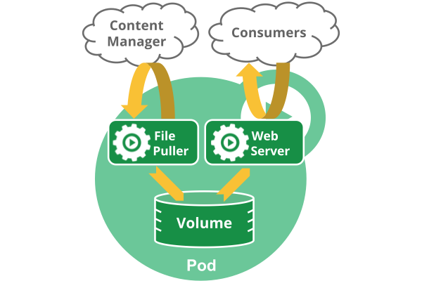

# Pod概览

## 理解Pod

Pod是kubernetes中你可以创建和部署的最小也是最简的单位。Pod代表着集群中运行的进程。

Pod中封装着应用的容器（有的情况下是好几个容器），存储、独立的网络IP，管理容器如何运行的策略选项。Pod代表着部署的一个单位：kubernetes中应用的一个实例，可能由一个或者多个容器组合在一起共享资源。

> [Docker](https://www.docker.com)是kubernetes中最常用的容器运行时，但是Pod也支持其他容器运行时。

在Kubernetes集群中Pod有如下两种使用方式：

- **一个Pod中运行一个容器**。“每个Pod中一个容器”的模式是最常见的用法；在这种使用方式中，你可以把Pod想象成是单个容器的封装，kuberentes管理的是Pod而不是直接管理容器。
- **在一个Pod中同时运行多个容器**。一个Pod中也可以同时封装几个需要紧密耦合互相协作的容器，它们之间共享资源。这些在同一个Pod中的容器可以互相协作成为一个service单位——一个容器共享文件，另一个“sidecar”容器来更新这些文件。Pod将这些容器的存储资源作为一个实体来管理。

[Kubernetes Blog](http://blog.kubernetes.io) 有关于Pod用例的详细信息，查看：

- [The Distributed System Toolkit: Patterns for Composite Containers](https://kubernetes.io/blog/2015/06/the-distributed-system-toolkit-patterns/)
- [Container Design Patterns](https://kubernetes.io/blog/2016/06/container-design-patterns/)

每个Pod都是应用的一个实例。如果你想平行扩展应用的话（运行多个实例），你应该运行多个Pod，每个Pod都是一个应用实例。在Kubernetes中，这通常被称为replication。

### Pod中如何管理多个容器

Pod中可以同时运行多个进程（作为容器运行）协同工作。同一个Pod中的容器会自动的分配到同一个 node 上。同一个Pod中的容器共享资源、网络环境和依赖，它们总是被同时调度。

注意在一个Pod中同时运行多个容器是一种比较高级的用法。只有当你的容器需要紧密配合协作的时候才考虑用这种模式。例如，你有一个容器作为web服务器运行，需要用到共享的volume，有另一个“sidecar”容器来从远端获取资源更新这些文件，如下图所示：

Pod中可以共享两种资源：网络和存储。

#### 网络

每个Pod都会被分配一个唯一的IP地址。Pod中的所有容器共享网络空间，包括IP地址和端口。Pod内部的容器可以使用`localhost`互相通信。Pod中的容器与外界通信时，必须分配共享网络资源（例如使用宿主机的端口映射）。

#### 存储

可以为一个Pod指定多个共享的Volume。Pod中的所有容器都可以访问共享的volume。Volume也可以用来持久化Pod中的存储资源，以防容器重启后文件丢失。

## 使用Pod

你很少会直接在kubernetes中创建单个Pod。因为Pod的生命周期是短暂的，用后即焚的实体。当Pod被创建后（不论是由你直接创建还是被其他Controller），都会被Kubernetes调度到集群的Node上。直到Pod的进程终止、被删掉、因为缺少资源而被驱逐、或者Node故障之前这个Pod都会一直保持在那个Node上。

> 注意：重启Pod中的容器跟重启Pod不是一回事。Pod只提供容器的运行环境并保持容器的运行状态，重启容器不会造成Pod重启。

Pod不会自愈。如果Pod运行的Node故障，或者是调度器本身故障，这个Pod就会被删除。同样的，如果Pod所在Node缺少资源或者Pod处于维护状态，Pod也会被驱逐。Kubernetes使用更高级的称为Controller的抽象层，来管理Pod实例。虽然可以直接使用Pod，但是在Kubernetes中通常是使用Controller来管理Pod的。

### Pod和Controller

Controller可以创建和管理多个Pod，提供副本管理、滚动升级和集群级别的自愈能力。例如，如果一个Node故障，Controller就能自动将该节点上的Pod调度到其他健康的Node上。

包含一个或者多个Pod的Controller示例：

- [Deployment](deployment.md)
- [StatefulSet](./statefulset.md)
- [DaemonSet](daemonset.md)

通常，Controller会用你提供的Pod Template来创建相应的Pod。

## Pod Templates

Pod模版是包含了其他object的Pod定义，例如[Replication Controllers](replicaset.md)，[Jobs](./job.md)和
[DaemonSets](./daemonset.md)。Controller根据Pod模板来创建实际的Pod。
