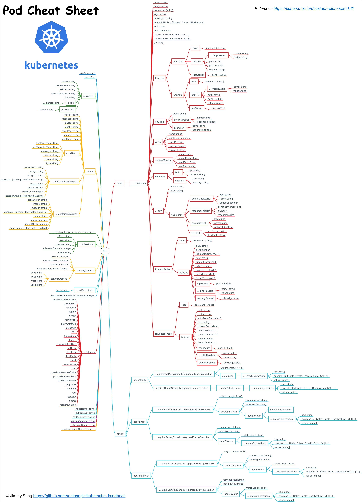

# Pod解析

Pod是kubernetes中可以创建的最小部署单元。

V1 core版本的Pod的配置模板见[Pod template](../manifests/template/pod-v1-template.yaml)。

## 什么是Pod？

Pod就像是豌豆荚一样，它由一个或者多个容器组成（例如Docker容器），它们共享容器存储、网络和容器运行配置项。Pod中的容器总是被同时调度，有共同的运行环境。你可以把单个Pod想象成是运行独立应用的“逻辑主机”——其中运行着一个或者多个紧密耦合的应用容器——在有容器之前，这些应用都是运行在几个相同的物理机或者虚拟机上。

尽管kubernetes支持多种容器运行时，但是Docker依然是最常用的运行时环境，我们可以使用Docker的术语和规则来定义Pod。

Pod中共享的环境包括Linux的namespace、cgroup和其他可能的隔绝环境，这一点跟Docker容器一致。在Pod的环境中，每个容器中可能还有更小的子隔离环境。

Pod中的容器共享IP地址和端口号，它们之间可以通过`localhost`互相发现。它们之间可以通过进程间通信，例如[SystemV](https://en.wikipedia.org/wiki/UNIX_System_V)信号或者POSIX共享内存。不同Pod之间的容器具有不同的IP地址，不能直接通过IPC通信。

Pod中的容器也有访问共享volume的权限，这些volume会被定义成pod的一部分并挂载到应用容器的文件系统中。

根据Docker的结构，Pod中的容器共享namespace和volume，不支持共享PID的namespace。

就像每个应用容器，pod被认为是临时（非持久的）实体。在Pod的生命周期中讨论过，pod被创建后，被分配一个唯一的ID（UID），调度到节点上，并一致维持期望的状态直到被终结（根据重启策略）或者被删除。如果node死掉了，分配到了这个node上的pod，在经过一个超时时间后会被重新调度到其他node节点上。一个给定的pod（如UID定义的）不会被“重新调度”到新的节点上，而是被一个同样的pod取代，如果期望的话甚至可以是相同的名字，但是会有一个新的UID。

Volume跟pod有相同的生命周期（当其UID存在的时候）。当Pod因为某种原因被删除或者被新创建的相同的Pod取代，它相关的东西（例如volume）也会被销毁和再创建一个新的volume。

*一个多容器Pod，包含文件提取程序和Web服务器，该服务器使用持久卷在容器之间共享存储。*

## Pod的动机

### 管理

Pod是一个服务的多个进程的聚合单位，pod提供这种模型能够简化应用部署管理，通过提供一个更高级别的抽象的方式。Pod作为一个独立的部署单位，支持横向扩展和复制。共生（协同调度），命运共同体（例如被终结），协同复制，资源共享，依赖管理，Pod都会自动的为容器处理这些问题。

### 资源共享和通信

Pod中的应用可以共享网络空间（IP地址和端口），因此可以通过`localhost`互相发现。因此，pod中的应用必须协调端口占用。每个pod都有一个唯一的IP地址，跟物理机和其他pod都处于一个扁平的网络空间中，它们之间可以直接连通。

Pod中应用容器的hostname被设置成Pod的名字。

Pod中的应用容器可以共享volume。Volume能够保证pod重启时使用的数据不丢失。

## Pod的使用

Pod也可以用于垂直应用栈（例如LAMP），这样使用的主要动机是为了支持共同调度和协调管理应用程序，例如：

- 内容管理系统、文件和数据加载器、本地换群管理器等。
- 日志和检查点备份、压缩、旋转、快照等。
- 数据变更观察者、日志和监控适配器、活动发布者等。
- 代理、桥接和适配器等。
- 控制器、管理器、配置器、更新器等。

通常单个pod中不会同时运行一个应用的多个实例。

详细说明请看： [The Distributed System ToolKit: Patterns for Composite Containers](https://kubernetes.io/blog/2015/06/the-distributed-system-toolkit-patterns/).

## 其他替代选择

**为什么不直接在一个容器中运行多个应用程序呢？**

1. 透明。让Pod中的容器对基础设施可见，以便基础设施能够为这些容器提供服务，例如进程管理和资源监控。这可以为用户带来极大的便利。
2. 解耦软件依赖。每个容器都可以进行版本管理，独立的编译和发布。未来kubernetes甚至可能支持单个容器的在线升级。
3. 使用方便。用户不必运行自己的进程管理器，还要担心错误信号传播等。
4. 效率。因为由基础架构提供更多的职责，所以容器可以变得更加轻量级。

**为什么不支持容器的亲和性的协同调度？**

这种方法可以提供容器的协同定位，能够根据容器的亲和性进行调度，但是无法实现使用pod带来的大部分好处，例如资源共享，IPC，保持状态一致性和简化管理等。

## Pod的持久性（或者说缺乏持久性）

Pod在设计支持就不是作为持久化实体的。在调度失败、节点故障、缺少资源或者节点维护的状态下都会死掉会被驱逐。

通常，用户不需要手动直接创建Pod，而是应该使用controller（例如[Deployments](./deployment.md)），即使是在创建单个Pod的情况下。Controller可以提供集群级别的自愈功能、复制和升级管理。

使用集合API作为主要的面向用户的原语在集群调度系统中相对常见，包括[Borg](https://research.google.com/pubs/pub43438.html)、[Marathon](https://mesosphere.github.io/marathon/docs/rest-api.html)、[Aurora](http://aurora.apache.org/documentation/latest/reference/configuration/#job-schema)和[Tupperware](https://www.slideshare.net/Docker/aravindnarayanan-facebook140613153626phpapp02-37588997)。

Pod 原语有利于：

- 调度程序和控制器可插拔性
- 支持pod级操作，无需通过控制器API“代理”它们
- 将pod生命周期与控制器生命周期分离，例如用于自举（bootstrap）
- 控制器和服务的分离——端点控制器只是监视pod
- 将集群级功能与Kubelet级功能的清晰组合——Kubelet实际上是“pod控制器”
- 高可用性应用程序，它们可以在终止之前及在删除之前更换pod，例如在计划驱逐、镜像预拉取或实时pod迁移的情况下[#3949](https://github.com/kubernetes/kubernetes/issues/3949)

[StatefulSet](statefulset.md) 控制器支持有状态的Pod。在1.4版本中被称为PetSet。在kubernetes之前的版本中创建有状态pod的最佳方式是创建一个replica为1的replication controller。

## Pod的终止

因为Pod作为在集群的节点上运行的进程，所以在不再需要的时候能够优雅的终止掉是十分必要的（比起使用发送KILL信号这种暴力的方式）。用户需要能够发起一个删除 Pod 的请求，并且知道它们何时会被终止，是否被正确的删除。用户想终止程序时发送删除pod的请求，在pod可以被强制删除前会有一个宽限期，会发送一个TERM请求到每个容器的主进程。一旦超时，将向主进程发送KILL信号并从API server中删除。如果kubelet或者container manager在等待进程终止的过程中重启，在重启后仍然会重试完整的宽限期。

示例流程如下：

1. 用户发送删除pod的命令，默认宽限期是30秒；
2. 在Pod超过该宽限期后API server就会更新Pod的状态为“dead”；
3. 在客户端命令行上显示的Pod状态为“terminating”；
4. 跟第三步同时，当kubelet发现pod被标记为“terminating”状态时，开始停止pod进程：
   1. 如果在pod中定义了preStop hook，在停止pod前会被调用。如果在宽限期过后，preStop hook依然在运行，第二步会再增加2秒的宽限期；
   2. 向Pod中的进程发送TERM信号；
5. 跟第三步同时，该Pod将从该service的端点列表中删除，不再是replication controller的一部分。关闭的慢的pod将继续处理load balancer转发的流量；
6. 过了宽限期后，将向Pod中依然运行的进程发送SIGKILL信号而杀掉进程。
7. Kubelet会在API server中完成Pod的的删除，通过将优雅周期设置为0（立即删除）。Pod在API中消失，并且在客户端也不可见。

删除宽限期默认是30秒。 `kubectl delete`命令支持 `—grace-period=<seconds>` 选项，允许用户设置自己的宽限期。如果设置为0将强制删除pod。在kubectl>=1.5版本的命令中，你必须同时使用 `--force` 和 `--grace-period=0` 来强制删除pod。
在 yaml 文件中可以通过 `{{ .spec.spec.terminationGracePeriodSeconds }}` 来修改此值。

### 强制删除Pod

Pod的强制删除是通过在集群和etcd中将其定义为删除状态。当执行强制删除命令时，API server不会等待该pod所运行在节点上的kubelet确认，就会立即将该pod从API server中移除，这时就可以创建跟原pod同名的pod了。这时，在节点上的pod会被立即设置为terminating状态，不过在被强制删除之前依然有一小段优雅删除周期。

强制删除对于某些pod具有潜在危险性，请谨慎使用。使用StatefulSet pod的情况下，请参考删除StatefulSet中的pod文章。

## Pod中容器的特权模式

从Kubernetes1.1版本开始，pod中的容器就可以开启privileged模式，在容器定义文件的 `SecurityContext` 下使用 `privileged` flag。 这在使用Linux的网络操作和访问设备的能力时是很有用的。容器内进程可获得近乎等同于容器外进程的权限。在不需要修改和重新编译kubelet的情况下就可以使用pod来开发节点的网络和存储插件。

如果master节点运行的是kuberentes1.1或更高版本，而node节点的版本低于1.1版本，则API server将也可以接受新的特权模式的pod，但是无法启动，pod将处于pending状态。

执行 `kubectl describe pod FooPodName`，可以看到为什么pod处于pending状态。输出的event列表中将显示： 
`Error validating pod "FooPodName"."FooPodNamespace" from api, ignoring: spec.containers[0].securityContext.privileged: forbidden '<*>(0xc2089d3248)true'`

如果master节点的版本低于1.1，无法创建特权模式的pod。如果你仍然试图去创建的话，你得到如下错误：

`The Pod "FooPodName" is invalid. spec.containers[0].securityContext.privileged: forbidden '<*>(0xc20b222db0)true'`

## API Object

Pod是kubernetes REST API中的顶级资源类型。

在kuberentes1.6的V1 core API版本中的Pod的数据结构如下图所示：

