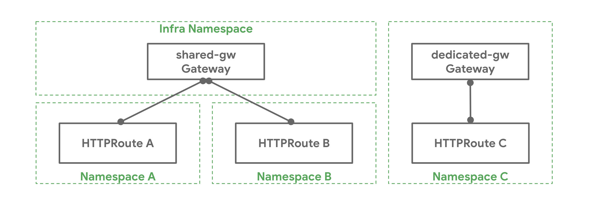
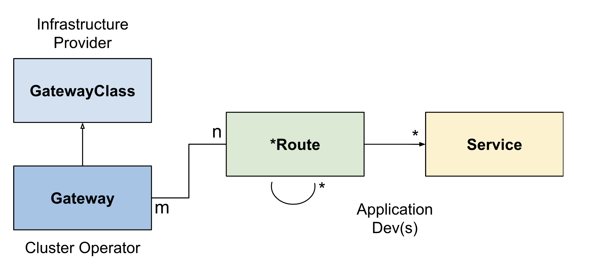

# Service API 简介

在了解了 Service API 的 [目的](kubernetes-service-api.md) 后，接下来我们再看下它的资源模型、请求流程、TLS 配置及扩展点等。

## 角色

Service API 开发者为其使用场景定义四类角色：

- 基础设施提供方：如 AWS、GKE 等
- 集群运维：管理整个集群的计算、存储、网络、安全等
- 应用程序开发者：为自己开发的应用负责，管理应用的健壮性
- 应用管理员：不是所有的公司都有，通常在一些复杂系统中会有专门的应用管理员

## 资源模型

注意：资源最初将作为 CRD 存在于 `networking.x-k8s.io` API 组中。未限定的资源名称将隐含在该 API 组中。

Service API 的资源模型中，主要有三种类型的对象：

- `GatewayClass`：定义了一组具有共同配置和行为的网关。
- `Gateway`：请求一个点，在这个点上，流量可以被翻译到集群内的服务。
- `Route`：描述了通过 Gateway 而来的流量如何映射到服务。

### GatewayClass

`GatewayClass` 定义了一组共享共同配置和行为的 Gateway，每个 `GatewayClass` 由一个控制器处理，但控制器可以处理多个 `GatewayClass`。

`GatewayClass` 是一个集群范围的资源。必须至少定义一个 `GatewayClass`，`Gateway` 才能够生效。实现 Gateway API 的控制器通过关联的 `GatewayClass` 资源来实现，用户可以在自己的 `Gateway` 中引用该资源。

这类似于 `Ingress` 的 [`IngressClass`](https://github.com/kubernetes/enhancements/blob/master/keps/sig-network/20190125-ingress-api-group.md#ingress-class) 和 `PersistentVolumes` 的 [`StorageClass`](https://kubernetes.io/docs/concepts/storage/storage-classes/)。在 `Ingress` v1beta1 中，最接近 `GatewayClass` 的是 `ingress-class` 注解，而在 IngressV1 中，最接近的类似物是 `IngressClass` 对象。

### Gateway

`Gateway` 描述了如何将流量翻译到集群内的服务。也就是说，它定义了一个方法，将流量从不了解 Kubernetes 的地方翻译到了解 Kubernetes 的地方。例如，由云负载均衡器、集群内代理或外部硬件负载均衡器发送到 Kubernetes 服务的流量。虽然许多用例的客户端流量源自集群的 "外部"，但这并不强求。

`Gateway` 定义了对实现 `GatewayClass` 配置和行为合同的特定负载均衡器配置的请求。该资源可以由运维人员直接创建，也可以由处理 `GatewayClass` 的控制器创建。

由于 `Gateway` 规范捕获了用户意图，它可能不包含规范中所有属性的完整规范。例如，用户可以省略地址、端口、TLS 设置等字段。这使得管理 `GatewayClass` 的控制器可以为用户提供这些设置，从而使规范更加可移植。这种行为将通过 `GatewayClass` 状态对象来明确。

一个 `Gateway` 可以包含一个或多个 `Route` 引用，这些 `Route` 引用的作用是将一个子集的流量引导到一个特定的服务上。

### {HTTP,TCP,Foo} Route

`Route` 对象定义了特定协议的规则，用于将请求从 `Gateway` 映射到 Kubernetes 服务。

`HTTPRoute` 和 `TCPRoute` 是目前唯一已定义的 `Route` 对象。未来可能会添加其他特定协议的 `Route` 对象。

### BackendPolicy

`BackendPolicy` 提供了一种配置 `Gateway` 和后端之间连接的方法。在这个 API 中，后端是指路由可以转发流量的任何资源。后端的一个常见例子是 `Service`。这个级别的配置目前仅限于 TLS，但将来会扩展到支持更高级的策略，如健康检查。

一些后端配置可能会根据针对后端的 `Route` 而有所不同。在这些情况下，配置字段将放在 `Route` 上，而不是 `BackendPolicy` 上。有关该资源未来可能配置的更多信息，请参考相关的 [GitHub issue](https://github.com/kubernetes-sigs/service-apis/issues/196)。

### 路由绑定

当 `Route` 绑定到 `Gateway` 时，代表应用在 `Gateway` 上的配置，配置了底层的负载均衡器或代理。哪些 `Route` 如何绑定到 `Gateway` 是由资源本身控制的。`Route` 和 `Gateway` 资源具有内置的控制，以允许或限制它们之间如何相互选择。这对于强制执行组织政策以确定 `Route` 如何暴露以及在哪些 `Gateway` 上暴露非常有用。看下下面的例子。

一个 Kubernetes 集群管理员在 `Infra` 命名空间中部署了一个名为 `shared-gw` 的 `Gateway`，供不同的应用团队使用，以便将其应用暴露在集群之外。团队 A 和团队 B（分别在命名空间 "A" 和 "B" 中）将他们的 `Route` 绑定到这个 `Gateway`。它们互不相识，只要它们的 `Route` 规则互不冲突，就可以继续隔离运行。团队 C 有特殊的网络需求（可能是性能、安全或关键性），他们需要一个专门的 `Gateway` 来代理他们的应用到集群外。团队 C 在 "C" 命名空间中部署了自己的 `Gateway` `specialive-gw`，该 Gateway 只能由 "C" 命名空间中的应用使用。

不同命名空间及 `Gateway` 与 `Route` 的绑定关系如下图所示。



在如何将路由与网关绑定以实现不同的组织政策和责任范围方面，有很大的灵活性。下面是网关和路由之间可能的对应关系：

- 一对一：网关和路由可以由一个所有者部署和使用，并具有一对一的关系。团队 C 就是一个例子。
- 一对多：一个网关可以有许多路由与之绑定，这些路由由来自不同命名空间的不同团队所拥有。团队 A 和 B 就是这样的一个例子。
- 多对一：路由也可以绑定到多个网关，允许一个路由同时控制不同 IP、负载均衡器或网络上的应用暴露。

总之，网关选择路由，路由控制它们的暴露。当网关选择一个允许自己暴露的路由时，那么该路由将与网关绑定。当路由与网关绑定时，意味着它们的集体路由规则被配置在了由该网关管理的底层负载均衡器或代理服务器上。因此，网关是一个网络数据平面的逻辑表示，可以通过路由进行配置。

#### 路由选择

`Gateway` 根据 `Route` 元数据，特别是 `Route` 资源的种类、命名空间和标签来选择 `Route`。`Route` 实际上被绑定到 `Gateway` 中的特定监听器上，因此每个监听器都有一个 `listener.routes` 字段，它通过以下一个或多个标准来选择 `Route`。

- **Label**：`Gateway` 可以通过资源上存在的标签来选择 `Route`（类似于 Service 通过 Pod 标签选择 Pod 的方式）。
- **Kind**：网关监听器只能选择单一类型的路由资源。可以是 `HTTPRoute`、`TCPRoute` 或自定义 `Route` 类型。
- **Namespace**：`Gateway` 还可以通过 `namespaces.from` 字段控制可以从哪些 `Namespace`、 `Route` 中选择。它支持三种可能的值。
  - `SameNamespace` 是默认选项。只有与该网关相同的命名空间中的路由才会被选择。
  - `All` 将选择来自所有命名空间的 `Route`。
  - `Selector` 意味着该网关将选择由 Namespace 标签选择器选择的 Namespace 子集的 Route。当使用 Selector 时，那么 `listeners.route.namespaces.selector` 字段可用于指定标签选择器。`All` 或 `SameNamespace` 不支持该字段。

下面的 `Gateway` 将在集群中的所有 `Namespace` 中选择 `expose: prod-web-gw` 的所有 `HTTPRoute` 资源。

```yaml
kind: Gateway
...
spec:
  listeners:  
  - routes:
      kind: HTTPRoute
      selector:
        matchLabels:
          expose: prod-web-gw 
      namespaces:
        from: All
```

#### 路由暴露

路由可以决定它们如何通过网关暴露。`gateways.allow` 字段支持三个值。

- `All`：如果没有指定，则是默认值。这使得所有的 `Route` 标签和 `Namespace` 选择器都绑定在网关上。
- `SameNamespace` 只允许该路由与来自同一 `Namespace` 的网关绑定。
- `FromList` 允许指定一个明确的网关列表，以便路由与之绑定。

下面的 `my-route` Route 只选择 `foo-namespace` 中的 `foo-gateway`，而不能与其他 `Gateway` 绑定。注意，`foo-gateway` 与 `my-route` 在不同的 Namespace 中。如果 `foo-gateway` 允许跨 `Namespace` 绑定，并且也选择了这个 `Route`，那么 `my-route` 就会与之绑定。

```yaml
kind: HTTPRoute
metadata:
  name: my-route
  namespace: bar-namespace
spec:
  gateways:
    allow: FromList
    gatewayRefs:
    - name: foo-gateway
      namespace: foo-namespace
```

请注意，网关和路由的绑定是双向的。这意味着两个资源必须相互选择才能绑定。如果一个`Gateway`的`Route`标签选择器不匹配任何现有的`Route`，那么即使`Route`的`spec.gateways.allow = All`，也不会有任何东西与之绑定。同样，如果一个`Route`引用了一个特定的`Gateway`，但该`Gateway`没有选择`Route`的`Namespace`，那么它们也不会绑定。只有当两个资源相互选择时，才会发生绑定。

从资源规范中可能并不总是能明显看出哪些网关和路由是绑定的，但可以通过资源状态来确定绑定。路由状态将列出路由所绑定的所有网关以及绑定的任何相关条件。

### 组合类型

`GatewayClass`、Gateway、`xRoute` 和 `Service` 的组合将定义一个可实现的负载均衡器。下图说明了不同资源之间的关系。



## 请求流程

使用反向代理实现的网关的一个典型的客户端 / 网关 API 请求流程是：

- 客户端向 `http://foo.example.com` 发出请求。
- DNS 将该名称解析为网关地址。
- 反向代理在 `Listener` 上接收请求，并使用 [`Host` 头](https://tools.ietf.org/html/rfc7230#section-5.4) 来匹配 `HTTPRoute`。
- 可选地，反向代理可以根据 `HTTPRoute` 的匹配规则执行请求头和 / 或路径匹配。
- 可选地，反向代理可以根据 `HTTPRoute` 的过滤规则修改请求，即添加 / 删除头。
- 最后，反向代理可以根据 `HTTPRoute` 的 `forwardTo` 规则，将请求转发到集群中的一个或多个对象，即 `Service`。

## TLS 配置

TLS 配置在 `Gateway` 监听器上。此外，对于某些自助服务用例，TLS 证书可以配置在路由对象上。

## 扩展点

API 中提供了一些扩展点，以灵活处理大量通用 API 无法处理的用例。

以下是 API 中扩展点的摘要。

- `XRouteMatch.ExtensionRef`：这个扩展点应该用来扩展特定核心 `Route` 的匹配语义。这是一个实验性的扩展点，未来会根据反馈进行迭代。
- `XForwardTo.BackendRef`：这个扩展点应该用于将流量转发到核心 Kubernetes 服务资源以外的网络端点。例如 S3 bucket、Lambda 函数、文件服务器等。
- `HTTPRouteFilter`：`HTTPRoute` 为这一 API 类型提供了一种方法，可以钩入 HTTP 请求的请求 / 响应生命周期。
- 自定义路由：如果上述扩展点都不能满足用例的需求，实现者可以选择为目前 API 中不支持的协议创建自定义路由资源。

