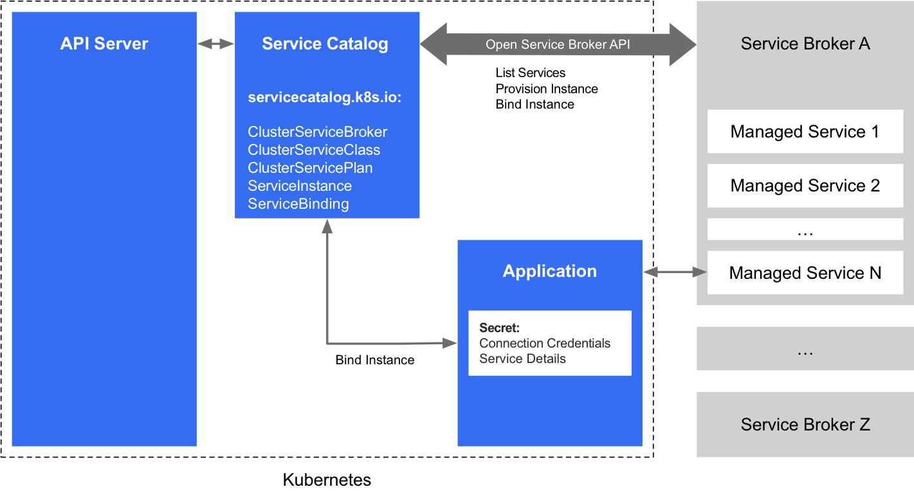
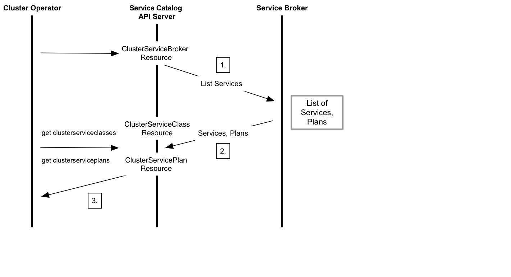
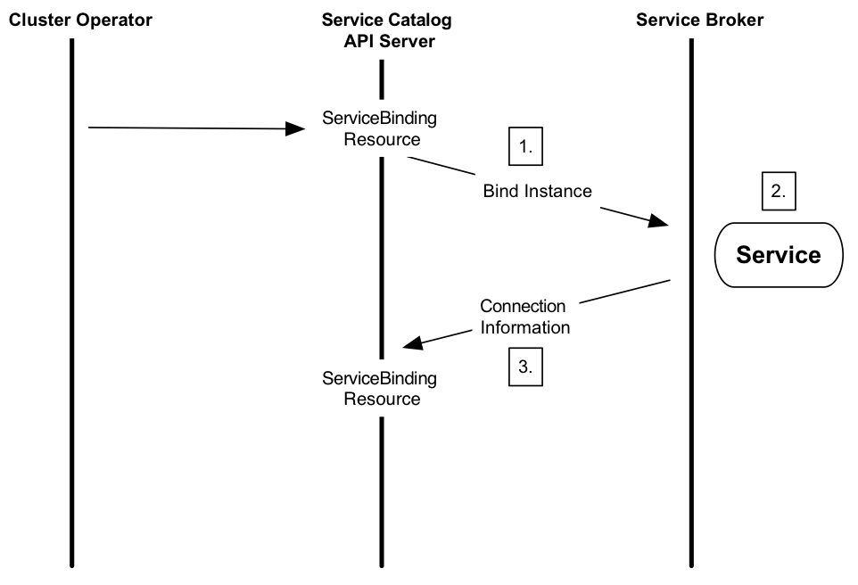
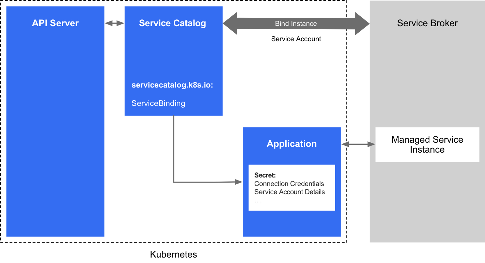

# 服务目录（Service Catalog）

服务目录（Service Catalog）是 Kubernetes 的扩展 API，它使运行在 Kubernetes 集群中的应用程序可以轻松使用外部托管软件产品，例如由云提供商提供的数据存储服务。

它提供列表清单、提供 (provision) 和绑定 (binding) 来自服务代理（Service Brokers）的外部托管服务，而不需要关心如何创建或管理这些服务的详细情况。

由 Open Service Broker API 规范定义的 Service broker 是由第三方提供和维护的一组托管服务的端点 (endpoint)，该第三方可以是 AWS，GCP 或 Azure 等云提供商。

托管服务可以是 Microsoft Azure Cloud Queue，Amazon Simple Queue Service 和 Google Cloud Pub/Sub 等，它们可以是应用可以使用的提供的各种软件。

通过 Service Catalog，集群运营者可以浏览由 Service Broker 提供的托管服务列表，提供的托管服务实例，并与其绑定，使其可被 Kubernetes 集群中的应用程序所使用。

## 场景样例

应用程序开发人员编写基于 Kubernetes 集群的应用程序，他们希望使用消息队列作为其应用程序的一部分。但是，他们不想自己配置和管理这个服务服务。恰好，有一家云提供商通过其服务代理 (Service Broker) 提供消息队列服务。

集群运营商可以设置 Service Catalog 并使用它与云提供商的 Service Broker 进行通信，以调配消息排队服务的实例并使其可用于 Kubernetes 集群内的应用程序。因此，应用程序开发人员不需要关心消息队列的实现细节或管理，可以简单地像服务一样使用它。

## 架构

Service Catalog 使用 [Open Service Broker API](https://github.com/openservicebrokerapi/servicebroker) 与 Service Broker 进行通信，充当 Kubernetes API 服务器的中介，发起供应并返回应用程序使用托管服务所需的凭据。

Service Catalog 通过扩展 API 服务器和控制器实现，使用 etcd 进行存储。它还使用 Kubernetes 1.7 + 中提供的聚合层来呈现其 API。



### API 资源

Service Catalog 安装 servicecatalog.k8s.ioAPI 并提供以以下 Kubernetes 资源：

- ClusterServiceBroker：作为 service broker 的群集内代理，封装其服务器连接详细信息。这些由集群运营者创建和管理，希望使用 broker 服务在其集群中提供新类型的托管服务。
- ClusterServiceClass：由特定 service broker 提供的托管服务。将新 ClusterServiceBroker 资源添加到群集时，Service catalog controller 将连接到 service broker 以获取可用托管服务的列表清单。然后它会创建新的 ClusterServiceClass 资源，与每个托管服务相对应。
- ClusterServicePlan：托管服务的特定产品。例如，托管服务可能有不同的可用套餐，例如免费套餐或付费套餐，或者可能有不同的配置选项，例如使用 SSD 存储或拥有更多资源。同向群集添加 ClusterServiceClass 一样，当添加一个新的 ClusterServiceBroker 时，Service Catalog 会创建一个新的 ClusterServicePlan 资源，与每个托管服务可用的每个服务套餐对应。
- ServiceInstance：一个提供好的 ClusterServiceClass 实例。这些是由集群运营者创建的托管服务的特定实例，供一个或多个集群内应用程序使用。当创建一个新的 ServiceInstance 资源时，Service Catalog controller 连接到相应的服务代理并指示它提供服务实例。
- ServiceBinding：访问 ServiceInstance 的凭据。由想让他们的应用利用 ServiceInstance 的集群集运营者创建。创建之后，Service Catalog controller 将创建一个与此服务实例对应的 Kubernetes 的 Secret，包含此服务实例的连接详细信息和凭证 ，可以挂载到 Pod 中。

### 鉴权认证

Service Catalog 支持这些认证方法：

- Basic (username/password)
- OAuth 2.0 Bearer Token

## 用法

群集运营者可以使用 Service Catalog API 资源来提供托管服务，并使其在 Kubernetes 群集中可用。涉及的步骤是：

1. 列出 Service Broker 提供的托管服务清单和服务套餐。
2. 提供托管服务的新实例。
3. 绑定到托管服务，该服务返回连接凭证。
4. 将连接凭证映射到应用程序中。

### 列出托管服务和服务组

首先，群集运营者必须在 servicecatalog.k8s.io 群组内创建 ClusterServiceBroker 资源。此资源包含访问服务代理端点所需的 URL 和连接详细信息。

这是一个 ClusterServiceBroker 资源的例子：

```yaml
apiVersion: servicecatalog.k8s.io/v1beta1
kind: ClusterServiceBroker
metadata:
  name: cloud-broker
spec:
  # Points to the endpoint of a service broker. (This example is not a working URL.)
  url:  https://servicebroker.somecloudprovider.com/v1alpha1/projects/service-catalog/brokers/default
  #####
  # Additional values can be added here, which may be used to communicate
  # with the service broker, such as bearer token info or a caBundle for TLS.
  #####
```

以下是说明从一个 service broker 列出托管服务和套餐所涉及步骤的顺序图：



1. 将 ClusterServiceBroker 资源添加到 Service catalog 中，它会触发对外部 Service Broker 的调用以获取可用服务的清单。

2. Service Broker 返回可用托管服务的清单和服务套餐的列表，它们分别在本地缓存为 `ClusterServiceClass` 资源和 `ClusterServicePlan` 资源。

3. 然后，集群运营者可以使用以下命令获取可用托管服务的清单：

   ```sh
   kubectl get clusterserviceclasses -o=custom-columns=SERVICE\ NAME:.metadata.name,EXTERNAL\ NAME:.spec.externalName
   ```

   它应该输出一个类似于以下格式的服务名称列表：

   ```sh
    SERVICE NAME                           EXTERNAL NAME
    4f6e6cf6-ffdd-425f-a2c7-3c9258ad2468   cloud-provider-service
    ...                                    ...
   ```

   他们还可以使用以下命令查看可用的服务套餐：

   ```sh
   kubectl get clusterserviceplans -o=custom-columns=PLAN\ NAME:.metadata.name,EXTERNAL\ NAME:.spec.externalName
   ```

   它应该输出一个类似于以下格式的套餐名称列表：

   ```sh
    PLAN NAME                              EXTERNAL NAME
    86064792-7ea2-467b-af93-ac9694d96d52   service-plan-name
    ...                                    ...
   ```

### 提供新的实例

集群运营者可以通过创建 ServiceInstance 资源来启动新实例的供应。

如下是一个 ServiceInstance 资源的例子：

```yaml
apiVersion: servicecatalog.k8s.io/v1beta1
kind: ServiceInstance
metadata:
  name: cloud-queue-instance
  namespace: cloud-apps
spec:
  # References one of the previously returned services
  clusterServiceClassExternalName: cloud-provider-service
  clusterServicePlanExternalName: service-plan-name
  #####
  # Additional parameters can be added here,
  # which may be used by the service broker.
  #####
```

以下序列图说明了提供一个新的托管服务的实例所涉及的步骤：


1. 当 `ServiceInstance` 资源创建后，Service Catalog 发起到外部 service broker 来提供服务的一个实例。
2. service broker 创建托管服务的新实例并返回 HTTP 响应。
3. 然后，群集运营者可以检查实例的状态，来确认它是否准备就绪。

### 绑定到托管服务

在提供新实例后，群集运营者必须绑定到托管服务才能获取到应用程序使用服务所需的连接凭证和服务帐户详细信息。这是通过创建 `ServiceBinding` 资源完成的。

以下是一个 `ServiceBinding` 资源的例子：

```yaml
apiVersion: servicecatalog.k8s.io/v1beta1
kind: ServiceBinding
metadata:
  name: cloud-queue-binding
  namespace: cloud-apps
spec:
  instanceRef:
    name: cloud-queue-instance
  #####
  # Additional information can be added here, such as a secretName or
  # service account parameters, which may be used by the service broker.
  #####
```

以下序列图说明了绑定到托管服务实例所涉及的步骤：



1. 在ServiceBinding创建后，Service Catalog给外部service broker发一个调用请求，获取与服务实例绑定所需的信息。

2. service broker为相应的服务帐户启用应用程序权限/角色。

3. service broker返回连接和访问托管服务实例所需的信息。根据不同的提供商和不同的服务，返回的信息可能在服务提供商和其管理服务之间有所不同。

### 映射连接凭证

绑定后，最后一步是将连接凭证和服务特定的信息映射到应用程序中。这些信息存储在secret中，应用程序可以用来访问并与托管服务连接。



#### Pod 配置文件

执行此映射的一种方法是使用声明式 Pod 配置文件。

以下示例描述了如何将服务帐户凭证映射到应用程序中。被调用的 sa-key 密钥存储在名为 provider-cloud-key 的卷中，并且应用程序将此卷挂载到 /var/secrets/provider/key.json。环境变量 PROVIDER_APPLICATION_CREDENTIALS 是从挂载文件的值映射而来的。

```yaml
...
    spec:
      volumes:
        - name: provider-cloud-key
          secret:
            secretName: sa-key
      containers:
...
          volumeMounts:
          - name: provider-cloud-key
            mountPath: /var/secrets/provider
          env:
          - name: PROVIDER_APPLICATION_CREDENTIALS
            value: "/var/secrets/provider/key.json"
```

以下示例描述如何将 secret 值映射到应用程序环境变量。在此示例中，消息传递队列 `topic` 名称从名为 `provider-queue-credentials` 的 secret 的 key topic 值映射到环境变量 `TOPIC`。

```yaml
...
          env:
          - name: "TOPIC"
            valueFrom:
                secretKeyRef:
                   name: provider-queue-credentials
                   key: topic
```

## 下一步

- 如果熟悉 Helm Charts ，使用 Helm 将 Service Catalog 安装到 Kubernetes 集群中。或者，可以使用 SC 工具安装服务目录。
- 查看 [sample service brokers](https://github.com/openservicebrokerapi/servicebroker/blob/master/gettingStarted.md#sample-service-brokers)。
- 探索 [kubernetes-incubator/service-catalog](https://github.com/kubernetes-sigs/service-catalog) 项目。

以上翻译自[官方文档](https://kubernetes.io/docs/concepts/extend-kubernetes/service-catalog/)。

## Service Catalog 的安装 (利用 Helm) 和交互

以下翻译自[官方项目文档](https://github.com/kubernetes-incubator/service-catalog/blob/master/docs/install.md)。与[官方网站文档](https://kubernetes.io/docs/tasks/service-catalog/install-service-catalog-using-helm/)大致一致。

Kubernetes 1.7 或更高版本的集群运行 API Aggregator，它位于 core API Server 前面的专用 proxy 服务器。

服务目录 (Service Catalog) 提供了一个位于 API aggregator 后面的 API Server，因此可以用 kubectl 像平常一样与 Service Catalog 进行交互。

要了解更多关于 API aggregation 的信息，请参阅 [Kubernetes 文档](https://kubernetes.io/docs/concepts/api-extension/apiserver-aggregation/)。

本文档的其余部分详细介绍了如何：

- 在群集上设置 Service Catalog
- 与 Service Catalog API 进行交互

## 前提条件

### Kubernetes 版本

Service Catalog 需要 Kubernetes v1.7 或更高版本。您还需要 在主机上安装 [Kubernetes configuration file](https://kubernetes.io/docs/tasks/access-application-cluster/configure-access-multiple-clusters/) 。你需要这个文件，以便可以使用 kubectl 和 helm 与群集通信。许多 Kubernetes 安装工具或云提供商会为你设置此配置文件。有关详细信息，请与您的工具或提供商联系。

#### `kubectl` 版本

大多数与 Service Catalog 系统的交互都是通过 `kubectl` 命令行界面实现的。与群集版本一样，Service Catalog 需要 kubectl 版本 1.7 或更高版本。

首先，检查 `kubectl` 版本：

```bash
kubectl version
```

确保 Kubernetes 版本和 kubectl 版本均为 1.7 或更高。

如果需要升级客户端，请按照[安装说明](https://kubernetes.io/docs/tasks/kubectl/install/) 获取新的 `kubectl` 二进制文件。

例如，运行以下命令以在 Mac OS 上获取最新的二进制文件：

```bash
curl -LO https://storage.googleapis.com/kubernetes-release/release/$(curl -s https://storage.googleapis.com/kubernetes-release/release/stable.txt)/bin/darwin/amd64/kubectl
chmod +x ./kubectl
```

### 群集内 DNS

您需要启用 Kubernetes 集群内的 DNS。大多数常用的安装方法会为您自动配置群集内 DNS：

- [Minikube](https://github.com/kubernetes/minikube)
- [`hack/local-up-cluster.sh`](https://github.com/kubernetes/kubernetes/blob/master/hack/local-up-cluster.sh)
- 大多数云提供商

### Helm

使用 Helm 安装 Service Catalog ，需要 v2.7.0 或更高版本。请参阅以下步骤进行安装。

#### 如果还没有安装 Helm

如果尚未安装 Helm，请下载 [`helm` CLI](https://github.com/kubernetes/helm#install)，然后运行 helm init（这会将 Helm 的服务器端组件 Tiller 安装到 Kubernetes 群集中）。

#### 如果已经安装了 Helm

如果已经安装了 Helm，请运行 helm version 并确保客户端和服务器版本均为 v2.7.0 或更高。

如果不是， 请安装[更新版本的 helm CLI](https://github.com/kubernetes/helm#install) 并运行 `helm init --upgrade`。

有关安装的更多详细信息，请参阅 Helm 安装说明。

#### Tiller 权限

Tiller 是 Helm 的服务端组件。默认情况下， helm init 将 Tiller pod 安装到 kube-system 名称空间中，并将 Tiller 配置为使用 default 服务帐户（service account）。

需要对 Tiller 进行配置 `cluster-admin` 权限，才能正确安装 Service Catalog：

```bash
kubectl create clusterrolebinding tiller-cluster-admin \
    --clusterrole=cluster-admin \
    --serviceaccount=kube-system:default
```

### Helm Repository 设置

Service Catalog 很容易通过 Helm chart 安装 。

此 chart 位于 chart repository 中。将此 repository 添加到本地计算机：

```bash
helm repo add svc-cat https://svc-catalog-charts.storage.googleapis.com
```

然后，确保 repository 已成功添加：

```bash
helm search service-catalog
```

应该看到以下输出：

```bash
NAME               VERSION    DESCRIPTION
svc-cat/catalog    x,y.z      service-catalog API server and controller-manag...
```

### RBAC

Kubernetes 群集必须启用 [RBAC](https://kubernetes.io/docs/admin/authorization/rbac/) 才能使用 Service Catalog。

与群集内 DNS 一样，许多安装方法都有对应启用 RBAC 的途径。

#### Minikube

如果您正在使用 Minikube，请使用以下命令启动群集：

```bash
minikube start --extra-config=apiserver.Authorization.Mode=RBAC
```

#### hack/local-cluster-up.sh

如果使用 [`hack/local-up-cluster.sh`](https://github.com/kubernetes/kubernetes/blob/master/hack/local-up-cluster.sh) 脚本，请使用以下命令启动群集：

```bash
AUTHORIZATION_MODE=Node,RBAC hack/local-up-cluster.sh -O
```

#### 云提供商

许多云提供商为你启用了 RBAC 的新集群。有关详细信息，请查阅你的提供商的文档。

## 安装 Service Catalog

集群和 Helm 配置正确，安装 Service Catalog 很简单：

```bash
helm install svc-cat/catalog \
    --name catalog --namespace catalog
```

## 安装 Service Catalog CLI 客户端

按照适用于操作系统的说明安装 svcat。二进制文件可以单独使用，也可以作为 kubectl 插件使用。

### MacOS

```sh
curl -sLO https://download.svcat.sh/cli/latest/darwin/amd64/svcat
chmod +x ./svcat
mv ./svcat /usr/local/bin/
svcat version --client
```

### Linux

```sh
curl -sLO https://download.svcat.sh/cli/latest/linux/amd64/svcat
chmod +x ./svcat
mv ./svcat /usr/local/bin/
svcat version --client
```

### Windows

下面的片段仅在当前会话的 PATH 添加一个路径。后续使用需要将它相应的路径永久添加到 PATH 中。

```
iwr 'https://download.svcat.sh/cli/latest/windows/amd64/svcat.exe' -UseBasicParsing -OutFile svcat.exe
mkdir -f ~\bin
$env:PATH += ";${pwd}\bin"
svcat version --client
```

### 手动方式

1. 对应操作系统下载相应的二进制文件：
   - [macOS](https://download.svcat.sh/cli/latest/darwin/amd64/svcat)
   - [Windows](https://download.svcat.sh/cli/latest/windows/amd64/svcat.exe)
   - [Linux](https://download.svcat.sh/cli/latest/linux/amd64/svcat)
2. 使二进制文件可执行。
3. 将二进制文件移动到 PATH 相应的目录。

### 插件方式使用客户端

要将 svcat 用作插件，请在下载后运行以下命令：

```bash
$ ./svcat install plugin
Plugin has been installed to ~/.kube/plugins/svcat. Run kubectl plugin svcat --help for help using the plugin.
```

当作为插件运行时，这些命令与添加全局 kubectl 配置标志相同。其中一个例外是，在插件模式下运行时不支持布尔标志，所以不要使用 `--flag`, 必须指定 `--flag=true`。
