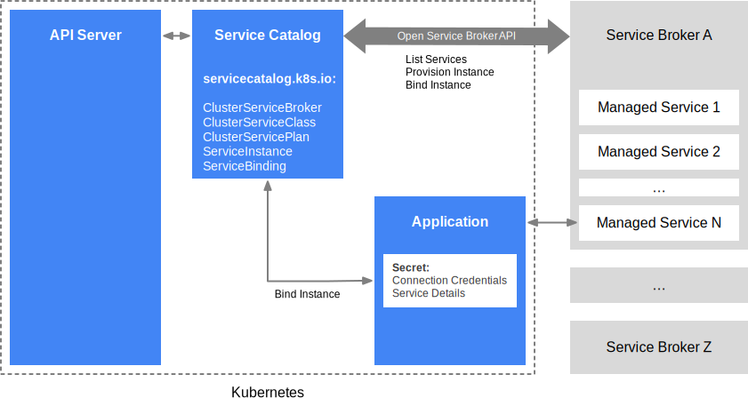
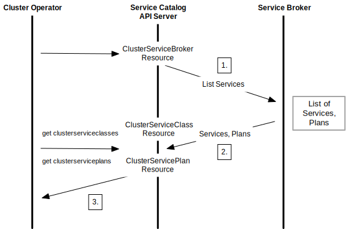
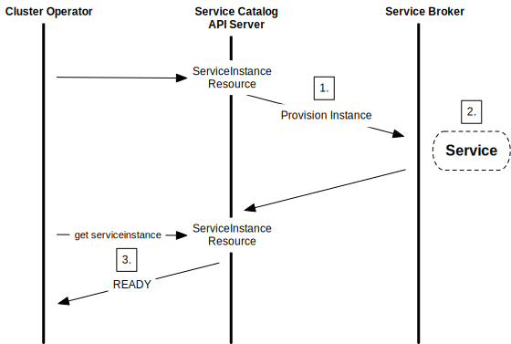
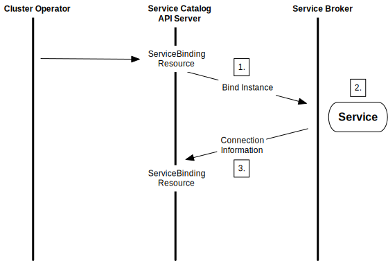
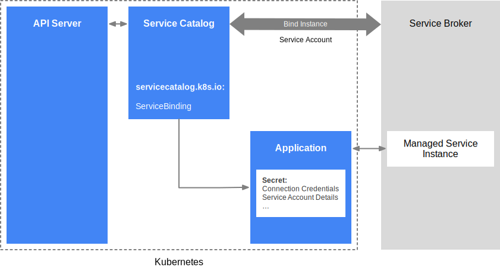

本文翻译自[官方文档](https://kubernetes.io/docs/concepts/service-catalog/)
# 服务目录（Service Catalog）

服务目录（Service Catalog）是Kubernetes的扩展API，它使运行在Kubernetes集群中的应用程序可以轻松使用外部托管软件产品，例如由云提供商提供的数据存储服务。

它提供列表清单、提供(provision)和绑定(binding)来自服务代理（Service Brokers）的外部托管服务，而不需要关心如何创建或管理这些服务的详细情况。

由Open Service Broker API规范定义的Service broker是由第三方提供和维护的一组托管服务的端点(endpoint)，该第三方可以是AWS，GCP或Azure等云提供商。

托管服务可以是Microsoft Azure Cloud Queue，Amazon Simple Queue Service和Google Cloud Pub/Sub等，它们可以是应用可以使用的提供的各种软件。

通过Service Catalog，集群运营者可以浏览由Service Broker提供的托管服务列表，提供的托管服务实例，并与其绑定，使其可被Kubernetes集群中的应用程序所使用。


## 场景样例

应用程序开发人员编写基于Kubernetes集群的应用程序，他们希望使用消息队列作为其应用程序的一部分。但是，他们不想自己配置和管理这个服务服务。恰好，有一家云提供商通过其服务代理(Service Broker)提供消息队列服务。

集群运营商可以设置Service Catalog并使用它与云提供商的Service Broker进行通信，以调配消息排队服务的实例并使其可用于Kubernetes集群内的应用程序。因此，应用程序开发人员不需要关心消息队列的实现细节或管理，可以简单地像服务一样使用它。

## 架构

Service Catalog使用[Open Service Broker API](https://github.com/openservicebrokerapi/servicebroker)与Service Broker进行通信，充当Kubernetes API服务器的中介，发起供应并返回应用程序使用托管服务所需的凭据。

Service Catalog通过扩展API服务器和控制器实现，使用etcd进行存储。它还使用Kubernetes 1.7+中提供的聚合层来呈现其API。




### API资源
Service Catalog安装servicecatalog.k8s.ioAPI并提供以以下Kubernetes资源：

* ClusterServiceBroker：作为service broker的群集内代理，封装其服务器连接详细信息。这些由集群运营者创建和管理，希望使用broker服务在其集群中提供新类型的托管服务。

* ClusterServiceClass：由特定service broker提供的托管服务。将新ClusterServiceBroker资源添加到群集时，Service catalog controller将连接到service broker以获取可用托管服务的列表清单。然后它会创建新的ClusterServiceClass资源，与每个托管服务相对应。

* ClusterServicePlan：托管服务的特定产品。例如，托管服务可能有不同的可用套餐，例如免费套餐或付费套餐，或者可能有不同的配置选项，例如使用SSD存储或拥有更多资源。同向群集添加ClusterServiceClass一样，当添加一个新的ClusterServiceBroker时，Service Catalog会创建一个新的ClusterServicePlan资源，与每个托管服务可用的每个服务套餐对应。

* ServiceInstance：一个提供好的ClusterServiceClass实例。这些是由集群运营者创建的托管服务的特定实例，供一个或多个集群内应用程序使用。当创建一个新的ServiceInstance资源时，Service Catalog controller连接到相应的服务代理并指示它提供服务实例。

* ServiceBinding：访问ServiceInstance的凭据。由想让他们的应用利用ServiceInstance的集群集运营者创建。创建之后，Service Catalog controller将创建一个与此服务实例对应的Kubernetes的Secret，包含此服务实例的连接详细信息和凭证 ，可以挂载到Pod中。

### 鉴权认证

Service Catalog 支持这些认证方法：

* Basic (username/password)
* [OAuth 2.0 Bearer Token](https://tools.ietf.org/html/rfc6750)

## 用法
群集运营者可以使用Service Catalog API资源来提供托管服务，并使其在Kubernetes群集中可用。涉及的步骤是：

1. 列出Service Broker提供的托管服务清单和服务套餐。
2. 提供托管服务的新实例。
3. 绑定到托管服务，该服务返回连接凭证。
4. 将连接凭证映射到应用程序中。

### 列出托管服务和服务套餐

首先，群集运营者必须在servicecatalog.k8s.io群组内创建ClusterServiceBroker资源。此资源包含访问服务代理端点所需的URL和连接详细信息。

这是一个ClusterServiceBroker资源的例子：

```yaml
apiVersion: servicecatalog.k8s.io/v1beta1
kind: ClusterServiceBroker
metadata:
  name: cloud-broker
spec:
  # Points to the endpoint of a service broker. (This example is not a working URL.)
  url:  https://servicebroker.somecloudprovider.com/v1alpha1/projects/service-catalog/brokers/default
  #####
  # Additional values can be added here, which may be used to communicate
  # with the service broker, such as bearer token info or a caBundle for TLS.
  #####
```
以下是说明从一个service broker列出托管服务和套餐所涉及步骤的顺序图：



1. 将ClusterServiceBroker资源添加到Service catalog中，它会触发对外部Service Broker的调用以获取可用服务的清单。
2. Service Broker返回可用托管服务的清单和服务套餐的列表，它们分别在本地缓存为`ClusterServiceClass`资源和`ClusterServicePlan`资源。
3. 然后，集群运营者可以使用以下命令获取可用托管服务的清单：

        kubectl get clusterserviceclasses -o=custom-columns=SERVICE\ NAME:.metadata.name,EXTERNAL\ NAME:.spec.externalName

    它应该输出一个类似于以下格式的服务名称列表：

        SERVICE NAME                           EXTERNAL NAME
        4f6e6cf6-ffdd-425f-a2c7-3c9258ad2468   cloud-provider-service
        ...                                    ...

   他们还可以使用以下命令查看可用的服务套餐：

        kubectl get clusterserviceplans -o=custom-columns=PLAN\ NAME:.metadata.name,EXTERNAL\ NAME:.spec.externalName

    它应该输出一个类似于以下格式的套餐名称列表：

        PLAN NAME                              EXTERNAL NAME
        86064792-7ea2-467b-af93-ac9694d96d52   service-plan-name
        ...                                    ...


### 提供新的实例

集群运营者可以通过创建ServiceInstance资源来启动新实例的供应。

如下是一个ServiceInstance资源的例子：

```yaml
apiVersion: servicecatalog.k8s.io/v1beta1
kind: ServiceInstance
metadata:
  name: cloud-queue-instance
  namespace: cloud-apps
spec:
  # References one of the previously returned services
  clusterServiceClassExternalName: cloud-provider-service
  clusterServicePlanExternalName: service-plan-name
  #####
  # Additional parameters can be added here,
  # which may be used by the service broker.
  #####
```
以下序列图说明了提供一个新的托管服务的实例所涉及的步骤：



1. 当`ServiceInstance`资源创建后，Service Catalog发起到外部service broker来提供服务的一个实例。
2. service broker创建托管服务的新实例并返回HTTP响应。
3. 然后，群集运营者可以检查实例的状态，来确认它是否准备就绪。

### 绑定到托管服务

在提供新实例后，群集运营者必须绑定到托管服务才能获取到应用程序使用服务所需的连接凭证和服务帐户详细信息。这是通过创建`ServiceBinding`资源完成的。

以下是一个`ServiceBinding`资源的例子：

```yaml
apiVersion: servicecatalog.k8s.io/v1beta1
kind: ServiceBinding
metadata:
  name: cloud-queue-binding
  namespace: cloud-apps
spec:
  instanceRef:
    name: cloud-queue-instance
  #####
  # Additional information can be added here, such as a secretName or
  # service account parameters, which may be used by the service broker.
  #####
```

以下序列图说明了绑定到托管服务实例所涉及的步骤：



在ServiceBinding创建后，Service Catalog给外部service broker发一个调用请求，获取与服务实例绑定所需的信息。

service broker为相应的服务帐户启用应用程序权限/角色。

service broker返回连接和访问托管服务实例所需的信息。根据不同的提供商和不同的服务，返回的信息可能在服务提供商和其管理服务之间有所不同。

### 映射连接凭证

绑定后，最后一步是将连接凭证和服务特定的信息映射到应用程序中。这些信息存储在secret中，应用程序可以用来访问并与托管服务连接。

<br>



#### Pod配置文件

执行此映射的一种方法是使用声明式Pod配置文件。

以下示例描述了如何将服务帐户凭证映射到应用程序中。被调用的sa-key密钥存储在名为provider-cloud-key的卷中，并且应用程序将此卷挂载到/var/secrets/provider/key.json。环境变量PROVIDER_APPLICATION_CREDENTIALS是从挂载文件的值映射而来的。

```yaml
...
    spec:
      volumes:
        - name: provider-cloud-key
          secret:
            secretName: sa-key
      containers:
...
          volumeMounts:
          - name: provider-cloud-key
            mountPath: /var/secrets/provider
          env:
          - name: PROVIDER_APPLICATION_CREDENTIALS
            value: "/var/secrets/provider/key.json"
```

以下示例描述如何将secret值映射到应用程序环境变量。在此示例中，消息传递队列`topic`名称从名为`provider-queue-credentials`的secret的key topic值映射到环境变量`TOPIC`。

```yaml
...
          env:
          - name: "TOPIC"
            valueFrom:
                secretKeyRef:
                   name: provider-queue-credentials
                   key: topic
```

# 下一步

* 如果熟悉Helm Charts ，使用Helm将Service Catalog安装到Kubernetes集群中。或者，可以使用SC工具安装服务目录。
* 查看 [sample service brokers](https://github.com/openservicebrokerapi/servicebroker/blob/master/gettingStarted.md#sample-service-brokers).
* 探索[kubernetes-incubator/service-catalog](https://github.com/kubernetes-incubator/service-catalog) 项目。
